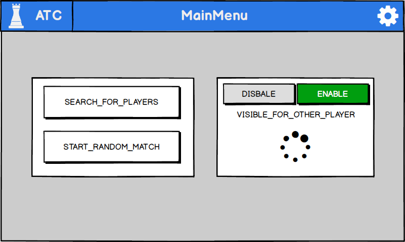
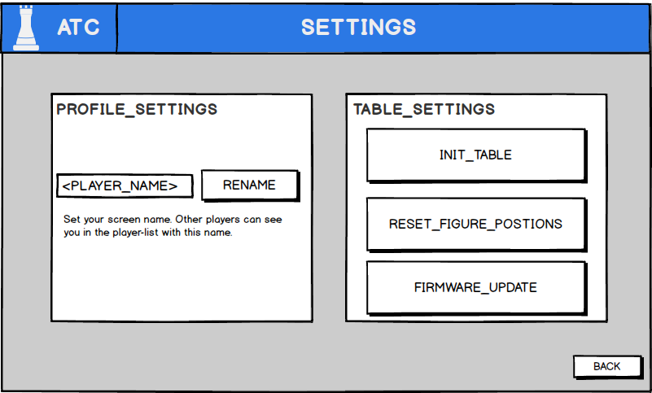
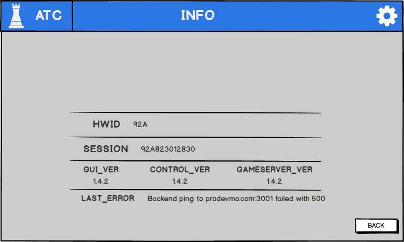

# AtomicChessOS


# BRANCH - QTUI


This branch contains the QT5 User Interface which is running on the RaspberryPi Display.


## REQUIREMENTS
For this chapter the following requirements must be met:

* Crossplattform toolchain and target images is build. The `/buildroot/output/host` folder is accessable on the development system.
* Embedded device is flashed with the image and reachable over SSH.
* `Qt Creator >= 4.10` and `Qt Design Studio` is installed on the development system (`>= Ubuntu 16.04`).


## TASK OF THE UI

The main purpose of the ui is the management of a gameand should not stand in 
* simple editable
* provide simple menu structure with max two menu layers
* player browser
* start game /stop game

### MENUS


## Qt

### WHY Qt

### QML


#### QML COMPONENTS

Every element begins with the type name of the qml component `Text {`, in this case its a label component.
The following block can contain at least a `id` attribute, but can have many more attributes.
The most common attributes are the  position on the screen `x`, `y` and a size `width`, `height`.
These attributes are automaticly added, if an element is created with the visual editor in `Qt Creator` or `Qt Design Studio`.

In case of the label, some additional attributes are nedded.
The `text` attribute, sets the visibal text of the label and the font size can be changed with the `font.pixelSize` attributes.

```qml
Text {                                          //QML TYPE, Text means label                                          
            id: hb_label                        //ID OF THE ELEMENT
            objectName: "hb_label"              //NAME TO ACCESS THE LABELS ATTRIBUTES IN C++ BACKEND
            x: 318                              //POSITION IN SCREEN COORDIANTES
            y: 18                   
            width: 164                          //SIZE
            height: 34
            text: qsTr("MAIN MENU")             //VISIBLE TEXT
            visible: true                       // HIDE| SHOW ELEMENT
            font.pixelSize: 30                  //FONTSIZE OF THE TEXT
        }
```


The next element which is heavily used in the UI for the project, is a simple button.
In addition to the already shown attributes, a new section called `Connections` was added to the element.
Most of the qml types can emit events, if a state of the element changes.
For example, the button can emit the `onClick` event, if the user clicked on the button.
A eventlistener can be registered in a `Connections {` block.
This block needs a `target` attribute, which value is the `id` of the element, the events should be processed.

The eventlistener itself is a function, which has the name of the event `onClick`.
The systax is JavaScript based and a small subset of the JavaScript language in functions is supported.

```js
onClick: {
            var arr = ["My", "Label"] //JS ARRAY
            hb_label.text = arr[0] + arr[1] //ACCESSING ATTRIBUTE OF AN OTHER QML ELEMENT
            console.log("CLICKED!") //JS EXPRESSION
        }
```
A complete QML Javascript refrence guide can be found on the Qt 5 Site.
[QML_JS_REFERENCE](https://doc.qt.io/qt-5/qtqml-javascript-expressions.html)

The goal of our button example is if the user clicked on the button, the label with id `hb_label` should be displayed.
Also a function from an other QML Componente should be called, in this example the `main_menu` component is our C++ backend.


```qml
Button {
            id: hb_button
            x: 731
            y: 4
            width: 61
            height: 61
            text: qsTr("BUTTON NAME")
            //REGISTER EVENT HANDLERS
            Connections {
                target: hb_settings_button      //FOR WHICH ELEMENT ID IS THE CONNECTION             
                function onClicked(_mouse){     //EVENT HANDLER FOR THE CLICK EVENT
                    hb_label.visible = true     //MODIFY OTHER QML ELEMENTS
                    main_menu.lb_settings_btn() //CALL A C++ BACKEND FUNCTION (main_menu is the QML instance of the C++ backend)
                }
            }
        }
```


### MOCKUP

For the first mockups, the tool `Balsamique Mockup 3` was used to create a wireframe model of the menus.
Though the requirement that the userinterface should be simple to create and operate, only simple GUI element was used (like buttons, labels, icons).
So the userinterface can be adapted in every other UI framework too.
It also habe to be simple to use for the user and every menu should only present the most important elements.

The UI conzept offers the users to do the following things:

* Start a random game
* Start a game with selected user
* Overview of game progress and state
* Abort game
 
After deciding which elements are necessary to map this functionality, a simple mockup of the user interface was created.



For example, this is the mockup of the MainMenu. It allowes the player, to start a random game, get the players list and a spinning indicator was used to show the state of the game search funktion.

The gearbox icon, redirects the user to the settings menu. This menu offers basic options to interact with the table.
In a normal usage situation this settings menu is not important, but it is mostly used for maintenance.
The settings menu is accessable in every other menu and the back button, redirects the user back to the last menu showed before opening the settings menu.



Also a general information menu was added, which shows the table software version, its hardware id (used for communcation with the cloud backend).
For debug reasons the last internal errormessage can be shown here.



This are only three example menus created for the user interface.
After creating the mockups, `Qt Design Studio` was used to convert the Mockup into an `QML` represenation

### Qt Design Studio

`Qt` offers several different tool to create a user interface. In this case the `Qt Design Studio`, was used in the first step of implementing the UI form the mockup. It has some advantages over the `Qt Creator`, reagarding the design workflow. It is for example possible to direclty import Adobe Photoshop files, this feature was used for the creation of the icons used in the interface. No manually export of the icon from Adobe Photoshop and reimporting into Qt was needed.
It also supports live preview of the design as an running application, no compilation needed for reviewing the UI.

The software uses a simple drag&drop system for elements, like buttons, labels and self designed components. The element can be placed on a empty screen to build the ui from the ground up. It also provides integration for the `QtQuickControl II` component presets, which includes some more advance ui element like the animated spinner or progress bars.

While building the UI in the software, the equivalent QML code is generated which corresponds in an `.qml` file.
The QML file can now be loaded into a `Qt Quick - Application` project inside of the `Qt Creator` software. 


## Qt Creator

* works without QtCreator but offers features espacially for editing C++ and QML files together
### PROJECT SETUP
* simply clicking ok; but choose qmake
* generate main.cpp with qml loading code ; and a basic qml file 
### TOOLCHAIN SETUP
* path setup
### DEVICE SETUP
* add device with ip address


## QML `objectName` ATTRIBUTE
It is also possible to edit the QML code and add new QML components inside of `Qt Creator`, which offers also a QML visual editor.
Here all object which are designed to be changed with C++ code, become a unique name. This happens inside of the QML code with the `objectName` attribute.

For example the content of the version label on the info menu should be changeable, so its gets a unique name with 
```qml
Text {
            id: is_hwid_label
            objectName: "is_hwid_label"
            x: 358
            y: 54
            color: "#ffffff"
            text: qsTr("HWID")
            font.pixelSize: 30
        }
```

With the `objectName` attribute set, it is possible modify other attributes inside of the element.
In the following C++ function is taken from the `menumanager.cpp` which is the C++ backend class between the QML and the `InterProcessCommunication`.
The funktion changes the visible attribute of an element, which is searched with the `objectName` attribute.

```c++
//menumanager.cpp
void MenuManager::set_visible_element(QString _name, bool _state){
    QObject* obj = this->parent()->findChild<QObject*>(_name);
    if(obj){
        obj->setProperty("visible",_state);
    }else{
        qInfo()<< "cant get element" << _name;
    }
}
```
## QML C++ BACKEND


As mentioned above, the UI is controlled by a C++ backend, it connects the QML UI with the `InterProcessCommunication` class.
This backend can be used as a normal QML Component, but allowes all C++ feature can be used to control the UI.
The backend is a normal C++ Class, but it have to inherited from `QObject`.

```c++
//menumanager.h
#include <QObject>
class MenuManager: public QObject
{
```

After creating the class files `menumanager.h` and `menumanager.cpp`, the last step is to register the new created class as a usable QML component.
This happend in the `main.cpp` file directly after bevore loading the QML file with the `qmlRegisterType` function call.


```c++
//menumanager.h
#include "menumanager.h"
int main(int argc, char *argv[])
{
            QGuiApplication app(argc, argv);
            QWindow window;
            window.setBaseSize(QSize(800,480));
            ...
            ...
            
            //REGISTER THE TYPE MenuManager WITH THE NAME MenuManager AND VERSION 1.0 AS QML TYPE WITH NAME MenuManager           
            qmlRegisterType<MenuManager>("MenuManager",1,0,"MenuManager");
            
            //LOAD QML FILE AND DISPLAY IT
            QQuickView view;
            view.engine()->addImportPath("qrc:/qml/imports");
            view.setSource(QUrl("qrc:/qml/WINDOW.qml"));
            ...
            ...
```

The last step required is to use the new created QML type in the QML file `WINDOW.qml` of the UI.

```qml
//qml/WINDOW.qml
Rectangle {
    id: window
    objectName: "window"
    width: 800
    height: 480

    //CREATE AN ELEMENT OF QML TYPE MenuManager    
    MenuManager{
        id:main_menu
    }
```
Now every function inside of the UI can call functions in the C++ backend by using the ID `main_menu.<FUNCTION>()`.


### ACCESS MODIFIERS TO WORK WITH THE UI
In the headerfile `menumanager.h` function can be declared with the access modifiers, for example`public` or `private`.
In the Qt C++ there are also other modifiers avariable, espacially for connecting with QML.

The mainly used modifier for this project is the `public slots` modifiert. Each function declared in this section can be called from the QML side.

```c++
//menumanager.h
class MenuManager: public QObject
{
public slots:
            void trigger_login_event_button(); //call if login button is pressed
```

For example the obve delcared function `trigger_login_event_button` should be called with a button in the QML UI is pressed by the user.

```qml
qml/WINDOW.qml
Button {
            id: hb_button
            ... //OTHER ATTRIBUTES
            //REGISTER EVENT HANDLERS
            Connections {
                target: hb_settings_button      //FOR WHICH ELEMENT ID IS THE CONNECTION             
                function onClicked(_mouse){     //EVENT HANDLER FOR THE CLICK EVENT
                    
                    main_menu.trigger_login_event_button() //CALL A C++ BACKEND FUNCTION (main_menu is the QML instance of the C++ backend)
                    
                }
            }
        }
```
[SIGNALS_SLOTS_QT](https://doc.qt.io/qt-5/signalsandslots.html)


### GET EVENTS FROM QML COMPONENTS | REACT TO BUTTONS
With the `public slots` modifiers above, its is now possible to react to event from components.
For example if the user presses the login button.
In the `mainmenu` class, for each action is a function declared, mostly for buttons an their `onClick` event.

```c++
//menumanager.h
class MenuManager: public QObject
{
...
...

public slots:
// ----- HEADLINE BAR ---- //
    void lb_settings_btn();         //ONCLICK EVENT FOR SETTINGS ICON
    void lb_info_btn();             //ONCLICK EVENT FOR INFO ICON                     
    // ----- LOGIN/START ----//
    void ls_login_btn();            //ONCLICK EVENT FOR START BUTTON                       
    ...
```

Every functions triggers a event, which are send to the rest of the system by using the `Inter Process Communication` class.

```c++
//menumanager.cpp
void MenuManager::ls_login_btn(){
    qInfo() <<"ls_login_btn"; //DEBUG MESSAGE
    
    //CREATE EVENT WITH ACTION TYPE (GUI_ELEMENT::BEGIN_BTN) AND THE TYPE OF EVENT (GUI_VALUE_TYPE::CLICKED)
    guiconnection.createEvent(guicommunicator::GUI_ELEMENT::BEGIN_BTN, guicommunicator::GUI_VALUE_TYPE::CLICKED);
}
```


### MODIFY QML COMPONENTS | SWITCHING BETWEEN MENUS

Now its possible to react to user events, but the other direction, to send events to the gui is also needed.
To display the current gamestate or switching between menus.

The `visible` attributes of an element, defines if the element is visible on the ui or not.
In the case of the UI for this project. Each menu is placed inside of an container.
If the user open a specific menu, all other menus will be hidden by setting the `visible` attribute to `false`, ecept of the target menu.

For this purpose each menu container has its own `objectName` attribute.

* `mm_container`, is the main menu container
* `ss_container`, is the settings menu container
* `ls_container`, is the start screen container

To finally switch the a menu the function `switch_menu(QString _container_name)` can be used, for simple menu switching.
It also poulates a variable called `last_menu_opened`, this stores the menu name the user comes from and makes its possible to switch back to the previous menu.
This functionally comes handy, for the settings menu, which can be opened from every other menu and by closing the settings menu the user redirect back to the previous menu.

```c++
switch_menu("ls_container"); //SHOW LOGIN MENU
switch_menu("ss_container"); //SHOW SETTINGS MENU
switch_menu(last_menu_opened); //SWITCH BACK TO LOGIN MENU (= PREVIOUS MENU)
```

For this menu structure it is sufficient to store only the previous menu.
A queue is used to enable navigations with deeper menu structures.

```c++
//menumanager.h
QStack<QString> menu_visist_history;
QMap<QString, int> menu_levels;
QString current_menu = "";

//menumanager.cpp
//ENTER MENU
void enter_menu(QString _name){
            previous_menus.push(current_menu)
            current_menu = _name;
            switch_menu(current_menu);
}

void leave_menu_to_previous(e){
    qInfo() << "go_menu_back";
    if(menu_visist_history.isEmpty()){ //CHECK IF PREV MENU EXISTS
        return;
    }
    QString tmp = menu_visist_history.pop(); //LOAD PREV MENU
    switch_menu(tmp); //SWITCH TO PREV MENU
}

void MenuManager::switch_menu(QString _screen){
    //SAVE ONLY THE CURRENT SCREEN TO THE QUEUE IF WE MOVE A LEVEL UP IN SCREEN TREE
    if(menu_levels.contains(_screen) && menu_levels.contains(current_menu_opened) && menu_levels[_screen] > menu_levels[current_menu_opened]){
    menu_visist_history.push(current_menu_opened);
    qInfo()<< "added to history " << current_menu_opened;
    }
    current_menu_opened = _screen;
    //...
    //...
}
```


### INTER PROCESS COMMUNICATION


The whole `Inter Process Communication` acronym `IPC` functionallity was implemented in `guicommunicator` class, which is located in the `SHARED` folder.

The `guicommunicator` offers a bidirectional communication between processes, which is needed for communcation between the UI and the controller software.
There a already implementations for such a behavior like `gRPC`, `librpc` or message queues like `ZeroMQ`.

??
TYPES
??

For this project a own implementation for the `IPC` concept was created. One reason for that was the integration into the buildroot system.
`gRPC` has a bug in the package compilation with buildroot.
A issue on the `libabseil-cpp` library GitHubPage, was opended.


An alternative to `gRPC` is the `ZeroMQ` library, which offers a lightweight message queue concept.
Buildroot offers libraries for building the `ZeroMQ` message broker and different client libraries `libzqm`.
Both packages are build into the toolchain.

`ZeroMQ` is designed for performance message transportation (10.000 message in 15ms) ,which is not needed for this project.

[ZeroMQ_PERFORMANCE](http://wiki.zeromq.org/area:results)

The `guicommunicator` class offers two methods for the message transport:

* `ZeroMQ`, by using the define `USE_ZMQ_AS_IPC`
* `Webserver`, by using the define `USE_WEBSERVER_AS_IPC`

The webserver method is implemented by using a http client and webserver instance for each direction.
This method was used, because the UI was designed before the other software parts.
So as other 'process' a simple http client can be used.


The codebase is for the UI and the Control apllication is the same.
There are some differences, Qt uses its own string type `QString` and uses other debug features `QDebug()`.
For this cases defines are used to implement the same function for both the Qt version and non Qt version.
The deine `USE_QT` is set in the project settings of the Qt project.

```c++
//SHARED/guicommunicator.h
#ifdef USES_QT
            #include <QString>
            #include<QDebug>
            #include <QThread>
            #include <QMutex>
#else
            #include <string>
            #include <mutex>
            #include <iostream>
            #include <thread>
#endif
```

Also in the implementation of the functions, the define was used.

```c++
//SHARED/guicommunicator.cpp
	void guicommunicator::createEvent(GUI_ELEMENT _event, GUI_VALUE_TYPE _type) {
		guicommunicator::createEvent(_event, _type, (std::string)"");
	}
#ifdef USES_QT 
	void guicommunicator::createEvent(GUI_ELEMENT _event, GUI_VALUE_TYPE _type, QString _value) {
		guicommunicator::createEvent(_event, _type, _value.toStdString());
	}
#endif
```


The `guicommunicator` class offers two main methods:

* `createEvent(_event, _type, _value)`, to send a event to the other process.
* `GUI_EVENT get_gui_update_event()`, which returns the received events

The library uses a thread for sending and received message packets, so start and stop methods are implemented.
The calling of this methods are only necessary if the instance of class want to receive messages.

* `start_receive_thread`, start receive thread.
* `stop_receive_thread`, stop receive thread.

After receiving a message (from webserver or `ZeroMQ`), the message will be checked and converted into the `GUI_EVENT` struct.
Allo received messaged will. be queued up into an queue datastructure and can pulled of the queue by using the `get_gui_update_event` method.
The insertion and reading of the queue, is secured with an binary semaphor to avoid a condition race in the critical section.
The critical section is in this case, the read/write access to the queue.

* TYPES OF EVENTS


* PACKING OF THE MESSAGES -> protobuf


##### Protobuf
* message types
* needed information
* generation of the .proto file to cpp code
* location of the files in shared folder
##### Webserver
* advantage for debugging
* zeromq not wokring


### DEPLOYMENT
* using buildroot pacakge
* simply use qmake to gerneate makefile
* and run makefile in buildroot
 
## CONCLUSION

