# BUILDROOT

This branch contains the buildroot framework to build the AtomicChessOS.

The buildroot configuration is stored under `./buildroot/config_backup`


# GETTING STARTED

Only a few commands are needed to build the AtomicChessOS Image

```bash
$ $ sudo apt  update && apt  upgrade -y
$ $ sudo apt install git-all
$ $ sudo apt install software-properties-common libncurses-dev` ython3 python3-pip python3-dev python3-setuptools python3-wheel ninja-build libcap-dev libmount-dev


# !!! INSTALL DOCKER !!!
# SEE https://docs.docker.com/desktop/install/linux-install/

# COPY CUSTOM PACKAGES
$ bash ./copy_local_packages.sh

# BUILD THE IMAGE USING DOCKER
# also creates singned swupdate package
# sudo bash ./build_toolchain_image.sh

# FLASH IMAGE
## replace target disk
dd if=./buildroot/output/images/sdcard.img of=/dev/rdiskXxX bs=1m
```


# NOTES

## OVERVIEW BUILDROOT

### GOAL OF THIS CHAPTER
The setup of buildroot framework is nessessarcy in order to build the other software components.
* cross compile toolchain is nessessarcy

### WHAT IS BUILDROOT

Buildroot is s software framework that automates the process of building a complete Linux Images for many embedded systems.
It also generate a cross compilation toolchain for the host system.
Buildroot not only generates a host site toolchain, it also generates the target file system with compiled kernel and bootloader.

"Buildroot is useful mainly for people working with embedded systems. Embedded systems often use processors that are not the regular x86 processors everyone is used to having in his PC. They can be PowerPC processors, MIPS processors, ARM processors, etc.
Buildroot supports numerous processors and their variants; it also comes with default configurations for several boards available off-the-shelf."

[SOURCE](https://buildroot.org/downloads/manual/manual.html#_about_buildroot)


### HOW BUILDROOT WORKS

* image
* configration files


### SYSTEM REQUIREMENTS

In order to get the buildrootpackage running, the host linux system need some packages.
All follwing steps are tested on a `Ubuntu 20.04 x64`
These packages can be installed with the `$ sudo apt install <PACKAGE>` command, the `$ sudo apt  update` command might be necessary, to get the latest versions.

* `$ sudo apt  update && apt  upgrade -y`
* `$ sudo apt install git-all`
* `$ sudo apt install software-properties-common libncurses-dev` ython3 python3-pip python3-dev python3-setuptools python3-wheel ninja-build libcap-dev libmount-dev


* `$ sudo apt install sed make binutils build-essential socat gcc g++ gzip bzip2 perl tar cpio unzip rsync bc wget git python cpio sed cmake genext2fs libssl-dev  -y`
* `$ sudo apt install gtk2.0 gtk2.0-dev csv python-glade2 libncurses5 libncurses5-dev -y`

For documentation using `Doxygen` the `doxygen` packages is needed. Also the `graphviz` is nessessary, to allow `doxygen` to generate visual call-graphs.

* `$ sudo apt install doxygen doxygen-gui graphviz -y`


The installation took place on a fresh installed Ubuntu 20.04, where most of the packages are already installed.

[SOURCE](https://buildroot.org/downloads/manual/manual.html#requirement)

#### INSTALL BUILDROOT

For this project a complete configured buildroot installation can be found in the git repository:
`/src/src_buildroot/buildroot`. All commands listed in this chapter are relative to this path.

Its also possible to create a fresh installation of buildroot. The base version of buildroot used in this project, was the release number `2020.02` which can be found on the buildroot download page `https://buildroot.org/download.html`.


After downloading the `tar.gz` file from the downloadpage. The archive must be unpacked using the `tar` command:

`$ tar -xf Downloads/buildroot-2020.02.tar.gz`

The setup of buildroot is finished after extraction process is complete.


 
## BASIC CONFIGURATION

To create a basic configuration buildroot provied a set of template boards/architectures to setup a minimal running configuration.
All avariable configuration can be found in the boards folder `./board`. Our Target Sytem is the RaspberryPi 3b+, there is a template for this already in the board folder and can be loaded with the `make <BOARD_NAME>_defconfig`. After running `$ make raspberrypi3_defconfig`, the buildroot config file `./.config` contains all needed parameters and packages.

Buildroot offer a terminal based grahpical menu, to select the right options and packages to install.
To access the menu, simply call `$ make menuconfig` inside of the buildroot root folder.
The following screen appears in the current terminal window:

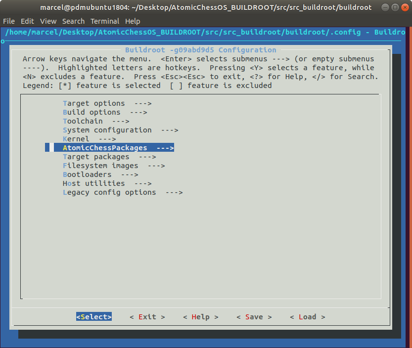

The menu is split into several categories and the most important basic configuration points are explained below.

### Target options

* `Target options -> Target Architecture`, the RPI uses an ARM CPU, so the setting is set to `ARM (little endian)`
* `Target options -> Target Architecture Variant`, defines the specific CPU Model. In the RPI3b+ case its an `Cortex A53`

### Kernel

#### KERNEL CONFIGURATION

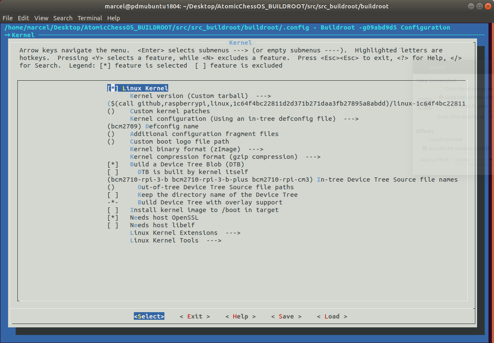
?? WHAT IS A DEVICE TREE ??

* `Kernel -> Device Tree Settings`, this point defines which device tree to build. In this case the predefined device tree `bcm-2710-rpi3b` is used. The DTB `DeviceTreeBinary` Files are downloaded from the RaspberryPi-Firmware Repository automaticly form buildroot.

Its also possible to add additional Device Tree Overlays in additon to the predefined overlay. This is the case if we want to add additional hardware to the target system. In our case, we add a an DTD Overlay to the system, to access the Touchscreen.
The tocuhscreen controller used, is the FT 5406. This controller is also used in the original 7" Raspberry Pi FTF Display, so there is a DTD Overlayfile already existing for loading.
The DTB File can be found in the RaspverryPi-Firmware Repository `rpi-firmware/overlays/rpi-ft5406-overlay.dtb`. We have to make shure that this file exists in the boot partition `<SD_CARD>/boot/overlays/` of the final image.
All DTB files will be loaded at startup if nessessarry. Its also possible to load additional DTB files with the configuration file `/boot/config.txt` of the Raspberry-Pi firmware.

* `Kernel -> Kernel Version`, in this case the precompiled kernel was used which are downloaded form the RaspberryPi-GitHub-Repository.

These are basic nedded configuration items to setup a minimum booting system.
Also buildroot generates a cross-compiler for the host system. So its possible to build software for the target-system.

The next step is the system configuration and the target packages configuration.

### TOOLCHAIN

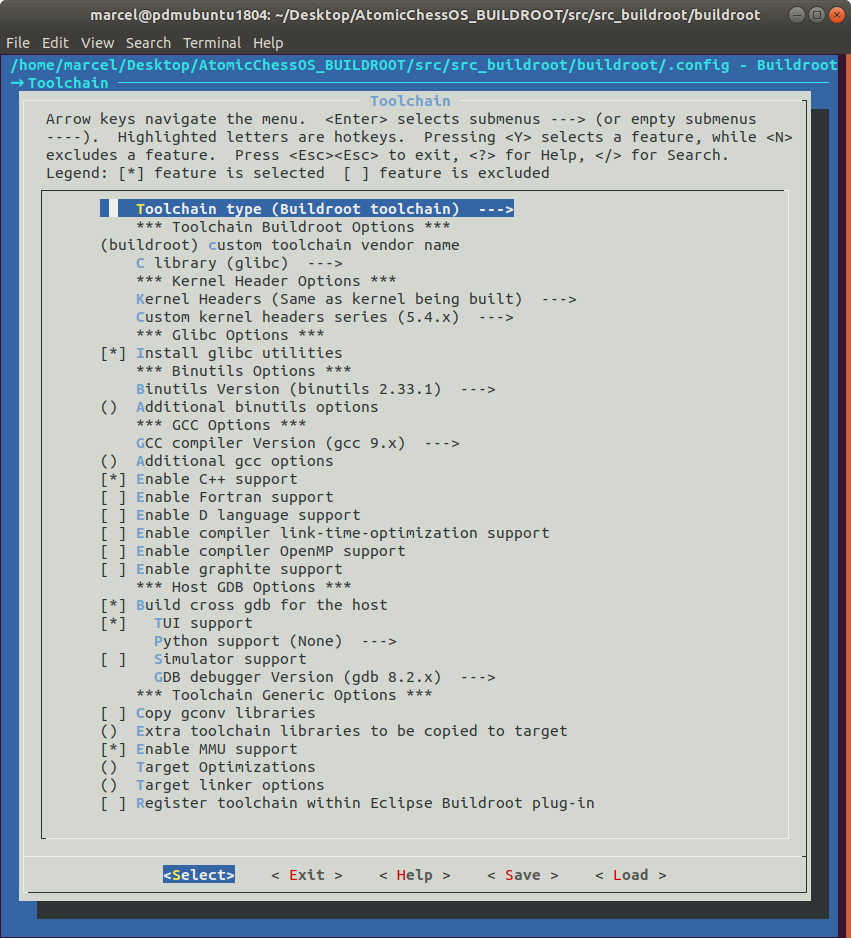

The buildroot framework does not only build a image for the target device, it also build all nessessary tools for build software for the target. This software collection is called toolchain and in runnung on the host system. On the target plattform is no compiler or build system installed, so its nit possible to compile software directly on the target, with an buildroot image.

#### SITENOTE_TOOLCHAIN

With the standard raspian os for the raspberry pi, its possible to install an compiler like gcc and a buildsystem like make, directly on the raspberry pi.

#### END SITENOTE

In the `Toolchain` Menu, its possible to setup, all parameters for the host toolchain that buildroot builds, together with the target image.
For example its possible to install a GCC or a Fortran compiler into the toolchain.
For development, we need a C++ compiler and a debugger.
The GDB Debugger has to be installed on the target and on the host. Buildroot selects the right version for host and target.

* `Toolchain -> Enable C++ support` -> enables the gcc and g++ compiler with the make build system
* `Toolchain -> Build Cross GDB` -> build the GDB Debugger for host and target

All other settings are the default settings. Its also possible to register the toolchain to an IDE linke Eclipse for easier setup on the host side.

### SYSTEM CONFIGURATION

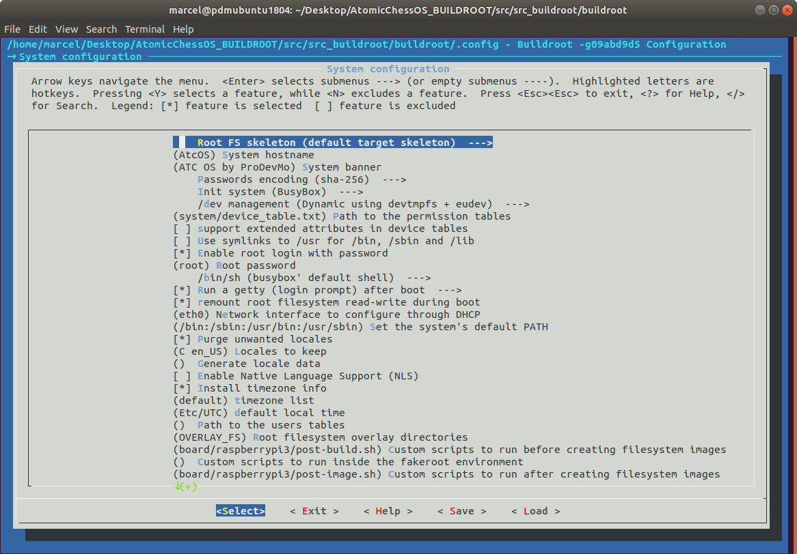

The system configuration allows to setup a root user, password or which keyboard layout should be used. Its like the `$ sudo raspi-config` command in a regular Raspbian installation.

The `System-Configuration` Settings comes also with predefined values. There are only some which needed to be modified.

* `System-Configuration -> Networkinterface DHCP`, this setting defined the Ethernet Interface to enable at startup and using a DHCP Server to obtain a IPv4 Adress. The value on a stock RPI3b+ can be ETH0 (LAN) or wlan0 (WIFI). The ATC_Table is using ethernet as its main network interface so `eth0` is the right choice.

* `System-Configuration -> Root filesystem overlay dir`, this filepath represents the Overlay Directory and is a custom Folder. All files in this directory will be copies into the final image rootfs and replaces existing files. In our case, this will be used for the wifi configuration and other ssh configuration files.

For debugging purposes, the access to the root aacount though a password is acceptable. In the production build of the image, the root access is disbaled.


#### /DEV MANAGEMENT

The setting for the /dev managemtns is very important! The ATC_OS need user interaction thought an input device, like a mouse, keyboard or a touchscreen. By default the udev is disbaled on the system, so its not possible to simply adding a touchscreen input to the system.

* `System Configuration -> /dev management (devtmpfs + eudev)`, enables udev subsystem.

UDEV basicly handles the events coming from an input source (Keyboard,.., plugged Harddrive) and performing tasks based in this inputs.
On task is to load a driver if can keyboard is attached though an usb port. In our case its used to access the touchscreen, after connecting the display via the DSI Interface to the Raspberry Pi, udev loads the FT5406 Touchscreen IC driver and make it accessable as `/dev/input/mouse1` (a usb mice is already plugged in).

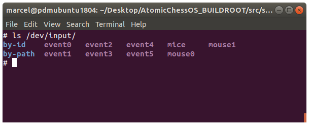

### TARGET PACKAGES CONFIGURATION

The target package configuration allows to install software and libraries on the target. For example we want to install an ftp server onto the target. In the target packages we can select the ftpserver packe and all other needed dependencies will be installed too.
Its a very simple process, just select the software and all other needed packages will selected too.

#### QT5

The most important library is the QT5 framework.
The userinterface of the ATC_OS  called ATC_UI is based on QT5 with the QuickControls II extention, so a QT Version >=5.7 is needed to enable this feature.
Buildroot supports the QT5.6 LTS version and the latest QT5.12 version by default. So here we have simply to enable the QT5 packge with all extetion packages.

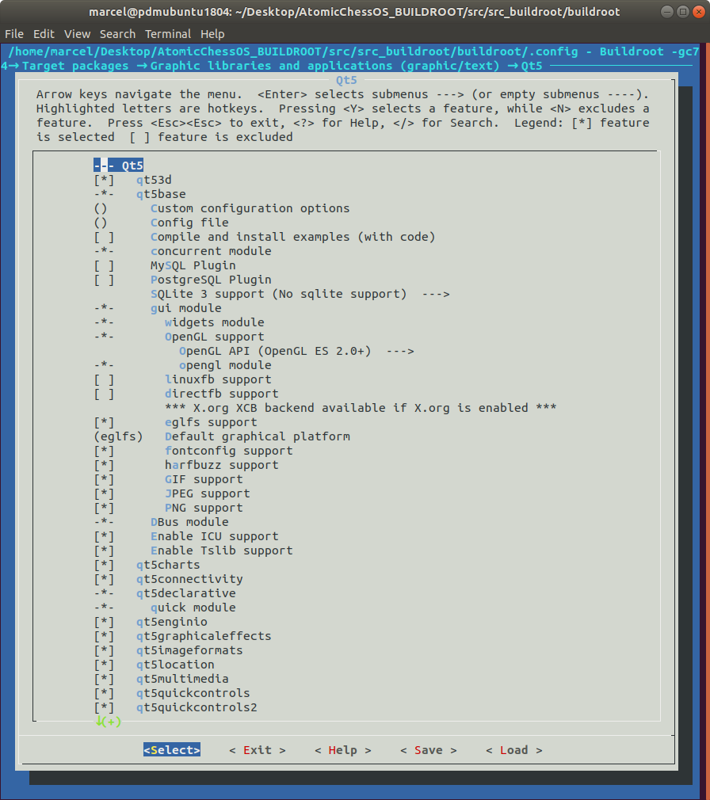

After enabling the QT5 packge, buildroot automaticly enabled EGLFS as grahpics backend. The backend is needed to enable application to render and show graphics on the screen. EGLFS is able to make use of the GPU for graphics acceleration and is needed by the QT5 QuickControl II Extention to render animations.

QT5 alone is able to use other graphics backend too, for example the directfb. the directfb is the simplest graphics backend provided by the linux system, and it can be used for very simple applications.


* `Target Packages -> Graphic -> QT5`, enables QT5, with the QT5_BASIC package. Use the `Return-Key` to access all QT5 packages.
* `Target Packages -> Graphic -> QT5 -> Default Graphic Plattform (ELGFS)`, set the default graphic backend to ELGFS for Hardware Graphics Acceleration.
  
The `Default Graphic Plattform (ELGFS)` entry is important to check, if its not set, the ATC_UI application will not start. The setting sets a environment variable called `QT_QPA_PLATFORM`, which tells the QT5 application to use the ELGFS backend.

#### SSH

In the case of the ATC_OS we need a ssh server to connect to the target via ethernet. This allows the remote debugging and development of the software. Most IDE support the deployment of the build software over ssh to a target system. So a ssh and sftp server is essential for development.

Buildroot provides the SSH and SFTP server in seperate packages:

* `Target Packages -> Networking Applications -> gsftpserver`, enable the SFTP Server, for file transfers.
* `Target Packages -> Networking Applications -> dropbear`, enable the SSH Server, for a secure shell

A NTP client will also be installed, so the target system can fetch the correct time over a NTP Server.
This is needed for a successful SSH HTTP Request of ATC_Controller application to the chess ATC_Server.
With incorrect time setting, the Client/Server is not able to verify a SSL Certificate.

#### INTER PROCESS COMMUNICATION

For communication of the gui and the control software a inter process communication system is nessessary.
It uses the ZeroMQ protocol, so it is needed so install the zeromq library.

* `Target Packages -> Libraries -> Networking -> zeromq`, enable zeromq messaging library to use the ZeroMQ protocol. (GUI communication).
* `Target Packages -> Libraries -> Networking -> czmq`, client library for ZeroMQ.
* `Target Packages -> Libraries -> Crypto -> libsodium`, enables crypto functions for ZeroMQ.

For message serialization, the google protobuf project was used. Here buildroot offers the `libprotobuf`.

* `Target Packaged -> Libraries -> Others -> protobuf`, enable the protobuf library.

#### MISC PACKAGES

These packages are not required, but used for development.

* `Target Packages -> Text editors -> nano`, install a simple text editor
* `Target Packages -> Networking Applications -> rsync`, proves simple file sync (also used by QT if avariable).

There are some more applications and libraries for development and testing installed, but the system is working with these mentioned above.

#### STAT PACKAGE
In the default configuration the `stat` command is missing on the target filesystem. The command is needed in order to use the Visual GDB Plugin later for remote debugging.
It uses the command to verify a successful depoyment of the compiled binary.
The `stat` command is located in the `coreutils` package, which is part of the busybox package. Busybox offers a different configuration menu which is accessable with the `$ make busybox-menuconfig`. In the following window the package can be activated in the `Coreutils -> stat` submenu.


### FILE SYSTEM SIZE

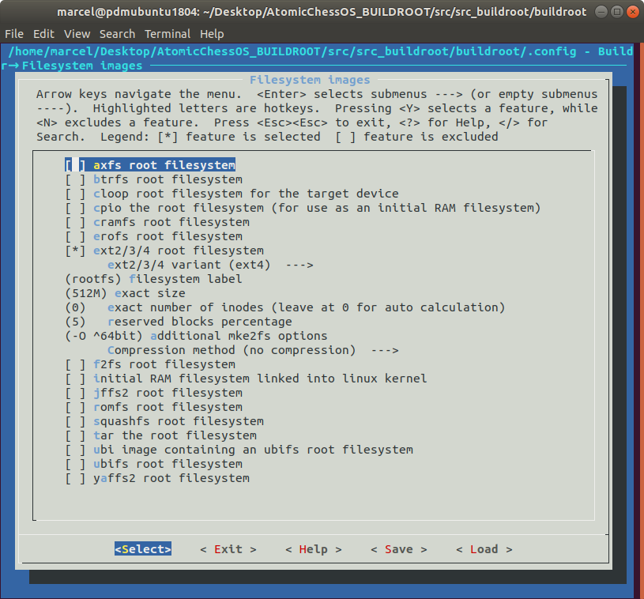

The QT libraries and the other needed libraries are quite large in size. For the full QT5 with QT3D and the Virtual Keyboard and the nedded QuickControls II the rootfs file system is about 230MB. The default setting is 128MB. So buildroot can not build the final image beacuas its not enought space. To increase the rootfs maximum size, buildroot provides a size option under `Filesystem images -> root filesystem -> exact size`. With the `Space-Key` it is possible to edit the default value to 512M. A Zero for automatic determination is not supported.

The `Fileystem images` category, provides several other options for the rootfs. Its also possible to create a readonly filesystem or a compressed one. For debugging purposes, the readonly filesystem option is disabled. 
For deploying new versions of the image, the compression method is set to `.gz` with the option `Filesystem images -> Compressionmethod (gzip)` for a smaller rootfs partition. After a build the normal image `sdcard.img` was created, also the compressed version of the rootfs `rootfs.ext2.gz`.

All other settings are the default settings.

After building a complete image the size is about 310MB in Size, this includes the bootloader, os with all libraries and packages with the ATC needed programs (ATC_UI, ATC_Client).

### FILE SYSTEM OVERLAY
* general function and usage
* usage in buildroot to modify the final filesystem
* concrete usage here, with ssh keys
?? IMAGE OF THE OVERLAY DIAGRAM ??


#### AUTOBOOT AND LOG ROATION

All ATC applications, like the ATC_GUI and the ATC_Controller, have to start with the system automaticly.
For this purpose the linux system offers several different methods to accomplish this task.


In this case, the goal is to start the Applications as service, after the the rest of the system is booted up.
The `init.d` system offers a priority handling for startup scripts, placed inside if the `/etc/init.d` folder of the system.
The startup script has defined parameters (`start`,`stop`,`restart`) which handle the start and stop procedure of the applications to run.

The body of an `init.d` script is listed below.

```bash
#!/bin/sh
#
# atc        Starts all atc pacakges.
#
umask 077

start() {
	modprobe i2c-dev
   	/usr/ATC/atc_ui &
	/usr/ATC/atc_controller &
	printf "Starting atc: "
	touch /usr/ATC/ATC_LOCK
	echo "OK"
}
stop() {
	printf "Stopping atc: "
	killall atc_ui
	killall atc_controller
	rm -f /usr/ATC/ATC_LOCK
	echo "OK"
}
restart() {
	stop
	start
}

case "$1" in
  start)
	start
	;;
  stop)
	stop
	;;
  restart|reload)
	restart
	;;
  *)
	echo "Usage: $0 {start|stop|restart}"
	exit 1
esac
exit $?

```

The naming of the script is important. As mentioned `init.d` offers a priority system, which is defined in the name of the script.

In the case of the ATC applications the startupscript is called `/etc/init.d/S99atc`.
The naming convention is the following:

`/etc/init.d/<TYPE><PRIORITY>name`

The type charakter is `S` which stands for service.
`init.d` offers priorities from `0` to `99` and the name can be a visible name to identifiy the service.
The goal is to start the script at the end of the startup routine, so the priority of `99` is set.


A last step is reuqired. Its nessessary to make the script executable, which is possible thought the `chmod` command.

`$ sudo chmod +x ./OVERLAY_FS/etc/init.d/S99atc`, marks the the script as executable.

After rebuilding the image, the embedded system shouls start the ATC Applications automaticly, with no need for an console login.
Its also possible to start and stop the script by calling `$ /etc/init.d/S99atc {start|stop}`.

The log that the applications generated, started with `init.d` can be found in the `/var/log/<FILENAME>.log` folder, where the name matches the `init.d` filename.

##### LOG ROATION

Logrotate is a system utility that manages the automatic rotation and compression of log files.
If log files were not rotated, compressed, and periodically pruned, they could eventually consume all available disk space on a system. 
In this case we dont have much space left on the partition, one options is to simply do not log anything or redirect the logoutput to `/dev/null`.
Especially for a long term test of the running system, logs are nessessary for debugging. 

Logrotate offers two ways of configuration, the first thought the configuration file located in `/etc/logrotate.conf`.
At the start of the file, other configuration files are included located in the `/etc/logrotate.d/`

```bash
/var/log/apt/atc.log {
  rotate 10
  hourly
  missingok
  notifempty
}
```

* `rotate`, keeps 10 logfiles stored
* `hourly`, interval of the rotation, also other intervals possible `daily, monthly,..`
* `missingok`, if the application has no logfiles, logrotate will print an error. The `missingok` attribute disables this behavior.
* `notifempty`, do not create a new logfile or roate the logfile, if the logfile of the application is empty.

It is also possible to set several different other attributes like `compress`. This compresses the logfile to an `.gz` archive.


The preconfigured logrotate configuration for the ATC applications can be found in the overlay fs folder of buildroot `./OVERLAY_FS/etc/logrotate.d/atc`

Its also possible to manually reload the logrotate configuration by using the. `logrotate /etc/logrotate.conf --debug` command, which loads the configuration and displays the loaded configuration.


#### SSH KNOWN HOSTS
* using the overlay to insert a known hosts file with the already known ssh keys 


## HOW TO FINALLY BUILD

Now everything is setup, so its possible to build the image. From a fresh buildroot installation it can take serveral hours to build the image. Buildroot download the sourcefiles only once to the dowload folder `./dl`. The generated output files can be found in the output directory `./output`. This folder contains several subfolder with the build results.

The `$ make` command starts the build process.
On the development pc (Ubuntu 20.04, IntelCore i9 9900K with 24GB RAM), the a fresh build took about 2h43m.

#### CAUTION
Editing some settings can require a complete requild, for example `Kernel` and  `Target Options` settings.
To cleanup the buildroot cache and output folders, run `$ make clean`

After some time, the process output should end with `INFO: adding roofs partition; INFO: writing MBR`, so everything is finished.
The result can be found in the output directory:

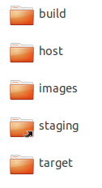

* `build`, contains the compiled libraries and other compile software
* `host`, contains the build software for the host, including the cross compile toolchain
* `images`, contains the final sd card image
* `target`, this is a copy of the rootfs of the target device

#### TARGET BUILD RESULT

The build image can be found in `./output/images/sdcard.img`. This image already contains the root filesystem, the boot partition with bootloader and firmware espacially for the RPI.

It can be flashed using the linux `dd` command
`$ dd bs=4M if=./sdcard.img of=/dev/<SD_CARD> conv=fsync`
or by using a gui based utility like [Win32DiskImager](https://github.com/znone/Win32DiskImager) or the [Etcher](https://www.balena.io/etcher/).

After flashing the image to an sd card, the device is ready for booting.
If the device boot sequence finsihed, its possible to connect with the taerget board over SSH with the in the `System-Settings` Chapter given settings.
On the development pc its also possible to connect without a user password. This is possible though host public key signature the `/root/.ssh/known_hosts` file, given though the `FILE SYSTEM OVERLAY` system in the build process.

#### HOST CROSS COMPILER

The crosscompiler (gcc,g++,gdb, ...) can be found in the sysroot directory `./output/host/bin/`

* G++ `arm-buildroot-linux-gnueabihf-g++`
* GCC `arm-buildroot-linux-gnueabihf-gcc`
* GDB `arm-buildroot-linux-gnueabihf-gdb`
* CMAKE `cmake`
* QT_QMAKE `qmake`, if qt was selected

The sysroot of the target system (needed for the QT Kit Sysroot Setting) is located in the  `./output/host/arm-buildroot-linux-gnueabihf/sysroot` folder.

#### BUILD A SINGLE PACKAGE

For building a single package, for example to debug the buildprocess if a new created package, buildroot provedes a make command.

`$ make <PACKAGE_NAME>-rebuild`

The package name can be found in the package folder of buildroot `./packages`.
A rebuild does not downloads the source again if a fixed commit id is present in the `.mk` File of the package.
Instead the already downloaded source in `./buildroot/dl` will be used.

## ADDING OWN PACKAGES

### PACKAGE STRUCTURE
This chapter only explains the basics about creating packages. Buildroot has a very powerful packages system, which is not needed for this project.
Here also the system dependencies are not considered.

After building the first image successfully, our goal is to add custom software packages to the buildroot configuration.
All avariable pacakges definitions are located in the package directory `./packages`.
Each package is located in a seperate folder inside the `./packages` folder.
The folder is called like the package name.

The package folder contains at least two files:

* `<PACKAGE_NAME>.mk`
* `Config.in`


### PACKAGE CONFIG FILE
The `Config.in` file contains the information, that are visible on the configuration menu `make menuconfig`.

Listed below is the simplest package information, which the `Config.in` can contains:

```bash

config BR2_PACKAGE_PACKAGENAME
    bool "PACKAGENAME"
    help
        INFORMATION ABOUT THE PACKAGE

```

The first line is the start configuration for the specific package, Important is `PACKAGENAME` at the end of the line.
Followed by the bool option. This option is visible under the buildroot configuration menu.
The `help` section, can contains several information about the author / functionallity of the package.

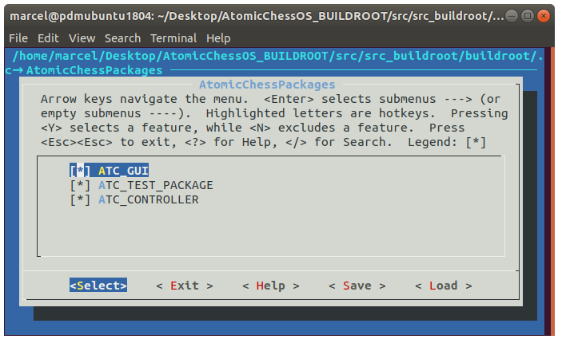

### PACKAGE MAKEFILE

The `<PACKAGENAME>.mk` is the makefile or build reciepe for the package.
The file contains the build and install instruction for the package.

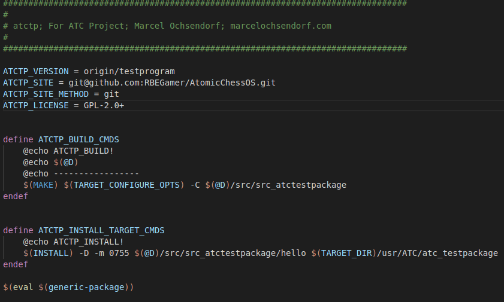

#### SOURCE FILE LOCATIONS
The first information, is the location of the sourcefiles of the package.
Buildroot always downloads the package sources from an other location.


Its possible to store the sources local but its not recommended, so its not explained here.
The source files of the custom packages are stored in a git repository.


* `<PACKAGESNAME>_VERSION = origin/master`, is the commitid or branch of the git repository.
* `<PACKAGESNAME>_SITE = git@github.com:RBEGamer/AtomicChessOS.git`, is the git server url
* `<PACKAGESNAME>_SITE_METHOD = git`, use git.

It is also possible to download the source as a zip or tarball archive from a webserver.
In this case the `<PACKAGESNAME>_SITE` key is the url without the filename and the `<PACKAGESNAME>_VERSION` the filename.

#### BUILD COMMANDS
Next step is the definition of the build steps.

The `define <PACKAGENAME>_BUILD_CMDS` starts a block of shell commands, which will executed during the build phase.

Buildroot defines some environment variables, for example the directory of the downloaded source or the location of the make executable.

* `$(@D)`, defines the directory of the source files
* `$(TARGET_DIR)`, defines the sysroot of the target device. Its mainly used for the installation process of the compile binaries.
* `$(MAKE)`, defines the actual make executable

Variables for compiler, qmake, cmake are also defined by buildroot, using the cross compile toolchain.

* `$(QT5_QMAKE)`, defines the QT Qmake executable
* `$(CAMKE)`, define the CMAKE executable
* `$(CC)`, defines the GCC compiler
  
The install block has to be closed with an `endef` line.

##### SITENOTE C++17

After adding more features to the ATC_GUI userinterface. The project can not be build with builroot, but manually with the QT Creator.
After investigating the error log of the make command, it turns out that the g++ compiler does not run with the C++17 option.
The ATC_GUI requires C++ Version 17 for the enum types, so in the qt projectfile `rpidisplay.pro` the c++ compiler flag was already set.

* `CONFIG += c++17 c++1z`
* `QMAKE_CXXFLAGS += -std=c++17`

These settings worked in the QtCreator environment just fine, but with the buildprocess in buildroot (qmake,make), qmake overrides the set config options in the project file.

The solution for this problem is, to define the `-std=c++17` compiler option manually in the buildroot package makefile `./packages/atcgui/atcgui.mk`.
After the modification, the buildprocess runs without a problem.

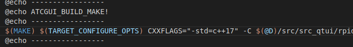


##### END SITENOTE


#### INSTALL COMMANDS
After the build instructions, the install steps follows.
The installation steps in general, copies the the build results from the package, like the executables or shared libraries to the target filesystem.

The `define <PACKAGENAME>_INSTALL_TARGET_CMDS` follows the concepts as the build commands.
Here the defines become useful, especially the `$(TARGET_DIR)`.

Now the configuration of the package is complete, but if the configuration menu is opened, there is no entry with the new pacakge.
The reason for that is, that we have to tell buildroot where to show the new package in the menu.
To do this there is a configuration file located in the packages folder `./packages/Config.in`.


```bash
menu "AtomicChessPackages"
	source "package/atcgui/Config.in"
	source "package/atctp/Config.in"
	source "package/atcctl/Config.in"
endmenu
```

To add the new package to a existing menu, simply to use the source command.
The path behinf the source prefix is the relative path to the `Config.in` file of the package that should be added.

It is also possible to add new menu structures, as shown above. In this example a new entry called `AtomicChessPackages` was added with three packages inside of the menu.

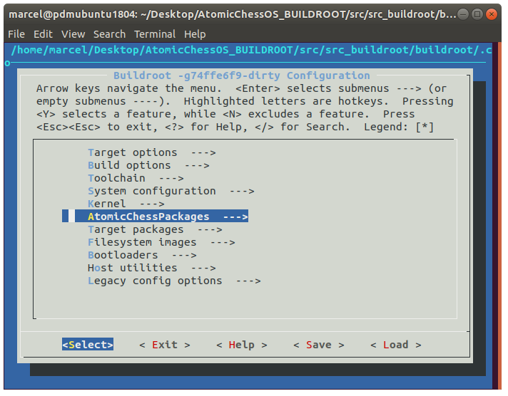

To test the new created package, its is also possible to build the single package by using its name, as described in the chapter `BUILD A SINGLE PACKAGE`.


## HARDWARE SUPPORT I2C SPI

The ATC Project uses the SPI bus of the Embedded System to communicate with the motor drivers. 
In addition the I2C bus is used to communicate with the nfc reader. In order to use the bus, the `i2c` kernel module has to be loaded with the `modprobe` command.

An other solution for automatic module loading, is `/boot/config.txt` file on the boot partition, but the embedded system is not loading kernel modules specified in the file. This is an issue of the integrated bootloader that buildroot builds. 
To solve this issue an option is to replace the bootloader with the original bootloader from the RaspberryPi system, but in this case, loading the module by hand or script is acceptable.

## FIRMWARE UPDATE


### UPDATE STRATEGY

#### SINGLE COPY
#### DOUBLE COPY

### ADDING A SECOND 'rootfs' partition
In order to implement the `double copy` update strategy, a third partition has to be added to the image.
The first partition is the `boot partition`, followed by the `rootfs`.
The goal is to add a third partition called `rootfsbackup` to the image.
Each board definition, contains a file `genimage.cfg`, which contains partition description.

```cfg
// board/raspberrypi3/genimage-raspberrypi3.cfg
image boot.vfat {
 ...
 ...
 ...
}
//--- CREATE EMPTY 1024MB EXT4 IMAGE
image backup.ext4 {
  ext4 {}
  size = 1024M
}
image sdcard.img {
  hdimage {
  }

  partition boot {
    partition-type = 0xC
    bootable = "true"
    image = "boot.vfat"
  }

  partition rootfs {
    partition-type = 0x83
    image = "rootfs.ext4"
    size = 1024M
  }
  //------ ADDED ROOTFSBACKUP PARTITION ------//
  partition rootfsbackup {
    partition-type = 0x83
    image = "backup.ext4" //USE CREATED EMPTY IMAGE FROM ABOVE
    size = 1024M
  }
}
```
The `rootfsbackup` was added in the file and has the same size as the `rootfs` partition. The size of `rootfs` and `rootfsbackup` was increased to 1024MB to have enought space for later

Also the partation size was increased for `rootfs` and `rootfsbackup` in the `genimage.cfg` file using the `size` attribute.


After flashing the image to an empty sd card, the partition scheme looks as the following.

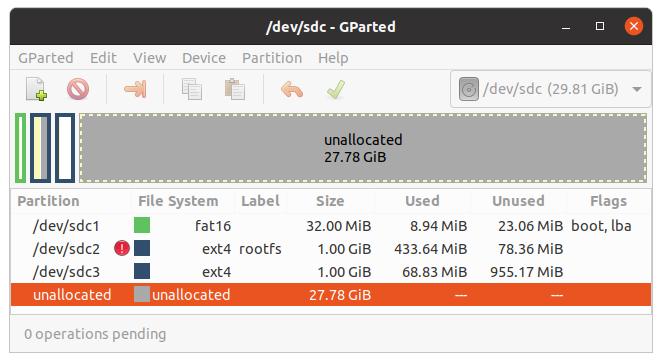

### SWITCHING BETWEEN PARTITIONS
In the current boot configuration, the system boots up, mount the `rootfs` partition and continuous the startup process.
The dual copy update strategy, updates one of the two partitions alternating.
In the current setup, after updateing the `rootfsbackup` partition, the system still boots from the `rootfs` partition and the new firmwar never starts.
So a possibility is needed to swicht between both partitions.
In order to archive this functionallity, the `boot`partition comes handy.

First information is needed from which is the root partition.
A simple solution is to parse the kernels `cmdline` and get the `root=` attribute.

The easiest way is to get the current cmdline with `$ cat /proc/cmdline` or parse it directly from the `boot` partition.

```text
cat /proc/cmdline
... vc_mem.mem_size=0x40000000  root=/dev/mmcblk0p2 rootwait console=tty1 console=ttyAMA0,115200
```

Finally parse the `root` attribute.
```bash
$ cat /proc/cmdline | sed -e 's/^.*root=//' -e 's/ .*$//'
$ /dev/mmcblk0p2
```

Also we need to modifiy the `cmdline` in order to change the `root` attribute to the new root partition. 
This can be archived with mounting the `root` partition into a folder.

On the target device the partitions can be found in the `/dev` folder:

* `/dev/mmcblk0p1` -> `boot` partition
* `/dev/mmcblk0p2` ->`rootfs` partation
* `/dev/mmcblk0p3` -> `rootfsbackup` partition

With the mount command a parition can be mounted to a specified folder.
In this example the goal is to mount the `boot` partition into a folder called `boot`
`$ mkdir /boot && mount /dev/mmcblk0p1 /boot`.

* startup
*


In the current boot configuration

### SWUPDATE

* update methods
* update strategie single dual copy
*


`swupdate` is already avariable as package in buildroot:

* `Target Packages ->System tools -> swupdate`, enable swupdate package.

Also a few support-packages are needed to automate the update process:


* `Target Packages ->Filesystem and flash utilities -> e2fsprogs`, to check the updated filesystem for errors.
* `Target Packages ->Libraries -> JSON/XML -> libjson`, json support for communicating with hawkbit server.
* `Target Packages ->Libraries -> JSON/XML -> json-c`
* `Target Packages ->Libraries -> Networking -> libcurl`, for swupdate download feature.


The `swupdate` package offers a more advanced configuration menu. In after selecting the `swupdate` package only the basic configuration is set by default.
For this project, a update using a local webserver or using a `hawkBit` server is a good way to updating over a remote server, with no need for a USB drive.

`$ make swupdate-menuconfig`, open the menu and the following changes were made:

* `Swupdate Configuration -> Enable image downloading`, enables downloading of updates from a webserver.
* `Swupdate Configuration -> Web Server`, enables downloading of updates from a webserver.
* `Swupdate Configuration -> Enable verification of signed images`, enables signed updates.
* `Swupdate Configuration -> Scricatta -> Server ->Server Type (hawkBit)`, enables automated rollout using a `hawkBit` server.


All changes after selecting `<SAVE>` will be discarded, to save the changes permanently in the `.config` file, the `$ make swupdate-update-defconfig` command has to be executed.
After rebuilding the image with `$ make` or using the build script `$ ./build.sh`, the `swupdate` command is avariable on the target.
The one of simplest methods of using `swupdate` is to start a webserver, where a update package can be uploaded.

`$ swupdate -v -w "--document-root /var/www/swupdate --port 8081"`, which start the webserver on port `8081`.


On the target system, the `swupdate` starts automatically by using the previously described `init.d` method.
For this reason a script `OVERLAY_FS/etc/init.d/S88swupdate` was created, which starts the `swupdate` webserver and the `hawkBit` client which is integrated in `swupdate`.


#### UPDATE PACKAGE CREATION

```cfg
software =
{
        version = "VERSION";
        rootfs:
        {
        	images: (
                {
                        filename = "rootfs.ext2.gz";
                        device = "/dev/mmcblk0p2";
                        type = "raw";
                        sha256 = "RFSHASH";
                        compressed = true;
                }
        	);
        };
        rootfsbackup:
        {
        	images: (
                {
                        filename = "rootfs.ext2.gz";
                        device = "/dev/mmcblk0p3";
                        type = "raw";
                        sha256 = "RFSHASH";
                        compressed = true;
                }
        	);
        };
}
```

#### HAWKBIT CONFIGURATION
In order to use the `hawkBit` client, `swupdate` can be configurated with an additional configuration file, located in `./OVERLAY_FS/etc/swupdate/swupdate.cfg`.
The config file contains the configuration for the `hawkBit` client.
The essentials detailes in the config file, is the `id` of the device and the `url` to the `hawkBit` server.

```cfg
// /etc/swupdate/swupdate_template.cfg
...
...
suricatta :
{
	tenant = "default";
	id = "ATCTABLE"; //DEVICE ID
	url = "http://192.168.178.125:8082"; //hawkBit Server URL
	nocheckcert	= true;
	enable		= true;
};
```
The `id` should be unique for every device. For easy setup the unique mac adress for the ethernet interface `eth0` on the target was used for this id.
To simplify the process a script `OVERLAY_FS/etc/swupdate/create_swupdate_cfg.sh` was created to automaticly replace the `id` with the mac adress at system startup. A template configuration `swupdate_template.cfg` in addition with the `sed` command to replace the placeholder `ATCTABLE` with the mac adress.

```bash
#!/bin/sh
# /etc/swupdate/create_swupdate_cfg.sh
#GET MAC ADDRESS
HWID=$(cat /sys/class/net/eth0/address)
#REMOVE THE : OF THE MAC ADDRESS TO GET A CLEANED ONE
HWIDCLEANED=${HWID//:/}
cp /etc/swupdate/swupdate_template.cfg /etc/swupdate/swupdate.cfg
sed -i 's|DEVICEID|'"$DEVICEID"'|g' /etc/swupdate/swupdate.cfg
```

With this method its simple to deploy one image, to serveral different devices, and the device setup itself automaticly.
Now the configuration is compl


### HAWKBIT
` $ sudo docker run -itd -p 8082:8080 --restart always hawkbit/hawkbit-update-server:latest --hawkbit.dmf.rabbitmq.enabled=false --hawkbit.server.ddi.security.authentication.anonymous.enabled=true`

To open the configuration website, navigate to `http://<IP>:8082/` with username `admin` and password `admin`.


## PREPERATION WORK FOR CI

At this point the whole buildroot setup is working on our development machine.
The final goal of the installation is, to automate the build process further more using a continous integtation (CI) system like jenkins.
To make the integration into the CI system easier, a single bash file was created to handle all for a build nessessary commands.
The file is placed in the buildroot-root directory `./build.sh` and invokes the make comand in order to run a buildroot build.

On step is important before make can be called. After a fresh download of the buildroot directory from the git server, it is not possible to directy call make. The `.config` file will not be synchronizes by the `.gitignore` file, so the file is missing in the buildroot-root directory.
To solve this issue, the buildroot configuration is stored under a different file name `./config_backup`. The `build.sh` file copies the `config_backup` to `.config`, and invoke the make command sucessfully.


Later the CI system simply have to call the `build.sh` file in order to start the build complete process.

In addition, later its also possible to add new features to the `build.sh`. For example to upload the final image to an FTP Server.


## CONCLUSION BUILDROOT
The configuration of the buildroot system was a bit difficult. 
There are a few dependencies eg for the touchscreen which have to be checked manually.
The goal of the buildroot system for the ATC Project is, to build a working/ ready to use image, which contains all needed software to drive a ATC Table.

For this purpose, three custom buildroot packages were created, to intregrate the needed ATC Software into the final SD-Card image.
The final SD Card image, can directly flashed to the RaspberryPi and the build cross plattform compiler toolchain can be used to develop software on the host computer and run it on the target hardware.

This setup was used in the whole software development process. Especially for the gui application. QT5 needs this cross compile toolchain to compile the application successful.


In summary buildroot was a great choice to work with. The process of integration of own packages was straight forward. In the end building an linux image for an embedded device that simply works, including all needed software for the project is very great.
This system also has advantages as not every image has to be adjusted manually, especially if the number of embedded systems to be installed increases.

??
The now created configuration and patching of buildroot allowes delivers a complete running system for QT and Hardware apllications.
The system is very easy to use, by simply calling the `./build.sh` script and flashing the `sdcard.img` file to an sdcard.
The RaspberryPi boots with ssh server, configures I2C and SPI and boots up the ATC software services.

??


