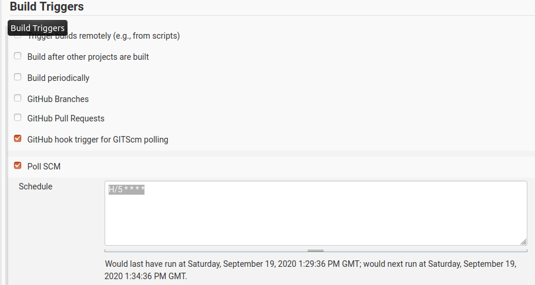

## Continous Integration

### WHY CI

### ADVANTAGES IN THIS PROJECT

For debugging and testing, building, checking the result, doing these step manually is okay.
But after the basic setup is working, the next task is to automate this tasks.
Especially, becuase the build process of buildroot can take serveral hours and the development pc is working hard to accomplish this task.
A good solution is outsource this task to a dedicated server. With an installed CI system on the server its not nessessary to kick off the process manualy.

The end result should be:

* Developer commits changes to release branch
* CI System detect changes and starts build process
* After successful build, save build artefacts
* (Publish build artefacts to production system)

In the case of building an sd card image for the embedded system, a manual step is needed to get the build files from the CI system running. So the CI can not publish the artefact to a production system. A better solution in this task is, to notify the developer that a build is succeed.

In this chapter we are getting to setup the jenkins software and create a configuration for the buildroot project in order to build the images for the embedded system automaticly.

### WHAT IS JENKINS

### SETUP JENKINS BLUEOCEAN

For this setup, the server is a virtual machine hosted on AWS (Amazon Web Service). Here is used a `AWS EC2 t3.2xlarge` instance.
This instance type offers 8 cpu threads and 32GiB of RAM. The Harddrive-Storage is here not important, the network troughput too.
As virtual machine base image (OS), we choose Amazon Linux which is based on Debian Linux.
It has a basic setup and ships with preinstalled applications like Docker, it is also hardened about remote root access.

This virtual machine is used to host the Jenkins Master, Build-Agents and the ATC_Server.

#### INSTALL JENKINS BLUEOCEAN

The setup of the jenkins software is very easy though the usage of Docker.
Jenkins offers a Docker-Image which can be installed though the `docker-cli`:

* `$ docker --version`, checks if docker is installed.
* `$ docker container run --name jenkins-blueocean --network host --env DOCKER_HOST=tcp://docker:2376 -v $(pwd)/jenkins_conf:/var/jenkins_home -p 8080:8080 -p 50000:50000 --restart always jenkinsci/blueocean`, pull docker image and start a new container using this image.

##### SITENOTE CONTAINER MANAGEMENT

Its possible to manage all docker container thought the `docker-cli`. There is also a webinterface for manage them, called portainer.
The portainer-webinterface allows to start/stop/create containers, image repository management and gives detailed logs and statistics over running containers.
Portainer is also able to manage a docker swarm or stack environment. In this reason portainer was also used to manage the docker environment on the remote server from the development pc.

The installation of portainer is very simple:

* `$ docker volume create portainer_data`, creates a volume for configuration data.
* `$ docker run -d -p 8000:8000 -p 9000:9000 --name=portainer --restart=always -v /var/run/docker.sock:/var/run/docker.sock -v portainer_data:/data portainer/portainer-ce`, start the portainer container. Its important to mount the local docker environment to the container using `-v /var/run/docker.sock:/var/run/docker.sock`.

The webinterface can be accessed with an brower pointing to `http://127.0.0.1:9000/`.

##### END SITENOTE

The Container needs two ports to be opened to the outside. On port `8080` the webinterface that jenkins provide can be accessed.
After successful start og the container, its possible to access the webinterface with the browser `http://127.0.0.1:8080/`.

The next steps are some basic installation questions:

* Install recommended plugins
* Setup a user account

Now we need to setup a few things in Jenkins before creating a new Job.

#### CREATE SSH CREDENTAILS

The sourcecode of the buildroot project, is stored in a git repository.
The repository is private and a clone is only possible, if the ssh key of the git client is registered on the git server.

On the development pc this is already the case, because it is needed to pull and push changes to the git repository.

On the Jenkins site, is is also nessessary, otherwise the jenkins agent can not pull the sourcecode from the git repository.

For security resonse the first step is to generate a new ssh keypair, that is only used for the jenkins<->git authentication.

A new keypair can generated with the `ssh-keygen` utility, which is installed on Ubuntu/Debian by default.

 `$ ssh-keygen -t rsa -C "jenkinsdev@prodevmo.com"`

 The tool asks for the storage location of the new key, here it is important to change the location due to avoiding to override existing keys.
 In the example the path `/home/prodevmo/.ssh/jenkins_master` was used.

 After `ssh-keygen` finished, it generates two files in the chosen directory:

 * `jenkins_master`, the private key file
 * `jenkins_master.pub`, the public key file

The content of the `jenkins_master.pub`, has to be saved on the git server.
For example, the process to add the new generated key to github is:

 Open a new brower and navigate to `github.com/settings/keys` and klick `new key`.
 In the following window paste the content of the `jenkins_master.pub` file and click `Add SSH Key`

 

 This proces is the same for other git systems like Bitbucket or GitLab, the GitHub workflow is only an example.

 Now the git server is setup with the new key, now we have to register the private key to the jenkins master.

 In order to do that, we have to navigate to the credentaials settings in jenkins : 
 `Jenkins->Manage Jenkins -> Manage Credentaials` and click under `Stores scoped to Jenkins` on `Domains (global)`.

On the left window, click on `Add Credentials`, to add a new Entry.
Select in the `Kind` drop-down menu `SSH Username with private key`, and paste the content of the private key file `jenkins_master` into the textfield. After clicking on the `OK` Button the key is saved and the setup of the ssh key is complete.

#### CREATE AGENT

##### SITENOTE SYSTEM REQUIREMENTS

Its possible to check if java version > 8 is on the system installed.

`$ java -version`

Otherwise it can be installed, using the apt package manager (Ubuntu/Debian).

`$ sudo apt install openjdk-14-jdk -y`

##### END SITENOTE
Before we can create a new job or project, its nessessary to create a build agent.
At this point we can only create one permanent agent. So the setup process is easy, simply clock thought the setup dialog.
In this installation, the name of the new agent is called `buildagent`.

##### SITENOTE JENKINS VERSION >= 2.249.1
 In this version its is possible, that Jenkins can automaticly depoly and agent on a system. It uses a SSH connection into the system and setup and install a new agent. The process is very easy, its only nessessary to setup the ssh username/password or keyfile for the system with the jenkins credential manager. (See chapter CREATE SSH CREDENTAILS).

The following steps, describes the tradiitional method for deploying a agent, using the downloaded agetn software and run it manually.
With the SSH deploy method, these steps can be skipped.

##### END SIDENOTE

On the jenkins agent overview page. Our new created agent is marked with a red cross symbol. This is becuase our created agent is not running on any system.
After a click on the agent `Jenkins->Nodes->buildagent` we can see on the status tab, a small manual how to start the agent.

The agent can run on the same machine as the master or on any other system. In our case we start the agent on the same server as the jenkins container is running.

After downloading the `agent.jar` file and open the folder in a new terminal, we use the command given on the page to start the agent:
`$ java -jar agent.jar -jnlpUrl http://127.0.0.1:8080/computer/buildagent/slave-agent.jnlp -secret <SECRET_TOKEN> -workDir "/var/jenkins"`

After the agent is started, we can see on the status page, that the agent is connected and is waiting for jobs.

With this one agent installed, jenkins schedules any new build job to run on this agent.
Its also possible to give different agent different abilities. This can be used if a job has specific requirements to build.
For example the build process need specific hardware like a GPU or FPGA card or architecture, then its possible to run a agent on the specific hardware.
With labeling of the agent, its possible to tell jenkins that only jobs, that require special hardware to run on this agent.

For example the agent we setup before runs on a server with an Nvidia Tesla K80. In this case at setup, the agent was labaled with `CUDA_ENABLED`.
A job that requires CUDA can run on this agent.

##### NOTE
The system on which the new agent runs must have all the software installed to be able to build the software.
In the case of the buildroot project. A stock ubuntu installation already has all needed software packages installed.
For debian distributions the `build-essentaial` package is missing and an be installed using
`$ sudo apt install build-essential`.

#### CREATE JOB (PROJECT)

Now the basic jenkins setup is complete and the next step is to setup a project. Jenkins offers different kind of project templates.

For this simple job, to build our buildroot image, a `Freestyle project` was chosen.

The configuration page offers several different options for customizin the new project.
for this project we are only using a minimal subset of the possibilities jenkins offers.

##### Source Code Management

The first settings we have to change is the `Source Code Management` setting. The sourcecode of this project, is located in a git repository.
In order that jenkins find the sourcecode we have to make the following changes:

* `Git`
* `Repository URL`, the URL of the git repository.
* `Credentials`, select the SSH Credentials we have created earlier. 
* `Branches to build`, the branch to checkout. In our case the buildroot sourcecode is located in the `*/buildroot` branch.

##### Build Triggers

This options let us choose, when jenkins should start building the project.
There are several options, depensing on the type of project.
For example the option `Build after other project` is suitable, if the current project depends on an other projects build result.
With this option its also possible to setup a build pipeline.

* 1. build a library X
* 2. build the software based on this library X
* 3. deploy softwa to a production environment

The option `Build peridically` is a good option for long build tasks. Building the project always at the same time.
For example building a whole big project everyday at night, so the result is finished on the next day.

For this project, we want to build everytime a change was made in the git repository. Jenkins offer use two options for this

* `Webhook trigger`, gets notified from the git server about changes
* `Poll SCM`, poll the git repository every set timeinterval for changes

The `Webhook trigger` is the better solution for big repositories, because the `Poll SCM` method polls the complete repository in an interval, which cuases overhead.
The advantage of the `Poll SCM` method is that there is no setup required. Only the time interval for the polling has to be set.
In this project a interval of 5minutes was used.

##### Build Steps

###### BUILD
Now everythin is setup. Jenkins can pull the code from a git repository and detect changes automaticly in order to start a build.
The last thing missing are the steps that jenkins should execute in order to build.
These steps are called `build step`, and can be specified under the `Build` section.

To build the buildroot project, a filed called `build.sh` was created in the repository. So jenkins has simply to execute this file in a build step.

After clicking on the button `Add build step`, jenkins offers serveral different type of build steps.
To execute a bash file, the entry `Execute shell` is the right option.
In the following textbox, it is possible to write bash commands link in a `.sh` file.

The only line we need to sexecute the `build.sh` file is to navigate into the location of the file and execute these.

`$ cd ./src/src_buildroot/buildroot`
`$ ./build.sh`

###### POST-BUILD

Jenkins 

# HOW TO HANDLE ARTEFACTS
* what are artefacts
* using ftp to upload final image
* tag the git commit thats build

#### BUILD RESULT OVERVIEW

After successful setup of the job.
The last build status is shown on the job overview page.

The blue dot indicated that the job was sucessful, a red dot that something failed.
By clicking on the job number, the complete job log output, runtime, artefacts are shown.

### CONCLUSION CONTINIOUS INTEGRATION WITH JENKINS

* easy setup with docker
* simple to use and setup
* perfect for long build tasks buildroot
* setup is usable for more project in the future 
