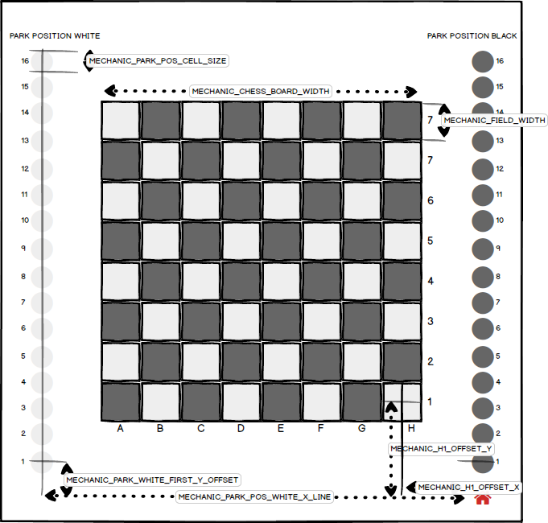
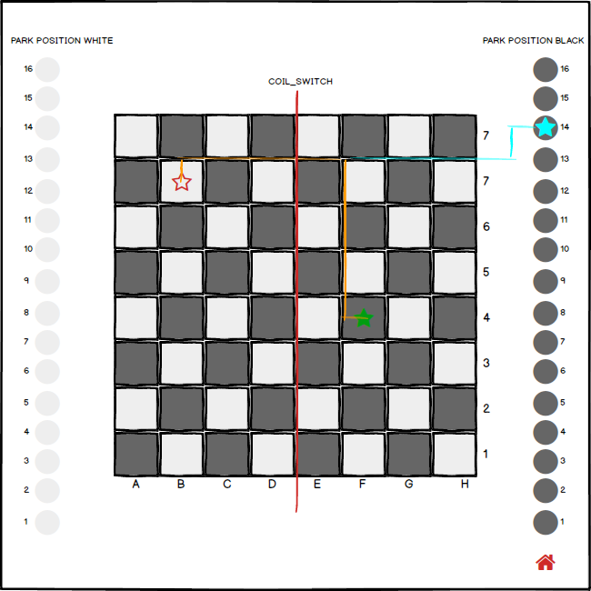
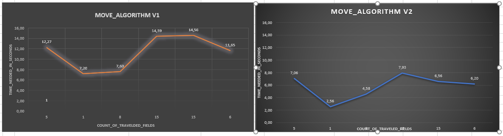

# AtomicChessOS

# ATC CONTROLLER

The controller is the main system on the embedded device that controls the hardware of a ATC Table

* Motor Control
* Communcication with the Server
* Communication with the UI running on the device
* Chess Figure Movement Algorithm


For this software component, we are using a Windows and Visual Studi environment for developing the software.
Our embedded system is a linux device, so we have to build the application for the linux environment running on the emmbedded device.
For this task, the prevously build buildroot toolchain is used.
A software plugin called VisualGDB for Visual Studio, enable Visual Studio to use the linux toolchain over a remote linux system, in order to build and deploy the application.

## REQUIREMENTS

* windows pc for development
* linux pc with buildroot toolchain
* embedded system for deployment

## SETUP A PROJECT USING VISUAL STUDIO AND VisualGDB


### REQUIREMENTS

On the development windows pc is the following software installed:
* Windows 10 Pro x64
* Visual Studio 2019 (Community or Enterprise)
* VisualGDB Plugin (Version 5.5, Linux Edition)
* A SSH Client (MobaXterm Personal Edition)
* git (Gitkraken)


### LINUX BUILD SYSTEM

On the linux build system, the VisualGSB plugin builds the project.
The system is a `Intel Nuc 10`, mini pc, with a stock `Ubuntu 20.04` installed.
One the machine are all package requirements for building the buildroot toolchain installed (see buildroot chapter).


After cloning the repository `$ git clone -b buildroot git@github.com:RBEGamer/AtomicChessOS.git ./atc_buildroot` and switched to the `buildroot` branch, the build process of the toolchain was invoked using the build script `$ ./atc_buildroot/src/src_buildroot/buildroot/build.sh`.

After building the  toolchain is completed, the further configuration work can be done on the windows development pc.
Its nessessary for the linux build system to allow SSH connections.
Its may required to install the OpenSSHServer uisng `$ sudo apt install openssh-server`.

The VisualGDB plugin requires some extra packages on the build pc:

* `$ sudo apt-get install socat`

Now the configuration of the linux build pc for the VisualGDB plugin is complete.
The next step, is the setup of the embedded system for deployment.

### EMBEDDED SYSTEM DEPLOYMENT

Afer building the sources into an executable, the final binaries will be copied to the embedded system.
The embedded system is flashed with tha latest image build by buildroot.

In order to setup the VisualGDB Project, its nessessary that the embedded device can be accessed over SSH.


#### MAKEFILE MODIFICATIONS
* buildroot build oveerrides TARGETNAME AND CONFIG to load a different makefile config in order to use the toolchain generated by buildroot
The different configurationa are stored in different .mk files that will be includes by the Makefile.
THe `debug.mk` configuration contains theVisualGDB Configuration that allows the Visual Studio Plugin to use the remote toolchain on the linux server and can only build by over the visual gdb plugin.
The `release.mk` configuration is used to build the controller apllication with the buildroot framework. It used the compiler executable paths defines by $CC. $LD enviroment variables and build the program with release flags and without any debug symbols. All used libraries are linked staticly.

## THIRD PARTY LIBRARIES

The ATC_Controller software uses serveral different third party libraries, escacially for http requests and json parsing.
* `https://github.com/nlohmann/json#serialization--deserialization`, json parsing.
* `https://github.com/yhirose/cpp-httplib`, http/https requests.
* `https://github.com/Neargye/magic_enum`, enum handling.
* `https://github.com/emilk/loguru`
A copy of the used versions, are located in the controller software directory.


# CONTROLLER OVERVIEW

## MOTOR DRIVER
## BOARD CLASS

## CHESS PIECE
### NFC TAG CONTENT GENERATOR
Each figures NFC tag is ued to identify the figure. For easy usage of the NFC tag, it is formatted into the NDEF format, so its simply possible to program the NFC tags with an mobile phone. The tag contains a ndef `text record` with a string to identifiy the type of figure (three bits), color (one bit) and a counting number (four bits). A combination of all three attributes make the figures id unique to the system. For the automatic unique ID generation, a html page `ChessFigureIDGenerator.html` was created to automaticliy generate all ID for a complete chess board.
Only one byte is stored in the record of the text record and so only 10bytes are used on the NFC tag.

* MSB [7,6,5,4,3,2,1,0] LSB 
* MSB [TYPE,TYPE,TYPE,COLOR,ID,ID,ID,ID] LSB 

For reading the NFC tag with the PN532, the program only reads the first NDEF record and parses the text record data to get the figure type. With this system it is possible to expand the system further and store more data on the NFC tag, by adding more NDEF records.

On the controller side two functions were created to generate the unique ids and read them back.

```c++
  ChessPiece::FIGURE fig;
	fig.figure_number = 1;
	fig.color = ChessPiece::COLOR_BLACK;
	fig.type = ChessPiece::TYPE_KNIGHT;
  
  //GENERATE ID FROM STRUCT
  uint8_t UNIQUE_ID = ChessPiece::figure2NDEF(fig);
  
  //PARSE UNIQUE_ID BACK TO A STRUCT
  ChessPiece::FIGURE back = ChessPiece::NDEF2Figure(UNIQUE_ID);
  
````
* IMAGE

## CONFIG AND CALIBRATION

The system uses a config file located in the filesystem `/usr/ATC/atccontroller.ini`.


### CALIBRATION

In order to calibrate the mechanic, several entries in the config file has to be changed.



### Chess Piece Movement Algorithm



#### BASIC MOVEMENT PROCEDURE

*move 
##### BOARD <-> BOARD

##### PARK_POSITION <-> BOARD || BOARD <-> PARK_POSITON


##### ALGORITHM IMPROVEMENTS

* queue movement all movementinstructions needed for a move, send them combinded to the motor driver
* send coil change event only if changed, SPI Implementation needs time (about 0.5 Secs with the wait ACK)
*


#### PIECE MOVE TIME

| ALGORITHM_V1_TRAVEL_TIME [s] 	| ALGORITHM_V2_TRAVEL_TIME [s] 	| TRAVEL_DISTANCE [FIELDS_DIAGONAL] 	|
|------------------------------	|------------------------------	|-----------------------------------	|
| 7.20                         	| 2.56                         	| 1                                 	|
| 11.56                        	| 6,20                         	| 3                                 	|
| 12,27                        	| 7,06                         	| 5                                 	|
| 14,39                        	| 6,56                         	| 8                                 	|



### MOVEMENT SPEED COMARPISION HARDWARE V1 / V2
* gocde slower nicht


#### [LINUX] HANDLING DIFFERENT 
The simplified hardware design of the projects uses two USB2Serial adapters to connect the SKR1.3 Stepper Driver Board and the User-Move Dector with the Embedded System. All serial deives will be mount under the `/dev/ttyXXX` path and the the squence can be differ after each reboot. In order to prevent this, it is possible to mount a usb device with a Vendor and Product-ID to a specified path using a custom udev roule.
For each rule, the Vendor and Product-ID is needed, for this commands like `lsub` or `usb-devices` and output the relevant information for each usb device attached.
```
$ usb-devices

T:  Bus=03 Lev=02 Prnt=02 Port=02 Cnt=03 Dev#= 11 Spd=12  MxCh= 0
D:  Ver= 2.00 Cls=ef(misc ) Sub=02 Prot=01 MxPS=64 #Cfgs=  1
P:  Vendor=1d50 ProdID=6029 Rev=01.00
S:  Manufacturer=marlinfw.org 
S:  Product=Marlin USB Device
S:  SerialNumber=06FF800AAF3D08075C664F58F50020C3
C:  #Ifs= 3 Cfg#= 1 Atr=80 MxPwr=500mA
I:  If#=0x0 Alt= 0 #EPs= 1 Cls=02(commc) Sub=02 Prot=00 Driver=cdc_acm
I:  If#=0x1 Alt= 0 #EPs= 2 Cls=0a(data ) Sub=00 Prot=00 Driver=cdc_acm
I:  If#=0x2 Alt= 0 #EPs= 2 Cls=08(stor.) Sub=06 Prot=50 Driver=usb-storage
```
During development, several different board are used to control the different hardware sections.
These can be divided into two main groups :

* `Stepper-Controller` - For controlling the Stpper-Drivers, Endstop, Coils/Servo
* `User-Move-Detector` - To interface the hall-sensor array, to detect a manual move of the figures.

In the following table, the Vendor/Product-IDs from some tested boards are listed below:

| Product                         | SUBSYSTEM | Vendor-ID | Product-ID | SYMLINK    | Board-Type         |
|---------------------------------|-----------|-----------|------------|------------|--------------------|
| Bigtreetech SKR 1.4 Turbo       | tty       | 1d50      | 6029       | ttySKR     | Stepper-Controller |
| Bigtreetech SKR 1.3             | tty       | 1d50      | 6029       | ttySKR     | Stepper-Controller |
| Arduino Due [Programming Port]  | tty       | 2341      | 003d       | ttyUBC     | User-Move-Detector |
| Arduino Due [Native SAMX3 Port] | tty       | 2341      | 003e       | ttyUBC     | User-Move-Detector |
| CH340                           | tty       | 1a86      | 7523       | ttyUBC     | User-Move-Detector |
| HL-340                          | tty      | 1a86     | 7523      | ttyUBC    | User-Move-Detector |
| STM32F411                       | tty       | 0483      | 5740       | ttyUBC     | User-Move-Detector |


With these information, is is possible to generate the needed udev rules.
```
$ cat /etc/udev/rules.d/50-usb.rules

...
SUBSYSTEM=="tty", ATTRS{idVendor}=="1d50", ATTRS{idProduct}=="6029", SYMLINK+="ttySKR"
...
SUBSYSTEM=="tty", ATTRS{idVendor}=="0483", ATTRS{idProduct}=="5740", SYMLINK+="ttyUBC"
...
```
This configuration archieves, that any type (of supported) Stepper-Controller-Boards are accessable over the `/dev/ttySKR` symblink.

After the installation of the rules and connection of a SKR1.3 and a STM32F411 (known as STM32-BlackPill), the device directory contains the following entires:

```
ls /dev/tty*

/dev/ttyS27  /dev/ttyS6
/dev/ttyUSB0  /dev/ttyACMA0  /dev/tty25  /dev/tty32  /dev/tty4  /dev/ttyprintk  /dev/ttySKR  /dev/ttyUBC
```
The in the configutation file of the controller file, these tty paths are set and no reconfiguration for different hardware configuration is needed.
