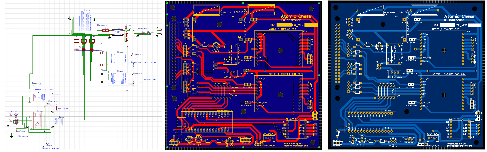
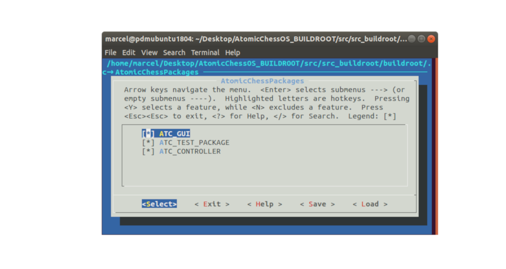
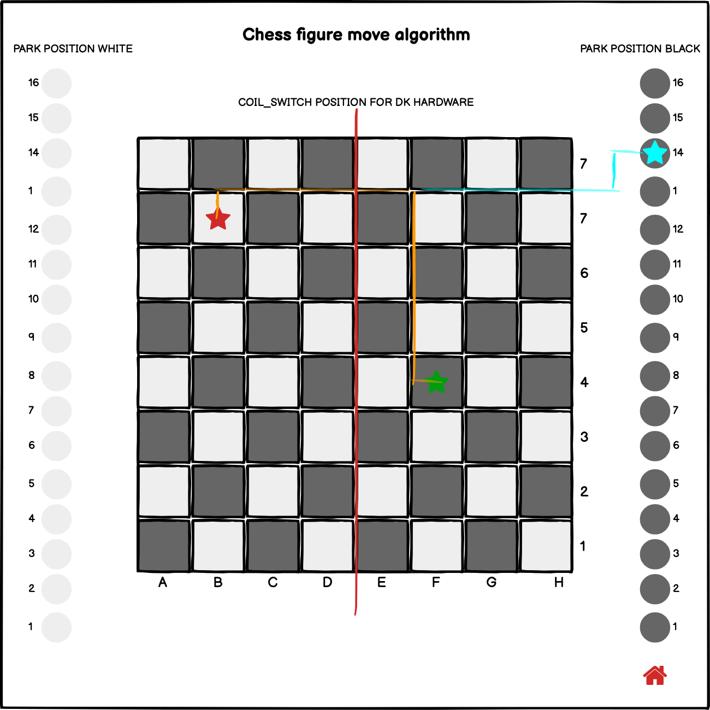
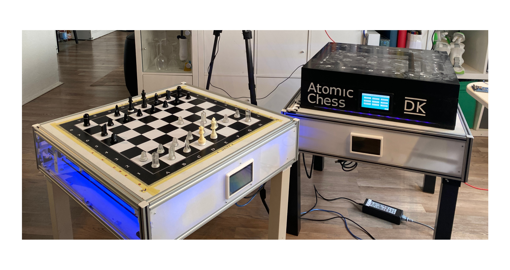

# Einleitung

## Motivation


Eingebettete Systeme (Englisch "embedded Systems") sind technische Zusammensetzungen, welche für eine spezifische Funktion entwickelt werden. Im Gegensatz zu Mehrzwecksystemen (Englisch "multi-purpose systems"), wie zum Beispiel einem Personal Computer, welcher in der Lage ist, diverse Funktionen auszuführen und nicht zwingend an eine Funktion gebunden ist, dienen eingebettete Systeme einer bestimmten Logik. Daraus resultieren einfachere und auch ressourcen-sparendere Systeme, die wesentlich näher an der Technik und der für den Zweck nötigen Komponenten und Software entwickelt werden. Systeme können günstiger zusammengesetzt und Fehlerquellen schneller entdeckt und behoben werden. Nicht für den Prozess notwendige Komponenten werden gar nicht erst verwendet. Bei einem Mehrzwecksystem wird akzeptiert, dass Komponenten und Schnittstellen existieren, die nicht benötigt werden. Diese verursachen Kosten und können mögliche Fehlerquellen sein.

<br>

Dennoch ist die Entwicklung eines solchen Systems nicht banal. Es ist abzuwägen, welche Komponenten derzeit auf dem freien Markt erhältlich sind, welche Eigenschaften diese mitbringen oder ermöglichen und wie diese optimal kombiniert werden können. Es bedarf im Vorhinein intensiverer Recherche und einer größeren Perspektive über mögliche Zusammenhänge. 
Im Falle eines Mehrzwecksystems ist die Auswahl simpler, da man den Prozess auch im Nachhinein noch anpassen kann, da zusätzliche Funktionen und Komponenten gegeben sind oder leichter ergänzt werden können. Das eingebettete System muss in der Regel aufgewertet oder sogar völlig ersetzt werden, wenn zu einem späteren Zeitpunkt festgestellt wird, dass Funktionen nicht gegeben oder umsetzbar sind. Fertige Systeme sind komplexer in der Aufwertung.

<br>

Die Fähigkeit zur Erstellung eines solchen Systems ist daher nicht als eine leichte Aufgabe anzunehmen und es ist mir wichtig, zum Abschluss meines Studiums mein gewonnenes Wissen über Systeme, Komponenten, Zusammenhänge und deren Verbindung bis hin zur Programmierung nachzuweisen. Die Auswahl eines fertigen Computers oder sogar das simple Nutzen existierender Betriebssysteme erweckt nicht den gleichen Reiz, wie es die eigene Erstellung dieser Komponenten auf mich hat. Ich halte es für essenziell, möglichst fachlich die Inhalte meines Studiums in Verbindung mit meinen Vorlieben zu bringen, um ein optimales Projekt zu erstellen.

<br>

Die Erstellung eines autonomen Schachtischs vereinbart in meinen Augen im großen Umfang die wesentlichen Komponenten des Informatikstudiums mit meiner Vorliebe zur mechanisch-elektrischen Gestaltung. Angefangen mit den Grundlagen der Informatik, insbesondere mit technischem Bezug, über die Berechnung und Auslegung von Systemkomponenten, zudem die objektorientierte Projektplanung und Architektur von Systemen bis hin zu Datenbanken und Webtechnologien und Softwareentwicklung. Zudem wird mein Studienschwerpunkt, die technische Informatik, mit einem einbetteten System manifestiert.

<br>

<!-- Classen ((erst ganz kurz im Überblick das Projekt beschreiben (Schachtisch). Erst danach kann der  Reiz davon erläutert werden. Sonst ist unklar, worum es überhaupt geht… Siehe unten: Die hier vorliegende Arbeit entwickelt einen autonomen Schachtisch, welcher in der Lage ist, Schachfiguren autonom zu bewegen und auf Benutzerinteraktionen zu reagieren.)) -->


Schach ist ein bewährtes, ausnahmslos bekanntes und immer logisches Spiel, welches jedoch im kommerziellen Rahmen nie an Bedeutung gewonnen hat. Die Auswahl der verfügbaren elektrifizierten und programmgesteuerten Schachtische ist auffallend gering; zudem sind existierende Lösungen oftmals nicht erschwinglich und bedürfen erheblicher Anpassungen des Spielers an das Spiel.
Innerhalb der vergangenen drei Jahrzehnte bewiesen immer mehr Konzerne ihre technische Kompetenz und Überlegenheit und die Fähigkeit ihrer Maschinen mittels der Optimierung von Schachalgorithmen und dem möglichst schnellen Besiegen derzeitiger Schach-Meister und -Meisterinnen. Die Algorithmen stehen heute in einer Vielzahl frei zugänglich zur Verfügung, jedoch ist das Interesse daran, für Spieler mögliche Anwendungen zu generieren, verschwindend gering und wird oftmals nur von Experten und Enthusiasten genutzt und auch hinterfragt. 

<br>

Mit dieser Arbeit möchte ich mich diesem Problem stellen und einen möglich günstigen Tisch entwickeln, welcher das Spielerlebnis ohne Einschränkungen dem Spieler transferiert. Zudem möchte ich gewonnene Erkenntnisse und aktuelle Ressourcen wie die Cloud-Infrastruktur einbinden, um das Schachspiel, welches zweier Spieler bedarf, für einen einzelnen Spieler zu ermöglichen. Das Ergebnis soll nicht nur aus vielen Zeilen Code bestehen, sondern auch ein handfestes Produkt sein, das meine Qualitäten und meinen Enthusiasmus widerspiegelt. 

<br>


## Zielsetzung

Das Ziel der hier vorliegenden Arbeit ist es, einen autonomen Schachtisch zu entwickeln, welcher in der Lage ist, Schachfiguren autonom zu bewegen und auf Benutzerinteraktionen zu reagieren.
Darüber hinaus sollte der autonome Schachtisch weitere folgende Funktionalitäten aufweisen:

- Erkennung Figur-Stellung
- Automatisches Bewegen der Figuren
- Spiel Livestream
- Parkposition für ausgeschiedene Figuren
- Stand-Alone Funktionalität 

<br>

Die Kernfrage der Arbeit bezieht sich somit auf die Überprüfung der Ausführbarkeit inklusive Erstellung und Umsetzung eines eingebetteten Systems und einer Cloud-Infrastruktur. 

<br>

Der Schwerpunkt liegt dabei insbesondere auf der Programmierung des eingebetteten Systems und dem Zusammenspiel von diesem mit einem aus dem Internet erreichbaren Server, welcher als Vermittlungsstelle zwischen verschiedenen Schachtischen und anderen Endgeräten dient.
Das Projekt umfasst zum einem die Positionserkennung und Steuerung der Hardwarekomponenten (Schachfiguren) und zum anderen die Kommunikation zwischen dem Tisch selbst und einem in einer Cloud befindlichem Server.
Mittels der Programmierung werden diverse Technologien von verschiedenen Einzelsystemen zu einem Gesamtprodukt zusammengesetzt.
Insgesamt gilt es, einen für Anwender ansprechenden Schachtisch zu entwickeln, der das Spielerlebnis nicht nur originalgetreu widerspiegelt, sondern das Einzelspieler-Modell zusätzlich noch verbessert.

<br>


Der Grundgedanke dabei ist, dem Spieler die Arbeit des Versetzens der Spielfiguren und das Erwägen von gegnerischen Zügen abzunehmen. Somit ist ein kompfortables Spiel auch gegen sich selber möglich, da das Überlegen und Ausführen von Spielzügen der Gegenseite entfällt.
Dem Spieler wird zudem die Möglichkeit geboten, gegen andere Spieler an diversen Orten oder gegen eine Schachlogik zu spielen und so Züge auszuführen, die jener im besten Fall nicht einmal vorhergesehen hat. Zudem wird die Korrektheit der getätigten Züge überprüft und sämtliche traditionellen Spielregeln in das Spiel mit einbezogen. Somit ist es nicht nur möglich, dass Anfänger das Spiel erlernen können, sondern auch bewährten Spielern mit unerwarteten Zügen des virtuellen oder realen Gegners neue Methodiken darzustellen.

<br>

Dies soll mittels eines kompakten und minimalistischen Designs realisiert werden. Darüber hinaus spielt nicht nur das Design eine Rolle, sondern auch die Handhabung. Dazu muss der Benutzer in der Lage sein, den Tisch in wenigen Handgriffen betriebsbereit machen zu können und über eine einfach Bedienoberfläche eine neue Partie gegen den Computer oder einen anderen Menschlichen spieler beginnen zu können. 

<br>

## Aufbau der Bachelorarbeit

Im zweiten Kapitel der hier vorliegenden Arbeit werden die zum Zeitpunkt des Projektstarts existierenden Produkte beziehungsweise öffentlich einsehbare Projekte und deren Umsetzung beleuchtet. Hier wird insbesondere darauf geachtet, die Grenzen bestehender Systeme darzulegen und nur für dieses Projekt zutreffende Funktionen zu vergleichen. 


<br>

Die Anforderungsanalyse im dritten Kapitel fasst alle zuvor recherchierten Funktionen bestehender Systeme zusammen und leitet daraus eine Auflistung der Anforderungen ab, welche in den nachfolgenden Prototypen realisiert werden sollen.
Hierbei wird darauf geachtet, dem Benutzer einen Mehrwert in Bezug auf die Benutzerfreundlichkeit und dem Umfang an Features zu bieten.

<br>

Nach der Festlegung der Anforderungen wird im vierten Kapitel eine Machbarkeitsanalyse durchgeführt.
In dieser wird untersucht, welche Technologien benötigt werden um, diese Anforderungen durch einen Prototyp erfüllen zu können.

<br>

Anschließend werden im fünften Kapitel die zuvor verwendeten Technologien betrachtet, welche bei den beiden darauffolgenden Prototypen verwendet wurden. Hierbei stehen insbesondere solche Technologien im Vordergrund der Untersuchung, welche möglichst einfach zu beschaffen sind und optimalerweise uneingeschränkt und lizenzunabhängig zur Verfügung stehen.

<br>

Das sechste Kapitel widmet sich der Realisierung eines ersten Prototyps des autonomen Schachtischs.
Hier werden die Erkenntnisse der zuvor evaluierten Technologien verwendet, um ein Modell zu entwickeln, welches den im ersten Abschnitt erarbeiteten Vorgaben entspricht. Der nach der Implementierung durchgeführte Dauertest soll zudem weitere Risiken, mögliche Probleme und Fehlerquellen aufdecken.

<br>

Im anschließenden siebten Kapitel wird auf der Basis des ersten Prototypens und dessen im Betrieb verzeichneten Probleme der finale Prototyp entwickelt.

Hier werden die Schwierigkeiten durch die Vereinfachung der Elektronik sowie der Mechanik gelöst.
Die Zuverlässigkeit wurde mittels stetiger Testläufe mit kontrollierten Schachzug-Szenarien überwacht und so ein produktreifer Prototyp entwickelt.

<br>

Im darauffolgenden achten Kapitel wird die Cloud-Infrastruktur thematisiert, welche für eine Kommunikation zwischen den autonomen Schachtischen entscheidend ist.
Auch wird dabei die Software, welche auf dem eingebetteten System ausgeführt wird, im Detail beschrieben und deren Kommunikation mit der Cloud-Infrastruktur, sowie mit den elektrischen Komponenten beleuchtet.
Zusätzlich zu dieser system-internen Software wurde ein Webclient entwickelt, mit dem es Benutzern möglich ist, über einen Webbrowser gegen den Tisch zu spielen.
Dieser Client bot außerdem die Möglichkeit, das System schon im Laufe des Entwicklungsprozesses testen zu können.

<br>


Das neunte Kapitel beschreibt die Software, welche auf dem eingebetteten System ausgeführt wird.
Dessen Hauptaufgabe ist die ansteuerung der Hardware-Komponenten, welche im autonomen Schachtisch verbaut sind.
Darunter zählt die Ansteuerung der Motoren um die Figuren autonom bewegen zu können und die erkennung der vom Benutzer getätigten Schachzüge.
Das System befindet sich unterhalb des Spielbretts und übersetzt die von der Cloud-Infrastruktur abgefragt über das Internet empfangenen Spieldaten in Spielzüge.
Dabei gilt ein besonderes Augenmerk der Berechnung der Figur-Bewegungen und dem Erkennen von durch den Benutzer getätigten Schachzügen.


<br>

Das zehnte und abschließende Kapitel umfasst das Fazit und gibt einen Ausblick auf mögliche Erweiterungen und Verbesserungen.


# Analyse bestehender Systeme

## Existierende Systeme im Vergleich

Im Folgenden werden vier kommerzielle und drei lizenzunabhängige (Open-Source) Schachtische miteinander verglichen.
Bei den ausgewählten Tischen handelt es sich um

- kommerziell
    - Square Off - Kingdom
    - Square Off - Grand Kingdom
    - DGT Smartboard
    - DGT Bluetooth Wenge
- open-source:
    - Automated Chessboard (Michael Guerero)
    - Automated Chessboard (Akash Ravichandran)
    - DIY Super Smart Chessboard

<br>

Für die kommerziell käuflichen Schachtische und (intelligenten) Schachbretter \ref{commchesstables} gibt es kein sehr großes Marktangebot, weswegen für den Vergleich nur zwei Hersteller mit jeweils zwei verschiedenen Modellen gewählt werden konnten. Derzeit integriert nur eines dieser Unternehmen, `Square Off`, eine Funktion, welche die Figuren auf dem Tisch mittels einer Mechanik unterhalb der Tischplatte bewegen kann.

Der zweite Hersteller `DGT` wurde dennoch zum Vergleich von zusätzlichen Funktionen herangezogen, da dessen Schachbretter die aktuelle Figur-Stellungen erkennen können.
Die Tische des Herstellers `DGT` unterscheiden sich kaum in ihren Basis-Funktionen; mit steigendem Preis werden zusätzliche Funktionen in Form von Sensoren oder Verbindungsoptionen implementiert.

<br>


Das Angebot von open-source Schachtisch-Projekten \ref{oschesstables} hingegen ist breiter, jedoch sind die einzelnen Modelle oftmals Kopien oder Revisionen voneinander. Die möglichen Funktionen unterscheiden sich daher kaum. Für die hier dargestellte Übersicht wurden drei Modelle gewählt, welche in ihren Funktionen signifikante Auffälligkeiten und einen hohen Stellenwert und Bekanntheitsgrad aufweisen.
Wie bereits aus den zum Teil identischen Namen ersichtlich, streben alle Tische das gleiche Ziel an und unterscheiden sich daher nur geringfügig in ihren Funktionen, was im Folgenden nun näher erläutert wird.


<br>

### Kommerzielle Produkte


\pagebreak

: Auflistung kommerzieller autonomer Schachtische \label{commchesstables}

|                                           | Square Off - Kingdom [@squareoffkingdom]  | Square Off - Grand Kingdom [@squareoffgrand] | DGT Smart Board [@dtgsmartboard]  | DGT Bluetooth Wenge [@dtgble] |
|:------------------------------------------|-------------------------------------------|:--------------------------------------------:|:---------------------------------:|------------------------------:|
| Erkennung Figur-Stellung                  | nein (Manuell per Ausgangsposition)       | nein (Manuell per Ausgangsposition)          | ja                                | ja                            |
| Abmessungen (LxBxH)                       | 486mm x 486mm x 75mm                      | 671mm x 486mm x 75mm                         | 540mm x 540mm x 20mm              | 540mm x 540mm x 20mm          |
| Konnektivität                             | Bluetooth                                 | Bluetooth                                    | Seriell                           | Bluetooth                     |
| Automatisches Bewegen der Figuren         | ja                                        | ja                                           | nein                              | nein                          |
| Spiel Livestream                          | ja                                        | ja                                           | ja                                | ja                            |
| Cloud-Anbindung (online Spiele)           | ja (Mobiltelefon + App)                   | ja (Mobiltelefon + App)                      | ja (PC + App)                     | ja (PC + App)                 |
| Parkposition für ausgeschiedene Figuren   | nein                                      | ja                                           | nein                              | nein                          |
| Stand-Alone Funktionalität                | nein (Mobiltelefon erforderlich)          | nein (Mobiltelefon erforderlich)             | nein (PC)                         | nein (PC)                     |          
| Besonderheiten                            | Akku für 30 Spiele                        | Akku für 15 Spiele                           | -                                 | -                             |


<!--- Dey: Anmerkung zum Layout der Tabelle: Das ist im pdf so etwas schwer zu lesen. Vielleicht kann man das Layout durch Spaltenbreiten, Leerzeilen, grauen Hintergrund für jede 2. Zeile oder ähnliches verbessern. Ist aber nur Kosmetik. --> 

<!--- Classen: Spendieren Sie der Tabelle ruhig eine ganze Seite. also die Zeilenhöhe erhöhen. Und Färbung jeder zweiten Zeile ist auch eine gute Idee --> 


\pagebreak


<br>

Die für den Vergleich gewählten Eigenschaften sind jene, welche die im Projekt angestrebten Funktionen möglichst äquivalent reflektieren. Dennoch schränkt das geringe Angebot an autonomen Tischen die Auswahl stark ein; daher wurde hierbei Wert gelegt auf Automation, Cloud-Anbindung und die Abmessungen, welche das Spielerlebnis am deutlichsten beeinflussen.

<br>

Die Bretter des Herstellers DGT erkennen die Position der verwendeten Figuren. Information über die dafür verwendete Technologie ist jedoch nicht verfügbar. Die Square-Off-Schachtische verfügen über keine solche Funktion.

<br>


Die Abmessungen (Außenmaße) der autonomen Schachtische unterscheiden sich nur beim Hersteller Square Off deutlich; 
der Grand Kingdom Schachtisch ist rechteckig konstruiert worden, was das Spielerlebnis deutlich verändert. Der simple Kingdom-Tisch ist dabei kleiner als das vorgegebene Turniermaß, was negativen Einfluss auf das Spielererlebnis hat. Mit den Standardmaßen der DGT-Spielbretter und zudem ihrer geringen Höhe gleichen diese deutlich einem Turniertisch. Die Kombination aus geringer Höhe und Erkennung der Figur-Stellung bei den DGT-Brettern ist positiv bemerkenswert. Die größe der einzelnen Schachfelder aller autonomen Schachtische befinden sich jedoch in den spezifikationen der (+uscf)[@officialuscfrules], welche sich von 5 bis 6.35cm belaufen.

<br>

Beide Hersteller bieten eine Bluetooth-Schnittstelle an. Einzig das Smart-Board des Herstellers DGT nutzt eine serielle, kabelgebundene Schnittstelle.

<br>

Bei den DGT-Schachbrettern ist zu beachten, dass diese die Schachfiguren nicht autonom bewegen können. Sie wurden jedoch in die Liste aufgenommen, da sie einen Teil der Funktionalitäten der Square Off Schachbrettern abdecken und lediglich die automatische Bewegung der Schachfiguren fehlt.
Die DGT-Bretter können die Position der Figuren erkennen und ermöglichen so auch Spiele über das Internet; diese können sie auch als Livestream anbieten.
Bei Schachturnieren werden diese für die Übertragung der Partien sowie die Aufzeichnung der Spielzüge verwendet und bieten Support für den Anschluss von weiterer Peripherie wie zum Beispiel Schachuhren.

Somit gibt es zum Zeitpunkt der Recherche nur einen Hersteller von autonomen Schachbrettern, welcher auch die Figuren bewegen kann: Grand Kingdom.

<br>

Ein Spiel-Livestream, d.h. eine Darstellung des aktuellen oder vergangener Spiele über eine Webanwendung, ist mit allen Tischen möglich. Da alle Tische eine Cloud-Anbindung besitzen, in der Regel mittels Applikation auf dem Smartphone oder Computer, wird lediglich des Versetzten von Figuren detektiert und in einer Oberfläche dargestellt.

<br>

Auffallend ist, dass nur einer der ausgewählten Tische über eine Parkposition für ausgeschiedene Figuren verfügt. Der Square-Off-Grand, welcher Figuren automatisch verschieben kann, besitzt dank der rechteckigen Tischform die Möglichkeit, Figuren selbständig aus dem Spiel zu entfernen und bei Bedarf wieder ins Spiel zurückzuführen.

<br>

Ebenfalls erwähnenswert ist, dass keiner der Tische eine Stand-Alone-Funktionalität besitzt. Jeder Tisch benötigt eine Verbindung zu einem externen Gerät, wie einem Smartphone oder Computer, welches dann die Berechnung der Gegnerzüge vornimmt. Keiner dieser Tische kann ein simples Spiel nach einem verbindungslosen Start ausführen.

Für die Schachtische der Firma `Square Off` ist eine Smartphone App `Square Off - Chess App`[@squareoffapp] für die Verwendung notwendig.
Die App wiederum fordert eine Registrierung inklusive Profilerstellung beim Hersteller. Erst danach ist ein Spiel gegen den Computer ohne Internet möglich. Alle weiteren Optionen (wie bspw. Spiel gegen andere Spieler, Live-Stream) sind nur über einen Online-Zugang möglich und erfordern je nach gewählten Optionen auch einen weiteren Account bei anderen Schach-Cloud-Anbietern wie `Chess.com` oder `Lichess`.

<br>

Beide Square-Off-Modelle ermöglichen durch eingebaute Akkus auch eine mobile Nutzung, was dem Nutzer mehr Flexibilität, zum Beispiel Spielen im Freien erlaubt.

<br>

Zusammenfassend ist festzustellen, dass alle vier Tische dank unterschiedlicher Ausführung von Spiel-Eigenschaften zu unterschiedlichen Spiel-Erlebnissen führen. Für Nutzer ist eine Entscheidung anhand von Funktionen kaum möglich; letztlich bedarf es vor einem Kauf der Auswertung von gewünschten und gegebenen Funktionen. Es ist erkennbar, dass nur die Firma `Square Off` einen absolut autonomen Schachtisch anbietet, auch wenn dieser nicht alle in diesem Projekt angestrebten Funktionalitäten bietet. So hat der Nutzer im Hinblick auf kommerzielle Angebote kaum Auswahlmöglichkeiten.

<br>

### Open-Source Projekte

Bei allen Open-Source Projekten wurden die Eigenschaften anhand der Beschreibung und der aktuellen Software extrahiert \ref{oschesstables}.

<br>

Besonders bei Projekten, welche sich noch in der Entwicklung befinden, können sich die Eigenschaften noch verändern und so weitere Funktionalitäten hinzukommen. Alle Eigenschaften der Projekte wurden zum Zeitpunkt der Recherche analysiert und dokumentiert und mit Beginn der Entwicklung als Struktur-Fixpunkt festgelegt. Nachfolgende Entwicklungen wurden nach diesem Zeitpunkt nicht mehr berücksichtigt.

<br>

Zusätzlich zu den genannten Projekten sind weitere derartige Projekte verfügbar; in der Tabelle wurde nur jene aufgelistet, welche sich von anderen Projekten in mindestens einem Feature unterschieden.

Auch existieren weitere Abwandlungen von autonomen Schachbrettern, bei welchen die Figuren von oberhalb des Spielbretts gegriffen bzw. bewegt werden. In einigen Projekten wird dies mittels eines Industrie-Roboters [@actprojectrobot] oder eines modifizierten 3D-Druckers[@atcproject3dprinter] realisiert. Diese wurden hier aufgrund der Mechanik, welche über dem Spielbrett montiert werden muss und damit das Spielerlebnis erheblich beinflusst, nicht berücksichtigt.


: Auflistung von Open-Source Schachtisch Projekten \label{oschesstables}

|                                         | Automated Chess Board (Michael Guerero) [@actproject1]| Automated Chess Board (Akash Ravichandran) [@actproject2]| DIY Super Smart Chessboard [@actproject3]|
|:----------------------------------------|:-----------------------------------------------------:|:--------------------------------------------------------:|-----------------------------------------:|
| Erkennung Figur-Stellung                | nein (Manuell per Ausgangsposition)                   | ja (Kamera / OpenCV)                                     | nein                                     |
| Abmessungen (LxBxH)                     | keine Angabe                                          | keine Angabe                                             | 450mm x 300mm x 50mm                     |
| Konnektivität                           | (+usb)                                                | (+wlan)                                                  | (+wlan)                                  |
| Automatisches Bewegen der Figuren       | ja                                                    | ja                                                       | nein                                     |
| Spiel Livestream                        | nein                                                  | nein                                                     | nein                                     |
| Cloud-Anbindung (online Spiele)         | nein                                                  | nein                                                     | ja                                       |
| Parkposition für ausgeschiedene Figuren | nein                                                  | nein                                                     | nein                                     |
| Stand-Alone Funktionalität              | nein (PC erforderlich)                                | ja                                                       | ja                                       |
| Besonderheiten                          | -                                                     | Sprachsteuerung (Amazon Alexa)                           | Zuganzeige über (+led) Matrix            |
| Lizenz                                  | (+gpl) 3+                                             | (+gpl)                                                   | -                                        |

<!--- Dey: Layout der Tabelle ist noch nicht optimal, wie bei anderer Tabelle auch -->


In den bestehenden Projekten ist zu erkennen, dass ein autonomer Schachtisch sehr einfach und mit simplen Mittel konstruiert werden kann. Hierbei fehlen in der Regel einige Features, wie das automatische Erkennen von Figuren oder das Spielen über das Internet.
Einige Projekte setzten dabei auf eingebettete Systeme, welche direkt im Schachtisch montiert sind. Andere hingegen nutzen einen externen PC, welcher die Steuerbefehle an die Elektronik sendet.

<br>

Bei der Konstruktion der Mechanik und der Methode, mit welcher die Figuren über das Feld bewegt werden, ähneln sich jedoch die meisten dieser Projekte. Hier wurden in der Regel einfache X- und Y-Achsen verwendet, welche von je einem Schrittmotoren bewegt werden.
Die Schachfiguren werden dabei mittels eines Elektromagneten über die Oberseite gezogen. Dabei ist ein Magnet oder eine kleine Metallplatte als Gegenpol in den Fuß der Figuren eingelassen.

<br>

Die Erkennung der Schachfiguren ist augenscheinlich die schwierigste Aufgabe. Hier wurde in der Mehrzahl der Projekte eine Kamera im Zusammenspiel mit einer auf OpenCV-basierten Figur-Erkennung verwendet.
Diese Variante ist je nach Implementierung des Vision-Algorithmus fehleranfällig bei sich ändernden Lichtverhältnissen. Auch muss die Kamera oberhalb der Schachfiguren platziert werden, wenn kein transparentes Schachfeld verwendet werden soll.

<br>

Eine weitere Alternative ist die Verwendung einer Matrix aus Reed-Schaltern oder Halleffekt-Sensoren. Diese werden in einer 8x8 Matrix Konfiguration unterhalb der Platte montiert und reagieren auf die Magnete in den Figuren. So ist es möglich zu erkennen, welches der Schachfelder belegt ist, jedoch nicht konkret von welchem Figurtyp.
Dieses Problem wird durch eine definierte Ausgangsstellung beim Spielstart gelöst. Nach jedem Zug durch den Spieler und der dadurch resultierenden Änderungen in den Figurpositionen in der Matrix können die neuen Figurstellungen berechnet werden.

<br>


Abschließend ist festzuhalten, dass es auch bei den Open-Source Projekten kein Projekt gibt, welches alle gewünschten Features abbildet.
Auch fehlen dort weitestgehend Features, welche die kommerziellen Projekte bieten. Ebenso gilt dies für die komerziellen Projekte, welche zwar viele Features bieten, jedoch dies zumeist in einem geschlossenen Ökosystem. Somit gibt es auch hier keinen klaren Testsieger, welche alle gewünschten Features abbildet.
Das Ziel der hier vorliegenden Arbeit soll nun sein, all die positiven Eigenschaften dieser Tische zu vereinigen und mittels noch zusätzlicher Verbesserungen ein eigenes Produkt zu entwickeln.

<br>

## User Experience

Ein wichtiger Aspekt bei diesem Projekt stellt die User-Experience dar. Diese beschreibt die Ergonomie der Mensch-Maschine-Interaktion und wird durch die DIN 9241[@din9241] beschrieben.
Darin geht es primär um das Erlebnis, welches der Benutzer beim Verwenden eines Produkts erlebt und welche Erwartungen der Benutzer an die Verwendung des Produkts hat.

<br>

Beim autonomen Schachtisch soll der Benutzer eine ähnlich authentische Erfahrung erleben wie bei einer Schachpartie mit einem menschlichen Gegenspieler.
Der Benutzer soll direkt nach dem Einschalten des Tisches und dem Aufstellen der Figuren in der Lage sein, mit dem Spiel beginnen zu können. Dies soll wie ein reguläres Schachspiel ablaufen; der Spieler vor dem Tisch soll die Figuren mit der Hand bewegen können und der Tisch soll den Gegenspieler darstellen.
Der Tisch soll somit die Figuren der Gegenseite bewegen.

<br>

Nach Beendigung einer Partie soll das Spielbrett wieder in die Ausgangssituation gebracht werden. Dies kann zum einem vom Tisch selbst oder vom Benutzer manuell geschehen.
Danach ist der Tisch für die nächste Partie bereit, welche der Benutzer einfach per Knopfdruck starten können sollte.

<br>

Dies soll auch für abgebrochene Spiele gelten, welche von Benutzer oder durch das System abgebrochen wurden. Auch in diesen Fällen soll das Schachbrett sich selbständig zurücksetzten können.

<br>

Ein weiterer Punkt, welcher bei der User-Experience beachtet werden soll, ist der zeitliche Aspekt. Ein Spiel auf einem normalen Schachspiel hat je nach Spielart kein Zeitlimit. Dies kann für das gesamte Spiel gelten oder auch für die Zeit zwischen einzelnen Zügen.
Der autonome Schachtisch soll es dem Spieler zum Beispiel ermöglichen, ein Spiel am Morgen zu beginnen und dieses erst am nächsten Tag fortzusetzen.

<br>

Auch muss die Frage beantwortet werden, was mit den ausgeschiedenen Figuren geschehen soll. Bei den autonomen Schachbrettern von Square Off[@squareoffgrand] werden die Figuren an die Seite auf vordefinierte Felder bewegt und können so bei der nächsten Partie vom System wieder aufgestellt werden. Viele andere Projekte schieben die Figuren aus dem Feld heraus, können diese aber im Anschluss nicht mehr gezielt in das Feld zurückholen. So muss diese Aufgabe vom Benutzer manuell durchgeführt werden. Von einigen Projekten wird die Behandlung ausgeschiedener Figuren gar nicht abgedeckt und der Benutzer muss die Figuren selbständig vom Feld entfernen.

<br>


# Anforderungsanalyse

Nach Abschluss der Recherche, kann somit eine Auflistung aller Features \ref{atcrequirements} angefertigt werden, welche ein autonomer Schachtisch aufweisen sollte.
In diesem Projekt werden vor allem Funktionalitäten berücksichtigt, welche bei Bedienung und Benutzung des autonomen Schachtisches dem Benutzer einen Mehrwert in Bezug auf die Benutzerfreundlichkeit bieten.

<br>

: Auflistung der Anforderungen an den autonomen Schachtisch \label{atcrequirements}

|                                                               | (+atc)                                  |
|:------------------------------------------   |----------------------------------------:|
| Erkennung Figur-Stellung                     | ja                                      |
| Konnektivität                                         | (+wlan), (+usb)                         |
| Automatisches Bewegen der Figuren   | ja                                      |
| Spiel Livestream                                   | ja                                      |
| Cloudanbindung (online Spiele)            | ja                                      |
| Parkposition für ausgeschiedene Figuren     | ja                                      |
| Stand-Alone Funktionalität                  | ja (Bedienung direkt am Tisch)          |


<br>

Die Abmessungen und das Gewicht des autonomen Schachtisches ergeben sich aus der mechanischen Umsetzung und werden hier aufgrund der zur Verfügung stehenden Materialen und Fertigungstechniken nicht festgelegt.
Dennoch wird Wert daraufgelegt, dass der Unterschied zwischen den Spielfeldabmessungen und den Abmessungen des Tisches so gering wie möglich ausfällt.


Auch müssen die Figuren für den Benutzer eine gut handhabbare Größe aufweisen, um ein angenehmes haptisches Spielerlebnis zu gewährleisten.
Diese richten sich hierbei an die Größse des Spielfeldes. Desweiteren gibt es auch hier von der (+uscf)[@officialuscfrules] spezifikationen über die Größse der Figuren, jedoch sollen diese hier nicht zwingend angewendet werden , da diese speziell für den autonomen Schachtisch angepasst werden müssen um eine automatische Erkennung dieser durch den Schachtisch gewährleisten zu können.

Ebenfalls wird kein besonderer Augenmerk auf die Geschwindigkeit der Figur-Bewegung gelegt, solange dies nicht das Spielerlebnis stört. Die Zuverlässigkeit und Wiederholgenauigkeit dieser Bewegungen sollen dabei im  Vordergrund  stehen um einen reibungslosen Spielablauf zu gewährleisten..


# Machbarkeitsanalyse und Verifikation ausgewählter Technologien

Da dieses Projekt aus vielen ineinandergreifenden Komponenten besteht wurden zuerst Technologien ausgewählt, welche sich augenscheinlich für die Umsetzung eignen.
Hier werden Technolgien für die folgenden Komponenten benötigt:

- Erstellung von Software-Paketen für das eingebettete System
- Identifizierung der Schachfiguren
- Mechaniksche Bewegung der Schachfiguren


## Erprobung Buildroot-Framework

Eine Hürde, welche bei diesem Projekt genommen werden musste, war die Erstellung der Software, welche auf dem autonomen Schachtisch ausgeführt wird.
Hierbei sollte diese nicht von Grund auf neu entwickelt werden, sondern auf einer soliden Basis aufbauen.
Allgemein soll hier auf ein minimales Linux-System gesetzt werden, in welches die Software des autonomen Schachtisch integriert wird. 
Auf dem Basis-System müssen die folgenden Software-Pakete installiert sein, bzw einfach integrierbar sein:

- (+ssh) für den Remote-Zugriff
- (+dhcp) Client zur automatischen IPv4-Adressvergabe
- (+udev) zur Ein-/Ausgabe Geräteverwaltung (Touchscreen)
- Qt[@qtframework] - (+gui) Framework
- SW-Update zur Durchführung von Remote-Software-Updates der Schachtisch-Software

Auf Seiten der Entwicklung war eine Toolchain notwendig, mit welcher es möglich sein sollte, in C++ geschriebene Programme auf dem System ausführen und mittels (+gdb) auf Fehler überprüfen zu können. Zusätzlich sollte der C++ Compiler mindestens den C++17 Standard unterstützen.

Zusätzlich zu diesen auf dem Linux-System benötigten Paketen sollte es möglich sein, ein durch das eingebettete System bootbares Dateisystemimage zu erzeugen.
Für diesen Zweck existieren einige Open-Source Projekte, welche solch ein Build-System bereitstellen. Hierbei existieren zwei weit verbreitete Systeme:
Das `Yocot`-Projekt[@yoctoproject] und das Buildroot[@buildrootproject]-Framework.
Diese unterscheiden sich im Aufbau und der Funktionsweise teils stark, vor allem während der ersten Verwendung.

: Vergleich Yocto - Buildroot \label{commchesstables}

|                                                         | YOCTO     | BUILDROOT     |
|------------------------------               |-------    |-----------                |
| Dependency-Management             | Nein     | Ja                           |
|  Partielle Updates                           | Ja         | Nein                       |
| Automatischer Paket-Download     | Nein     | Ja                           |
| Verwendung Build-Cache               | Ja        | Nein                        |
| Einfache Konfiguration                   | Nein     | Ja                            |
|                                                        |              |                                |


<!--- Classen:  Erläutern, was das bedeutet und warum das nachteilig ist --> 

Hierbei stellt das `Yocto`- Projekt eine größere Einsteigshürde dar, aufgrund seines komplexen Layer-Systems.  
Es bietet sich jedoch für komplexe Projekte an, welche einen hohen Grad an Individualisierung benötigen. Ein Nachteil dessen, ist da dadurch auch viel vom Nutzer selber konfiguriert werden muss, bevor ein minimales System in Betrieb genommen werden kann. Somit muss zuerst eine grundlegende Konfiguration für das eingebettete System angelegt werden und es kann nicht direkt mit einem fertigen minimalen System mit der eigentlichen Software-Entwicklung gestartet werden.  Allgemein sind die Anforderungen an die zu erstellende Software und deren benötigte requirements sehr gering, sodass hier eine detaillierte Einarbeitung zeitlich nicht möglich war.

Der Aufbau dieser Konfiguration des `Yocto`- Projekt besteht aus drei Schichten:

- Layer - Build-Metadaten
- Recipes - Pakete
- Bitbake - Tool zum erstellen

Eigene Pakete werden dabei in `Recipes` angelegt, welche in einer Makefile ähnlichen Syntax das Paket und die Schritte zum erstellen beschreiben. Diese einzelnen Pakete werden anschließend in `Layern` zu einem Gesamtsystem zusammengesetzt. Dies geschieht anschließend mittels des `Bitbake`-Tools, welches das System erstellt.


Das `Buildroot`-Framework hingegen bietet bereits eine große Anzahl an vorkonfigurierten Ziel-Systemen an, für welche es bereits alle nötigen Parameter enthält, um ein minimales solches System erstellen zu können. Auch ist bereits eine optimierte Konfiguration für das im Rahmen des hier vorliegenden Projekts gewählte eingebettete System vorhanden, welche direkt gestartet werden kann.


<! --- PRO CONS EMBEDDED SYSTEM -->

Hier wurde ein `Raspberry Pi 3b+` gewählt, da dieser kostengünstig und zugleich einfach beschaffbar ist. Zudem  sind alle wichtigen Schnittstellen zur späteren Verwendung herausgeführt, welches diesen zu einen idealen System zur Prototypen-Entwicklung macht.


Nach einem erfolgreichen Erstellen des Images kann dieses direkt über das eingebettete System gestartet werden.
Bei jedem Build-Vorgang müssen jedoch alle Pakete erneut gebaut werden, bevor diese zu einem finalen Image zusammengefügt werden.
Hierbei kann dieser Vorgang je nach Umfang der verwendeten Pakete mehrere Stunden dauern. Das `Yocot`-Projekt unterstützt hierbei das Erstellen einzelner Pakete, somit müssen nur Änderungen neu gebaut werden.
Da im Rahmen dieses Projekts nur eine minimale Anzahl von Paketen benötigt werden, hält sich dieser Buildvorgang zeitlich in Grenzen und ist allgemein für dieses Projekt nicht entscheidend.

Dann wurde prototypisch evaluiert, wie aufwändig es ist, zum `Buildroot` Framework eigene in C++ geschriebene Software hinzuzufügen.
Zu diesem Zweck wurde ein eigenes C++ Paket erstellt und in das `Buildroot`-Framework integriert. Hierzu wurden dem `Buildroot` Quellcode zwei weitere Dateien hinzugefügt.

Die `Config.in` beschreibt das Paket und legt Abhängigkeiten zu anderen Paketen fest.  

```yaml
#atctp - Config.in - Package Configuration
config BR2_PACKAGE_ATCTP
    bool "ATC_TEST_PACKAGE"
    help
        This package is a test package to verify the buildroot build process
```

Die zweite Datei ist die `PAKET_NAME.mk - Makefile`, welche die Schritte beschreibt, welche zum Erstellen und Installieren des Paketes durchgeführt werden müssen. 

```yaml
# atctp - atctp.mk - Makefile

ATCTP_VERSION = 1.0.0
ATCTP_SITE = ./package/atctp/src
ATCTP_SITE_METHOD = local
ATCTP_LICENSE = GPL-2.0+

define ATCTP_BUILD_CMDS
    @echo ATCTP_BUILD!
    @echo $(@D)
    @echo -----------------
    $(MAKE) $(TARGET_CONFIGURE_OPTS) -C $(@D)
endef

define ATCTP_INSTALL_TARGET_CMDS
    @echo ATCTP_INSTALL!
    $(INSTALL) -D -m 0755 $(@D)/hello $(TARGET_DIR)/usr/ATC/atc_testpackage
endef

$(eval $(generic-package))
```

Das somit erstellte Test-Paket `atctp` bildete eine funktionierende Grundlage für das System. Somit eignet sich das `Buildroot`-Framework optimal für dieses Projekt, da hier der Prozess zur Integration von eigener Software sehr einfach gestaltet ist.


## Verifikation NFC Technologie zur Identifizierung der Schachfiguren

Ein weiterer wichtiger Bestandteil sollte die Erkennung der sich auf dem Feld befindlichen Schachfiguren sein.
Hierbei muss zum einen der Figur-Typ (König, Dame, Türme, Läufer, Springer, Bauern) und zum anderen die Figur-Farbe (schwarz, weiss) vom System erkannt werden.

Da hier keine aufwendige Elektronik entwickelt werden,  sondern auf Standard-Komponenten zurückgegriffen werden sollte, schied ein komplexes (+hf) Antennen-Array unter dem Schachfeld aus, wie es bei einigen kommerziellen Produkten umgesetzt ist.
Eine einfache 8x8 Matrix aus Drucktastern oder Hall-Effekt-Sensore schied ebenfalls aus, da hier die Eingabe über den Benutzer erfolgt und nur Rückschlüsse auf die veränderte Figur anhand einer manuellen Bewegung der Figur nachvollzogen werden kann.

Stattdessen eignete sich hier die (+nfc) Technologie, welche auch bei modernen Smartphones eingesetzt wird.
Hierzu werden kleine (+nfc)-Tags bzw. Aufkleber, welche aus einem Chip und einer Antenne bestehen, so programmiert, dass diese eine definierte Aktion beim Lesegerät auslösen.
Dies kann zum Beispiel das Öffnen einer Internetseite auf dem mobilen-Endgerät nach dem Scan eines mit einem NFC Tag ausgestatteten Filmplakats sein.


Ein  Vorteil dieser Technologie ist, dass diese auch im Konsumerbereich bereits breit verfügbar ist. Durch das einfache Programmieren dieser (+nfc)-Tags über das Smartphone wird kein zusätzliches Lese-/Schreib-Gerät benötigt.
Hier musste jedoch zuvor getestet werden, welcher maximale Abstand erlaubt ist, um solch einen Tag noch scannen zu können.
Auch ist der Abstand zwischen den einzelnen Tags entscheidend, d.h. wie nah diese beieinander platziert werden können, um trotzdem noch einwandfrei individuell ausgelesen werden zu könnnen.

Hierzu wurde ein kleiner Testaufbau \ref{ATC_nfc_range_test} entwickelt, um verschiedene Abstände testen zu können.

Als Lesegerät wurde ein `PN532` Modul zum Auslesen der (+nfc) Tags eingesetzt, da dieses Modul einfach angesteuert werden kann und eine abnehmbare Antenne besitzt.
Dieses Modul wurde vom Autor der hier vorliegenden Arbeit bereits in anderen Projekten eingesetzt und erwies sich dort als zuverlässig.

Die im Test verwendeten (+nfc) Tags hatten einen Durchmesser von 22mm und waren somit ein Standard-Produkt.
Im Test stellte sich heraus, dass diese Tags im gewählten Setup einen Abstand von mindestens 5mm zueinander benötigten.
Der Abstand des Lesegeräts bzw. der Antenne zu einem Tag konnte dabei bis zu 14mm betragen.

Somit eignet sich die Kombination aus Tag und Lesegerät für eine Positionserkennung der Schachfiguren, wobei sich das Lesegerät unter der Schachtischplatte befindet.


## Verifikation der Mechanik zur Bewegung der Schachfiguren

Da die einzelnen Figuren über das Schachfeld bewegt werden sollen, ist hierfür eine akkurate Positionierung dieser notwendig.
Da die Figuren einen Durchmesser von 22mm haben und ein einzelnes Schachfeld ein Größe ca. 55mm besitzt, reicht eine Wiederholgenauigkeit von +-1mm.
Auch wird bei der Wahl der passenden Motoren angenommen, dass das Spiel, welches durch die Mechanik in das System eingebracht wird, vernachlässigbar klein ist.
Es ist auch davon auszugehen, dass die Kraft, welche von den Motoren benötigt wird, um eine Achse zu bewegen, nicht mehr als 45 Ncm betragen muss.

Dies entspricht den Werten einer X-Y-Achsenkonfiguration, wie sie in einem handelsüblichen 3D-Drucker zu finden ist, die mit `Nema 17`-Schrittmotoren ausgestattet sind.
Der geplante Aufbau des autonomen Schachtischs ähnelt einer solchen Konfiguration sehr, da auch hier die Figuren in X-Y Richtung verfahren werden.
Einzig die Z-Achse kommt hier nicht zum Einsatz. Somit wurden für erste Tests diese Motoren gewählt.


Deswegen bietet sich hier auch die Verwendung von Schrittmotoren an, da diese sehr kostengünstig in der geforderten Leistungsklasse zu erwerben sind und zudem die Ansteuerung einfach realisiert werden kann. Hierzu gibt es verschiedene Schrittmotor-Treiber, welche die Ansteuerung übernehmen. Diese bieten in der Regel ein `STEP`, `DIR` Interface an. Der Schrittmotor-Treiber besitzt diese beiden Eingänge und jeder elektrische Impuls sorgt dafür, dass der Motor einen Schritt ausführt. Je nach gewähltem Motor entspricht dies einer Rotation um 1.8 Grad und dies reicht somit für die Positioniergenauigkeit aus.

Da das eingebettete System auf einem nicht-echtzeitfähigen Linux-System aufsetzt, ist hier eine zeitkritische Ansteuerung der Motortreiber nicht gewährleistet.
Somit stellt sich das `STEP`,`DIR`-Interface für diesen Anwendungsfall als nicht ideal heraus. Um dieses Problem zu umgehen, kann hier ein zusätzlicher Mikrokontroller eingesetzt werden, welcher die benötigten Impulse generiert.

Diese Option wurde zuvor getestet und erwies sich als eine robuste Alternative. Jedoch existieren Schrittmotor-Treiber, welche über zusätzliche Bus Schnittstellen verfügen.
Hier wurde auf den `TMC5160-BOB` gesetzt, da dieser über ein (+spi) Interface verfügt, welches direkt an das eingebettete System angeschlossen werden kann.

Somit stellen die Schrittmotoren und die gewählte Ansteuerung ein vielversprechendes Antriebskonzept für den autonomen Schachtisch dar.


## 3D Druck für den mechanischen Aufbau


Da es sich hier nur um einen Prototyp handelt, wurde auf ein einfach zu verarbeitendes Filament vom Typ (+pla) zurückgegriffen.
Dieses ist besonders gut für die Prototypentwicklung geeignet und kann mit nahezu jeden handelsüblichen (+fdm) 3D-Drucker verarbeitet werden.

<br>

Es wurden einige Testdrucke durchgeführt, um die Qualität der gewählten Druckparameterwerte \ref{3dprintsettings} zu überprüfen und diese gegebenenfalls anzupassen.
Auch wurden verschiedene weitere Bauteile gedruckt, an welchen die Toleranzen für die späteren (+cad) Zeichnungen abgeschätzt werden konnten.
Dies betraf vor allem die Genauigkeit der Bohrungen in den gefertigten Objekten, da hier später Bolzen und Schrauben nahezu spielfrei eingeführt werden müssen.
Ein Test, welcher die Machbarkeit von Gewinden zeigen würde, wurde nicht durchgeführt, da alle Schrauben später mit der passenden Mutter gesichert werden sollten.
So sollte eine Abnutzung durch zu häufige Montage der gedruckten Bauteile verhindert werden.

<br>

Beim Design der zu druckenden Bauteile wurde darauf geachtet, dass diese den Bauraum von 200x200x200mm nicht überschreiten und somit auch von einfachen (+fdm) 3D-Druckern erstellt werden können.

<br>

Als Software wurde der Open-Source Slicer Ultimaker Cura [@ultimakercura] verwendet, da dieser zum einen bereits fertige Konfigurationen für den verwendeten 3D-Drucker enthält und zum anderen experimentelle Features bereitstellt.

<br>


Hier wurde für die Bauteile, welche eine Stützstruktur benötigen, die von Cura bereitgestellte experimentelle Tree Support Structure aktiviert. \ref{3d_print_tree_structure}
Diese bietet den Vorteil gegenüber anderen Stützstrukturen, dass sich diese leichter entfernen lässt und weniger Rückstände an den Bauteilen hinterlässt.
Diese Vorteile wurden mit verschiedenen Testdrucken verifiziert und kamen insbesondere bei komplexen Bauteilen mit innenliegenden Elementen zum Tragen, bei denen eine Stützstruktur erforderlich war.

<br>

: Verwendete 3D Druck Parameter. Temperatur nach Herstellerangaben des verwendeten PLA Filaments. \label{3dprintsettings}

| Ender 3 Pro 0.4mm Nozzle  | PLA Settings  |
|:--------------------------|--------------:|
| Layer Height              | 0.2mm         |
| Infill                    | 50.00%        |
| Wall Thickness            | 2.0mm         |
| Support Structure         | Tree          |
| Top Layers                | 4             |
| Bottom Layers             | 4             |

<br>


Zusätzliche Parameter wie die Druckgeschwindigkeit wurden hierbei individuell für den gewählten 3D Drucker ermittelt. Allgemein wurden hier die Standardeinstellungen verwendet, welche in diesem Falle einen guten Kompromiss zwischen Qualität und Druckzeit lieferten.

<br>


# Erstellung erster Prototyp


## Mechanik

Bei dem mechanischen Aufbau wurde auf ein einfaches Design geachtet. Die Konstruktion wurde im Vorfeld in einem (+cad) Programm durchgeführt und die Grundkonstruktion in mehreren Iterationsschritten verfeinert. Das verwendete (+cad) Programm `Autodesk Fusion 360` bietet eine einfache Umsetzung auch für Personen, welche keine Ausbildung im Bereich der Mechanik und Entwicklung vorweisen können.

<br>

Bei der initialen Planung wurde beachtet, einen möglichst kleinen Fußabdruck des Schachtischs zu realisieren. Darüber hinaus wurde beabsichtigt, eine fertige Schachtischplatte als Basis zu verwenden und die Mechanik unter diese zu konstruieren. Um dies zu ermöglichen, wurde ein IKEA Lack Tisch verwendet, welcher die idealen Abmessungen von 55x55cm hat und somit eine erforderliche Schachfeldgröße von 55mm ermöglicht.
Durch den bereits vorhandenen Rahmen ist es auf einfache Art möglich, weitere Komponenten an diesem zu befestigen. Somit stellt diese Tischplatte eine ideale Basis für den autonomen Schachtisch dar.

<br>

Für die Achsenführung der beiden X- und Y-Achsen wurden konventionelle 20x20mm V-Slot Aluminium-Profile verwendet, welche mit einfachen Mitteln und wenig Geschick passend zugeschnitten werden können. Allgemein wurde eine X-Y Riemenführung verwendet, wobei jede Achse einen separaten `Nema 17` Schrittmotor inklusive des passenden Endschalters montiert hat. Bei den Schlitten, welche auf den Aluminium-Profilen laufen, wurden fertige Standardkomponenten verwendet, um das Spiel in der Mechanik zu minimieren. Diese stellen jedoch einen großen Posten in der Preiskalkulation dar. Die Vorteile überwogen jedoch, da diese nicht manuell erstellt und getestet werden mussten.

<br>

Bereits während des Designprozesses konnte anhand einer statischen Simulation des Modells erkannt werden, dass trotz der Optimierung des Fahrweges beider Achsen durch die Verkleinerung der Halterungen der Aluminium-Profile die Gesamtausdehnung der Fahrwege nicht ausreichte. Mit dieser Konstellation konnten die Figuren nicht ausreichend weit aus dem Spielfeld platziert werden und verblieben in den äußeren Spielfeldern. Dieser Effekt war unerwünscht und schränkte das Spielerlebnis deutlich ein.

<br>


<br>

Um dies zu verhindern, wurde der zentrale Schlitten der Y-Achse, auf welchem der Elektromagnet für die Figur-Mitnahme platziert ist, um einen weiteren Elektromagneten erweitert. Dieser befindet sich nun nicht mehr mittig auf dem Schlitten, sondern wurde um 110mm in Richtung der X-Achse versetzt \ref{ATC_DK_HW_DUAL_COIL}. So war es möglich, Figuren bis ganz an den Rand verschieben zu können.


<br>

Diese Lösung erfordert jedoch einen komplexeren Bahnplanungs-Algorithmus, da die Elektromagneten zwischen einzelnen Zügen gewechselt werden müssen. Dies führt zu einem kurzzeitigen Stillstand der Figur auf dem Schachfeld im Rahmen des Verschiebens der Figur an den Spielfeldrand.

<br>

Alle selbst-konstruierten Teile wurden anschließend mittels 3D Druck erstellt und konnten in die Tischplattenbasis eingeschraubt werden. Die Verwendung der aus Holz bestehenden Grundplatte erschwerte jedoch eine akkurate Platzierung der Teile und die bereits existierenden Seitenwände schränkten diese noch zusätzlich ein.
Somit erforderte der komplette Zusammenbau mehrere Tage und zusätzliche Iterationen des 3D-Designs, um den Einbau spezifischer Teile zu ermöglichen.
Das Design stellte damit jedoch eine solide Grundlage dar, welche für die weitere Software- und Hardware-Entwicklung essentiell ist.

<br>

## Parametrisierung der Schachfiguren

Da das System die auf dem Feld befindlichen Schachfiguren anhand von (+nfc) Tags erkennt, müssen diese zuerst mit Daten beschrieben werden.
Die verwendeten NXP `NTAG 21`[@nxpntag21] (+ic) besitzen einen vom Benutzer verwendbaren Speicher von 180 Bytes. Dieser kann über ein (+nfc)-Lese/Schreibgerät mit Daten verschiedenster Art beschrieben und wieder ausgelesen werden.
Moderne Mobiltelefone besitzen in der Regel auch die Fähigkeit, mit passenden (+nfc) Tags kommunizieren zu können. Somit sind keine Stand-Alone Lesegeräte mehr notwendig.

<br>

Der Schachtisch verwendet dabei das (+ndef) Dateiformat, welches festlegt, wie die Daten auf dem (+nfc) Tag gespeichert werden. Da dieses ein standardisiertes Format ist, können alle gängigen Lesegeräte und Chipsätze diese Datensätze lesen. Der im autonomen Schachtisch verwendete Chipsatz `PN532` von NXP ist dazu ebenfalls in der Lage.

<br>

Um das (+ndef) Format verwenden zu können, müssen die (+nfc) Tags zuerst entsprechend formatiert werden. Die meisten käuflichen Tags sind bereits derart formatiert. Alternativ kann dies mittels Mobiltelefon und passender Applikation geschehen.
Da (+ndef) eigene Verwaltungsinformationen über die Art der Formatierung und über die gespeicherten Einträge speichert, stehen nach der Formatierung nur noch 137 Bytes des NXP NTAG 21 für die Speicherung von Nutzdaten zur Verfügung.

<br>

Per Lesegerät können anschließend mehrere (+ndef) Records auf den Tag geschrieben werden. Diese sind mit Dateien auf einer Festplatte vergleichbar und können verschiedene Dateiformate und Dateigrößen annehmen.
Ein typischer Anwendungsfall ist der (+ndefrtd) URL Datensatz. Dieser kann dazu genutzt werden, eine spezifizierte URL auf dem Endgerät aufzurufen, nachdem der (+nfc) Tag gescannt wurde. [@nordicnfclibndef]

<br>

Der autonome Schachtisch verwendet den einfachsten (+ndefrtd) Typ, den sogenannten Text-Record, welcher zum Speichern von Zeichenketten genutzt werden kann, ohne dass eine Aktion auf dem Endgerät ausgeführt wird.
Jeder Tag einer Schachfigur, welche für den autonomen Schachtisch verwendet werden kann, besitzt diesen (+ndef) Record \ref{ndef_record_rook} an der ersten Speicher-Position. Alle weiteren eventuell vorhandenen Records werden vom Tisch ignoriert. [@nordicnfclib]


Um die Payload für den (+nfc) Record zu erstellen, wurde ein kleine Web-Applikation \ref{ATC_ChessFigureIDGenerator} erstellt, welche den Inhalt der Text-Records erstellt.
Dieser ist für jede Figur individuell und enthält den Figur-Typ und die Figur-Farbe. Das Tool unterstützt auch das Speichern weiterer Attribute wie einem Figur-Index, welcher aber in der finalen Software-Version nicht genutzt wird.

<br>


<br>

Nach dem Beschreiben eines (+nfc) Tags ist es zusätzlich möglich, diesen gegen Auslesen mittels einer Read/Write-Protection zu schützen.
Diese Funktionalität wird jedoch nicht verwendet, um das Kopieren einzelner Figuren durch den Benutzer zu ermöglichen. Somit kann dieser leicht seine eigenen Figuren erschaffen, ohne auf das Tool angewiesen zu sein.
Auch ist es so möglich, verschiedene Figur-Sets zu mischen; somit kann ein Spieler verschiedene Sets an Figuren mit dem autonomen Schachtisch verwenden.


<br>


## Schaltungsentwurf


Durch die zuvor durchgeführte Validierung der verwendeten Technologien konnte ein Blockdiagramm \ref{ATC_Hardware_Architecture_DK} der verwendeten elektrischen Komponenten angefertigt werden.
Dieses enthält zum einen die zwei Schrittmotor-Treiber und zum anderen die Komponenten zur Ansteuerung der beiden Elektromagnete sowie das `PN532` Modul zum Auslesen der (+nfc) Tags.

<br>

Die wichtigsten Komponenten in der Schaltung sind das eingebettete System und die beiden Schrittmotortreiber `TMC5160-BOB`. Diese sind direkt über einen (+spi) Bus miteinander verbunden. Zusätzlich zu den Schrittmotoren selbst ist an jedem Treiber der Endschalter zur Durchführung der Referenzfahrt der Achse angeschlossen. Die Treiber bieten dabei Eingänge für zwei Endschalter, jeodch wird nur ein Endschalter für die minimale Position (Home Position) benötigt. Die Treiber sind direkt mit der Eingangsspannung verbunden, werden jedoch durch eine 5A Glassicherung geschützt. Da der (+spi) Bus und die Treiber mit dem 3.3V Logikpegel des eingebetteten Systems kompatibel sind, können diese direkt miteinander verbunden werden. Dieser Bus ist in einer Stern-Konfiguration aufgebaut, was zur Folge hat, dass jeder Treiber ein zusätzliches Chip-Select Signal benötigt. Diese wurden ebenfalls mit dem eingebetteten System verbunden.

<br>

Zusätzlich sind Spannungswandler nötig, um die erforderlichen Spannungen von 12V für die Elektromagnete und 5V für das eingebettete System zu erzeugen. Die Schrittmotoren werden direkt mit der Versorgungsspannung von 14-24V betrieben. Alle weiteren verwendeten Komponenten, zu denen unter anderem auch das `PN532` (+nfc) Modul und die `WS2811` (+led) Module gehören, werden ebenfalls über die 5V Schiene versorgt.

<br>

Für den Betrieb der beiden Elektromagnete wurde kein N-Channel Mosfet o.ä. verwendet, da hier maximale Flexibilität bei der Ansteuerung ausschlaggebend ist und bisher nicht ausreichend Erfahrung mit dem Verhalten dieser im Zusammenspiel mit den magnetischen Schachfiguren gesammelt werden konnte. Deshalb wurde hier eine H-Brücke `DRV8871H` verwendet. Somit kann auch die Polarität im Nachhinein per Software geändert werden und nicht nur die Spannung über ein (+pwm) Signal. Der verwendete Treiber besitzt darüber hinaus zwei Ausgänge, was den Nutzen dieser Module besonders ausweitet.

<br>

Für die Erzeugung der (+pwm) Signale für die H-Brücke wurde ein zusätzlicher Mikrokontroller `Atmega328p` benötigt, da hier die Steuersignale nicht direkt vom eingebetteten System erzeugt werden sollen, sondern nur die Zustandsinformationen über den (+spi) Bus übertragen werden sollen. Dies spart zusätzliche (+gpio) Anschlüsse und somit sind alle Kompomenten über einen einzigen zentralen Bus kontrollierbar, welches einen möglichen Tausch des eingebetteten Systems in späteren Revisionen vereinfacht.

<br>

Der zusätzliche Mikrokontroller übernimmt auch die Kommunikation mit dem `PN532` Modul, da dieses sonst über seine (+i2c) Schnittstelle mit einem entsprechenden Host-System kommunizieren müsste. Der Mikrokontroller übernimmt somit ebenfalls die Konversion des (+i2c) Bus hin zum zentralen (+spi) Bus. Zu beachten ist, dass nun ein zusätzlicher Chip-Select (+gpio) zum Ansteuern der Elektromagnete und des `PN532` Moduls benötigt wird. Dies wird durch die Firmware, welche auf dem Mikrokontroller ausgeführt wird, realisiert, die je nach empfangenem Kommando die entsprechende Komponente ausgewählt.

<br>



<br>

Nach der Festlegung der zu verwendenden Komponenten wurde ein entsprechender Schaltplan \ref{ATC_Schematic_DK} nach den zuvor erörterten Vorgaben entworfen. Hierbei wurden die Vorgaben der Datenblätter[@tmc5160db][@atmega328pdb] und der Application Notes [@pn532apn][@drv8833apn] in diesen integriert. Da es sich hier um einen ersten Funktionsentwurf handelte, wurde zusätzliche Testpunkte in das Design eingefügt.

Somit war es während der weiteren Entwicklung möglich, zusätzliches Testequipment wie einen Logic-Analyser direkt an den (+spi) Bus oder ein Oszilloskop an die Ausgänge der H-Brücke dauerhaft anzuschliessen. Desweiteren war es möglich, die Bus- und Spannungsversorgung über Jumper zu trennen, um einen Funktionstest einzelner Komponenten durchführen zu können.

<br>

Allgemein verwenden alle Komponenten 3.3V als Logik-Pegel. Trotzdem wurde ein Level-Shifter eingesetzt, welcher den (+spi) Bus des eingebetteten Systems von dem der Mikrokontroller trennt.

<br>

Durchgeführte Tests mit dem verwendeten `Atmega328p` ergaben, dass dieser nicht direkt mit 3.3V und einer Taktfrequenz von 16MHz betrieben werden kann und es somit zu einem nicht kontrollierbaren Verhalten dieses kommt.
Dieses Verhalten machte sich durch eine gestörte Kommunikation mit dem `PN532` Modul bemerkbar und ein Auslesen von (+nfc) Tags war nur in 60% der Fälle fehlerfrei möglich.

Im Anschluss wurde die Versorgungsspannung auf 5V erhöht, was zur Folge hatte, dass die Ein- und Ausgänge ebenfalls mit diesem Pegel arbeiteten; der einsatz des zusätzlichen Level-Shiter wurde zum Schutz des eingebetteten Systems und dessen (+gpio) Schnittstelle notwendig.


<br>

Der Schalplan und dessen Funktionalität wurden anschließend durch den Aufbau der vollständigen Schaltung auf einer Lochrasterplatine \ref{ATC_DK_HW_LOCHRASTER} im Eurokartenformat manuell aufgebaut und getestet.

<br>

Aus diesem Design wurde ein (+pcb) Layout für eine einfache 2-lagige Platine erstellt. Dieses orientierte sich an der zuvor umgesetzten Lochrasterplatine und spiegelte deren Layout wider.
Auch hier wurde nicht auf den Platzverbrauch geachtet. Es wurden zusätzliche Steckverbindungen für die externen Komponenten eingefügt und passende Bohrungen an den Ecken sowie in der Mitte zur Montage vorgesehen. Auf dem obersten Layer wurde der Bestückungsdruck erhöht und mit zusätzlicher Information über die Pin-Belegungen der einzelnen Stecker erweitert.


<br>


## Implementierung (+hal) 

Der (+hal) stellt das Verbindungsglied zwischen der Hardware und der Benutzer-Software dar.
In diesem Fall übernimmt er die Übersetzung der Befehle der Controller-Software in für die Hardware verständliche Befehle. Dabei geschieht dies über den zentralen (+spi) Bus, welcher im Linux-System als Datei unter dem Pfad `/dev/spidev0.0` eingebunden wird und über Dateioperation (lesen, schreiben) mittels `ioctl` konfiguriert werden kann.
Weiterhin können Daten über das File-Handle gelesen und geschrieben werden.
Somit ist eine Kommunikation mit der Hardware-Ebene möglich.

<br>

Diese Funktionalität wird von dem für dieses Projekt implementierten (+hal) in Form einer C++ Klasse abgebildet und ermöglicht einen einfachen Zugriff auf die elektrisch verbundenen Komponenten. Zusätzlich wird in dieser Klasse auch das Hardware-Versions-Management abgebildet.

Da im Verlauf der Entwicklung mehrere Hardware-Revisionen gebaut wurden und die Controller-Software weiterhin mit allen Revisionen kompatibel sein soll, ermittelt der (+hal) vor dem Start die entsprechende Revision. Dazu wird die Prozessor-(+id) (welche mittels des `cat /proc/cpuinfo | grep Serial | cut -d ' ' -f 2` Kommandos abgefragt werden kann) des Systems abgefragt und mittels einer statischen Liste die entsprechende Revision ermittelt.
Hierbei enthält die Tabelle nur Revisionsinformationen über die während der Entwicklung entstandenen Revisionen.
Sollte die Prozessor-(+id) nicht hinterlegt sein, geht das System von der aktuellsten Revision aus. So ist keine manuelle Pflege der Tabelle während einer möglichen Produktion notwendig.

<br>

```c++
//HardwareInterface.h
//...
class HardwareInterface
{
  enum HI_HARDWARE_REVISION {
        HI_HWREV_UNKNOWN = 0,
        HI_HWREV_DK   = 1, //FIRST 55x55cm ATC TABLE WITH TWO COILS
        HI_HWREV_PROD = 2, //SECONDS GENERATION BASED ON SKR1.3 3D PRINT CONTROLLER
        HI_HWREV_PROD_V2 =3,  //THIRD GENERATION WITH SKR 1.4 WITH CORE XY MECHANIC
        HI_HWREV_VIRT=4, //SIMULATED HW FOR TESTING USING THE DOCKERFILE
    };

  enum HI_COIL
    {
        HI_COIL_A   = 0,
        HI_COIL_B   = 1,
        HI_COIL_NFC = 2
    };
  //....
  //MOTOR CONTROL FUNCTIONS
  void enable_motors();
  void disable_motors();
  bool is_target_position_reached();
  void move_to_postion_mm_absolute(const int _x, const int _y, const bool _blocking);
  void home_sync();
  //...
  //LED CONTROL FUNCTIONS
  bool setTurnStateLight(const HI_TURN_STATE_LIGHT _state);
  //NFC CONTROL FUNCTIONS
  ChessPiece::FIGURE ScanNFC();
  //MAGNET CONTROL FUNCTIONS
  bool setCoilState(const HI_COIL _coil, const bool _state);
  //...
```

<br>

Je nach ermittelter Revision werden die erforderlichen Hardwarekomponenten initialisiert. Bei allen über den (+spi) Bus angeschlossenen Komponenten werden nach der Initialisierung des (+spi) Bus auf der Betriebssystem-Ebene zusätzliche Versionsregister der einzelnen Komponenten abgefragt. Dies stellt sicher, dass alle Komponenten mit dem System verbunden sind. 

Allgemein kann eine Datentransfer über den (+spi) drei Mal fehlschlagen, bevor die Software mittels eines Fehlers abbricht. Gerade bei der Kommunikation mit dem Mikrokontroller kam es bei Testläufen zu Fehlern bezüglich der (+spi) Kommunikation, sofern das (+nfc)-Modul aktiv war. Um ein direktes Beenden der Software zu verhindern, wurde diese Art der Fehlerbehandlung eingeführt.

```c++
//SPICommunications.cpp
//...
int SPICommunication::spi_write_ack(SPICommunication::SPI_DEVICE _device, uint8_t* _data, int _len)
{
	uint8_t* buffer_r{ new uint8_t[_len] { 0 }};
	uint8_t* buffer_w{ new uint8_t[_len] { 0 }};

	volatile int res = -1;
	volatile int c = 0; //RETRY COUNTER
	while (true)
	{
		//RECREATE COMMAND BUFFER
        //WILL BE OVERWRITTEN AFTER spi_write / spi_read
		for (size_t i = 0; i < _len; i++)
		{
			buffer_w[i] = _data[i];
            buffer_r[i] = 0;
		}
		
		//WRITE COMMAND
		res = SPICommunication::getInstance()->spi_write(_device, buffer_w, _len);
        //WAIT
        std::this_thread::sleep_for(std::chrono::milliseconds(SPI_RW_DELAY));
        //READ RESULT BACK
		res = SPICommunication::getInstance()->spi_write(_device, buffer_r, _len);
		//PARSE RESULT; CHECK FOR READ SUCCESS
		if(buffer_r[0] == MAGIC_ACK_BYTE)
		{
			break;
		}
        //INCREASE ERROR COUNTER
		c++;
		if (c > SPI_RW_ACK_RETRY)
		{
			break;
		}
	}
	return res;
}
//...
```

Der (+hal) und dessen benötigte Softwarekomponenten zur Buskommunikation und Hardware-Revisionsbestimmung wurden für die Verwendung innerhalb von mehreren Threads angepasst und somit ist deren Verwendung threadsafe. Diese Optimierung wurde jedoch nicht verwendet, da jegliche Funktionsaufrufe, welche die Hardware betreffen, aus dem Main Thread der Controller-Software getätigt werden.


### TMC5160 SPI Treiber

Der Treiber für die verwendeten `TMC5160` Schrittmotor-Treiber ist ebenfalls ein Bestandteil des (+hal). Die verwendeten Bausteine bieten mitunter sehr komplexe Konfigurationsmöglichkeiten und je nach Betriebsart sind mehrere Lese- und Schreiboperationen über den (+spi) Bus notwendig. Diesbezüglich wurde die komplette Ansteuerung auf der Softwareseite in ein eigenes Modul geschachtelt.
Dieses stellt verschiedene Funktionen zum Verfahren eines Motors bereit. Hierzu benötigt jeder verwendete Hardware-Treiber eine Instanz des Moduls zur Ansteuerung; so ist es zusätzlich möglich, für jede Achse verschiedene Parameter \ref{tmcrampparams} setzen zu können in Bezug auf Beschleunigung und Positioniergeschwindigkeit des Motors.

: TMC5160 Beschleunigungskurve / RAMP Parameter \label{tmcrampparams}

| Parameter 	| Value   	|
|:--------------|----------:|
| V_START   	| 1       	|
| A1        	| 25000   	|
| V1        	| 250000  	|
| A_MAX     	| 5000    	|
| V_MAX     	| 1000000 	|
| D_MAX     	| 5000    	|
| D1        	| 50000   	|
| V_STOP    	| 10      	|

Der Treiber untersützt dabei zwei verschiedene Funktionsmodi:

- Position-Mode
- Velocity-Mode

Der Treiber wird hierbei nur im `Position-Mode` betrieben, da hier eine Ziel-Position für den Motor vorgegeben werden kann.
Hierbei kann über ein Register eine Zielposition in Schritten vorgegeben werden. Der Treiber ermittelt daraufhin die passende Beschleunigungskurve und verfährt den Motor an diese Position.
Über ein entsprechendes Register kann der Status der Operation abgefragt werden und ob der Motor seine Position erreicht hat bzw. ob Fehler auftraten. Somit muss nicht auf das Erreichen der Zielposition gewartet werden und andere Aufgaben können währenddessen ausgeführt werden. Die Beschleunigungskurve kann zusätzlich manuell angepasst werden.
Hier wurden jedoch die Standardwerte aus dem Datenblatt verwendet, welche sich bei mehreren Tests als optimal im Bezug auf Geräuschemission des Motors herausstellten.

Beim dem `Velocity-Mode` hingegen, kann der Motor in einer definierten Geschwindigkeit in eine Richtung verfahren werden. Dabei kann diese Bewegung in einem Dauerlauf durchgeführt werden, welches im `Position-Mode` nicht geht. Hierbei wird dies durch den maximalen möglichen Wert des Ziel-Positions-Register bestimmt.

```c++
///TMC5160.cpp
TMC5160::TMC5160(MOTOR_ID _id) {
  //...
  //CHECK SPI INIT
  if(!SPICommunication::getInstance()->isInitialised()){/*...*/}
    //REGISTER SPI CS PIN FOR SELECTED MOTOR  ID
    if (_id == MOTOR_ID::MOTOR_0) {
        const SPI_CS_DEVICE = SPICommunication::SPI_DEVICE::MOTOR_0; //TODO CAST
        SPICommunication::getInstance()->register_cs_gpio(SPI_CS_DEVICE, CS_GPIO_NUMBER_MOTOR_0);
    }
    //LOAD DEFAULT MOTOR RAMP / CONFIG PARAMETER
    default_settings();
    //..
}
//...
void TMC5160::default_settings()
{
    // ENABLE STEALTH-CHOP
    write(REGDEF_GCONF, 0x0000000C);
    // SET SPREAD CYCLE PWM
    write(REGDEF_CHOPCONF, 0x000100C3);
    // SET MAX MOTOR CURRENT
    write(REGDEF_IHOLD_IRUN, 0x00080F02);
    // SET MOTOR AUTO POWER OF TO 10 SEC
    write(REGDEF_TPOWERDOWN, 0x0000000A);
    // SET MAX VELOCITY IN STEALTH-CHOP MODE
    write(REGDEF_A1, 0x000001F4);
    // SET RAMP PARAMETERS
    reset_ramp_defaults();
    // SET DRIVER STATE TO POSITION MODE
    write(REGDEF_RAMPMODE, 0);
    // SET CURRENT POSITION TO 0
    write(REGDEF_XACTUAL, 0);
    // SET TARGET POSITION TO 0
    write(REGDEF_XTARGET, 0);
}

int TMC5160::write(const int _address, const int _data)
{
    const size_t DATA_LEN = 5;
    //POPULATE WRITE DATA BUFFER
    uint8_t write_buffer[] = { _address | 0x80, 0, 0, 0, 0 };
    write_buffer[1] = 0xFF & (_data >> 24);
    write_buffer[2] = 0xFF & (_data >> 16);
    write_buffer[3] = 0xFF & (_data >> 8);
    write_buffer[4] = 0xFF & _data;
    //WRITE DATA OVER SPI
    return  SPICommunication::getInstance()->spi_write(SPI_CS_DEVICE ,write_buffer, DATA_LEN);
}

int TMC5160::read(const int _address)
{
  //POPULATE WRITEBUFFER = READ REGISTER ADDRESS
    const size_t DATA_LEN = 5;
    uint8_t write_buffer[] = {  _address & 0x7F, 0, 0, 0, 0 };
    uint8_t read_buffer[] = {  _address & 0x7F, 0, 0, 0, 0 };
    //FIRST WRITE REGISTER ADRESS TO READ
    int res = SPICommunication::getInstance()->spi_write(SPI_CS_DEVICE ,write_buffer, DATA_LEN);
    //READ RESULT
    res = SPICommunication::getInstance()->spi_write(SPI_CS_DEVICE, read_buffer, DATA_LEN);
    //PARSE RESULT INTO INT
    int value = read_buffer[1];
    value = value << 8;
    value |= read_buffer[2];
    value = value << 8;
    value |= read_buffer[3];
    value = value << 8;
    value |= read_buffer[4];
    return value;
}

//EXAMPLE USAGE, GOTO POSITION
void TMC5160::go_to(const int _position) {
    write(REGDEF_RAMPMODE, 0);
    //SET XTARGET REGISTER = TARGET POSITION
    //NON BLOCKING
    write(REGDEF_XTARGET, _position);
    //USE move_to_postion_mm_relative FOR A BLOCKING VARIANT
}

void TMC5160::atc_home_sync()
{	
	enable_motor(); //ENABLE MOTOR
	enable_switch(TMC5160::REF_SWITCH::REF_L, true, true, true); //ENABLE LIMIT SWICHT => ENABLE HARD ENDSTOP
	move_velocity(TMC5160::VELOCITY_DIRECTION::NEGATIVE, HOME_SPEED_VELOCITY, 1000);  //MOVE NEGATIVE TO LIMIT SWITCH
	//WAIT TO REACH THE ENDSTOP
	while(!get_ramp_stauts().status_stop_l) {
		std::this_thread::sleep_for(std::chrono::microseconds(1));		
	}
	//STOP MOTOR
	hold_mode();
	//SAVE LATCHED POSTION
	int offset = get_position() - get_latched_position();
	write(REGDEF_XACTUAL, offset);
	//SAVE OFFSET
	int currpos = get_position();
	set_postion_offset(currpos);
	//RESET RAMP
	write(REGDEF_RAMPSTAT, 4);
	//GOTO THE NEW ZERO POSTION
	set_AMAX(RAMP_AMAX);
	set_VMAX(RAMP_VMAX);
	go_to(0);
	//DISABLE HARD ENDSTOP 
	enable_switch(TMC5160::REF_SWITCH::REF_L, true, false, true);
	disable_motor(); //DISBLE MOTOR
}
//...
```

Eine zusätzliche Besonderheit stellt der Referenzfahrt dar. Nach dem Start des Systems ist es möglich, dass sich der Schlitten einer Achse nicht an der Null-Position befindet, sondern an einer unbekannten Position auf der Achse.
Deswegen muss diese Achse zuerst an die Home-Position gefahren werden. Dazu besitzt das System zwei Endschalter, welche jeweils mit einem Schrittmotor-Treiber verbunden sind. Diese besitzen zwei solche Taster-Eingänge `REF_L`/`REF_R`.

Bei einer wechselnden Flanke an diesem Eingang kann der Motor-Treiber verschiedene Funktionen ausführen. In diesem Fall wurde die Motor-Stopp Funktion mittels Registereintrag gewählt, welche den Motor stoppt, sobald der Schalter betätigt wird. Dies stellt schlussendlich die Home-Position dar.
Dies kann jedoch nicht im `Position-Mode` des Treibers umgesetzt werden, da das Ziel-Positionsregister auf Null gesetzt wird. Hierzu muss der Treiber in den `Velocity-Modus` geschaltet werden, welches ein Verfahren des Motors in eine Richtung ohne Zeitbegrenzung erlaubt.
Dies wird so lange in negativer Bewegungsrichtung ausgeführt, bis der Endschalter erreicht wurde. Somit ist die Achse an ihrer Home-Position angekommen und kann anschließend im Positions-Modus normal verfahren werden.


## Fazit bezüglich des ersten Prototyps


Im Hinblick auf den Umsetzungsprozess des autonomen Schachtischs stellt die Fertigstellung des ersten Prototyps einen ersten großen Erfolg dar.
Dennoch konnten nicht alle zuvor gestellten Requirements mit diesem Design umgesetzt werden.

Zu den Defiziten zählte zum einen der Bewegungsspielraum der einzelnen Achsen. Dieser wurde bereits während der Entwicklung durch die Verwendung von zwei Elektromagneten künstlich verlängert. Nach einem Langzeittest stellte sich jedoch diese Methode als zu fehleranfällig heraus. Die Parkpositionen, welche sich an den zwei Seiten des Spielbrettes befinden, konnten nicht durchgängig zuverlässig angefahren werden und boten nur Platz für 14 ausgeschiedene Figuren pro Spielerfarbe. Somit war ein komplettes Abräumen des Spielfeldes nicht möglich, auch wenn dieses in der Praxis eher selten vorkommt.

<br>

Zum anderen war der Aufbau und die anschließende Kalibrierung der Mechanik und der entsprechenden Offset-Werte in der Software nicht trivial und benötigte einiges an Zeit. Durch die Verwendung der Tischplatte und des hölzernen Grundrahmens konnte jedoch ein robustes Design in einem kleinen Formfaktor umgesetzt werden, welches zusätzlichen Platz für Erweiterungen bietet.  

Gerade die Verwendung von verschraubten Holzplatten machte jedoch eine Vervielfältigung mit gleicher Qualität schwierig. Ein Re-Design der inneren Komponenten gestaltete sich schwierig, da hier bereits mehrere Iterationen durchgeführt wurden, um eine maximalen möglichen Verfahrweg zu ermöglichen.


<br>

Auf Seiten der Elektronik arbeitete diese eher zuverlässig und bereitete keinerlei Probleme. Jedoch stellten die verwendeten Motortreiber einen größeren Kostenfaktor dar und der Zeitaufwand für den Zusammenbau und Überprüfung dieser war substantiell. Die verwendeten Elektromagnete sind für 9V Betriebsspannung ausgelegt, mussten jedoch über ihren Spezifikationen mit 12V betrieben werden, was bei einem Dauerbetrieb zu stark erhöhten Temperaturen führte.

<br>

Allgemein war hier die Entscheidung, die Außenmaße des Tisches zu optimieren, nicht ideal und führte zu diversen Problemen. Diese konnten jedoch mit verschiedenen Workarounds behoben werden konnten. Ein Schachspiel ist mit diesem Prototypen mit Einschränkungen möglich und bildet bis auf das Fehlen der nicht funktionstüchtigen Parkpositionen die zuvor festgelegten Requirements ab.

Im weiteren Verlauf der Entwicklung stand jedoch die Verbesserung der Zuverlässigkeit und die fehlerfreie Umsetzung der Parkposition für ausgeschiedene Figuren an. Ein einfacherer Zusammenbau auch für Dritte sollte ebenfalls ins Auge gefasst werden.

Hierzu würde ein komplettes Re-Design der Mechanik sowie der Elektronik nötig sein. Anpassungen der Software würden dadurch ebenfalls nötig, stellten jedoch durch den modularen Aufbau dieser kein Hindernis dar. Die durch den ersten Prototypen gewonnenen Erkenntnisse konnten somit direkt in das neue Design einfließen.

<br>


# Aufbau des zweiten Prototypen


## Modifikation der Mechanik

### Gehäuse und Design

Mit der Entscheidung, auf die hölzerne Struktur des Systems gänzlich zu verzichten, wurden massive Veränderungen des Designs des Schachtischs bestehend aus Gehäuse, Dimensionen und allen Außenelementen nötig.

<br>

Zuvor bestand der Quader-förmige Schachtisch aus einem Lack-Tisch als Deckel, welcher mit einem selbsterstellten Untergestell bestehend aus Rahmen und Boden verschraubt wurden. Nun musste der Quader selbst konstruiert werden. 

<br>

Die Wahl des neuen Materials war jedoch simpel; aufgrund der langjährigen Bewährtheit, der Stabilität und der einfachen Möglichkeit der Anpassung wurden als Basis des neuen Systems Aluminium-Profilstangen gewählt. Da der Tisch keine größeren Kräfte aufnehmen muss, wurde ein Stangengrundmaß von 20 x 20 mm gewählt. Diese Stangen sind dennoch stabil genug, um möglichen Außeneinwirkungen wie Stößen oder Drücken standzuhalten. 

<br>

Als Außenmaße wurden 620 x 620 x 170 mm (Länge, Breite, Höhe) gewählt. Das Außenmaß ergab sich aus der Berechnung der benötigten Spielfeldgröße, der Parkpositionen und der gegebenen Stangenbreite. Die Schachfiguren besitzen einen maximalen Durchmesser von 22 mm. Damit Figuren aneinander ohne Berührung vorbeigeführt werden können, ist somit eine Größe von mindestens 44 mm für ein Feld nötig. Da eine Distanz eingerechnet werden muss, um ein magnetisches Anziehen der Figuren zu verhindern und Fehler bei der mittigen Positionierung der Figuren möglich sind, wurde hierfür eine zusätzliche Toleranz von 13 mm ergänzt und somit ein Idealmaß von 57 mm Seitenlänge pro Feld errechnet. 
Bei einem vollständigen Schachtisch ergibt sich daraus eine Schachfeldgröße von 456 x 456 mm. 
Für die Parkpositionen wurden zusätzlich noch einmal 30 mm berechnet mit einem Abstand zum Feld von weiteren 37 mm.
Somit ergibt sich, wenn man das Feld quadratisch auslegt, eine Seitenlänge von 590 mm. Als Plattenmaß wurde 620mm gewählt, um eine Toleranz für die Befestigung zu berücksichtigen und zudem möglichen Einschränkungen der Mechanik vorzubeugen.

<br>

Die Platte wurde dann in Alu-Profilstangen eingelassen; die Stangen sollen die Platte umrahmen. Mit einem Grundmaß von 20 x 20 mm für die Profilstangen ergab sich somit ein Gesamtmaß von 660 mm x 660 mm.
Benötigt wurden 8 Profilstangen der Länge 620 mm und 4 der Länge 170 mm, welche zu einem quadratischen Kasten zusammengesetzt wurden. Für die X-Achsen wurden zudem zwei Profilstangen der Länge 610 mm und für die Y-Achse noch eine weitere der Länge 620 mm benötigt. 

<br>

Die für die Montage üblicherweise verwendeten Winkel wurden jedoch aufgrund der Größe nicht verwendet. Es wurden eigene Winkel mittels 3D-Druck erstellt oder auch Komponenten zur Befestigung direkt als Winkel-Elemente integriert. So wird der obere Quadrant des Korpus von 4 Winkeln gehalten, welche zum einen als Auflage für die Tischplatte fungieren und zum anderen das Befestigen der beiden X-Achsen Profilstangen ermöglichen.

<br>

Da die Tischpatte nur aufliegt, ist es zusätzlich möglich, den Raum unterhalb der Profilstangen als Konstruktionsraum zu verwenden. Dabei ist zu beachten, dass an allen Seiten des Tisches noch Seitenelemente, bestehend aus 620 x 130 x 5 mm Acrylglas-Platten, eingelassen werden. Somit beträgt die exakte Länge der für die Konstruktion nutzbaren Seiten 650 mm. Lediglich die Ecken, welche die Höhenelemente der Aluprofile beinhalten, bieten nur eine Länge von 620 mm.

<br>

Um das Design optisch zu verbessern, wurden die Acrylglas-Elemente in weiß gewählt. Transparente Elemente ermöglichen zwar eine Sicht auf die Mechanik im Inneren, jedoch wurde hierbei insbesondere Wert auf den Gesamteindruck gelegt, welcher durch die weiße Struktur des Glases aufgewertet wird.
Zudem wurden im Inneren noch zusätzlich LED-Streifen verlegt, welche dank des verwendeten TMC-Boards einfach angeschlossen werden konnten. Die weißen Glaselemente streuen das Licht günstiger und ermöglichen so ein unterschwelliges Leuchten.

<br>

Um das System vollständig zu verschließen und somit auch besser zu schützen, wurde zudem eine Bodenplatte mit identischen Maßen zur Tischplatte eingelassen und mit Stützelementen verschraubt. 

<br>

Nachteil der verwendeten Aluminium-Profilstangen und der weißen Acrylglas-Elemente sind die höheren Kosten und der Aufwand der Montage. Der verwendete Lack-Tisch und auch das selbsterstellte Untergestell als solches waren preisgünstig und leicht erhältlich. Zudem ist die Tischplatte, welche aus einem einzelnen Tisch bestand, stabil und robust. Aluminiumstangen hingegen, die zusätzlich noch bestellt, selbstständig an die gewünschte Länge angepasst und mit weiteren Komponenten verschraubt werden müssen, sind dementsprechend deutlich kostenintensiver. 

<br>

Zudem wurde die Tischplatte nun durch eine simple Holzplatte ersetzt. Eine Höhe von 3 mm darf aufgrund des Magnetismus zwischen Schlitten und Schachfigur nicht überschritten werden. Um ein Durchbiegen der Platte zu verhindern, wurden in den Profilstangen horizontale Vorsprünge ergänzt, die die Platte auf einer Ebene mit der Oberkante der Alu-Profilstangen halten.

<br>

Die Beine des zuvor verwendeten Lack-Tischs wurden erneut verwendet. Diese konnten für die zweite Revision verwendet werden und so zusätzlich die gleiche Montagehöhe zwischen der ersten und der zweiten Revision des Tischs erreicht werden. Da selbst die Höhe der Quader der Schachtisch-Revisionen identisch ist, sind beide Tische nun gleich hoch. Alternative Lösungen wären der Erwerb von simplen Hohlleisten der gleichen Länge oder aber das Integrieren weiterer Profilstangen, welche man optimalerweise auch klappbar lagern könnte. Derzeit sind die Beine verschraubt und nicht klappbar. 
Der daraus resultierende Nachteil der Tischbeine ist, dass man den gesamten Tisch nun schwerlich auf einen anderen Tisch stellen kann, um die Montage zu erleichtern oder ein Schachspiel auf einer anderen, eventuell bequemeren Höhe durchzuführen. 
Der Tisch benötigt allerdings auch keine Unterlage mehr und kann ohne Probleme im offenen Raum platziert werden. 
Die aktuell verwendeten Beine können je nach Bedarf auch entfernt werden, sodass der Schachtisch wieder als simpler Quader einfach zu handhaben ist. 

<br>

Insgesamt überwiegen die Vorteile der Universalität dank der gegebenen Normungen, der einfachen Anpassungsmöglichkeiten in der Länge und dank des einfachen Ergänzens und Verschiebens von Komponenten. Im Holzrahmen verschraubte Elemente hinterlassen Löcher, die zu Beeinträchtigungen führen können. Zudem ist das Ergänzen von anderen Komponenten im Aluminium-Profil einfacher. 


<br>

### 3D-Komponenten

Die Masse an selbst-erstellten 3D-Komponenten wurde aufgrund des selbst erstellten Korpus in der zweiten Revision erhöht. Aluprofile bieten die Möglichkeit der einfachen Montage von zusätzlichen Komponenten. Mittels sogenannter Nutensteine, welche in das Profil geschoben werden, ist es möglich, diese Komponenten einfach an das Profil zu schrauben, indem man in das im Nutenstein befindliche Gewinde schraubt. Dank der Schienen-ähnlichen Gestaltung der Profile sind die Positionen dieser Nutensteine individuell anpassbar.
Ausgehend von den gewählten Maßen der Stangen wurden Nutensteine vom „Typ 6“ mit einem M5 Gewinde gewählt.

<br>

Zudem wurde nur ein einziges 3D-Design angefertigt, indem eine simple Platte erstellt wurde, auf welcher zwei Vorsprünge extrudiert wurden und eine Durchführung des Durchmessers 6,5 mm. Mittels der Durchführung konnte die Platte mit einem Nutenstein verschraubt werden, mittels der Vorsprünge, welche in die Profilschienen ragen, wird ein Drehen der Platte verhindert.
Dieses 3D-Design wurde im Folgenden als Grundlage für alle neuen Komponenten verwendet. Oftmals wurden bestehende Modelle der ersten Revision mit diesem neuen Design verbunden und als eine Komponente gedruckt, was eine Wiedernutzung von etablierten Komponenten ermöglicht.

<br>

Der Grundrahmen als solcher wurde einmalig erstellt und nur in einfachen Strukturen wie der Winkel-Sehnenlängen oder Höhenparametern von Flächen angepasst. Alle weiteren Komponenten im Inneren bedurften mehrerer Revisionen, um die verwendete Mechanik optimal umzusetzen und mehr Kräfte für Riemenspannungen zu ermöglichen. 

<br>

Insgesamt benötigt der gesamte Schachtisch 26 verschiedene mittels FDM 3D-gedruckte Komponenten, durch Mehrfachnutzung werden insgesamt 75 Elemente gedruckt. Dies ergibt bei den verwendeten Druckern und dem gewählten Filament eine Druckzeit von 25 Stunden und rund 450 Gramm Filament.

<br>

Zusätzlich zu diesen Komponenten ist es möglich, 32 Schachfiguren mittels SLA 3D-Druck zu erzeugen. 

<br>


### Positions-Mechanik 

Die Mechanik des ersten Prototypen wurde für die Erstellung des zweiten Prototypen gänzlich verändert.

In der ersten Revision wurde noch jede Achse über einen separaten Riemen gesteuert, sodass ein Schrittmotor die Bewegung des Schlittens entlang der Y-Achse und ein weiterer die Bewegung der gesamten Y-Achse, bestehend aus Motor, Riemen, Schlitten und Führungsschiene, entlang der X-Achse ermöglichte. Die Führung entlang der X-Achse erfolgte in der Mitte des Tischs, die Y-Achse wurde links und rechtsseitig rollbar gelagert und in der Mitte über einen Riemen gezogen. Dies hatte zur Folge, dass bei entstehender Unwucht, welche durch die Bewegung des Schlittens auf der Y-Achse auftreten kann, die Y-Achse in ihren Lagerungen nicht mehr parallel verlief, sondern beim Betätigen des Motors der X-Achse die Y-Achse in einem unerwünschten Winkel bewegt wurde. 

<br>

Die Konsequenz dessen war, dass die Schachfiguren nicht mehr rein parallel zu X oder Y-Achse bewegt werden konnten, sondern immer ein unvorteilhafter Winkel in den Bewegungsablauf integriert wurde. Das hatte wiederum zur Folge, dass Figuren nicht richtig positioniert wurden oder zu dicht an unbewegten Figuren vorbeigeführt wurden.

<br>

Eine Lösungsmöglichkeit wäre die Ergänzung eines zweiten Motors für die X-Achse gewesen, so dass linksseitig und rechtsseitig unmittelbar an der Lagerung gezogen werden könnte. Dies erwies sich jedoch als unpraktikabel und hätte einen zusätzlichen Kostenfaktor dargestellt. Ein stabileres Befestigen der Y-Achse in ihren Lagerungen hätte zur Folge gehabt, dass der Widerstand der Lagerungen zugenommen hätte und die Bewegung der Achse nur unter erhöhten Kräften möglich gewesen wäre.

<br>

Deswegen wurde ein völlig anderes System für die zweite Revision des Schachtischs gewählt, welches auf beide Achsen die gleichen Kräfte ausübt und beide Achsen nicht mehr unabhängig voneinander betrachtet. 

<br>

CoreXY basiert auf der Idee alter Zeichentische und wird heute für verschiedene Anwendungen wie den 3D-Druck oder das (+cnc)-Fräsen genutzt, bei dem ein Objekt oder Werkzeug in mehreren Dimensionen bewegt werden soll. 

<br>

Ein Objekt wird von zwei Enden desselben gespannten Riemens gehalten; wenn ein Ende des Riemens kürzer wird, wird das andere Ende länger. Der Riemen wird über Lagerungen in den gegenüberliegenden Ecken eines Rechtecks so angeordnet, dass die Bewegung eines Motors eine Bewegung des Werkzeugs in einem 45-Grad-Winkel bewirkt. Werden nun zwei Riemen in das System gebracht und alle vier Enden an dem Objekt befestigt, so ist es möglich, durch das Bewegen des einen Riemens mittels einer Bewegung des anderen Riemens den 45-Grad Winkel zu einer geraden Strecke zu glätten. Das bedeutet, dass man beide Motoren bewegen muss, um in einer geraden Linie zu fahren.

<br>

Einer der größten Vorteile des CoreXY-Systems ist die hohe Bewegungsgeschwindigkeit. Dies ist insbesondere dadurch möglich, dass es keine beweglichen Teile von nennenswerter Masse gibt. In der ersten Revision wurden beim Bewegen der X-Achse alle Komponenten bewegt, zu denen auch der höher gewichtige Schrittmotor zählte. Im neuen System ist die einzige Belastung der Schlitten und dessen Lagerung, die beiden Motoren sind in gegenüberliegenden Ecken des Tisches dauerhaft befestigt und dienen jeweils als ein Lagerpunkt (und Antriebspunkt) eines Riemens. Nur die Lagerung der Y-Achse hat leichte Reib-Einflüsse. Das bedeutet, dass der Schlitten der einzige Teil des Systems ist, der mit einer nennenswerten Geschwindigkeit und Masse bewegt wird, und dass daher viel weniger Vibrationen auftreten.

<br>

Da die Riemen des Systems dauerhaft auf Spannung gehalten werden, ist kein Spiel mehr im System festzustellen. Positionen der Schachfiguren werden millimetergenau und mit einer hohen Wiederholgenauigkeit angefahren. 

<br>

Ein weiterer Vorteil ist, dass CoreXY das gleiche Bauvolumen bei geringeren Gesamtabmessungen bieten kann. Der Fahrweg der Schachfiguren konnte somit ausgeweitet werden, ohne den Bauraum des Tisches zu ändern, da bei einem CoreXY-System jeder Punkt der gesamten Bauplatte angefahren werden kann, ohne zusätzlichen Platz zu benötigen. Bei einem Außenmaß des Tisches von 620x620 mm wies der erste Prototyp einen Fahrweg von 480x480 mm auf, während die zweite Revision mit selben Außenmaßen einen Fahrweg von 580x580 mm erreicht. Der fehlende Raum der ersten Version ist insbesondere auf die Lagerung der Motoren zurückzuführen, die jeweils ihre eigene Achse verkürzten. Nun liegen beide Motoren auf der x-Achse und dienen sogar als Bremse vor den Steuerkomponenten. 

<br>

Die Konstruktion ist zudem stabiler, es erleichtert das Einschließen und Aufstellen im ausgeschalteten Zustand. 

<br>

Zudem ist die Steuerung des CoreXY-Systems bereits in der Firmware Marlin integriert. Sie ist lediglich mittels des Parameters CoreXY zu aktivieren und die Schrittweite auszurechnen. Wird anschließend eine zu fahrende Strecke vorgegeben, berechnet Marlin selbständig, wie schnell und in welche Richtung jeder der beiden Motoren bewegt werden muss. 

<br>

In der Komplexität des Aufbaus und dem Zeitaufwand der Montage war kein Unterschied zwischen der ersten und zweiten Revision zu erkennen. Für Anfänger im Bereich CoreXY ist das Verlegen und insbesondere das stramme Spannen der Riemen eine Herausforderung, die sich aber durch die Konstruktion der Bauteile vereinfachen lässt. Insbesondere die Verbindung an der Lagerung der Y-Achse ist so erstellt worden, dass die Riemen nach der Durchführung nur in eine definierte Richtung gespannt werden können. 

<br>

Das Resultat übertrifft sogar die Erwartungen. Die Mechanik ist robust und es konnten keine Fehler mehr im Betrieb festgestellt werden. Einzelne Fehler durch nachgiebige 3D-Konstruktionen wurden ausgebessert und so ein optimales und möglichst beständiges X-Y-System erzeugt.  

<br>


## Optimierung der Spielfiguren


Die bisher genutzten vorgefertigten Figuren funktionierten grundsätzlich gut mit dem ersten Prototyp. Allerdings weisen sie eine zu hohe Fehleranfälligkeit, in Bezug auf das gegenseitige Beeinflussen (Abstoßen, Anziehen) durch die verwendeten Magnete auf. Zusätzlich stellt der Fertigungsprozess einer Figur einen zeitlichen Aufwand dar, da diese jeweils aus fünf \ref{ATC_ChessFigures} Einzelteilen bestehen:

- Figur
- Basisplatte
- Magnet
- (+nfc) Tag
- Filzgleiter


<br>

Die Größe der Figuren kann durch die fest definierte Schachfeldgröße von 57mm und die verwendeten (+nfc) Tags nicht verändert werden.
Nach einigen Testdurchläufen mit dem ersten Prototyp war zu erkennen, dass sich die Figuren je nach aktueller Situation auf dem Spielfeld weiterhin magnetisch anziehen.
Um diesen Fehler zu beheben wurden verschiedene Bewegungsgeschwindigkeiten getestet. Es ergaben sich allerdings für diesen Anwendungsfall keine merklichen Verbesserungen.

<br>

Dies führt je nach Spielverlauf zu Komplikationen, sodass die Figuren manuell vom Benutzer wieder mittig auf den Felder platziert werden müssen.
Um dies zu verhindern, wurden einige Figuren zusätzlich mit einer 20mm Unterlegscheibe am Boden beschwert. Dies behob das Problem, jedoch erwies sich das (+nfc) Tag nicht mehr als lesbar.

<br>

Die aktuell verwendeten Figuren des ersten Prototyps wiegen zwischen 8 Gramm für die Bauern und 10 Gramm für die restlichen Figuren.
Der Test mit der Unterlegscheibe ergab, dass diese mit zusätzlichen 5 Gramm genug Gewicht hinzufügt, um die magnetische Beeinflussung zu unterbinden.

<br>

Testweise wurden einige Figuren mittels 3D Druck erstellt, um so das Gewicht zu erhöhen.
Nach einem erfolgreichen Test wurde das (+cad) Modell so angepasst, dass sich der Magnet direkt in den Boden der Figur einkleben lässt.
Des Weiteren wurden bei den Bauern die Magnete ausgetauscht. Die zuerst verwendeten 10x3mm Neodym-Magnete wurden bei diesen Figuren gegen 6x3mm Magnete getauscht.
Somit sind im Design zwei verschiedene Arten von Magneten notwendig. Jedoch traten in den anschließend durchgeführten Testläufen keine Beeinflussungen mehr auf.


Durch diese Veränderungen am Figur-Design konnte zusätzlich die Zeit für den Zusammenbau einer einzelnen Figur gesenkt werden.
Es werden nur noch vier \ref{ATC_ChessFigures} Einzelteile (Figur, Magnet, NFC-Tag, Filzgleiter) verwendet und zusätzliches Verkleben der Teile ist nicht mehr notwendig. Diese können direkt in den Fuß der Figur mittels einer Presspassung eingelegt werden.

## Änderungen der Elektronik

Mit ein relevanter Kritikpunkt, welcher bereits während des Aufbaus des ersten Prototyps zu erkennen war, war die Umsetzung der Elektronik.
Diese wurde im ersten Prototyp manuell aufgebaut und enthielt viele verschiedene Komponenten.

<br>

Die verwendeten Motortreiber stellten sich während der Entwicklung als sehr flexibel heraus, stellten aber auch einen signifikanten Kostenfaktor dar.
Nach Aufbau und Erprobung des ersten Prototyps wurde ersichtlich, dass hier nicht alle zuerst angedachten Features der Treiber benötigt wurden und so auch Alternativen in Betracht gezogen werden konnten.
Zusätzlich konnte die Elektronik nur beschränkt mit anderen Systemen verbunden werden, was insbesondere der verwendeten (+spi) Schnittstelle geschuldet war.

<br>

All diese Faktoren erschwerten einen einfachen Zusammenbau des autonomen Schachtischs. Die Lösung stellte die Verwendung von Standardhardware dar.
Nach der Minimierung der elektrischen Komponenten und des mechanischen Aufbaus war zu erkennen, dass der autonome Schachtisch einer (+cnc)-Fräse bzw. einem 3D Drucker stark ähnelt.
Insbesondere die XY-Achsen Mechanik sowie die Ansteuerung von Schrittmotoren wird in diesen Systemen verwendet.
Mit dem Durchbruch von 3D Druckern im Consumer-Bereich sind auch kleine und preisgünstige Steuerungen \ref{3dmarlinctl} erhältlich, welche 2-3 Schrittmotoren und diverse zusätzliche Hardware ansteuern können.


Hierbei existiert eine große Auswahl solcher Steuerungen mit den verschiedensten Ausstattungen. Bei der Auswahl wurde vor allem auf die Möglichkeit geachtet, sogenannte Silent-Schrittmotortreiber verwenden zu können, um die Geräuschemmissionen durch die Motoren so weit wie möglich zu minimieren. Im ersten Prototyp wurden unter anderem aus diesem Grund die `TMC5160-BOB` Treiber ausgewählt. Die meisten Boards \label{3dmarlinctl} bieten austauschbare Treiber, so dass es auch im Nachhinein möglich ist, diese auszuwechseln.

<br>

: Standardhardware 3D Drucker Steuerungen \label{3dmarlinctl}

|                    | SKR 1.4 Turbo     | Ramps 1.4           | Anet A8 Mainboard     |
|:-------------------|:-----------------:|:-------------------:|----------------------:|
| Stepper Driver     | TMC2209           | A4988 / TMC2209     | A4988                 |
| LED Strip Port     | WS2811 / RGB      | -                   | -                     |
| Firmware           | Marlin-FW 2.0     | Marlin-FW 1.0       | Proprietary           |


<br>

Hierzu wurde der Schrittmotor-Treiber `TMC2209` gewählt, welcher diese Features ebenfalls unterstützt und in der Variante als Silent-Step-Stick direkt in die meisten 3D Drucker Steuerungen eingesetzt werden kann. Hierbei ist es wichtig, dass auf der gewählten Steuerung die Treiber-ICs nicht fest verlötet sind, sondern getauscht werden können.

Ein weiterer Punkt ist die Kommunikation der Steuerung mit dem Host-System. Hierbei setzten alle untersuchten Steuerungen auf die (+usb) Schnittstelle und somit ist eine einfache Kommunikation gewährleistet. Der verwendete `Raspberry Pi` als eingebettetes System im autonomen Schachtisch bietet vier freie (+usb) Anschlüsse, somit ist eine einfache Integration gewährleistet.

<br>


Nach einer gründlichen Evaluation der zur Verfügung stehenden Steuerungen wurde die `SKR 1.4 Turbo`-Steuerung ausgewählt, da diese trotz des geringfügig höheren Marktpreises genug Ressourcen auch für spätere Erweiterung bietet und eine Unterstützung für die neuste Version der Marlin-FW[@marlinfw] bereitstellt.
Somit wurde die Elektronik durch die verwendete Plug&Play Komponenten stark vereinfacht \ref{ATC_Hardware_Architecture_PROD}.

<br>

## Anpassungen HAL


### Implementierung GCODE-Sender

Durch die durchgeführten Änderungen an der Elektronik, insbesondere durch die Verwendung einer `Marlin-FW`[@marlinfw] fähigen Motorsteuerung, war eine Anpassung des (+hal) notwendig.
Diese Steuerung unterstützt die Ansteuerung der Motoren und anderer Komponenten (z.B. Spindeln, Heizelemente) mittels G-Code und wird typischerweise in 3D Druckern und (+cnc)-Fräsen eingesetzt.


G-Code ist eine Programmiersprache, welche mittels einfacher textbasierter Befehle \ref{gcodecmd} Komponenten diese Maschinen kontrollieren kann.
Dabei können einzelne Achsen verfahren werden oder die Drehzahl einer Spindel kontrolliert werden. Der G-Code wird von der Steuerung interpretiert. In der Regel wird dieser zuvor von einem (+cad) Programm erzeugt und zeilenweise übertragen. Bei einem 3D Drucker wird dieser vom Slicer generiert und enhält die Wegpunkte, welche vom Hotend angefahren werden sollen. 

<br>

Im Falle des autonomen Schachtischs werden die G-Code Anweisungen on-the-fly durch den (+hal) erzeugt und die Motorsteuerung verfährt die Achsen an die jeweils gewünschten Positionen.

`Marlin-FW` bietet dabei einen großen Befehlssatz an G-Code Kommandos. Bei diesem Projekt werden jedoch nur einige wenige G-Code Kommandos verwendet \ref{gcodecmd}, welche sich insbesondere auf die Ansteuerung der Motoren beschränken.

<br>

: Grundlegende verwendete G-Code Kommandos \label{gcodecmd}

|                           | G-Code Command    | Parameters                            |
|:------------------------- |:-----------------:|--------------------------------------:|
| Move X Y                  | G0                | X`dest_pos_x_mm` Y`dest_pos_y_mm`     |
| Move Home Position        | G28               | -                                     |
| Set Units to Millimeters  | G21               | -                                     |
| Set Servo Position        | M280              | P`servo_index` S`servo_position`      |
| Disable Motors            | M84               | X Y                                   |


Die erforderlichen Kommandos wurden auf ein Minimum beschränkt, um eine maximale Kompatibilität mit verschiedenen G-Code-fähigen Steuerungen zu gewährleisten.
Die Software unterstützt jedoch weitere Kommandos wie zum Beispiel `M150`, mit welchem spezielle Ausgänge für (+led)s gesteuert werden können. Dieses Feature bietet sowohl die verwendete `Marlin-FW` als auch die verwendete Steuerung an. Sollte die verwendete Steuerung solch ein optionales Kommando nicht unterstützen, so wird dieses ignoriert, was zur Folge hat, dass auch preisgünstige Steuerungen verwendet werden können.

Die Kommunikation zwischen Steuerung und eingebettetem System geschieht über eine (+usb) Verbindung. Die Steuerung meldet sich als virtuelle serielle Schnittstelle im System an und kann über diese mit der Software kommunizieren. Auch werden so keine speziellen Treiber benötigt, da auf nahezu jedem System ein Treiber `USB-CDC` für die gängigsten (+usb)-zu-Seriell Wandler bereits installiert ist. Die Software erkennt anhand der zur Verfügung stehenden (+usb)-Geräte sowie deren Vendor und Product-(+id)-Informationen die verbundene Steuerung und verwendet diese nach dem Start automatisch. Hierzu wurde zuvor eine Liste \ref{gcodeusbctl} mit verschiedenen getesteten Steuerungen sowie deren (+usb)-Vendor und Product-(+id) angelegt.

<br>

: Hinterlegte G-Code Steuerungen \label{gcodeusbctl}

| Product                   | Vendor-ID | Product-ID | Board-Type         |
|:--------------------------|:---------:|:----------:|-------------------:|
| Bigtreetech SKR 1.4 Turbo | 1d50      | 6029       | Stepper-Controller |
| Bigtreetech SKR 1.4       | 1d50      | 6029       | Stepper-Controller |
| Bigtreetech SKR 1.3       | 1d50      | 6029       | Stepper-Controller |

<br>

Damit die Software mit der Steuerung kommunizieren kann, wurde eine G-Code Sender Klasse implementiert, welche die gleichen Funktionen wie die (+hal)-Basisklasse bereitstellt.
Nach Aufruf einer Funktion zum Ansteuern der Motoren wird aus den übergebenen Parametern das passende G-Code Kommando in Form einer Zeichenkette zusammengesetzt und auf die serielle Schnittstelle geschrieben.

<br>


```c++
//GCodeSender.cpp
bool GCodeSender::setServo(const int _index,const int _pos) {
    return write_gcode("M280 P" + std::to_string(_index) + " S" + std::to_string(_pos));
}

bool GCodeSender::write_gcode(const std::string _gcode_line, bool _ack_check) {
    //...
    //FLUSH INPUT BUFFER
    port->flushReceiver();
    //APPEND NEW LINE CHARACTER IF NEEDED
    if (_gcode_line.rfind('\n') == std::string::npos)
    {
        _gcode_line += '\n';
    }
    //WRITE COMMAND TO SERIAL LINE
    port->writeString(_gcode_line.c_str());
    //WAIT FOR ACK
    return wait_for_ack();
}

bool GCodeSender::wait_for_ack() {
    int wait_counter = 0;
    //...
    while (true) {
        //READ SERIAL REPONSE
        const std::string resp = read_string_from_serial();
        //...
        //PROCESS RESPONSE
        if (resp.rfind("ok") != std::string::npos)
        {
            break;
        }else if(resp.rfind("echo:Unknown") != std::string::npos) {
            break;
        }else if(resp.rfind("Error:") != std::string::npos) {
            break;            
        }else if (resp.rfind("echo:busy: processing") != std::string::npos) {
            wait_counter = 0;
            LOG_F("wait_for_ack: busy_processing");
        }else {
            //READ ERROR COUNTER AND HANDLING
            wait_counter++;
            if (wait_counter > GCODE_ERROR_RETRY_COUNT)
            {
                break;
            }
        }
    }
    //...
    return true;
}
```

Die Steuerung verarbeitet diese und bestätigt die Ausführung mit einer Acknowledgement-Antwort. Hierbei gibt es verschiedenen Typen. Der einfachste Fall ist ein `ok`, welches eine erfolgreiche Abarbeitung des Kommandos signalisiert. Ein weiterer Fall ist die Busy-Antwort `echo:busy`. Diese signalisiert, dass das Kommando noch in der Bearbeitung ist und wird im Falle des autonomen Schachtisches bei langen und langsamen Bewegungen der Mechanik ausgegeben. Das System wartet diese Antworten ab, bis eine finale `ok`-Antwort zurückgegeben wird. Erst dann wird das nächste Kommando aus der Warteschlange bearbeitet.

<br>

### I2C-Seriell Umsetzer

Durch den Wegfall der zuvor eingesetzten Elektronik und den Austausch durch die `SKR 1.4 Turbo` Steuerung ist jedoch ein Anschluss des `PN532` (+nfc) Moduls nicht mehr direkt möglich, da dieses mittels (+i2c) Interface direkt mit dem eingebetteten System verbunden war. Dieses Interface entfällt nun. Dennoch besteht weiterhin eine Anschlussmöglichkeit, jedoch wurde auch hier auf eine (+usb) Schnittstelle gewechselt. So ist es möglich, das System auch an einem anderen Host-System zu betreiben, wie zum Beispiel an einem handelsüblichen Computer.

<br>

Dazu wurde ein Schnittstellenwandler entwickelt, welcher die (+i2c) Schnittstelle zu einer (+usb) seriell wandelt. Dabei wurde ein `Atmega328p` Mikrokontroller eingesetzt, da dieser weit verbreitet und kostengünstig zu beschaffen ist.
Die Firmware des Mikrokontrollers stellt ein einfaches kommandobasiertes Interface bereit. Die Kommunikation ist mit der Kommunikation und der Implementierung des G-Code Senders vergleichbar und nutzt die gleichen Funktionen zur Kommunikation mit der seriellen Schnittstelle.

<br>

```c++
//userboardcontroller.cpp Atmega328p Firmware
//simplyfied version
char scan_nfc_tag(){
    //...
    if (nfc.tagPresent())
    {
        //READ TAG CONTENT
        NfcTag tag = nfc.read();
        //READ NDEF PAYLOAD
        NdefMessage msg = tag.getNdefMessage();
        if(msg.getRecordCount() > 0){
            //READ FIRST RECORD
            NdefRecord record = msg.getRecord(0);
            const int payloadLength = record.getPayloadLength();
            byte payload[payloadLength];
            //...
            record.getPayload(payload);
            //...
            //...
            //RETURN FIGURE ID
            if(payloadLength == 6){
                return payload[3];
            }
        }
    return 0; //VALID TAGS FROM 1-127
}
```

<br>

In diesem Falle wird nur ein Befehl zum Auslesen des (+nfc) Tags benötigt. Das Host-System sendet die Zeichenkette `_readnfc_` zum Mikrokontroller und dieser versucht über das `PN532` Modul ein (+nfc) Tag zu lesen. Wenn dieses erkannt wird und einen passenden Payload enthält, antwortet dieser mit dem String `_readnfc_res_FIGURE-ID_ok_` oder wenn kein Tag gefunden wurde mit `_readnfc_red__empty_`.
Auch hier wird wie bei der G-Code Sender Implementierung auf Fehler bei der Kommunikation bzw. einem Abbruch durch einen Timeout reagiert. Das System initialisiert die serielle Schnittstelle neu und resettet das System durch Setzten des `DTR`-(+gpio) am (+usb)-Seriell Wandler (+ic) (falls vorhanden).

<br>

```c++
//UserBoardController.cpp HOST-SYSTEM
ChessPiece::FIGURE UserBoardController::read_chess_piece_nfc(){
    ChessPiece::FIGURE fig;
    fig.type = ChessPiece::TYPE::TYPE_INVALID;
    //...
    //READ SERIAL RESULT
    const std::string readres = send_command_blocking(UBC_COMMAND_READNFC);
    //...
    //SPLIT STRING _
    const std::vector<std::string> re = split(readres,UBC_CMD_SEPARATOR);
    //READ SECTIONS
    //...
    const std::string figure = re.at(3);
    const std::string errorcode = re.at(4);
    //CHECK READ RESULT
    if(errorcode == "ok"){
        if(figure.empty()){
            break;
        }
        //...
        //DETERMINE FINAL READ FIGURE
        const char figure_charakter = figure.at(0);
        fig = ChessPiece::getFigureByCharakter(figure_charakter);
    }
    //...
    return fig;
}
```

<br>

Das System erkennt den Anschluss der Hardware beim Start auf die gleiche Art und Weise wie der G-Code Sender. Dafür wurden einige verschiedene Mikrokontroller im System hinterlegt \ref{umbdctl}, auf welchen die Firmware getestet wurde.

<br>

: Hinterlegte Mikrokontroller \label{umbdctl}

| Product                         | Vendor-ID | Product-ID | Board-Type         |
|:--------------------------------|:---------:|:----------:|-------------------:|
| Arduino Due [Programming Port]  | 2341      | 003d       | User-Move-Detector |
| Arduino Due [Native SAMX3 Port] | 2341      | 003e       | User-Move-Detector |
| CH340                           | 1a86      | 7523       | User-Move-Detector |
| HL-340                          | 1a86      | 7523       | User-Move-Detector |
| STM32F411                       | 0483      | 5740       | User-Move-Detector |


<br>


## Fazit bezüglich des finalen Prototyps


Der in der zweiten Iteration entstandene Prototyp wurden viele Elemente aus der ersten Iteration grundlegend überarbeitet.
Dabei endstand ein völlig neues Design, welches sich auf einfach zu beschaffende Komponenten und Materialien stützt.
Dies ermöglicht einen simpleren und zeitlich effektiveren Zusammenbau des vollständigen autonomen Schachtischs und bietet die Möglichkeit einer einfachen Erweiterung des Systems.

<br>

Aus der Verwendung des CoreXY Aufbaus resultiert eine nahezu spiel- und verlustfreie Mechanik (+-1mm), welche für diesen Zweck überaus geeignet ist.
Somit konnten die mechanischen Probleme des ersten Prototyps vollständig eliminiert werden und es wird somit eine zuverlässige Spielführung erzielt.
Diese Zuverlässigkeit wurde im mehreren Testläufen verifiziert und ein abschliessender sechs Stunden Dauertest bestätigte diese zusätzlich.
Auch konnte die Bewegungsgeschwindikeit des Schlittens erhöht werden, was zu einem schnelleren Platzieren der Figuren führt.

<br>

Ein großer Kritikpunkt des ersten Prototyps waren die nicht vollständig funktionsfähigen Park-Positionen für die ausgeschiedenen Figuren.
Durch die Vergrößerung des Bewegungsspielraums der Achsen und die Anpassungen in der Software ist es nun möglich, alle Figuren vom Spielbrett entfernen zu können.
Das System ist darauffolgend auch in der Lage, diese wieder in das Spielgeschehen zurückholen zu können. Somit ist kein manuelles Eingreifen durch den Benutzer mehr notwendig, wenn ein neues Spiel gestartet werden soll.

Zusätzlich wurde durch das transparente Design eine neue Art der Benutzerinteraktion geschaffen. Durch die visuellen Hinweise, welche der Tisch mittels der (+led) Beleuchtung geben kann, ist der Nutzer nicht mehr auf das (+gui) angewiesen und erfährt visell, ob der gegnerische Spielzug beendet wurde. Der Nutzer kann ohne Aufwand erkennen, in welchem Zustand sich der autonome Schachtisch befindet.

<br>

Zudem konnte eine reibunglose Erkennung des getätigten Schachzug umgesetzt werden, welches bei der vorherigen Version nicht vollständig umsetzbar war.
Durch den modularen Aufbau des (+hal) und des erweiteren Revisions-Managements ist es zudem möglich, die Software auf allen bisher erstellen Prototypen ausführen zu können.

Somit ist festzuhalten, dass mit der zweiten Revision alle zuvor geforderten Eigenschaften \ref{finalfeaturesatc} zufriedenstellend umgesetzt werden konnten.
Die erstellte Hard- und Software bietet zusätzlich zahlreiche Erweiterungsmöglichkeiten.


: Eigenschaften die finalen Prototypen \label{finalfeaturesatc}

|                                         | (+atc) – autonomous Chessboard      |
|:----------------------------------------|------------------------------------:|
| Feldabmessungen (LxBxH)                 | 57x57mm                             |
| Abmessungen (LxBxH)                     | 620x620x170mm                       |
| Gewicht                                 | 5.7kg                               |
| Konnektivität                           | (+wlan), (+usb)                     |
| Automatisches Bewegen der Figuren       | ja                                  |
| Erkennung Schachfigurstellung           | ja                                  |
| Spiel Livestream                        | ja                                  |
| Cloudanbindung (online Spiele)          | ja                                  |
| Parkposition für ausgeschiedene Figuren | ja                                  |
| Stand-Alone Funktionalität              | ja                                  |
| Besonderheiten                          | visuelle Hinweise per Beleuchtung   |


Dennoch ist zu beachten, dass dieser Stand des Projekts noch nicht vollständig ausgereift ist und noch Verbesserungspotential bietet, welches zum Beispiel vor einem kommerziellen Verkauf des Produktes notwendig wären.
Dabei besonders markant ist die Erkennung der vom Benutzer getätigten Schachzüge.
Durch die Verwendung des (+nfc) Moduls und den Scanvorgang des Schachfeldes muss eine gewisse Wartezeit von ca. 20 Sekunden in Kauf genommen werden, bevor das System einen Zug erkennt.
Somit sind keine schnellen Partien möglich wie zum Beispiel bei Schachformen wie dem Schnellschach, bei denen die Zugzeit begrenzt ist.


<br>

# Entwicklung der Cloud Infrastruktur


Die erste Phase der Entwicklung des Gesamtsystems (autonomer Schachtisch + Cloud-Anbindung) bestand in der Auslegung und Erstellung der Cloud-Infrastruktur und der darauf ausgeführten Services. Diese stellt dabei die Funktionalität der Kommunikation zwischen den einzelnen Schachtischen bereit, sodass mit mehreren, Ortsunabhänig gegeneinander gespielt werden kann.
Zusätzlich stellt diese auch optionale Computer-Spieler als Service bereit, sodass Nutzer auch die möglichkeit haben gegen den Computer spiele zu können. Dazu stellt die Cloud-Infrastruktur zusätzliche Mechanismen bereit um Spieler, welche auf der Suche nach einem Spiel sind mit anderen Suchenden zu verbinden.

Die "Cloud" stellte in diesem Zusammenhang einen Server dar, welcher aus dem Internet über eine feste IPv4 und IPv6-Adresse erreichbar war und frei konfiguriert werden konnte.
Auf diesem System wird der (+atc)-Cloud Stack \ref{ATC_Cloud_Architecture} installiert, welcher zum einen aus der Schach-Software bestand, welche in einem Docker-Stack ausgeführt wurde und zum anderen, weitere Dienste, welche bei der Entwicklung des Systems genutzt werden. Diese sind jedoch kein Bestandteil des (+atc)-Cloud-Systems.


## API Design

Das System soll so ausgelegt werden, dass zu einem späteren Zeitpunkt verschiedene Client-Devices mit diesem kommunizieren können.
Dazu zählen zum einen der autonome Schachtisch, aber zum Beispiel auch ein Web-Client, welcher die Funktionalität eines Schachtisches im Browser abbilden kann.
Hierzu muss das System eine einheitliche (+rest)-Schnittstelle bereitstellen.


<br>

Die RESTful (+api) stellt verschiedene Ressourcen bereit, welche über eine URI \ref{ATC_URI_SCHEMES} eindeutig identifizierbar sind.
Auf diese können mittels verschiedenster HTTP Anfragemethoden (unter anderem: `GET`, `POST`) zugegriffen werden. Jede dieser Methoden stellt einen anderen Zugriff auf die Ressource dar und beeinflusst somit das Verhalten und die Rück-Antwort dieses Zugriffs.

<br>

Eine URI besteht dabei aus mehreren Teilen. Das Schema gibt an, wie die nachfolgenden Teile interpretiert werden sollen.
Dabei werden bei einer RESTful Schnittstelle typischerweise das (+http) Protokoll sowie (+https) verwendet. Dabei steht (+https) für eine verschlüsselte Verbindung.

<br>

Somit stellt die RESTful (+api) eine Interoperabilität zwischen verschiedenen Anwendungen und Systemen bereit, welche über ein Netzwerk miteinander kommunizieren.
Dieser Ansatz ist somit geeignet, um den verschiedenen Client Systemen (Schachtisch, Webclient) eine Kommunikation mit dem Server zu erlauben.


## Service Architektur

Der komplette Software-Stack, welcher zum Betrieb der Schach-Cloud notwendig ist, wurde in einer sehr vereinfachten Mikroservice-Archtivektur angelegt.
Dies bedeutet, dass hier zum Betrieb notwendige Softwarekomponenten in mehrere kleinere Bestandteile ausgelagert wurden \ref{ATC_Service_Architecture}, die jeweils auf wenige Funktionalitäten fokussieren.
Durch dieses modulare Design ist es zusätzlich möglich, die eigentliche Schach-Logik auslagern und in der Theorie auch andere Spiele implementieren zu können.


Diese einzelnen Komponenten sind eigenständig ausführbar und erst die Vernetzung dieser in einem gemeinsamen privaten Netzwerk bilden eine funktionfähige Schachcloud.
Somit setzt sich diese aus den folgenden Komponenten zusammen:

- Backend
- MoveValidator
- AutoPlayer

Da jeder dieser Services stateless ist und und keine eigenen Daten speichert, werden zwei Datenbank-Services benötigt, um die Spieldaten zu speichern:

- Mongo NoSQL Datenbank
- Redis In-Memory Key Value Datenbank

Hierbei wurde auf zwei verschiedene Datenbanken gesetzt, was im Folgenden erläutert wird. 

Die `Redis` [@redis] Datenbank wird ausschließlich für die Speicherung der aktiven Sessions der einzelnen verbundenen Clients verwendet.
Durch das verwendete Sessionsystem, bei dem jeder Clients in kurzen Intervallen seine Aktivität bestätigen muss, bietet diese Datenbank den Vorteil, dass diese durch ihre Architektur sehr schnell auf die angeforderten Datensätze zugreifen kann. Auch wird hier nur der Datensatz gespeichert, welcher die notwendigen Informationen zu der aktiven Session des Clients speichert. Dieser werden durch die (+id) des Clients abgefragt.
Ferner wird der Zeitstempel der Anmeldung sowie die letzte Anfrage des Clients in Form eines (+json) Dokuments gespeichert.

```json
{
 "client_hwid":"h34724",
 "login_ts": 1622128754,
 "heartbeat_ts":1622158754
}
```

Durch den Key-Value-Ansatz sowie den hohen Verbrauch an Arbeitsspeicher eignet sich diese Datenbank jedoch nicht zum Speichern der Spieldaten.
Hierzu wurde ein zusätzlicher `Mongo` [@mogodb] Datenbank Service erstellt, in welchem diese Daten abgelegt werden. Zusätzlich zu den Spieldaten (Spiele, Spielstände, Statistiken) werden auch die Nutzerprofile speichert. Ein Profil wird beim ersten Anmeldevorgang erstellt und enthält neben den Profilinformationen (Geräte-(+id), Namen, Spielertyp) auch die Referenzen auf die gewonnenen und verlorenen Spiele. Diese Referenzen können später für die Visualisierung verwendet werden.

Alle aufgelisteten Services werden in separaten Containern betrieben. Die Containervirtualisierung geschieht mittels der Software `Docker` [@docker]. Diese stellt ein einfaches Interface zur Erstellung und Verwaltung von Containern bereit. Um einen Container auf dem System starten zu können, muss dieser zunächst aus einem Image heraus erstellt werden. Dieses Image wird mittels eines `Dockerfile` beschrieben. Das `Dockerfile` besteht dabei aus einer Reihe an Kommandos, welche den Aufbau des Images beschreiben. 

Bei diesem Projekt besteht ein Image in der Regel aus einem vorgefertigten `Ubuntu 20.04` Image, in welchem zusätzliche Software installiert wird, die zur Ausführung der eingentlichen Software benötigt wird. Auch existieren bereits vorgefertigte Images, welche bereits Software für einen spezifischen Anwendungsfall enthalten.

```Dockerfile
# Dockerfile for ATC_AutoPlayer

FROM golang:latest #USE golang AS BASE IMAGE
RUN mkdir /app
ADD . /app/ # COPY SOURCE FILE OVER
WORKDIR /app
RUN ls
RUN cd ./stockfish-11-linux/src/ && make clean && make build ARCH=autodetect
RUN go mod init AutoPlayer ; exit 0
RUN CGO_ENABLED=0 GOOS=linux go build -a -installsuffix cgo -o main .
CMD ["/app/main"] # START APP
```

Da die Architektur aus mehr als einem Container besteht, gestaltet sich ein manuelles Management dieser Container als nicht praktikabel.
Zu diesem Zweck existieren mehrere Tools und Systeme, um solche Aufgaben zu automatisieren. 
Ein weiterer nicht zu vernachlässigender Punkt sind die Abhängigkeiten, welche unter den Containern bestehen.
In diesem Fall benötigt der Backend-Service die beiden Datenbanken, um starten zu können.
Somit ist es essentiell, dass diese bereits zuvor erfolgreich gestartet werden.
Solche Funktionalitäten deckt das sehr leichtgewichtigte Tool `docker-compose` [@dockercompose] ab.
Durch eine entsprechende Konfigurationsdatei kann ein so genannter Stack aus mehreren Containern aufgebaut werden.

```yaml
# docker-compose.yml STACK CONFIGURATION src_server
version: "3"
services:
  AtomicChessBackend:
    container_name: atcbackend
    depends_on:
      - AtomicChessRedisDatabase
      - AtomicChessMongoDatabase
      - AtomicChessMoveValidator
    links: 
      - "redisdb:AtomicChessRedisDatabase"
      - "mongodb:AtomicChessMongoDatabase"
      - "movevalidator:AtomicChessMoveValidator"
    image: atcbackend:latest
    build: 
      context: ../ATC_Backend/
    restart: always
    ports:
      - 3000:3000
    environment:
      - PRODUCTION=1

  AtomicChessMoveValidator:
    container_name: atcmovevalidator
    build:
      context: ../ATC_MoveValidator/
    image: atcmovevalidator:latest
    restart: always
    ports:
      - 5000:5000
    environment:
      - PRODUCTION

  AtomicChessRedisDatabase:
    image: redis:latest
    restart: always
    container_name: atcredis
    ports:
      - 6379:6379
    
  AtomicChessMongoDatabase:
    image: mongo:latest
    container_name: atcmongo
    restart: always
    environment:
        - MONGO_LOG_DIR=/dev/null
    volumes:
        - ./data/db:/data/db
    ports:
      - 27017:27017
    command: mongod --logpath=/dev/null --quiet

  AtomicChessAutoPlayer:
    depends_on:
      - AtomicChessBackend
    links: 
        - "backend:AtomicChessBackend"
    build:
      context: ../ATC_AutoPlayer/
    image: atcautoplayer:latest
    restart: always
    scale: 5 # SPAWN THREE INSTANCES
    environment:
      - PRODUCTION=1
      - BACKEND_IP=backend:3000 #HOST IP:PORT OF BACKEND
      #- USE_HOSTNAME_HWID=TRUE # USE THE MACHINE HOSTNAME AS HWID
      #- PLAYER_TYPE_HUMAN=1 # SIMULATE A HUMAN PLAYER
```


## Service: Backend


Das Backend, welches den zentralen Teil der Service-Architektur bildet, stellt den Zugriffspunkt für die autonomen Schachtische und den Webclient (s.u.) dar.
Dieses stellt die (+api) zur Außenwelt bereit, mit dem sich die einzelnen Clients verbinden.

<br>

Dies geschieht zusätzlich durch einen (+tls)-Reverse Proxy, welcher eine verschlüsselte Verbindung (+https) bereitstellt.
Diese funktioniert sowohl mit einem self-signed Certificate als auch mit einem Zertifikat der Lets Entrypt Organisation[@letsencrpyt].
Somit sind die vom Backend bereitgestellte (+api) und die später erstellen Webclients (s.u.) für alle modernen Webbrowser vertrauenswürdig.

Bei dem eingerichteten Reverse-Proxy werden alle Verbindungen aus dem öffentlichen Internet mit einem Service verbunden, welcher im lokalen Netzwerk betrieben wird. In diesem Fall ist dies der lokale Server bzw `localhost`, auf dem der Backend-Service auf dem Port 3000 ausgeührt wird.

```conf
# APACHE 2 REVERSE PROXY CONFIGURATION
<IfModule mod_ssl.c>
<VirtualHost *:443>
        ServerName atomicchess.de
        ProxyPreserveHost On 
        DocumentRoot /var/www/html
        ProxyPass /.well-known !
        ProxyPass / http://127.0.0.1:3000/
        ProxyPassReverse / http://127.0.0.1:3000/	
	ServerAdmin webmaster@atomicchess.de

	ErrorLog ${APACHE_LOG_DIR}/error.log
	CustomLog ${APACHE_LOG_DIR}/access.log combined

	SSLCertificateFile /etc/letsencrypt/live/atomicchess.de/fullchain.pem
	SSLCertificateKeyFile /etc/letsencrypt/live/atomicchess.de/privkey.pem
	Include /etc/letsencrypt/options-ssl-apache.conf
</VirtualHost>
</IfModule>
```

Durch diese Methode wird eine sichere Verbindung zwischen dem Service und dem Nutzer-Device hergestellt. Der Vorteil ist, dass die Services im privaten Netzwerk keine (+tls) Zertifikate benötigen, um in diesem Netz miteinander kommunizieren zu können. Lediglich bei einer Verbindung zum öffentlichen Internet wird eine sichere Verbindung durch die Forward-Proxy Funktion des Apache 2 Webservers hergestellt.


<br>

Der Backend-Service stellt die grundlegenden Funktionen bereit, welche die Clients benötigen. Dazu zählen unter anderem:

- Profilverwaltung
- Matchmaking
- Spielstatus
- Authentifizierung der Clients

Jeder Client meldet sich mittels der `/rest/login` Route an. Das Backend prüft, ob bereits ein Spielerprofil in der Datenbank angelegt wurde und erstellt ggf. ein neues für das Device. Dabei werden der Spieler-Typ ((+ai), autonomer Schachtisch, Webclient) als auch die Geräte-(id) festgehalten. Nach einem erfolgreichen Login \ref{ATC_request_example} erhält der Client ein Session-Token. Nur mit diesem Token können weitere Funktionen des Backends verwendet werden.
Dieses Token ändert sich nach jedem Login-Prozess. Somit kann nur ein Client Token-Inhaber sein und die Tokens anderer, zuvor angemeldeter Clients werden ungültig.

<br>

Nach einem erfolgreichen Login kann der Client den Spielstatus abfragen, in welchem er sich befindet:

- Idle: kein Spiel aktiv und nicht auf der Suche nach einem Spiel
- Matchmaking: Spieler sucht aktiv nach einem Spiel
- Game-Running: Client ist einem aktiven Spiel zugewiesen

Der `Idle`-Status, wird direkt nach einem Login gesetzt. Somit wird der Client nicht automatisch Spielen zugewiesen. Dies kann durch die `/rest/set_player_state` (+api) Route geändert werden.
Diese wird vom Client aufgerufen, wenn dieser ein Spiel starten möchte. Dazu wird ein Eintrag in der Lobby-Tabelle der Datenbank erzeugt. In dieser befinden sich alle Spieler, welche auf der Suche nach einem Spiel sind. Dabei wird zusätzlich der Zeitpunkt des Eintretens gespeichert.

<br>

Wenn mindestens zwei Clients auf der Suche nach einem Spiel sind und sich somit in der Lobby-Tabelle befinden, wird der Matchmaking-Algorithmus aktiv.
Dieser sortiert die Clients nach Zeitpunkt des Eintretens und nach dem Spieler-Typ. Der Spieler-Typ kann dabei einer der folgenden Clienten sein:

- autonomer Schachtisch `Human`
- Webclient  `Human`
- AutoPlayer `AI`

Das System sortiert die Liste der suchenden Clients nach deren Typ. Somit wird sichergestellt, dass zuerst alle menschlichen Spieler zusammen ein Spiel beginnen und erst im letzten Schritt ein Mensch gegen den Computer spielen muss.

Zum Beispiel besteht die Spielerliste welche auf der Suche nach einem Match sind aus den folgenden Typen:

- 1. Webclient A `Human`
- 2. autonomer Schachtisch A `Human`
- 3. autonomer Schachtisch B `Human`

Alle Spieler sind vom Typ `Human` somit versucht das System mit jeweils zwei Spielern ein neues Spiel zu starten. Da der `Webclient A` und der `autonome Schachtisch A` bereits am längsten gewartet haben, werden diese zuerst ausgewählt. Das System entscheidet hierbei nicht  die beiden autonomen Schachtisch Clienten zu verbinden, da hier zuerst auf die Wartezeit der Spieler rücksicht genommen wird. Nach dem Matchmaking sieht die Liste folgendermaßen aus:

- 1. autonomer Schachtisch B `Human`

Somit steht nur noch ein wartender Spieler auf der Liste, da dieser vom Typ `Human` ist, wartet das System auf einen weiteren Spieler. Solle sich in einer definierten Zeit von circa 20 Sekunden kein weiterer Spieler vom Typ `Human` hinzukommen, wird automatisch ein `AI`-Spieler gestartet.

- 1. autonomer Schachtisch B `Human`
- 2. AutoPlayer `AI`

Somit wird mit diesen beiden Spielern ein weiteres Spiel gestartet. Somit wird sichergestellt das jeder Spieler welcher mit einem autonomen Schachtisch oder Webclient spielt, auch zuerst gegen einen menschlichen Spieler spielen kann. Erst zum Schluss kommt ein Match gegen den Computer zustande, damit kein Spieler ewig lange auf einen Spielpartner warten muss.


```js
//ATC_BACKEND matchmaking_logic.js
var matchmaking_job = new CronJob('*/' + CFG.getConfig().matchmaking_runner_interval + ' * * * * *', function () {
    //GET ALL PLAYERS WITH SEARCHING FOR A NEW GAME IS ENABLED
    LH.get_player_for_matchmaking(function (gpfm_err, gpfm_res) {
        //...
        //CHECK IF MORE THEN TWO PLAYERS ARE SEARCHING (HUMAN + AI)
        if (!gpfm_res || gpfm_res.combined_player_searching.length <= 1) {
            return;
        }
        // 1 HUMAN AND 1 AI SEARCHING => DIRECT MATCH
        if (CFG.getConfig().matchmaking_ai_enable === true && gpfm_res.player_searching_human.length === 1 && gpfm_res.player_searching_ai.length >= 1) {
            //...
            //START A MATCH FOR THESES TWO PLAYERS => REMOVE LOBBY ENTRY FROM DB AND CREATE A NEW GAME IN THE GAME DATABASE
            GH.start_match(gpfm_res.player_searching_human[0].hwid, gpfm_res.player_searching_ai[0].hwid, function (sm_err, sm_res) {
                if (sm_err) {
                    //ON ANY ERROR THE CLIENT WILL RESET THE FAULTY STATE ITSELF AND RELOGIN TO THE SYSTEM
                    console.error(sm_err);
                }
            });
        //MORE THAN 1 HUMAN PLAYER WAITING
        } else if (gpfm_res.player_searching_human.length > 1) {
            //THEN MAKE A MATCH BEWEEN THE TWO HUMAN PLAYER
            //SORT PLAYER WITH THE LONGEST WAIT TIME IN THE LOBBY
            gpfm_res.player_searching_human.sort(player_sort_function_swt);
            //SELECT THE MOST WAITING PLAYER
            const  p1 = gpfm_res.player_searching_human[0];
            //SELECT A RANDOM OTHER PLAYER
            const  p2 = gpfm_res.player_searching_human[HELPER_FUNCTIONS.randomInteger(1, gpfm_res.player_searching_human.length - 1)];
            //...
            //START A MATCH
            GH.start_match(p1.hwid, p2.hwid, function (sm_err, sm_res) {
                if (sm_err) {
                    //ON ANY ERROR THE CLIENT WILL RESET THE FAULTY STATE ITSELF AND RELOGIN TO THE SYSTEM
                    console.error(sm_err);
                }
            });
        }
    }, true);
});
```


Kommt ein Match zustande, werden die Spielereinträge aus der Lobby-Tabelle entfernt und es wird ein neues Spiel in der Game-Tabelle der Datenbank angelegt.

Diese Tabelle enthält alle Spiele und deren aktuellen Status:

- aktuelles Spielbrett
- welcher Spieler aktuell am Zug ist
- Anzahl Schachzüge
- Spieler-(id)s
- Spielerfarbe
- Spiel-Status (abgebrochen, beendet)

Diese Einträge fragen die Clients in regelmäßigen Intervallen über die `/rest/player_state` Route ab. Somit kennen sie das aktuelle Spielfeld und ob sie gerade am Zug sind.
Ein Zug wird mittels der `/rest/make_move` Route übermittelt. Das Backend überprüft diesen mittels des `MoveValidator`-Services und speichert das Ergebnis in dem passenden Datenbank-Record zum Spiel ab.

Nach Beendigung eines Spiels werden die Clients wieder in den `Idle`-Status zurückversetzt. Somit können diese ein neues Spiel beginnen. Nach einem Sieg ermittelt das Backend einen Score für den Client, welcher gewonnen hat. Dieser wird in dem Profil-Record gespeichert und kann abgefragt werden. Somit wurde ein einfaches Profil-System implementiert.

<br>

Ein Client muss sich außerdem in regelmäßigen Abständen über die `/rest/heartbeat` Route zurückmelden. Somit weiß der Backend-Service, dass der Client noch existiert.
Bleibt ein Request innerhalb einer bestimmten Zeit aus, werden alle aktuellen Spiele beendet und der Client wird aus dem System entfernt.
Somit ist sichergestellt, dass beide Parteien bei einem gestarteten Spiel noch aktiv sind, auch wenn diese keine Schachzüge ausführen.


## Service: MoveValidator

Der MoveValidator-Service bildet im System die eigentliche Schachlogik ab.
Die Aufgabe ist es, die vom Benutzer eingegebenen Züge auf Korrektheit zu überprüfen und daraufhin einen neuen Spiel-Status zurückzugeben.
Dazu zählen unter anderem das neue Schachbrett und ob ein Spieler gewonnen oder verloren hat.
Bevor ein Spiel begonnen wird, generiert der MoveValidator das initiale Spielfeld und bestimmt den Spieler, welcher als erstes am Zug ist.


Der Backend-Service fragt ein neues Spiel an oder übergibt einen Schachzug inkl. des aktuellen Spielbrett-Aufbaus an den Service.\ref{ATC_movevalidator_execute_move}
Der Response wird dann vom Backend in der Datenbank gespeichert und weiter an die Client-Devices verteilt.


: MoveValidator-Service (+api) Overview \label{finalfeaturesatc}

| MoveValidator-Function    | (+api)-Route             | Method | Form-Data             |
|:--------------------------|:------------------------:|:------:|----------------------:|
| Check Move                | /rest/check_move         | POST   | fen, move, player     |
| Execute Move              | /rest/execute_move       | POST   | fen, move             |
| Validate Board            | /rest/validate_board     | POST   | fen                   |
| Init Board                | /rest/init_board         | GET    |                       |


<br>

Allgemein geschieht die Kommunikation über vier (+api) Calls, welche vom MoveValidator-Service angeboten werden \ref{finalfeaturesatc}.
Als erstes wird vom Backend der `/rest/init_board` Request verwendet, welcher ein neues Spielbrett in der (+fen) Notation zurückgibt, welches zum Start der Partie verwendet wird.
Allgemein wurde das gesamte System so umgesetzt, dass es mit einem Spielfeld in einer Zeichenkettenrepräsentation arbeitet.
Dies hat den Vorteil, dass die Spielfeld-Notation leicht angepasst werden kann.
Mit diesem Design ist es möglich, auch andere Spielarten im System zu implementieren, da nur an dieser Stelle die initialen Spielfelder generiert werden und Züge der Spieler validiert werden müssen.

<br>

Die (+fen) Notation ist universell und kann jede Brettstellung darstellen. Auch enthält diese nicht nur die Figurstellungen, sondern auch weitere Informationen, wie die aktuelle Nummer des Zuges oder welcher Spieler gerade an der Reihe ist. Diese werden dann in der (+xfen) Notation angegeben, bei der zusätzlich zu der Brettstellung auch noch die weiteren Informationen angehängt werden \ref{fenxfen}.

<br>

: Vergleich (+fen) - (+xfen) \label{fenxfen}

| FEN-TYPE  | FEN-String                                                    |
|:----------|--------------------------------------------------------------:|
| FEN       | rnbqkbnr/pp1ppppp/8/2p5/4P3/5N2/PPPP1PPP/RNBQKB1R             |
| X-FEN     | rnbqkbnr/pp1ppppp/8/2p5/4P3/5N2/PPPP1PPP/RNBQKB1R b KQkq - 1 2|
| SCHEMA    | Board Player-Color Rochade En-Passant Halfturn Turn-Number    |


<br>

Alle gängigen Schachprogramme und Bibliotheken unterstützen das Laden von Spielbrettern in der (+fen) bzw (+xfen) Schreibweise, ebenso die für den MoveValidator Service verwendete `Python-Chess`[@pythonchesslib] Bibliothek. Diese unterstützt zusätzlich die Generierung der für den Benutzer möglichen Schachzüge, welche auf dem aktuellen Brett möglich sind.

<br>

Diese Liste wird vom System dazu verwendet, um sicherzustellen, dass der Benutzer nur gültige Züge tätigen kann. Diese Funktion lässt sich zusätzlich abschalten, falls das Spiel nicht nach den allgemeinen Schachregeln verlaufen soll. Bei der Generierung der möglichen Schachzüge muss zwischen den `Legal-Moves` und den `Pseudo-Legal` Schachzügen unterschieden werden. Die `Legal-Moves` beinhalten nur die nach den Schachregeln möglichen Züge, welche von Figuren des Spielers ausgeführt werden können.
Die `Pseudo-Legal` Schachzüge sind alle Schachzüge, welche von den Figuren auf dem aktuellen Schachbrett möglich sind.
Somit sind hier zum Beispiel auch die möglichen Schachzüge aller Figuren enthalten, auch wenn der König im Schach steht und so eigentlich nur Züge möglich sind welche diese Situation beseitigen.

<br>

Wenn ein Spieler an der Reihe ist und einen Zug getätigt hat, wird sein getätigter Zug mittels der `/rest/check_move` (+api) überprüft und festgestellt, ob dieser gemäß der Legal-Moves durchführbar war. Ist dies der Fall, wird der Zug auf dem online-Spielbrett angewendet. Dies geschieht durch die `/rest/execute_move` (+api). Diese führt den Zug aus, ermittelt anschließend das neue Spielbrett und überprüft zusätzlich, ob das Spiel gewonnen oder verloren wurde.

<br>

Hat der Benutzer jedoch einen ungültigen Zug ausgeführt, wird dieser vom System storniert und der Client des Benutzers stellt den Zustand des Spielbretts vor dem getätigten Zug wieder her. Danach hat der Benutzer die Möglichkeit, einen alternativen Zug auszuführen.

<br>


## Service: Webclient


Der Webclient wurde primär dazu entwickelt, um das System während der Entwicklung zu testen.
Dieser simuliert einen autonomen Schachtisch und verwendet dabei die gleichen (+http) Requests.
Um das zu ermöglichen, wurde dieser vollständig in (+js) sowie (+html) und (+css) umgesetzt und ist somit komplett im Browser ausführbar.

<br>

Ausgeliefert werden die statischen Dateien zur Einfachheit durch den Backend-Service; es wurde kein gesonderter Frontend-Service angelegt.
Durch die Implementierung des Webclients in (+js) ist dieser sogar lokal über einen Browser ausführbar, ohne dass die benötigten Dateien über einen Webserver ausgeliefert werden müssen.

<br>

Zusätzlich zu dem verwendeten Vanilla-(+js) wurde `jQuery`[@jquery] als zusätzliche (+js) Bibliothek verwendet, was eine Manipulation der (+html) Elemente stark vereinfacht. jQuery bietet insbesondere einfach zu nutzende (+http)-Request Funktionen bzw. (+ajax) an, welche für die Kommunikation mit dem Backend-Service verwendet werden. Diese werden im Hintergrund eingesetzt, so dass der Webclient automatisch den neuen Spielzustand dem Benutzer anzeigt. Dies geschieht mittels `polling`, bei dem der Webbrowser in zyklischen Abständen die aktuellen Spiel-Informationen vom Backend-Service abfragt. Diese Methode wurde verwendet, um eine maximale Kompatibilität mit verschiedensten gegebenenfalls älteren Web-Browsern sicherzustellen. Eine moderne Alternative ist die Verwendung von WebSockets, bei welchen der Web-Browser eine direkte (+tcp)-Verbindung zum Webserver (in diesem Fall zum Backend-Service) aufnimmt und so eine direkte Kommunikation stattfinden kann ohne Verwendung der `polling`-Methode.

<br>

Der Hauptanwendungsfall des Webclienten \ref{ATC_webclient} während der Entwicklung war es, weitere Spieler zu simulieren und so ein Spiel mit nur einem autonomen Schachtisch testen zu können.
Durch den Webclient ist zusätzlich möglich, gezielt Spiele und Spielzüge zu simulieren. Hierzu gehören vor allem Sonderzüge wie die Rochade oder der En-Passant Zug.
Auch können durch den Webclient ungültige Züge simuliert werden, welche durch die verwendete Schach-(+ai) nicht getätigt werden.

<br>

Während der Implementierung wurde der Webclient weiter ausgebaut und es wurden weitere Eigenschaften ergänzt.
Dazu zählt zum einen eine Übersicht über vergangene und aktuell laufende Spiele. In dieser können Spiele Zug um Zug nachvollzogen werden und weitere Informationen über den Spielstatus angezeigt werden.\ref{ATC_statistics}
Auch ist es möglich, aktuell laufende Spiele in Echtzeit anzeigen zu lassen; somit wurde eine Livestream-Funktionalität implementiert.

<br>


## Service: AutoPlayer

Der AutoPlayer-Service stellt den Computerspieler bereit.

<br>

Jede Service-Instanz stellt einen virtuellen Spieler bereit, welcher die gleichen Schnittstellen wie der Webclient oder der autonome Schachtisch verwendet.
Die einzige Änderung an den verwendeten (+rest)-Calls ist der Login-Request. Hier wird das `playertype` Flag gesetzt, welches den Spieler als Computerspieler gegenüber dem System authentifiziert.
Daraus resultierend wird dieser während des Matchmaking-Prozesses erst für ein Match ausgewählt, wenn keine menschlichen Spieler mehr zur Verfügung stehen. Dieser digitale Gegenspieler ist vom Typ Webclient oder autonomer Schachtisch.
Dieser Prozess gewährleistet zudem, dass immer zuerst die menschlichen Spieler ein Spiel beginnen und die digitalen nur Alternativen darstellen.

<br>

Eine weitere Modifikation ist die Verwendung einer Schach-(+ai), da dieser Service als Computerspieler agieren soll.
Hierzu kam die Open-Source Chess Engine `Stockfish`[@stockfish] in der Version 11 zum Einsatz.
Die Stockfish-Engine bietet noch weitere Features als nur die besten Züge zu einem gegebenen Schachbrett zu ermitteln.

<br>

Die AutoPlayer-Instanz kommuniziert über das (+uci) Protokoll[@uciprotocol] mit der Engine.
Dieses Protokoll wird in der Regel von Schach-Engines verwendet, um mit einem (+gui) zu kommunizieren.

<br>

Um das aktuelle Spielbrett in der Engine zu setzen, wird dieses in der (+xfen) Notation mit dem Präfix `position fen` als Klartext an die Engine übergeben und diese sendet daraufhin eine List möglicher Züge zurück. Die erste Indexposition dieser Liste ist dabei der von der Engine am besten bewertete Zug.

<br>

Im Kontext des AutoPlayer-Service wird der Engine nur das aktuelle Spielbrett übermittelt und der beste Zug auslesen.
Dies wird ausgeführt, wenn der AutoPlayer am Zug ist. Nachdem die Engine einen passenden Zug gefunden hat, wird das Ergebnis über den `make_move` (+rest)-(+api) Call übermittelt.

<br>

Wenn das Match beendet wird, beendet sich auch die Service-Instanz.
Diese wird jedoch wieder gestartet, wenn die Anzahl der zur Verfügung stehenden Computerspieler unter einen definierten Wert fällt.
Somit ist dafür gesorgt, dass das System nicht mit ungenutzten AutoPlayer-Instanzen gebremst wird.
Diese Anzahl \ref{ai_player_count} ist in der Konfiguration des Backend-Service frei wählbar und kann je nach zu erwarteten Aufkommen angepasst werden.

Allgemein skaliert das System durch diese Art der Ressourcenverwaltung auch auf kleinen Systemen sehr flexibel.
Durch die Art der Implementierung, dass sich der AutoPlayer-Service wie ein normaler Spieler verhält, sind auch andere Arten des Computerspieler möglich.
So ist es zum Beispiel möglich, die Spielstärke je Spieler anzupassen oder einen Computerspieler zu erstellen, welcher nur zufällige Züge zieht.

Ein weiterer Anwendungsfall für den AutoPlayer-Service ist das Testen des weiteren Systems, insbesondere des Backend-Service.
Durch das Erstellen eines Spiels mit zwei AutoPlayer-Instanzen können automatisierte Schachpartien ausgeführt werden, um die Funktionsfähigkeit des restlichen Systems zu testen.
Dieses Feature wurde insbesondere bei der Entwicklung des Webclients und der Steuerungssoftware für den autonomen Schachtisch verwendet.


# Embedded System Software

Die Embedded System Software ist die Hauptsoftware, welche auf dem eingebetteten System ausgeführt wird.
Als Basis-System dient das über das `Buildroot` erstellte Linux-System, in welchem die Software nach dem Start ausgeführt wird.



Um eine einfache Integration in das Linux-System zu gewährleisten, wurde ein `Buildroot`-Paket erstellt \ref{buildroot_packages_1}, welches über den Konfigurations-Dialog ausgewählt werden kann. Somit kann ein komplettes System-Image erstellt werden, welches die Software für den autonomen Schachtisch und dessen eingebettetes System enthält.

Hierbei ist die Software in zwei Teile aufgeteilt:

- Controller
- (+gui)

Dabei stellt die Controller-Software die Hauptsoftware zur Ansteuerung der Mechanik dar. Auch übernimmt diese die Kommunikation mit der Cloud-Infrastruktur und die Berechnung der Figur Positionen.

Die (+gui) Anwendung stellt dabei die Schnittstelle mit dem Benutzer dar. Diese generiert alle visuellen Elemente, welche über das Display am autonomen Schachtisch dargestellt werden, soll und leitet Eingaben des Nutzers an die Controller-Software weiter.


## Ablaufdiagramm

Nach dem Start der Controller-Software folgt diese einem fest vorgegebenen Ablauf \ref{ATC_gameclient_statemachiene}. Dieser wird mittels einer State-Machine in der Controller-Software abgebildet.
Nachdem die Software gestartet ist, wird zuerst eine Verbindung mit dem Cloud-Server aufgenommen.
Da der Tisch eine Art Thin-Client darstellt, bei dem die eigentliche Spiellogik auf dem Server ausgeführt wird, muss die Controller-Software nur das vom Server vorgegebene Schachfeld mittels der Mechanik synchronisieren und entsprechende Schachzüge des Benutzers an diesen übermitteln.

<br>


<br>

Nach erfolgreicher Anmeldung am Cloud-Server kann der Benutzer ein Spiel starten, welches lediglich zu einem entsprechenden Request an den Server führt.
Die nachfolgende Dauerschleife überprüft, ob ein Spiel gestartet wurde. Dazu wird in zyklischen Intervallen die `/rest/get_playerstate` (+api) aufgerufen.
Diese stellt Informationen bereit, ob und in welchem Status sich das Spiel für den anfragenden Client befindet. 

<br>

Wurde das Spiel gerade erst gestartet, beginnt die Sync-Phase. Bei dieser müssen beide Clients die Figuren in die vorgegebe Ausgangsstellung bringen und dies bestätigen. Erst dann gilt das Spiel für den Server als begonnen und der aktive Spieler wird ausgewählt.
Ist der Client am Zug, wartet dieser auf einen Zug in Form einer Benutzereingabe.
Dies kann entweder durch manuelles Eintippen des Schachzugs über das (+gui) geschehen oder über eine manuelle Bewegung der Figuren auf dem Schachtisch.
Auch hier hat der Client keine Informationen darüber, ob der getätigte Zug gültig ist.
Die Zuginformationen werden über die entsprechende (+api) Route `/rest/make_move` an den Server übermittelt, welcher diesen Zug auf dem Schachbrett ausführt. Wenn der Zug ungültig ist, muss der Client den Benutzer informiert werden, diesen Zug rückgängig zu machen.  Ist der Zug jedoch gültig, wird dieser vom Server an den anderen Client übermittelt und dieser muss anschließend wie bei der Sync-Phase das Spielbrett aufbauen bzw. verändern.

<br>

Nach einem Abbruch oder einem Gewinn oder Verlust des Spiels wartet der Client wieder, bis ein neues Spiel vom Server aus gestartet wird, oder der Benutzer manuell ein Spiel startet.
Dieser Zyklus wird dauerhaft ausgeführt. Der Client bietet jedoch noch weitere Einstellungsmöglichkeiten für den Benutzer über das (+gui) an.
Diese Benutzer-Events werden separat verarbeitet und sind vom Spielablauf getrennt. Hierzu zählen unter anderem der Kalibrierungs-Dialog sowie eine Informationsansicht über den aktuellen Status des Systems.


## Figur Bewegungspfadberechnung

Nach dem Start der Software werden durch das Abscannen jedes einzelnen Feldes die Anzahl und Typen der Figuren ermittelt. Dies stellt sicher, dass sich die erforderliche Anzahl der Figuren beim Systemstart auf dem Spielbrett befindet, ansonsten in ein Start des Programms nicht möglich.

Während der Sync-Phase muss die Software das vorgegebene Schachfeld erstellen. Dazu hält die Software den aktuellen Brett-Zustand vor und vergleicht diesen mit dem Ziel-Schachbrett.
Durch den Vergleich können die Figuren mit geänderter Position identifiziert werden. Dadurch dass immer Ziel und aktuelles-Spielbrett miteinander verglichen werden, können mehrere Züge auf einmal durchgeführt werden. Hierbei ist es auch möglich, auf Spielbrettern in einem beliebigen Zustand wieder die Ausgangsposition herstellen zu können.
Somit kann ein beliebiges Spielfeld vorgegeben werden, welches der Tisch dementsprechend aufbaut.

<br>

Um dies zu ermöglichen, wird aus dem Vergleich der beiden Spielbretter die Differenz in Form einer Liste gebildet. In dieser sind alle erforderlichen Änderungen der einzelnen Felder vermerkt.
Eine Änderung besteht aus der Figur, welche sich aktuell auf dem Brett befindet, und dem Ziel-Zustand.

```c++
//ChessBoard.cpp
std::vector<ChessBoard::FigureFieldPair>
ChessBoard::compareBoards(ChessPiece::FIGURE *_board_a, ChessPiece::FIGURE *_board_b, bool _include_park_pos) {
    std::vector<ChessBoard::FigureFieldPair> diff_list;
    ChessPiece::FIGURE *board_current = get_board_pointer(ChessBoard::BOARD_TPYE::REAL_BOARD);
    ChessPiece::FIGURE *board_target = get_board_pointer(ChessBoard::BOARD_TPYE::TARGET_BOARD);
    //..
    //NOW CHECK BOARD DIFFERENCES
    for (int i = ChessField::field2Index(ChessField::CHESS_FILEDS::CHESS_FIELD_A1);
         i < ChessField::field2Index(ChessField::CHESS_FILEDS::CHESS_FIELD_PARK_POSTION_WHITE_1); i++) {
        ChessPiece::FIGURE tmp_curr = getFigureOnField(board_current, ChessField::Index2Field(i));
        ChessPiece::FIGURE tmp_target = getFigureOnField(board_target, ChessField::Index2Field(i));
        //CHECK IF EQUAL FIGURES
        if (ChessPiece::compareFigures(tmp_curr, tmp_target)) {
            continue;
        }
        ChessBoard::FigureFieldPair tmp;
        tmp.field_curr = ChessBoard::FigureField(ChessField::Index2Field(i), tmp_curr);
        tmp.field_target = ChessBoard::FigureField(ChessField::Index2Field(i), tmp_target);
        tmp.processed = false;
        diff_list.push_back(tmp);
    }
    return diff_list;
}
```
<br>

Aus dieser Liste können anschließend einzelne Figur-Bewegungen abgeleitet werden. Dazu wird zu einer Änderung des Start-Feldes in der Liste ein weiteres Listenelement gesucht, bei welchem die Änderung im Zielfeld liegt. Somit können Start- und Zielfeld für eine Figur bestimmt werden. Anzumerken ist, dass die errechneten Züge nicht die logischsten oder kürzesten darstellen müssen,
da hier die Reihenfolge der Änderungen nach Vorkommen in der Liste entscheidend ist.
Somit entsteht eine weitere Liste an Feld-Operationen, bei denen Figuren hinzugefügt, bewegt, entfernt werden können.

- überschüssige Figuren entfernen
    - wenn allgemein zu viele Figuren auf dem Feld sind
    - wenn bei dem auszuführenden Zug eine Figur geschlagen wird
- möglichen Zug ausführen
    - falls Figuren fehlen diese hinzufügen
    - sonst Figur an Zielposition bewegen
- Figur fehlt
    - Figur aus Park-Position auf das Spielbrett holen

Dieser Vorgang wird rekursiv solange ausgeführt, bis es keinen Änderungsbedarf auf dem Spielbrett mehr gibt. Der rekursive Ansatz ist notwendig, da Figuren ihren Bestimmungsort noch nicht einnehmen können, wenn dieser noch von einer anderen Figur belegt ist. Diese muss dann zuerst auf deren Ziel-Feld geschoben werden.

<br>

Aus den Start und Ziel-Feldern werden im letzten Schritt Wegpunkte \ref{ATC_FigureMoveAlgorithm} generiert.
Diese beschreiben den Weg, welchen die Figur von Start zum Zielfeld ablaufen muss.
Das Spielbrett wurde so designt, dass zwischen Figuren auf benachbarten Feldern immer noch eine weitere Figur Platz hat.
Somit ist es möglich, dass die sich bewegenden Figuren zwischen zwei auf ihren Feldern stehenden hindurchbewegt werden können.
Der Algorithmus berechnet genau diese Wegpunkte. Nachdem die Figur aus der Mitte des Feldes an dessen Rand bewegt wurde, kann die Figur ungehindert an den anderen Figuren vorbei bewegt werden. Die Figur wird anschließend in Richtung der X-Achse auf die Höhe des Zielfeldes bewegt, um darauffolgend auf der Y-Achse an die Kante des Zielfeldes bewegt zu werden.
Der letzte Wegpunkt liegt im inneren des Zielfelds, sodass sich die Figur in der Mitte von diesem befindet.

<br>



<br>

Anzumerken ist, dass dieser Algorithmus nicht weiter optimiert wurde. Somit führen die Figuren gegebenenfalls Zick-Zack-Bewegungen aus, auch wenn das Zielfeld direkt neben dem Start-Feld liegt.


## Schachfeld Scan Algorithmus zur Erkennung von Schachzügen

Ein weiterer wichtiger Teil der Controller-Software ist die Erfassung der Schachzüge, welche vom Benutzer getätigt wurden.
Das System bietet dem Benutzer hier zwei Möglichkeiten, welche im Folgenden erläutert werden.

Über das (+ui) des autonomen Schachtischs kann der Benutzer, wenn dieser am Zug ist, seinen Zug manuell eingeben. Hierbei wird das Start- und Ziel-Feld angegeben, woraus das System automatisch den gewünschten Zug ermittelt.

Dies ist jedoch bei einer Schachpartie nicht praktikabel. Der Benutzer muss eine Möglichkeit haben, die Schachfiguren händisch bewegen zu können. 
Das System muss aus den geänderten Figuren den getätigten Schachzug ermitteln können. 

<br>

Da das Schachbrett in beiden Revisions-Varianten über keine Sensoren unter den einzelnen Schachfeldern verfügt, wurde der existierende (+nfc) Scanner verwendet.
Mit dem ist es möglich, gezielt Figuren auf zuvor bestimmten Feldern zu ermitteln. 
Der Nachteil dieser Methode ist die Wartezeit, welche aufgrund des Scan-Prozesses nötig ist. Ein Scan aller 64 Felder ist nicht praktikabel, da jeder Scan und die Bewegung der Mechanik ca 3 Sekunden benötigt.
Zusätzlich verlängert sich die Scandauer durch ein leeres Schachfeld, da der Scanner mehrere Versuche unternimmt, dort ein gültiges (+nfc) Tag zu erkennen.

<br>

Somit muss mittels eines Algoritmus \ref{ATC_ChessMoveAlgorithm} entschieden werden, welche Felder als mögliche Kandidaten in Fragen kommen.
Hinweise auf diese Felder bietet der aktuelle Spiel-Status, welcher vom System über den Cloud-Service abgefragt wird.
Dieser liefert nicht nur das aktuelle Schachbrett, sondern auch die möglichen Schachzüge, welche vom Benutzer ausgeführt werden können.

<br>


<br>

Durch diese Auflistung an möglichen Zügen wird anschließend eine Liste mit den mögliche Start-Feldern der Figuren erstellt.
Anhand dieser Liste werden die Felder mittels des (+nfc) Moduls auf Veränderungen überprüft.
Stellt das System eine Änderung fest, wird ermittelt, auf welche Felder die Figur auf dem ursprünglichen Feld ziehen konnte.
Anschließend werden alle Ziel-Feld-Positionen der Figur abgescannt, bis auch hier eine Änderung detektiert wurde.
Aus diesen beiden Informationen lässt sich der getätigte Zug ableiten. Dieser wird anschliessend an der Cloud-Service zur Überprüfung weitergeleitet.

<br>

Sollte kein Zug bestimmt werden können, gibt es zwei Möglichkeiten für das System.
Zum einen kann der Benutzer informiert werden, dass sein getätigter Zug ungültig ist und zum anderen ist es möglich, alle Schachfelder auf einen möglichen alternativen Zug abzuscannen.
Daraufhin kann der autonome Schachtisch den getätigten Zug manuell zurücksetzen. Dies kann vom Benutzer in den Einstellungen eingestellt werden, da ein manuelles Zurücksetzten wesentlich schneller durchgeführt werden kann.
Danach hat der Benutzer die Möglichkeit, einen weiteren Zug durchzuführen, solange bis der getätigte Zug gültig ist.

<br>

Der gesamte Prozess des Scanvorgangs dauert je nach Anzahl der Möglichkeiten welche der Spieler hat, um die 20 Sekunden bis das System den getätigten Zug ermittelt hat.


## Inter Prozess Communication

Bei der Entwicklung des Systems wurde darauf geachtet, dass das User-Interface auswechselbar bleibt. Somit ist es auch möglich, ein web-basiertes User-Interface zu integrieren. Dazu wurde ein zusätzlicher (+ipc) Layer hinzugefügt, welcher eine Abstraktion der von der User-Interface Software verwendeten Funktionen auf der Controller-Software Ebene bereitstellt.

<br>

Desweiteren wurde eine einfache (+ipc) Bibliothek implementiert, welche sowohl dem Controller- als auch dem User-Interface als Shared-Library zur Verfügung steht.
Diese stellt einfache Funktionen zum Senden und Empfangen von Events bereit und erzeugt nach der Initialisierung einen separaten Thread, in welchem die Kommunikation mit den anderen (+ipc) Instanzen verwaltet wird.

<br>

Der Hauptthread des Programms kann anschließend über eine (+fifo) Message Queue die von den anderen Instanzen empfangenen Events in einer Polling-Loop abfragen und Events an die anderen Instanzen absetzen. Diese können mit der gleichen Vorgehensweise Events der jeweils anderen Instanzen empfangen, sowie Events erstellen und senden.

<br>

Die Kommunikation zwischen den (+ipc) Instanzen geschieht hierbei über eine (+tcp) Socket-Verbindung. Es wurde keine Shared Memory (speicherbasierte) Implementierung verwendet, da hier nur eine Kommunikation auf Betriebssystemebene möglich ist.

<br>

Durch die Socket-basierte Implementierung ist es möglich, die anderen (+ipc) Instanzen auszulagern und auf verschiedenen Endgeräten ausführen zu lassen.

<br>

```json
{
"event":12, //BEGIN_BTN_SCAN
"type":2, //CLICKED
"dest_process_id":"ui_qt_01",
"origin_process_id":"controller_sw_01",
"is_ack":false //Qos
}
```

Über die (+tcp) Verbindung werden ausschließlich Daten im (+json) Format übertragen. Dies macht ein einfaches Debugging und Steuerung über einen Webbrowser möglich, was die Implementierung während der Entwicklungsphase vereinfachte.


Zusätzlich kann über die Acknowledgement-Funktionalität sichergestellt werden, dass die anderen (+ipc) Instanzen dieses Event erhalten haben. Diese müssen nach Erhalt das empfangene Event quittieren, was mittels des `is_ack` Flag zurückgemeldet wird.

<br>

```c++
//IPC guicommunicator.cpp
//SIMPLIFIED EXAMPLE USAGE

//INIT IPC SERVER
guicommunicator gui;
gui.start_recieve_thread();
//CHECK OTHER PROCESS REACHABLE
while (!gui.check_guicommunicator_reachable()){
    gui_wait_counter++;
    if (gui_wait_counter > GUI_WAIT_COUNTER_MAX){
        break;
    }
}
//...
//CHECK OTHER PROCESS VERSION NUMBER
if(gui.check_guicommunicator_version()){
    LOG_F(WARNING, "guicommunicator version check failed");
}

//SWITCH MENU ON SCREEN TO PLEASE WAIT SCREEN
gui.createEvent(guicommunicator::GUI_ELEMENT::SWITCH_MENU, guicommunicator::GUI_VALUE_TYPE::PROCESSING_SCREEN);
//FLIP SCREEN ORIENTATION
gui.createEvent(guicommunicator::GUI_ELEMENT::QT_UI_SET_ORIENTATION_180, guicommunicator::GUI_VALUE_TYPE::ENABLED);

//GET EVENT FROM OTHER PROCESSES STORED IN EVENT QUEUE
guicommunicator::GUI_EVENT ev = gui.get_gui_update_event();
if (!ev.is_event_valid){
    gui.debug_event(ev, true);
    continue;
}
//CHECK EVENT QUEUE FOR USER INPUT
if(ev.event == guicommunicator::GUI_ELEMENT::BEGIN_BTN_SCAN && ev.type == guicommunicator::GUI_VALUE_TYPE::CLICKED) {}
```


## User Interface

Das User-Interface ist mit eines der zentralen Elemente, mit welchem der Benutzer interagiert.
Hierbei soll dieses nur die nötigsten Funktionen bereitstellen, welche zur Bedienung des Schachtisches nötig sind.
Aufgrund der kleinen Abmessungen des Displays mit 4.3 Zoll wurden alle Bedienelemente in ihrer Größe angepasst, sodass der Benutzer auch von einer weiter entfernten Position den Zustand direkt erkennen kann. Auch wurde die maximale Anzahl an Bedienelementen in einer Ansicht auf drei begrenzt.
Die Spielansicht stellt zudem nur die eigene Spielerfarbe sowie welcher Spieler gerade am Zug ist dar. Somit soll der Spieler nicht vom Spiel abgelenkt werden. Nach dem Spielstart findet keine weitere Interaktion mit dem User-Interface mehr statt.

<br>

Trotz der Einfachheit der Bedienung und dem meist nur also Informationsquelle über den Spielstand dienenden User-Interface bietet dieses viele Möglichkeiten der Konfiguration des Systems. Somit kann auf ein weiteres Eingabegerät, wie zum Beispiel ein Mobiltelefon, verzichtet werden, da alle relevanten Einstellungen im Optionen-Menu vorgenommen werden können.

Als Framework wurde hier das `Qt`[@qtframework] verwendet, da dieses bereits in der Version `5.12` im Buildroot-Framework hinterlegt ist. Somit musste kein anderes derartiges Framework aufwändig in das Buildroot-Framework integriert werden.

<br>

Das User-Interface wurde gegen Ende der Entwicklung der Controller-Software begonnen. Somit waren alle benötigten Ansichten und Funktionen definiert. Trotzdem wurden im Vorfeld bereits mögliche Ansichten und Menüstrukturen mittels Wireframing \ref{ATC_Gui} festgehalten und konnten anhand dieser schnell umgesetzt werden.


Das `Qt` bietet dazu einen separaten Editor `Qt Design Studio` an, in den die zuvor erstellen Wireframe-Grafiken importiert wurden und anschliessend mit den Bedienelementen ersetzt werden konnten. Dieser Prozess gestaltete sich als sehr effizient und so konnte das komplette UI mit moderatem Zeitaufwand umgesetzt werden.

```qml
// WINDOW.qml User-Interface ATC
import QtQuick 2.15
import QtQuick.Controls 2.15
//...
Rectangle {
    id: window
    objectName: "window"
    width: 800
    height: 480
    //BACKEND LOGIC INIT => CREATES INSTANCE OF THE MenuManager CLASS
    MenuManager{
        id:main_menu
        objectName: "mainmenu"
    }
    //...
    // MAIN MENU CONTAINER
    Rectangle {
        id: mm_container
        objectName: "mm_container"
        property var headline_bar_name:"Main Menu"
        //START AI MATCH BUTTON
        Button {
                id: mm_start_random_btn
                x: 40
                y: 183
                width: 207
                height: 55
                text: qsTr("START AI MATCH")
                //CONNECT BUTTON EVENTS TO BACKEND LOGIC
                Connections {
                    target: mm_start_random_btn
                    function onClicked(_mouse){
                        //CALL A FUNCTION IN BACKEND LOGIC INSTANCE
                        main_menu.mm_search_for_players_toggled(true)
                    }
                    //...
                }
                //...
```

<br>

Die anschließende Implementierung der Backend-Logik des Unter-Interfaces bestand in der Verbindung der in (+qml) erstellten Bedienelemente durch den `Qt Design Studio`-Editor mit der User-Interface Backend Logik. Diese beschränkt sich auf die Initialisierung des Fensters und das anschließende Laden und Darstellen des (+qml) Codes. Die Backend-Logik Funktionalitäten sind in einem (+qml) Typ `MenuManager` angelegt, welcher vor dem Laden des eigentlichen User-Interface (+qml)-Codes registriert werden muss.

<br>

```c++
// main.cpp User-Interface ATC
#include <QGuiApplication>
#include <QQmlApplicationEngine>
#include "menumanager.h" //BACKEND LOGIC
int main(int argc, char *argv[])
{
  QCoreApplication::setAttribute(Qt::AA_EnableHighDpiScaling);
  //...
  //CREATE WINDOW
  QWindow window;
  window.setBaseSize(QSize(800,480));

  //REGISTER MainMenu COMPONENT
  qmlRegisterType<MenuManager>("MenuManager",1,0,"MenuManager");
  //LOAD User-Interface QML
  QQuickView view;
  //...
  view.engine()->addImportPath("qrc:/qml/imports");
  view.setSource(QUrl("qrc:/qml/WINDOW.qml"));
  view.engine()->rootContext()->setContextProperty("app", &app);
  //...
  //IMPORTANT STEP: AFTER INIT THE MainMenu COMPONENT HAS NO PARENT
  //SO WE NEED TO SET IT MANUALLY TO MAKE C++ -> QML FUNCATION CALLS WORKING
  QObject *object = view.rootObject();
  QObject *rect = object->findChild<QObject*>("mainmenu");
  if (rect){
         rect->setParent(object);
  }
  //FINALLY SHOW MENU ON SCREEN
  view.show();
}
```

<br>

Da das User-Interface ein separates Programm ist, welches auf dem System ausgeführt wird, muss dieses in der Lage sein, mit der Controller-Software zu kommunizieren. Hierzu wurde die zuvor erstellte (+ipc) Bibliothek in das Projekt importiert, jedoch wurde im Makefile das `USES_QT` Define-Flag gesetzt.
Wenn dieses Flag gesetzt ist, wird die Bibliothek in den Client-Modus versetzt und stellt somit das Gegenstück zu der Instanz dar, welche in der Controller-Software läuft. Somit werden auch die Funktionen zum Senden von `gui.createEvent()` umgekehrt, sodass ein Event in der Controller-Software ausgelöst wird.
Dies kann zum Beispiel durch eine Benutzereingabe geschehen oder wenn das User-Interface den von der Controller-Software geforderten Zustand angenommen hat.

<br>

```c++
// menumanager.cpp User-Interface ATC
#include "menumanager.h"

MenuManager::MenuManager()
{
    //START IPC THREAD
    guiconnection.start_recieve_thread();
    //...
}

//METHOD CALLED FROM QML ELEMENT ss_calboard_btn
void MenuManager::ss_calboard_btn(){
    //SEND EVENT TO CONTROLLER SOFTWARE
    guiconnection.createEvent(guicommunicator::GUI_VALUE_TYPE::START_CALBOARD_PROC);
}

//PROCESSES EVENTS COMMING FROM THE INTER PROCESS COMMUNICATION AND SHOWS MENUS OR SET IMAGES/LABES
// MenuManager::updateProgress() CALLED BY SPERATE THREAD
void MenuManager::updateProgress()
{
    //GET LATEST EVENT FROM IPC
    const guicommunicator::GUI_EVENT ev =  guiconnection.get_gui_update_event();
    if(!ev.is_event_valid){return;}
    //PROCESS EVENTS
    //SWITCH MAIN MENU REQUEST
    if(ev.event == guicommunicator::GUI_ELEMENT::SWITCH_MENU){
        switch_menu(ev.type);
    }
    //...
}
```


# Fazit





Zusammenfassend lässt sich feststellen, dass das Ziel der Arbeit erreicht wurde. Die Kernfrage, welche die Überprüfung der Ausführbarkeit inklusive Erstellung und Umsetzung eines eingebetteten Systems und einer Cloud-Infrastruktur umfasst, konnte abschließend positiv beantwortet werden.

Es wurde iterativ ein autonomer Schachtisch \ref{ATC_PROD_TABLE_FINAL_IMG} entwickelt, welcher alle zuvor gestellten Anforderungen erfüllt. 
Die Positionen der Schachfiguren können mittels NFC-Tags in den Füßen der Figuren und eines NFC-Lesers unterhalb des Schachfelds umgesetzt werden. 
Die Mechanik zur Bewegung des NFC-Lesers und eines Magneten in dessen Mitte ermöglicht zudem durch gegenpolige Magnete in den Füßen der Figuren ein automatisches Bewegen der Figuren ohne manuelle Interaktion. 
Die Größe der Felder des Schachtischs ist so ausgelegt, dass Figuren ohne Kontraktionen aneinander vorbeigeführt und am Rand des Spielfeldes positioniert werden können, sofern sie aus dem Spiel ausgeschieden sind. Dadurch war eine kleinere Revision des Tisches nicht anwendbar, dennoch konnten mittels der größeren Dimensionen der letzten Revision diese Funktion und weitere, wie die Mechanik zur Bewegung, optimiert und adäquat umgesetzt werden. 

<br>

Der Tisch verfügt über eine Stand-Alone Funktionalität, welche das Starten und Auswerten eines Spiels ohne Anbindung zum Internet oder zu externen Geräten wie Smartphones ermöglicht. 
Dennoch ist es über eine Verbindung zum Internet mittels eines Cloud-Services möglich, zusätzliche Funktionen wie das Spiel gegen andere reale Spieler oder gegen eine Schachlogik zu nutzen oder einen Livestream zum Darstellen von gegenwärtigen Spielen aufzubauen.

<br>

Anhand der Durchführung von iterativen Verbesserungen und einzelnen Revisionen des Modells lassen sich definierte Aussagen zu Fortschritten und Veränderungen des Gesamtsystems treffen.
Der Schachtisch als eingebettetes System besteht aus einem modularen Aufbau, welcher sich im Verlauf der Iterationen durch das Anpassen einzelner Komponenten aufwerten ließ. Derartige Systeme erfordern in der Vorbereitung ein hohes Verständnis der Zusammenhänge von Komponenten, da spätere Veränderungen komplexer sind. Da hierbei in den verschiedenen Iterationen aber nur einzelne Modulgruppen verändert wurden, musste lediglich die Verbindung des jeweiligen Moduls neu berücksichtigt werden und keine gänzliche Aufwertung aller Komponenten erfolgen. 
Anders als Mehrzwecksystemen, welche oftmals wenige einzelne Module beinhalten, konnte hier eine separierte Betrachtung der Komponenten erfolgen.

<br>

Nicht nur der Aufbau der Komponenten erfolgte modular, sondern auch das Erstellen aller Softwarekomponenten und die Konstruktion des Schachtischs. 
Letzteres führt zu einem einfachen Aufbau des Tisches, welcher auch von versierten oder motivierten Anwendern ausgeführt werden kann. Eine aussagekräftige Versuchsführung dazu liegt jedoch nicht vor.
Zudem sind nahezu alle verwendeten Materialien mühelos erhältlich, nur 3D-Komponenten müssen separat gedruckt werden. Alle Ressourcen einschließlich der (+cad) -Modelle werden online zur Verfügung gestellt. 

<br>

Die Bedienung des Systems mittels des verbauten Bildschirms ist ebenfalls auf eine simple Benutzerführung spezifiziert. Auch unerfahrene Spieler können ein Spiel beginnen, ohne eine differenzierte Einweisung erhalten zu haben. Diese Funktionalität wurde an einzelnen Probanden getestet, eine aussagekräftige Statistik liegt jedoch nicht vor. 

<br>

Grundsätzlich ist festzuhalten, dass es sich beim Resultat der Arbeit um kein finalisiertes Produkt, sondern um einen strukturellen Prototyp handelt. Weitere Prüfungen wie Nutzungsstatistiken oder Sicherheitsprüfungen müssten durchgeführt werden, ehe der Schachtisch als kommerzielles Produkt betrachtet werden kann. Auch fehlen diverse Langzeittests. Ein Betriebstest mit einer Dauer von 6 Stunden verlief ohne erkennbare Zwischenfälle, für aussagekräftige Verschleiß- und Fehlererkennungen bedarf es jedoch noch weiterer und längerer Untersuchungen. 

<br> 

Der Prototyp lässt sich jedoch mit kommerziell erhältlichen und open-source verfügbaren Schachtischen vergleichen. Das Ziel, alle wünschenswerten Funktionen und Implementationen dieser Tische in den Prototypen zu integrieren, konnte erfolgreich umgesetzt werden. Darüber hinaus wurde weitere Funktionalitäten eingegliedert, wie eine Stand-Alone Funktionalität oder eine Schnittstelle zum Erstellen weiterer Erweiterungen. 

<br>

Das System und insbesondere der implementierte Cloud-Service sind online erreichbar und erweiterbar. Dies ermöglicht unter anderem das Bauen eines eigenen Tisches unter Verwendung des (+atc)-Systems, aber auch die Integration weiterer Komponenten. Erfahrene Entwickler können somit das Spiel beliebig ausweiten oder sogar andere Spiele ergänzen. Die für das Projekt entworfene Mechanik und Spielführung kann dementsprechend auch für diverse andere Tischbrettspiele wie zum Beispiel Mühle verwendet werden.

<br>

Neben diversen im Studium erlernten Fähigkeiten wurden im Laufe des Projekts noch diverse andere Leistungen erforderlich, wie die Erstellung einer Mechanik oder das Konstruieren von Komponenten, was das Aneignen von zusätzlichem Wissen erforderte. Die resultierende Mechanik ist ungeachtet dessen fehlerlos und nahezu spielfrei, welches einen reibungslosen Spielablauf ermöglicht.

<br>

Abschließend lässt sich feststellen, dass ein funktionstüchtiger Schachtisch konstruiert wurde, der basierend auf einem eingebetteten System und einer Cloud-Infrastruktur als gelungener Abschluss eines Informatikstudiums bezeichnet werden kann.

<br>

## Persönliches Fazit

Im Verlauf dieser Arbeit bin ich persönlich weit über mich hinausgewachsen und ich bin sehr stolz, mein fertiges Projekt präsentieren zu können. Ich konnte nicht nur theoretisch die Machbarkeit meines Konzepts beweisen, sondern auch einen physischen Prototypen erstellen.

<br>

Natürlich hat das System noch Schwächen und bedarf diverser Ergänzungen, bevor es als fertiges Produkt betrachtet werden kann. Dazu gehören auch diverse Untersuchungen wie ein Langzeittest oder schleifenbasierte Hardwareüberprüfungen. Es wäre von Vorteil gewesen, das System durch einen erfahrenen Schachspieler bewerten zu lassen oder Rückmeldung über die Struktur und Menüführung von Anfängern zu erhalten. Diese Option blieb aufgrund von Versammlungs- und Zusammentreffens-Reglementierungen während der COVID-19 Pandemie jedoch verwehrt. Für eine vollständige Analyse fehlen daher wichtige statistische Daten.

<br>

Doch genau solche Erkenntnisse geben mir einen Anreiz, das Projekt auch nach Abschluss des Studiums nicht zu beenden, sondern weitere Ideen umzusetzen und anschließend auch mit Testpersonen zu erproben. 

<br>

Der iterative Prozess der Erstellung des Schachtischs ist zeitaufwändig und kostspielig, ermöglicht allerdings das frühzeitige Erkennen von Schwachstellen und das Ausbessern der jeweiligen modularen Komponente, noch eher eine Etablierung im System erfolgen kann. Ebenso ermöglicht es ein einfacheres Verständnis über alle Komponenten, lediglich die Zusammensetzung und Beziehung dieser muss rechtzeitig überdacht werden. 

<br>

Insgesamt ist das Projekt selbst recht umfangreich und umfasst in verschiedenen Facetten diverse Themenbereiche meines Studiums, was mir von Beginn an ein Anliegen war. Es manifestiert meinen Studienschwerpunkt, die technische Informatik, und hat mich dazu motiviert, noch tiefgründiger in die Materie zu schauen. Zudem waren noch weitere Kompetenzen gefordert, welche zuvor gar nicht oder nur teilweise gegeben waren, wie das Konstruieren von 3D-Komponenten oder das Gestalten von Produkten. Umso beeindruckter bin ich selbst von der Bewegungsmechanik des Systems, welche sich im Entwicklungsprozess sehr stark verändert hat und letztlich zu einem fehlerlosen Resultat führte. 

<br>

Neben diesen projektspezifischen Kompetenzen ist es zudem möglich gewesen, weitere Erfahrungen im Bereich der Projektplanung und Organisation zu sammeln. Im optimalen Verlauf wäre ein fertiger Prototyp bereits früher möglich gewesen, jedoch erforderte die Veränderung der Mechanik vom XY-System zu CoreXY und verschiedene unvorhergesehene Schwächen mit den verwendeten Magneten weitere Umsetzungsiterationen, die rückblickend nötig und zielführend waren. 

<br>

Auch die Erstellung der Thesis und das Formatieren von Vorlagen und Befehlen in Markdown und LaTeX erwies sich als lehrreich und innovativ. 

<br>

Insgesamt bin ich sehr zufrieden mit meinem Ergebnis, aber auch mit mir selbst und meiner erbrachten Leistung. 

<br>

## Ausblick

Wie jedes Produkt und insbesondere jeder Prototyp nach Abschluss eines Projekts lassen sich auch hierbei Aussagen zu Verbesserungen und Ergänzungen tätigen.

<br>

In erster Linie besteht die Möglichkeit, diverse Modifikationen des traditionellen Schachs in das System zu integrieren. Diese Option wurde im Laufe des Projekts bewusst ausgelassen.
Doch auch Erweiterungen auf diverse andere Brettspiele, wie beispielsweise Mühle, Dame oder Mensch-ärgere-dich-nicht wären optional möglich. Mittels eines bildgebenden Systems oberhalb des Tisches oder Lichtelementen und Strukturen unterhalb einer durchsichtigen Tischplatte wäre es möglich, unterschiedliche Strukturen anzuzeigen und als Spielbrett darzustellen.

<br>

Auch weitere Hardware kann mittels Porterweiterungen wie (+usb) zum Tisch ergänzt werden. So wäre zum Beispiel eine Schachuhr optional, welche bei öffentlichen Turnieren erforderlich ist. Eine Uhr würde zudem erkenntlich machen, wann ein Spieler den eigenen Zug beendet hat. Derzeit geschieht dies über eine Nutzereingabe oder bei Ablauf eines Timers.

<br>

Zudem ermöglicht die Verbindung zum Internet unzählige Kapazitäten, wie die Einbindung anderer, existierender Schach-Clouds wie beispielsweise „licchess.org“. 

<br>

Ebenso könnten Sprachassistenten ergänzt werden, die das Spiel somit auch für körperlich eingeschränkte Personen möglich macht. Diese könnten zudem auch über aktuelle Zustände auditiv informieren oder weitere Befehle berücksichtigen.

<br>

Der derzeitige Systemzustand ermöglicht ein autonomes Schachspiel mit möglichst äquivalentem Spielerlebnis im Vergleich zu einem konventionellen Schachspiel. Auf Basis dessen ist der Anzahl der möglichen Ergänzungen und Ideen zur Verbesserung keine Grenzen gesetzt. Erfahrene Entwickler wird die Möglichkeit geboten, diese mittels der diverser Schnittstellen eigenständig zu integrieren. 
Das System als solches ist dennoch ein abgeschlossenes Projekt mit einem präsentablen Resultat. 
