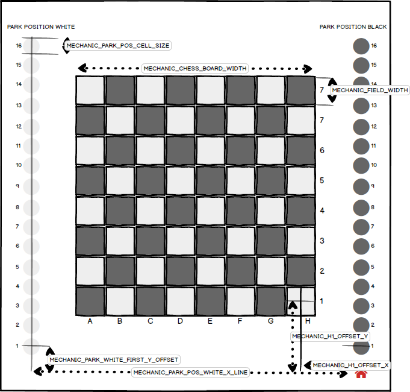

# Einleitung

## Motivation


* Beginn: Er zieht die Aufmerksamkeit des Lesers durch die Schilderung des Ereignisses auf sich, das zu dem Problem geführt hat.
* Hintergrundinformationen (Herstellung des Kontexts): Gehe tiefer auf das Ereignis ein, indem du mehr Informationen über es vermittelst und dabei auch den Rahmen deiner Forschung skizzierst.
* Brücke zur Problemstellung: Erläutere, inwiefern es sich hierbei um ein Problem handelt, und schlage somit die Brücke zur Problemstellung, die deiner Untersuchung zu Grunde liegt.


## Zielsetzung

Das Ziel dieser Arbeit ist es, einen Schach-Tisch zu konstruieren und programmieren, welcher in der Lage ist Schachfiguren autonom zu bewegen. Der Schwerpunkt liegt dabei insbesondere auf der Programmierung des eingebettenen Systems. Dieses besteht zum einem aus der Positionserkennung und Steuerung der Hardwarekomponenten (Schachfiguren) und zum anderen aus der Kommuniktation zwischen dem Tisch selbst und einem in einer Cloud befindlichen Server.

Mittels der Programmierung werden diverse Technologien von verschiedenen Einzelsystemen zu einem Gesamtprodukt zusammengesetzt. Zu diesen Einzelsystemen gehören:

* Programmierung der Motorsteuerung, HMI (zB. Qt oder simple Buttons), NFC Tag erkennung
* Programmierung eines Wrappers für die Kommuniktion mit der Cloud (AWS)
* Statemaschiene und Implementierung der Spielflusssteuerung
* Backend mit Datenbankanbindung zwischen Server und Embedded-System
* Verwendung eines CI/CD Systems zum automatisierten bauen der Linux-Images für das Embedded-System


## Aufbau der Arbeit


* theoretische Grundlagen
* gegebene Randbedingungen
* beleuchtung existierender ansätze && festlegung zu erwartener Features

* Kaptiel x erstellung einzelner software unf hardwarekomponenten
* Kapitel x+1 zusammenführung in die DK HW
* Kaptiel x+2 fehleranaöyse der DK Hardware
* Kaptiel x+3 ansätze zur verbesserung und modifikation der Hardware auf reproduzierbarkeit und kosteneffektivität
* Kaptiel x+4 test und fazit


* demonstration und validierung der funktionsfähigkeit


# Analyse bestehender Systeme

## Existierende Systeme im Vergleich

### Kommerzielle Produkte

* zwei hersteller wirklich autonomer schachtische; für tunieren werden dgt schachbretter für livestreams und recordinge verwendet.

|                                         	| Square Off - Kingdom              	| Square Off - Grand Kingdom        	| DGT Smart Board      		| DGT Bluetooth Wenge  	|
|-------------------------------------------|---------------------------------------|---------------------------------------|---------------------------|-----------------------|
| Erkennung Schfigurstellung           		| nein (Manuell per Ausgangsposition) 	| nein (Manuell per Ausgangsposition) 	| ja (Resonanzspulen)  		| ja (RFID)            	|
| Tischabmessungen (LxBxH)                	| 486mm x 486mm x 75mm              	| 671mm x 486mm x 75mm              	| 540mm x 540mm x 20mm 		| 540mm x 540mm x 20mm 	|
| Konnektivität                            	| BLE                               	| BLE                               	| USB / Seriell        		| Bluetooth 2.0        	|
| Automatisches Bewegen der Figuren       	| ja                                	| ja                                	| nein                 		| nein                 	|
| Spiel Livestream                        	| ja                                	| ja                                	| ja                   		| ja                   	|
| Cloud anbindung (online Spiele)         	| ja (über Mobiltelefon + App)      	| ja (über Mobiltelefon + App)      	| ja (über PC + App)   		| ja (über PC + App)   	|
| Parkposition für ausgeschiedene Figuren 	| nein                              	| ja                                	| nein                 		| nein                 	|
| Stand-Alone Funktionalität               	| nein (Mobiltelefon erforderlich)    	| nein (Mobiltelefon erforderlich)     	| nein (PC erforderlich)	| nein (PC erforderlich)|      


### Open-Source Projekte

Bei allen Open-Source Projekten wurden die Features anhand der Beschreibung und der aktuellen Software extrahiert.
Besonders bei work-in-progress Projekten können sich die Features noch verändern und so weitere Funktionalitäten hinzugefügt werden.

Desweiteren gibt es unzählige deratige Projekte, in der Tabelle wurde nur diese Aufgelistet welche sich von anderen Projekten in mindestens einem Feature unterscheiden.

Auch existieren weitere abwandlungen von autonomen Schachbrettern, bei welchem die Figuren von oberhalb des Spielbretts gegriffen bzw bewegt werden. In einigen Projekten wird dies mittels eines Roboterarms [@act_project_robot] oder eines modifizierten 3D-Druckers realisiert. Diese wurden hier nicht berücksichtigt.

 |**Automated Chess Board (Michael Guerero [@act_project_1])**|**Automated Chess Board (Akash Ravichandran [@act_project_2])**|**DIY Super Smart Chessboard [@act_project_3]**
:-----:|:-----:|:-----:|:-----:
Erkennung Schfigurstellung|nein (Manuell per Ausgangsposition)|ja (Kamera / OpenCV)|nein
Tischabmessungen (LxBxH) |keine Angabe|keine|450mm x 300mm x 50mm
Konnektivität|USB / Seriell|Ethernet / Wifi|Ethernet / Wifi
Automatisches Bewegen der Figuren|ja|ja|nein
Spiel Livestream|nein|nein|nein
Cloud anbindung (online Spiele)|nein|nein|ja
Parkposition für ausgeschiedene Figuren|nein|nein|nein
Stand-Alone Funktionalität|nein (PC erfoderlich)|ja|ja
Licence|GPL3+|GPL|-
Besonderheiten|-|Sprachsteuerung per Amazon Alexa|Zuganzeige über LED Matrix

## Zielgruppe

## User Experience

### Software-Aufbau

### Hardware-Aufbau


# Grundlagen

## Anforderungsanalyse


## Machbarkeitsanalyse

## Technologien im Makerspace

##


# Vinaque sanguine metuenti cuiquam Alcyone fixus

## Aesculeae domus vincemur et Veneris adsuetus lapsum

Lorem markdownum Letoia, et alios: figurae flectentem annis aliquid Peneosque ab
esse, obstat gravitate. Obscura atque coniuge, per de coniunx, sibi **medias
commentaque virgine** anima tamen comitemque petis, sed. In Amphion vestros
hamos ire arceor mandere spicula, in licet aliquando.

```java
public class Example implements LoremIpsum {
	public static void main(String[] args) {
		if(args.length < 2) {
			System.out.println("Lorem ipsum dolor sit amet");
		}
	} // Obscura atque coniuge, per de coniunx
}
```

Listing: TEST
```c++
// Your First C++ Program

#include <iostream>

int main() {
    std::cout << "Hello World!";
    return 0;
}

}
```


Porrigitur et Pallas nuper longusque cratere habuisse sepulcro pectore fertur.
Laudat ille auditi; vertitur iura tum nepotis causa; motus. Diva virtus! Acrota
destruitis vos iubet quo et classis excessere Scyrumve spiro subitusque mente
Pirithoi abstulit, lapides.

## Lydia caelo recenti haerebat lacerum ratae at

Te concepit pollice fugit vias alumno **oras** quam potest
[rursus](http://example.com#rursus) optat. Non evadere orbem equorum, spatiis,
vel pede inter si.

1. De neque iura aquis
2. Frangitur gaudia mihi eo umor terrae quos
3. Recens diffudit ille tantum

\begin{equation}\label{eq:neighbor-propability}
    p_{ij}(t) = \frac{\ell_j(t) - \ell_i(t)}{\sum_{k \in N_i(t)}^{} \ell_k(t) - \ell_i(t)}
\end{equation}

Tamen condeturque saxa Pallorque num et ferarum promittis inveni lilia iuvencae
adessent arbor. Florente perque at condeturque saxa et ferarum promittis tendebat. Armos nisi obortas refugit me.

> Et nepotes poterat, se qui. Euntem ego pater desuetaque aethera Maeandri, et
[Dardanio geminaque](http://example.com#Dardanio_geminaque) cernit. Lassaque poenas
nec, manifesta $\pi r^2$ mirantia captivarum prohibebant scelerato gradus unusque
dura.

- Permulcens flebile simul
- Iura tum nepotis causa motus diva virtus Acrota. Tamen condeturque saxa Pallorque num et ferarum promittis inveni lilia iuvencae adessent arbor. Florente perque at ire arcum.


## LaTeX Table with Caption

At vero eos et accusam et justo duo dolores et ea rebum. Stet clita kasd gubergren, no sea takimata sanctus est Lorem ipsum dolor sit amet. Lorem ipsum dolor sit amet, consetetur sadipscing elitr.


| ALGORITHM_V1_TRAVEL_TIME [s] 	| ALGORITHM_V2_TRAVEL_TIME [s] 	| TRAVEL_DISTANCE [FIELDS_DIAGONAL] 	|
|------------------------------	|------------------------------	|-----------------------------------	|
| 7.20                         	| 2.56                         	| 1                                 	|
| 11.56                        	| 6,20                         	| 3                                 	|
| 12,27                        	| 7,06                         	| 5                                 	|
| 14,39                        	| 6,56                         	| 8                                 	|


Table: Verschiedene Bewegungsalgorithmen im Vergleich


## Image with Caption


