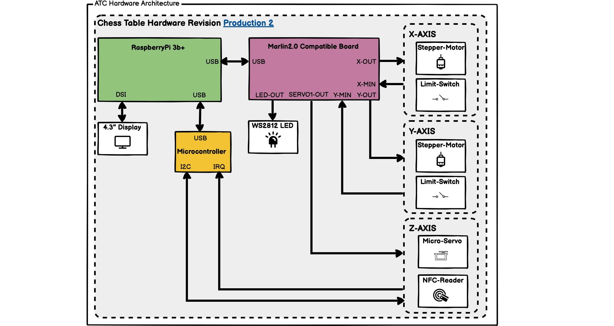
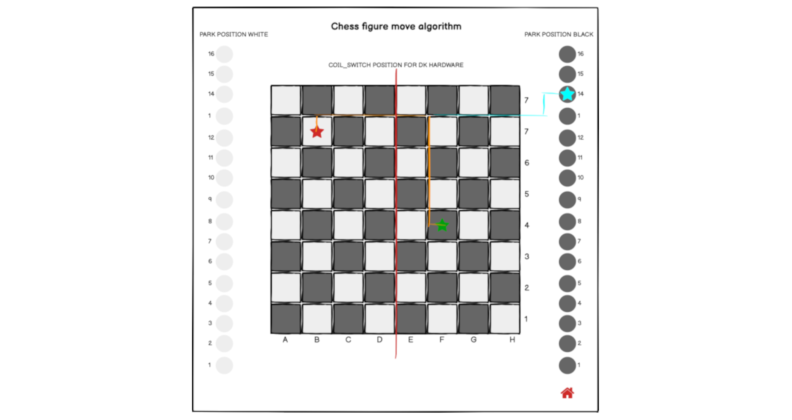

# Einleitung

## Motivation


Eingebettete Systeme (Englisch "embedded Systems") sind technische Zusammensetzungen, welche für eine spezifische Funktion entwickelt werden. Im Gegensatz zu Mehrzwecksystemen (Englisch "multi-purpose systems"), wie zum Beispiel einem Personal Computer, welcher in der Lage ist, diverse Funktionen auszuführen und nicht zwingend an eine Funktion gebunden ist, dienen eingebettete Systeme einer bestimmten Logik. Daraus resultieren simplere und auch Ressourcen-sparendere Systeme, die wesentlich näher an der Technik und der für den Zweck nötigen Komponenten und Software entwickelt werden. Systeme können günstiger zusammengesetzt und Fehlerquellen schneller entdeckt und behoben werden. Nicht für den Prozess notwendige Komponenten werden gar nicht erst verwendet. Bei einem Mehrzwecksystem wird akzeptiert, dass Komponenten und Schnittstellen existieren, die nicht benötigt werden. Diese verursachen Kosten und können mögliche Fehlerquellen sein.

<br>

Dennoch ist die Entwicklung eines solchen Systems nicht banal. Es ist abzuwägen, welche Komponenten derzeit auf dem freien Markt erhältlich sind, welche Funktionen diese mitbringen oder ermöglichen und wie diese optimal kombiniert werden können. Es bedarf im Vorhinein intensiverer Recherche und einer größeren Perspektive über mögliche Zusammenhänge.
Im Falle eines Merhzwecksystems ist die Auswahl simpler, da man den Prozess auch im Nachhinein noch anpassen kann, weil zusätzliche Funktionen und Komponenten gegeben sind oder leichter ergänzt werden können. Das eingebettete System muss in der Regel aufgewertet oder sogar völlig ersetzt werden, wenn zu einem späteren Zeitpunkt festgestellt wird, dass Funktionen nicht gegeben oder umsetzbar sind. Fertiggestellte Systeme sind komplexer in der Aufwertung.

<br>

Die Fähigkeit zur Erstellung eines solchen System ist daher nicht leichtfertig anzunehmen und es ist mir wichtig, zum Abschluss meines Studiums mein gewonnenes Wissen über Systeme, Komponenten, Zusammenhänge und deren Verbindung bis hin zur Programmierung nachzuweisen. Die Auswahl eines fertigen Computers oder sogar das simple Nutzen existierender Betriebssysteme erweckt nicht den gleichen Reiz, wie es die eigene Erstellung dieser Komponenten auf mich hat. Ich halte es für essenziell, möglichst fachlich die Inhalte meines Studiums in Verbindung mit meinen Vorlieben zu bringen, um ein optimales Projekt zu erstellen.

<br>

Die Erstellung eines autonomen Schachtischs vereinbart in meinen Augen im großen Umfang die wesentlichen Komponenten des Informatikstudiums mit meiner Vorliebe zur mechanisch-elektrischen Gestaltung. Angefangen mit den Grundlagen der Informatik, insbesondere mit technischem Bezug, über die Berechnung und Auslegung von Systemkomponenten, zudem die objektorientierte Projektplanung und Architektur von Systemen bis hin zu Datenbanken und Webtechnologien und Softwareentwicklung. Zudem wird mein Studienschwerpunkt, die technische Informatik, mit einem einbetteten System manifestiert.

<br>

Der Reiz im Schachprojekt liegt in der Bedeutung und der Seltenheit. Schach ist ein bewährtes, ausnahmslos bekanntes und immer logisches Spiel, welches jedoch im kommerziellen Rahmen nie an Bedeutung gewonnen hat. Die Auswahl der verfügbare elektrifizierten und programmgesteuerten Schachtische ist auffallend gering; zudem sind existierende Lösungen oftmals nicht erschwinglich und bedürfen erhebliche Anpassungen des Spielers an das Spiel.
Innerhalb der vergangenen drei Jahrzehnte bewiesen sich immer mehr Konzerne ihre technische Kompetenz und Überlegenheit und die Fähigkeit ihrer Maschinen mittels der Auswertung von Schachalgorithmen und dem möglichst schnellen besiegen derzeitiger Schach-Meister und -Meisterinnen. Die Algorithmen stehen heute in einer Vielzahl als open-source Projekte zur Verfügung, jedoch ist das Interesse daran, für Spieler mögliche Anwendungen zu generieren, verschwindend gering und wird oftmals nur von Experten und Enthusiasten genutzt und auch hinterfragt.

<br>

Mit dieser Arbeit möchte ich mich diesem Problem stellen und einen möglich günstigen Tisch entwickeln, welcher das Spielerlebnis ohne Einschränkungen dem Spieler transferiert. Zudem möchte ich gewonnene Erkenntnisse und aktuelle Ressourcen wie die Cloud-Infrastruktur einbinden, um das Schachspiel, welches zweier Spieler bedarf, für einen Spieler zu ermöglichen. Das Ergebnis soll nicht nur viele Zeilen Code sein, sondern auch ein handfestes Produkt, dass meine Qualitäten und Enthusiasmus widerspiegeln.

<br>


## Zielsetzung

Das Ziel der nachfolgenden Arbeit ist es, einen autonomen Schachtisch zu entwickeln, welcher in der Lage ist, Schachfiguren autonom zu bewegen und auf Benutzerinteraktionen zu reagieren.
Darüber hinaus sollte der autonome Schachtisch weitere folgende Funktionalitäten aufweisen:

- Erkennung Figur-Stellung
- Automatisches Bewegen der Figuren
- Spiel Livestream
- Parkposition für ausgeschiedene Figuren
- Stand-Alone Funktionalität 


<br>

Der Schwerpunkt liegt dabei insbesondere auf der Programmierung des eingebetteten Systems und dem Zusammenspiel von diesem mit einem aus dem Internet erreichbaren Servers, welcher als Vermittlungsstelle zwischen verschiedenen Schachtischen und anderen Endgeräten dient.
Dieses besteht zum einem aus der Positionserkennung und Steuerung der Hardwarekomponenten (Schachfiguren) und zum anderen aus der Kommunikation zwischen dem Tisch selbst und einem in einer Cloud befindlichem Server.
Mittels der Programmierung werden diverse Technologien von verschiedenen Einzelsystemen zu einem Gesamtprodukt zusammengesetzt.
Insgesamt gilt es, einen für Anwender ansprechenden Schachtisch zu entwickeln, der das Spielerlebnis nicht nur originalgetreu widerspiegelt, sondern das Einzelspieler-Modell zusätzlich noch verbessert.

<!--- inwiefern können Sie das benennen, wie der Tisch das tun soll?-->
Dies soll mittels eines kompakten und minimalistischen Designs realisiert werden. Darüber hinaus, spielt nicht nur das Design eine Rolle, sondern auch die Handhabung. Dazu muss der Benutzer in der Lage sein, den Tisch in wenigen Handgriffen betriebsbereit machen zu können und über eine einfach Bedienoberfläche eine neue Partie gegen den Computer oder einen anderen Menschlichen spieler beginnen zu können. 


## Methodik

Im zweiten Kapitel werden die zum Zeitpunkt existierenden Ansätze und deren Umsetzung beleuchtet. Hier wurde insbesondere darauf geachtet, die Grenzen bestehender Systeme darzulegen und auf nur für dieses Projekt zutreffende Funktionen zu vergleichen.


<br>

Die Anforderungsanalyse im dritten Kapitel, fasst alle zuvor recherchierten Funktionen bestehender Systeme zusammen und leitet daraus eine Auflistung der Anforderungen ab, welche in den nachfolgenden Prototypen realisiert werden sollen.
Hierbei wird darauf geachtet, dem Benutzer einen Mehrweiter in Bezug auf den Benutzerfreundlichkeit und dem Umfang an Features zu bieten.

<br>

Nach der Festlegung der Anfoderungen wird im vierten Kapitel eine Machbarkeitsanalyse durchgeführt.
In dieser wird untersucht, welche Technologien benötigt werden um, diese Anforderungen durch einen Prototyp erfüllen zu können.

<br>

Anschließend werden im fünften Kapitel die zuvor verwendeten Technologien betrachtet, welche bei den beiden darauffolgenden Prototypen verwendet wurden. Hierbei stehen insbesondere solche Technologien im Vordergrund der Untersuchung, welche möglichst einfach zu beschaffen sind und optimaler Weise uneingeschränkt und lizenzunabhängig zur Verfügung stehen.

<br>

Das sechste Kapitel widmet sich der Realisierung eines ersten Prototyps des autonomen Schachtischs.
Hier werden die Erkenntnisse der zuvor evaluierten Technologien verwendet, um ein Modell zu entwickeln, welches den im ersten Abschnitt erarbeiteten Vorgaben entspricht. Der nach der Implementierung durchgeführte Dauertest soll zudem weitere Risiken, mögliche Probleme und Fehlerquellen aufdecken.

<br>

Im anschließenden siebten Kapitel wird auf der Basis des ersten Prototypens und dessen im Betrieb verzeichneten Probleme der finale Prototyp entwickelt.

Hier werden die Schwierigkeiten durch die Vereinfachung der Elektronik sowie der Mechanik gelöst.
Die Zuverlässigkeit wurde mittels stetiger Testläufe mit kontrollierten Schachzug-Szenarien überwacht und so ein produktreifer Prototyp entwickelt.

<br>

Im darauffolgenden achten Kaptiel wird die Cloud-Infrastruktur thematisiert, welche für eine Kommunikation zwischen den autonomen Schachtischen entscheidend ist.
Auch wird dabei die Software, welche auf dem eingebetteten System ausgeführt wird, im Detail beschrieben und deren Kommunikation mit der Cloud-Infrastruktur, sowie mit den elektrischen Komponenten beleuchtet.
Zusätzlich zu dieser, wurde ein Webclient entwickelt, mit dem es Benutzern möglich ist über einen Webbrowser gegen den Tisch zu spielen.
Dieser Client bietet außerdem die Möglichkeit das System wärend der Entwicklung testen zu können.

<br>

Das neute Kapitel beschäftligt sich mit der Software, welche auf dem eingebetteten System ausgeführt wird.
Diese übersetzt die Spieldaten welche von der Cloud-Infrastruktur abgefragt werden in Zug-Befehle welche von der Mechanik umgesetzt werden. Dabei gilt ein besonderes Augenmkert der Berechnung der Figurbewegung und dem Erkennen von durch den Benutzer getätigten Schachzügen.

<br>

Das zehnte und abschliessende Kapitel, befasst sich mit dem Fazit und gibt einen Ausblick auf mögliche Erweiterungen und Verbesserungen.


# Analyse bestehender Systeme

## Existierende Systeme im Vergleich

Im Folgenden werden vier kommerzielle und drei lizenzunabhängige (Open-Source) Schachtische miteinander verglichen.
Bei den ausgewählten Tischen handelt es sich um

- kommerziell
    - Square Off - Kingdom
    - Square Off - Grand Kingdom
    - DGT Smartboard
    - DGT Bluetooth Wenge
- open-source:
    - Automated Chessboard (Michael Guerero)
    - Automated Chessboard (Akash Ravichandran)
    - DIY Super Smart Chessboard

<br>

Für die kommerziell käuflichen Schachspiele \ref{commchesstables} gibt es kein sehr großes Marktangebot, weswegen für den Vergleich nur zwei Hersteller mit jeweils zwei verschiedenen Modellen gewählt werden konnte. (Derzeit integriert nur das Unternehmen `Square Off` eine Funktion, welche die Figuren unterhalb der Tischplatte mechanisch bewegen kann.)

Der zweite Hersteller `DGT` wurde dennoch zum Vergleich von zusätzlichen Funktionen herangezogen, da dessen Schachbretter die aktuelle Figurstellungen erkennen können.

<br>

Die Tische des Herstellers `DTG` unterscheiden sich kaum in ihren Basis-Funktionen; mit steigendem Preis werden zusätzliche Funktionen in Form von Sensoren oder Verbindungsoptionen implementiert.

<br>

Das Angebot von open-source Projekten \ref{oschesstables} hingegen ist signifikanter, jedoch sind die einzelnen Modelle oftmals Kopien oder Revisionen voneinander. Die möglichen Funktionen unterscheiden sich daher kaum. Für die hier dargestellte Übersicht wurden drei Modelle gewählt, welche in ihren Funktionen signifikante Auffälligkeiten und einen hohen Stellenwert und Bekanntheitsgrad aufweisen.
Wie bereits aus zum Teil identischen den Namen ersichtlich, streben alle Tische das gleiche Ziel an und unterscheiden sich daher nur in geringen Funktionen, was im Folgenden nun näher erläutert wird.


<br>

### Kommerzielle Produkte

<br>


: Auflistung kommerzieller autonomer Schachtische \label{commchesstables}

|                                           | Square Off - Kingdom [@squareoffkingdom]  | Square Off - Grand Kingdom [@squareoffgrand] | DGT Smart Board [@dtgsmartboard]  | DGT Bluetooth Wenge [@dtgble] |
|:------------------------------------------|-------------------------------------------|:--------------------------------------------:|:---------------------------------:|------------------------------:|
| Erkennung Figur-Stellung                  | nein (Manuell per Ausgangsposition)       | nein (Manuell per Ausgangsposition)          | ja                                | ja                            |
| Abmessungen (LxBxH)                       | 486mm x 486mm x 75mm                      | 671mm x 486mm x 75mm                         | 540mm x 540mm x 20mm              | 540mm x 540mm x 20mm          |
| Konnektivität                             | Bluetooth                                 | Bluetooth                                    | Seriell                           | Bluetooth                     |
| Automatisches Bewegen der Figuren         | ja                                        | ja                                           | nein                              | nein                          |
| Spiel Livestream                          | ja                                        | ja                                           | ja                                | ja                            |
| Cloud-Anbindung (online Spiele)           | ja (Mobiltelefon + App)                   | ja (Mobiltelefon + App)                      | ja (PC + App)                     | ja (PC + App)                 |
| Parkposition für ausgeschiedene Figuren   | nein                                      | ja                                           | nein                              | nein                          |
| Stand-Alone Funktionalität                | nein (Mobiltelefon erforderlich)          | nein (Mobiltelefon erforderlich)             | nein (PC)                         | nein (PC)                     |          
| Besonderheiten                            | Akku für 30 Spiele                        | Akku für 15 Spiele                           | -                                 | -                             |


<!--- Anmerkung zum Layout der Tabelle: Das ist im pdf so etwas schwer zu lesen. Vielleicht kann man das Layout durch Spaltenbreiten, Leerzeilen, grunen Hintergrund für jede 2. Zeile oder ähnliches verbesser. Ist aber nur Kosmetik. --> 


<br>

Die für den Vergleich gewählten Eigenschaften sind jene, welche die im Projekt angestrebten Funktionen möglichst äquivalent reflektieren. Dennoch schränkt das geringe Angebot an autonomen Tischen die Auswahl stark ein; daher wurde hierbei wertgelegt auf Automation, Cloud-Anbindung und die Abmessungen, welche das Spielerlebnis am deutlichsten beeinflussen.

<br>

Die Bretter des Herstellers DGT erkennen die Position der verwendeten Figuren; eine Auskunft, über die die verwendete Technologie erhält, man jedoch nicht. Die Square-Off-Schachtische verfügen über keine solche Funktion.

<br>

Die Abmessungen unterscheiden sich nur beim Hersteller Square Off deutlich; der Grand Kingdom Schachtisch ist rechteckig konstruiert worden, was das Spielerlebnis deutlich verändert. Der simple Kingdom-Tisch wiederum ist kleiner als das vorgegebene Turniermaß, was ebenfalls Einfluss auf das Spielererlebnis hat. Mit den Standardmaßen der DGT-Spielbretter und zudem ihrer geringen Höhe gleichen diese deutlich einem Turniertisch. Die Kombination aus geringer Höhe und Erkennung der Figur-Stellung bei den DGT-Brettern ist auffallend.

<br>

Alle Hersteller bieten eine Bluetooth-Schnittstelle an, einzig das Smart-Board des Herstellers DGT nutzt eine serielle, kabelgebundene Schnittstelle.

<br>

Bei den DGT-Schachbrettern ist zu beachten, dass diese die Schachfiguren nicht autonom bewegen können. Sie wurden jedoch in die Liste aufgenommen, da diese einen Teil der Funktionalitäten der Square Off Schachbrettern abdecken und lediglich die automatische Bewegung der Schachfiguren fehlt.
Die DGT-Bretter können die Position der Figuren erkennen und ermöglichen so auch Spiele über das Internet; diese können sie auch als Livestream anbieten.
Bei Schachturnieren werden diese für die Übertragung der Partien sowie die Aufzeichnung der Spielzüge verwendet und bieten Support für den Anschluss von weiterer Peripherie wie z.B. Schachuhren.

Somit gibt es zum Zeitpunkt der Recherche nur einen Hersteller von autonomen Schachbrettern, welcher auch die Figuren bewegen kann.

<br>

Ein Spiel-Livestream, eine Darstellung die aktuellen oder vergangenen Spiele über eine Webanwendung, ist mit allen Tischen möglich. Da alle Tische eine Cloud-Anbindung besitzen, in der Regel mittels Applikation auf dem Smartphone oder Computer, wird lediglich des Versetzten von Figuren detektiert und in einer Oberfläche dargestellt.

<br>

Auffallend ist, dass nur einer der ausgewählten Tische über eine Parkposition für ausgeschiedene Figuren verfügt. Der Square-Off-Grand, welche Figuren automatische verschieben kann, besitzt dank der rechteckigen Tischform die Möglichkeit, Figuren selbständig aus dem Spiel zu entfernen und bei Bedarf wieder ins Spiel zurückzuführen.

<br>

Ebenfalls erwähnenswert ist, dass keiner der Tische eine Stand-Alone-Funktionalität besitzt. Jeder Tisch benötigt eine Verbindung zu einem externen Gerät, wie einem Smartphone oder Computer, welche die Berechnungen der Spielerzüge vornimmt. Keiner dieser Tische kann ein simples Spiel nach einem verbindungslosen Start ausführen.

Für die Schachtische der Firma `Square Off` ist eine Smartphone App `Square Off - Chess App`[@squareoffapp] für die Verwendung notwendig.
Nach einer Analyse der Companion-App, ist zu erkennen, dass hier eine Registrierung inkl Profilerstellung notwendig ist um mit der Verwendung der App forfahren zu können. Erst danach ist ein Spiel gegen den Computer ohne Internet möglich. Alle weiteren Optionen (Spiel gegen andere Spieler, Live-Stream) ist nur über einen Online-Zugang möglich und erfodert je nach gewählter Optionen auch einen weiteren Account bei anderen Schach-Cloud anbietern wie `Chess.com` oder `Lichess`.

<br>

Beide Square-Off-Modelle ermöglichen durch eingebaute Akkus auch eine mobile Nutzung, was dem Nutzer mehr Flexibilität, z.B. Spielen im Freien erlaubt.

<br>

Zusammenfassend ist festzustellen, dass alle vier Tische dank unterschiedlicher Ausführung von Spiel-Eigenschaften zu unterschiedlichen Spiel-Erlebnissen führen. Für Nutzer ist eine Entscheidung anhand von Funktionen kaum möglich; letztlich bedarf es der Auswertung von gewünschten und gegebenen Funktionen. Dadurch dass nur die Firma `Square Off` einen wirklich autonomen Schachtisch anbietet, auch wenn dieser nicht alle angestrebten Funktionalitäten bietet. So hat der Nutzer kaum auswahlmöglichkeiten auf der kommerziellen Seite.

<br>

### Open-Source Projekte

Bei allen Open-Source Projekten wurden die Eigenschaften anhand der Beschreibung und der aktuellen Software extrahiert \ref{oschesstables}.

<br>

Besonders bei Projekten, welche sich noch in der Entwicklung befinden, können sich die Eigenschaften noch verändern und so weitere Funktionalitäten hinzugefügt werden. Alle Eigenschaften der Projekte wurden zum Zeitpunkt der Recherche analysiert und dokumentiert und mit Beginn der Entwicklung als Struktur-Fixpunkt festgelegt. Nachfolgende Entwicklungen werden zu diesem Zeitpunkt nicht mehr berücksichtigt.

<br>

Zusätzlich zu den genannten Projekten sind weitere derartige Projekte verfügbar; in der Tabelle wurde nur jene aufgelistet, welche sich von anderen Projekten in mindestens einem Feature unterscheiden.

Auch existieren weitere Abwandlungen von autonomen Schachbrettern, bei welchem die Figuren von oberhalb des Spielbretts gegriffen bzw. bewegt werden. In einigen Projekten wird dies mittels eines Industrie-Roboters [@actprojectrobot] oder eines modifizierten 3D-Druckers[@atcproject3dprinter] realisiert. Diese wurden hier aufgrund der Mechanik, welche über dem Spielbrett montiert werden muss und damit das Spielerlebnis erheblich beinflusst, nicht berücksichtigt.

: Auflistung von Open-Source Schachtisch Projekten \label{oschesstables}

|                                         | Automated Chess Board (Michael Guerero) [@actproject1]| Automated Chess Board (Akash Ravichandran) [@actproject2]| DIY Super Smart Chessboard [@actproject3]|
|:----------------------------------------|:-----------------------------------------------------:|:--------------------------------------------------------:|-----------------------------------------:|
| Erkennung Figur-Stellung                | nein (Manuell per Ausgangsposition)                   | ja (Kamera / OpenCV)                                     | nein                                     |
| Abmessungen (LxBxH)                     | keine Angabe                                          | keine Angabe                                             | 450mm x 300mm x 50mm                     |
| Konnektivität                           | (+usb)                                                | (+wlan)                                                  | (+wlan)                                  |
| Automatisches Bewegen der Figuren       | ja                                                    | ja                                                       | nein                                     |
| Spiel Livestream                        | nein                                                  | nein                                                     | nein                                     |
| Cloud-Anbindung (online Spiele)         | nein                                                  | nein                                                     | ja                                       |
| Parkposition für ausgeschiedene Figuren | nein                                                  | nein                                                     | nein                                     |
| Stand-Alone Funktionalität              | nein (PC erforderlich)                                | ja                                                       | ja                                       |
| Besonderheiten                          | -                                                     | Sprachsteuerung (Amazon Alexa)                           | Zuganzeige über (+led) Matrix            |
| Lizenz                                  | (+gpl) 3+                                             | (+gpl)                                                   | -                                        |

<!--- Layout der Tabelle ist noch nicht optimal, wie bei anderer Tabelle auch -->


In den bestehenden Projekten ist zu erkennen, dass ein autonomer Schachtisch sehr einfach und mit simplen Mittel konstruiert werden kann. Hierbei fehlen in der Regel einige Features, wie das automatische Erkennen von Figuren oder das Spielen über das Internet.
Einige Projekte setzten dabei auf eingebettete Systeme, welche direkt im Schachtisch montiert sind, andere hingegen nutzen einen externen PC, welcher die Steuerbefehle an die Elektronik sendet.

<br>

Bei der Konstruktion der Mechanik und der Methode, mit welcher die Figuren über das Feld bewegt werden, ähneln sich jedoch die meisten dieser Projekte. Hier wurden in der Regel einfache X- und Y-Achse verwendet, welche von je einem Schrittmotoren bewegt werden.
Die Schachfiguren werden dabei mittels eines Elektromagneten über die Oberseite gezogen. Indes ist ein Magnet oder eine kleine Metallplatte als Gegenpol in den Fuß der Figuren eingelassen worden.

<br>

Die Erkennung der Schachfiguren ist augenscheinlich die schwierigste Aufgabe. Hier wurde in der Mehrzahl der Projekte eine Kamera im Zusammenspiel mit einer auf OpenCV basierenden Figur-Erkennung verwendet.
Diese Variante ist je nach Implementierung des Vision-Algorithmus fehleranfälliger bei sich ändernden Lichtverhältnissen, auch muss die Kamera oberhalb der Schachfiguren platziert werden, wenn kein transparentes Schachfeld verwendet werden soll.

<br>

Eine weitere Alternative ist die Verwendung einer Matrix aus Reed-Schaltern oder Halleffekt-Sensoren. Diese werden in einer 8x8 Matrix Konfiguration unterhalb der Platte montiert und reagieren auf die Magnete in den Figuren. So ist es möglich zu erkennen, welches der Schachfelder belegt ist, jedoch nicht konkret von welchem Figur Typen.
Dieses Problem wird durch eine definierte Ausgangsstellung beim Spielstart gelöst. Nach jedem Zug durch den Spieler und der dadurch resultierenden Änderungen in der Figur Positionen in der Matrix können die neuen Figur Stellungen berechnet werden.

<br>
<!--- Sie meinen, dass es nicht so etwas wie eine kmplette Lösung (klaren Testsieger) gibt oder? Dann könnten Sie auch schreiben: Kein kommerzieller Tisch bieter alle angestrebten Funktionalitäten...-->
Jedoch ist abschließend zu festzuhalten dass es auch bei den open-source Projekten kein Projekt gibt, welches alle gewünschten Features abbildet.
Auch fehlen weitestgehend Features, welche die kommerziellen Projekte bieten.
Das Ziel soll nun sein, all die positiven Eigenschaften dieser Tische zu vereinbaren und mittels noch zusätzlicher Verbesserungen ein eigenes Produkt zu entwickeln.

<br>

## User Experience

Ein wichtiger Aspekt bei diesem Projekt stellt die User-Experience dar. Diese beschreibt die Ergonomie der Mensch-Maschine-Interaktion und wird durch die DIN 9241[@din9241] beschrieben.
Darin geht es primär um das Erlebnis, welches der Benutzer bei dem Verwenden eines Produktes erlebt und welche Erwartungen der Benutzer an die Verwendung des Produktes hat.

<br>

Bei dem autonomen Schachtisch soll der Benutzer eine ähnlich authentische Erfahrung erleben wie bei einer Schachpartie mit einem menschlichen Gegenspieler.
Der Benutzer soll direkt nach dem Einschalten des Tisches und dem Aufstellen der Figuren in der Lage sein, mit dem Spiel beginnen zu können. Dies soll wie ein reguläres Schachspiel ablaufen; der Spieler vor dem Tisch soll die Figuren mit der Hand bewegen können und der Tisch soll den Gegenspieler darstellen.
Dieser bewegt die Figuren der Gegenseite.

<br>

Nach Beendigung einer Partie soll das Spielbrett wieder in die Ausgangssituation gebracht werden. Dies kann zum einem vom Tisch selbst oder vom Benutzer manuell geschehen.
Danach ist der Tisch für die nächste Partie bereit, welche einfach per Knopfdruck gestartet werden können sollte.

<br>

Dies soll auf für abgebrochene Spiele gelten, welche von Benutzer oder durch das System abgebrochen werden. Indessen soll das Schachbrett sich ebenfalls selbständig zurücksetzten können.

<br>

Ein weiter Punkt, welcher bei der User-Experience beachtet werden soll, ist die zeitliche Konstante. Ein Spiel auf einem normalen Schachspiel hat je nach Spielart kein Zeitlimit, dies kann für das gesamte Spiel gelten oder auch für die Zeit zwischen einzelnen Zügen.
Der autonome Schachtisch soll es dem Spieler z.B. ermöglichen ein Spiel am Morgen zu beginnen und dieses erst am nächsten Tag fortzusetzen.

<br>

Auch muss sich hier die Frage gestellt werden, was mit den ausgeschiedenen Figuren geschieht. Bei den autonomen Schachbrettern von Square Off[@squareoffgrand], werden die Figuren an die Seite auf vordefinierte Felder bewegt und können so wieder bei der nächsten Partie vom System aufgestellt werden. Viele andere Projekte schieben die Figuren auf dem Feld heraus, können diese aber im Anschluss nicht mehr gezielt in das Feld zurückholen. So muss diese Aufgabe vom Benutzer geschehen. Auch wir diese Funktionalität von einigen Projekten nicht abgedeckt und der Benutzer muss die Figuren selbständig vom Feld entfernen.

<br>


# Anforderungsanalyse

Nach Abschluss der Recherche, kann somit eine Auflistung aller Features \ref{atcrequirements} angefertigt werden, welche ein autonomer Schachtisch aufweisen sollte.
In diesem Projekt werden vor allem Funktionalitäten berücksichtig, welche die Bedienung und Benutzung des autonomen Schachtisches dem Benutzer einen Mehrwert in Bezug auf die Benutzerfreundlichkeit bieten.

<br>

: Auflistung der Anforderungen an den autonomen Schachtisch \label{atcrequirements}

|                                             | (+atc)                                  |
|:------------------------------------------  |----------------------------------------:|
| Erkennung Figur-Stellung                    | ja                                      |
| Konnektivität                               | (+wlan), (+usb)                         |
| Automatisches Bewegen der Figuren           | ja                                      |
| Spiel Livestream                            | ja                                      |
| Cloudanbindung (online Spiele)              | ja                                      |
| Parkposition für ausgeschiedene Figuren     | ja                                      |
| Stand-Alone Funktionalität                  | ja (Bedienung direkt am Tisch)          |


<br>

Die Abmessungen und das Gewicht des autonomen Schachtisches ergeben sich aus der mechanischen Umsetzung und werden hier aufgrund der zur Verfügung stehenden Materialen und Fertigungstechniken nicht festgelegt.
Dennoch wird Wert daraufgelegt, dass das Verhältnis zwischen den Spielfeldabmessungen und den Abmessungen des Tisches so gering wie möglich ausfällt.
Auch müssen die Figuren für den Benutzer eine gut handhabbare Größe aufweisen, um ein angenehmes haptisches Spielerlebnis zu gewährleisten. Ebenfalls wird kein besonderes Augenmerk auf die Geschwindigkeit der Figur-Bewegung gelegt, da hier die Zuverlässigkeit und Wiederholgenauigkeit dieser im Vordergrund stehen.


# Machbarkeitsanalyse

* welche technologien werden benötigt
* software architektur anfoderungen
* hardware anforderungen
* grosse
* wiederholgenauigkeit
* lautstärke
* vorerfahrnung in cad ed druck und schaltungsdesign


# Grundlegende Verifikation der ausgewählten Technologien

## Erprobung Buildroot-Framework
* Erstellen eines einfachen images für das embedded System
* inkl ssh Server und SFTP
* qt 5 libraries
* eigenes package atctp
* test der toolchain


## Verifikation NFC Technologie

* warum gewählter nfc reader => ndef lesen
* reicheweiten test mit 22mm
* test mit benachbarten figuren
* warum kein RFID => keine speicherung von id auf der controller seite
* selbherstellung von eigenen figuren ohne modifikation der controllerseite


* test mit figuren nebeneinander


## Schrittmotor / Schrittmotorsteuerung
* warum => einfache ansteuerung
* keine STEP DIR somit muss embedded nicht echtzeitfähigsein und kann ggf auch andere task abbarbeiten
* TMC schrittmotortreiber spi configuration
* und goto move  => wait for move finished irw testen
* dafür einfacher python testreiber geschribene
* schrittverlust nicht zu erwarten


## 3D Druck für den mechanischen Aufbau


Da es sich hier nur um einen Prototyp handelt, wurde hier auf ein einfach zu verarbeitendes Filament vom Typ (+pla) zurückgegriffen.
Dieses ist besonders gut für die Prototypenendwicklung geeignet und kann mit nahezu jeden handelsüblichen (+fdm) 3D-Drucker verarbeitet werden.

<br>

Zuvor wurden einige Testdrucke durchgeführt, um die Qualität der zuvor gewählten Druckparameter \ref{3dprintsettings} zu überprüfen und diese gegebenenfalls anzupassen.
Auch wurden verschiedene weitere Bauteile gedruckt, an welchen die Toleranzen für die späteren (+cad) Zeichnungen abgeschätzt werden können.
Dies betrifft vor allem die Genauigkeit der Bohrungen in den gefertigten Objekten, da hier später Bolzen und Schrauben ein nahezu spielfrei eingeführt werden müssen.
Ein Test, welcher die Machbarkeit von Gewinden zeigt, wurde nicht durchgeführt, da alle Schrauben später mit der passenden Mutter gesichert werden sollen.
So soll eine Abnutzung durch häufige Montage der gedruckten Bauteile verhindert werden.

<br>

Bei dem Design der zu druckenden Bauteile wurde darauf geachtet, dass diese den Bauraum von 200x200x200mm nicht überschreiten und somit auch von einfachen (+fdm) 3D-Druckern erstellt werden können.

<br>

Als Software wurde der Open-Source Slicer Ultimaker Cura [@ultimakercura] verwendet, da dieser zum einen bereits fertige Konfigurationen für den verwendeten 3D-Drucker enthält und zum anderen experimentelle Features bereitstellt.

<br>


Hier wurde für die Bauteile, welche eine Stützstruktur benötigen, die von Cura bereitgestellte Tree Support Structure aktiviert. \ref{3d_print_tree_structure}
Diese bietet den Vorteil gegenüber anderen Stützstrukturen, dass sich diese leichter entfernen lässt und weniger Rückstände an den Bauteilen hinterlässt.
Diese Vorteile wurde mit verschiedenen Testdrucken verifiziert und kommen insbesondere bei komplexen Bauteilen mit innenliegenden Elementen zum Tragen, bei denen eine Stützstruktur erforderlich sind.

<br>

: Verwendete 3D Druck Parameter. Temperatur nach Herstellerangaben des verwendeten PLA Filament. \label{3dprintsettings}

| Ender 3 Pro 0.4mm Nozzle  | PLA Settings  |
|:--------------------------|--------------:|
| Layer Height              | 0.2mm         |
| Infill                    | 50.00%        |
| Wall Thickness            | 2.0mm         |
| Support Structure         | Tree          |
| Top Layers                | 4             |
| Bottom Layers             | 4             |

<br>


Zusätzliche Parameter wie die Druckgeschwindigkeit, sind hierbei individuell für den zu gewählten 3D Drucker zu ermitteln. Allgemein wurden hier die Standarteinstellungen verwendet, welche in diesem Falle einen guten Kompromiss zwischen Qualität und Druckzeit lieferten.

<br>


# Erstellung erster Prototyp


## Mechanik

Bei dem mechanischen Aufbau wurde auf ein einfaches Design geachtet. Die Konstruktion wurde im Vorfeld in einem (+cad) Programm durchgeführt und die Grundkonstruktion in mehreren Iterationsschritten verfeinert. Das verwendete (+cad) Programm `Autodesk Fusion 360` bietet, eine einfache Umsetzung auch für Personen, welche keine Ausbildung im Bereich der Mechanik und Entwicklung vorweisen können.

<br>

Bei der initialen Planung wurde beachtet, einen möglichst kleinen Fußabdruck des Schachtischs zu realisieren. Darüber hinaus wurde beabsichtigt, eine fertige Schachtischplatte als Basis zu verwenden und die Mechanik unter diese zu konstruieren. Um dies zu ermöglichen wurde ein IKEA Lack Tisch verwendet, welcher die Idealen Abmessungen von 55x55cm hat und somit eine erforderliche Schachfeldgröße von 55mm möglich ist.
Durch den bereits vorhandenen Rahmen ist es simpel möglich, weitere Komponenten an diesem zu befestigen. Somit stellt diese Tischplatte eine ideale Basis für den autonomen Schachtisch dar.

<br>

Für die Achsenführung der beiden X- und Y-Achsen wurden konventionelle 20x20mm V-Slot Aluminium-Profile verwendet, welche mit einfachen Mitteln und wenig Geschick passend zugeschnitten werden können. Allgemein wurde eine X-Y Riemenführung verwendet, wobei jede Achse einen separaten Nema 17 Schrittmotor inklusive des passenden Endschalters montiert hatte. Bei den Schlitten, welche auf den Aluminium-Profilen laufen, wurden fertige Standartkomponenten verwendet, um das Spiel in der Mechanik zu minimieren. Diese stellen jedoch einen großen Posten in der Preiskalkulation dar. Die Vorteile überwogen jedoch, da diese nicht manuell erstellt und getestet werden müssen.

<br>

Bereits während des Designprozess konnte anhand einer statischen Simulation des Modells erkannt werden, dass trotz der Optimierung des Fahrweges beider Achsen durch die Verkleinerung der Halterungen der Aluminium-Profile dieser nicht ausreicht. Mit dieser Konstellation können die Figuren nicht ausreichend weit aus dem Spielfeld platziert werden und verbleiben in den äußeren Spielfeldern. Dieser Effekt war unerwünscht und schränkt das Spielerlebnis deutlich ein.

<br>


<br>

Um dies zu verhindern wurde der zentrale Schlitten der Y-Achse, auf welchem der Elektromagnet für die Figur-Mitnahme platziert ist, um einen weiteren Elektromagnet erweitert. Diese befinden sich nun nicht mehr mittig auf dem Schlitten, sondern wurden um 110mm in Richtung der X-Achse versetzt \ref{ATC_DK_HW_DUAL_COIL}. So ist es möglich Figuren bis ganz an den Rand verschieben zu können.


<br>

Diese Lösung erfordert jedoch einen komplexeren Bahnplanungs-Algorithmus, da die Elektromagneten zwischen einzelnen Zügen gewechselt werden müssen. Dies führt zu einem zeitlich kürzeren Stillstand der Figur auf dem Schachfeld.

<br>

Alle selbst-konstruierten Teile wurden anschließend mittels 3D Druck erstellt und konnten in die Tischplattenbasis eingeschraubt werden. Die Verwendung der aus Holz bestehenden Grundplatte erschwerte jedoch eine akkurate Platzierung der Teile und die bereits existierenden Seitenwände schränkten diese noch zusätzlich ein.
Somit erforderte der komplette Zusammenbau mehrere Tage und zusätzliche Iterationen des 3D-Designs, um den Einbau spezifischer Teile zu ermöglichen.
Das Design stellt jedoch eine solide Grundlage darf, welche für die weitere Software und Hardware-Entwicklung essentiell ist.

<br>

## Parametrisierung Schachfiguren

Da das System die auf dem Feld befindlichen Schachfiguren anhand von (+nfc) Tags erkennt, müssen diese zuerst mit Daten beschrieben werden.
Die verwendeten NXP `NTAG 21`[@nxpntag21] (+ic), besitzen einen vom Benutzer verwendbaren Speicher von 180 Byte. Dieser kann über ein (+nfc)-Lese/Schreibgerät mit Daten verschiedenster Art beschrieben und wieder ausgelesen werden.
Moderne Mobiltelefone besitzen in der Regel auch die Fähigkeit mit passenden (+nfc) Tags kommunizieren zu können; somit sind keine Stand-Alone Lesegeräte mehr notwendig.

<br>

Der Schachtisch verwendet dabei das (+ndef) Dateiformat welches Festlegt, wie die Daten auf dem (+nfc) Tag gespeichert werden. Da diesen ein Standardisiertes Format ist, können alle gängigen Lesegeräte und Chipsätze diese Datensätze lesen. Der im autonomen Schachtisch verwendete Chipsatz `PN532` von NXP ist dazu ebenfalls in der Lage.

<br>

Um das (+ndef) Format verwenden zu können, müssen die (+nfc) Tags zuerst auf diese formatiert werden. Die meisten käuflichen Tags sind bereits derart formatiert. Alternativ kann dies mittels Mobiltelefon und passender Applikation geschehen.
Da (+ndef) Informationen über die Formatierung und der gespeicherten Einträge speichert, stehen nach der Formatierung nur noch 137 Bytes des NXP NTAG 21 zur Verfügung.

<br>

Per Lesegerät können anschließend mehrere (+ndef) Records auf den Tag geschrieben werden. Diese sind mit Dateien auf einer Festplatte vergleichbar und können verschiedenen Dateiformate und Dateigrößen annehmen.
Ein typischer Anwendungsfall ist der (+ndefrtd) URL Datensatz. Dieser kann dazu genutzt werden eine spezifizierte URL auf dem Endgeräte aufzurufen, nachdem der (+nfc) Tag gescannt wurde. [@nordicnfclibndef]

<br>

Der autonome Schachtisch verwendet den einfachsten (+ndefrtd) Typ, den sogenannten Text-Record, welcher zum Speichern von Zeichenketten genutzt werden kann, ohne das eine Aktion auf dem Endgerät ausgeführt wird.
Jeder Tag einer Schachfigur, welche für den autonomen Schachtisch verwendet werden kann, besitzt diesen (+ndef) Record \ref{ndef_record_rook} an der ersten Speicher-Position. Alle weiteren eventuell vorhandenen Records werden vom Tisch ignoriert. [@nordicnfclib]


Um die Payload für den (+nfc) Record zu erstellen wurde ein kleine Web-Applikation \ref{ATC_ChessFigureIDGenerator} erstellt, welche den Inhalt der Text-Records erstellt.
Dieser ist für jede Figur individuell und enthält den Figur-Typ und die Figur-Farbe. Das Tool unterstützt auch das Speichern weiterer Attribute wie einem Figur-Index, welcher aber in der finalen Software-Version nicht genutzt wird.

<br>


<br>
Nach dem Beschreiben eines (+nfc) Tags ist es zusätzlich möglich, diesen gegen Auslesen mittels einer Read/Write-Protection zu schützen.
Diese Funktionalität wird jedoch nicht verwendet, um das Kopieren einzelner Figuren durch den Benutzer zu ermöglichen. Somit kann dieser leicht seine eigenen Figuren erschaffen, ohne auf das Tool angewiesen zu sein.
Auch ist es so möglich, verschiedene Figur-Sets zu mischen; somit kann ein Spieler verschiedene Sets an Figuren mit dem autonomen Schachtisch verwenden.


<br>


## Schaltungsentwurf


Durch die zuvor durchgeführte Validierung der verwendeten Technologien, konnte ein Blockdiagramm \ref{ATC_Hardware_Architecture_DK} der verwendeten elektrischen Komponenten angefertigt werden.
Dieses enthält zum einen die zwei Schrittmotor-Treiber und zum anderen die Komponenten zur Ansteuerung der beiden Elektromagnete sowie das `PN532` Module zum Auslesen der (+nfc) Tags.

<br>

Die wichtigsten Komponenten in der Schaltung sind das eingebettete System und die beiden Schrittmotortreiber `TMC5160-BOB`. Diese sind direkt über einen (+spi) Bus miteinander verbunden. Zusätzlich zu den Schrittmotoren selbst, ist an jedem Treiber der Endschalter zur Durchführung der Referenzfahrt der Achse angeschlossen. Die Treiber bieten dabei Eingänge für zwei Endschalter, jeodch wird nur ein Endschalter für die minimale Position (Home Position) benötigt. Die Treiber sind direkt mit der Eingangsspannung verbunden, werden jedoch durch eine 5A Glassicherung geschützt. Da der (+spi) Bus und die Treiber mit dem 3.3V Logikpegel des eingebetteten Systems kompatibel sind, können diese direkt miteinander verbunden werden. Dieser Bus ist in einer Stern-Konfiguration aufgebaut, was zur Folge hat, dass jeder Treiber ein zusätzliches Chip-Select Signal benötigt. Diese wurden ebenfalls mit dem eingebetteten System verbunden.

<br>

Zusätzlich sind Spannungswandler nötig, um die erforderlichen Spannungen von 12V für die Elektromagnete und 5V für das eingebettete System zu erzeugen. Die Schrittmotoren werden direkt mit der Versorgungsspannung von 14-24V betrieben. Alle weiteren verwendeten Komponenten zu denen unter anderem auch das `PN532` (+nfc) Modul und die `WS2811` (+led) Module gehören, werden ebenfalls über die 5V Schiene versorgt.

<br>

Für den Betrieb der beiden Elektromagnete wurde kein N-Channel Mosfet o.ä. verwendet, da hier auf maximale Flexibilität der Ansteuerung ausschlaggebend ist und bisher nicht ausreichend Erfahrung mit dem Verhalten dieser im Zusammenspiel mit den magnetischen Schachfiguren gesammelt werden konnte. Deshalb wurde hier eine H-Brücke `DRV8871H` verwendet, somit kann auch die Polarität im Nachhinein per Software geändert werden und nicht nur die Spannung über ein (+pwm) Signal. Der verwendete Treiber besitz darüber hinaus zwei Ausgänge, was den Nutzen dieser Module besonders ausweitet.

<br>

Für die Erzeugung der (+pwm) Signale für die H-Brücke wurde ein zusätzlicher Mikrokontroller `Atmega328p` benötigt, da hier die Steuersignale nicht direkt vom eingebetteten System erzeugt werden, sondern nur die Zustandsinformationen über den (+spi) Bus übertragen werden sollen. Dies spart zusätzliche (+gpio) Anschlüsse und somit sind alle Kompomenten über einen zentralen Bus kontrollierbar, welches einen möglichen Tausch des eingebetteten Systems in späteren Revisionen vereinfacht.

<br>

Der zusätzliche Mikrokontroller übernimmt auch die Kommunikation mit dem `PN532` Modul, da dieses sonst über seine (+i2c) Schnittstelle mit einem entsprechenden Host-System kommuniziert. Der Mikrokontroller übernimmt somit ebenfalls die Konversation des (+i2c) Bus hin zum zentralen (+spi) Bus. Zu beachten ist, dass nun ein zusätzlicher Chip-Select (+gpio) zum Ansteuern der Elektromagnete und des `PN532` Moduls benötigt wird. Dies wird durch die Firmware, welche auf dem Mikrokontroller ausgeführt wird, realisiert, und je nach empfangenem Kommando die entsprechende Komponente ausgewählt.

<br>


<br>

Nach der Festlegung der zu verwendenden Komponenten, wurde ein entsprechender Schaltplan \ref{ATC_Schematic_DK} nach den zuvor erörterten Vorgaben entworfen. Hierbei wurde die Vorgaben der Datenblätter und der Application-Notes in diesen Orientiert. Da es sich hier um einen ersten Funktionsentwurf handelt, wurde zusätzliche Testpunkte in das Design eingefügt.

Somit ist es während der weiteren Entwicklung möglich, zusätzliches Testequipment wie einen Logic-Analyser direkt an den (+spi) Bus oder ein Oszilloskop an die Ausgänge der H-Brücke dauerhaft anzuschliessen. Desweiteren ist es mögliche die Bus- und Spannungsversorgung über Jumper zu trennen, um einen Funktionstest einzelner Komponenten durchführen zu können.

<br>

Allgemein verwenden alle Komponenten, 3.3V als Logik-Pegel. Trotzdem wurde ein Levelshifter eingesetzt, welcher den (+spi) Bus des eingebetteten Systems mit dem der Mikrokontroller trennt.

<br>

Durchgeführte Tests mit dem verwendeten `Atmega328p` haben ergeben, dass dieser nicht direkt mit 3.3V und einer Taktfrequenz von 16MHz betrieben werden kann und es somit zu einem nicht kontrollierbaren Verhalten dieses kommt.
Dieses Verhalten machten sich durch eine gestörte Kommunikation mit dem `PN532` Modul bemerkbar und eine Auslesen von (+nfc) Tags war nur in 60% der Fälle fehlerfrei möglich.

Im Anschluss wurde die Versorgungsspannung auf 5V erhöht, welches zur Folge hat, dass die Ein- und Ausgänge ebenfalls mit diesem Pegel arbeiten; dieser Schritt wurde zum Schutz des eingebetteten Systems und dessen (+gpio) Schnittstelle notwendig.


<br>

Der Schalplan und dessen Funktionalität, wurden anschließend durch den Aufbau der vollständigen Schaltung auf einer Lochrasterplatine \ref{ATC_DK_HW_LOCHRASTER} im Eurokartenformat manuell aufgebaut und getestet.

<br>

Aus diesem Design wurde ein (+pcb) Layout für eine einfache 2 lagige Platine erstellt. Dieses orientiert sich an der zuvor umgesetzten Lochrasterplatine und spiegelt das Layout wider.
Auch wurde hier nicht auf den Platzverbrauch geachtet. Es wurde zusätzliche Steckverbindungen für die externen Komponenten eingefügt und passende Bohrungen an den Ecken sowie in der Mitte zur Montage vorgesehen. Auf dem obersten Layer wurde der Bestückungsdruck erhöht und mit zusätzlicher Information über die Pin-Belegungen der einzelnen Stecker erweitert.


<br>


## Implementierung HAL

Die (+hal) stellt das Verbindungsglied zwischen der Hardware und der Benutzer-Software dar.
In diesem Fall übernimmt diese die Übersetzung der Befehle der Controller-Software in für die Hardware verständliche Befehle. Dabei geschieht dies über den zentralen (+spi) Bus, welcher im Linux-System als Datei unter dem Pfad `/dev/spidev0.0` eingebunden wird und über Dateioperation (lesen, schreiben) mittels `ioctl` konfiguriert werden kann.
Weiterhin können Daten über das File-Handle gelesen- und geschrieben werden.
Somit ist eine Kommunikation mit der Hardware-Ebene möglich.

<br>

Diese Funktionalität wird von der für diese Projekte implementierten (+hal) in Form einer C++ Klasse abgebildet und ermöglicht einen einfachen Zugriff auf die elektrisch verbundenen Komponenten. Zusätzlich wird in dieser auch das Hardware-Versions-Management abgebildet.
Da im Verlauf der Entwicklung mehrere Hardware-Revisionen gebaut wurden und die Controller-Software weiterhin mit allen Revisionen kompatibel sein soll, ermittelt die (+hal) vor dem Start die entsprechende Revision. Dazu wird die Prozessor-(+id) (welche mittels des `cat /proc/cpuinfo | grep Serial | cut -d ' ' -f 2` Kommandos abgefragt werden kann) des Systems abgefragt und mittels einer statischen Liste diese ermittelt.
Hierbei enthält die Tabelle nur Revisionsinformationen über die während der Entwicklung entstandenen Revisionen.
Sollte die Prozessor-(+id) nicht hinterlegt sein, geht das System von der aktuellen Revision aus, so ist keine manuelle Pflege der Tabelle während einer möglichen Produktion nötig.

<br>

```c++
//HardwareInterface.h
//...
class HardwareInterface
{
  enum HI_HARDWARE_REVISION {
        HI_HWREV_UNKNOWN = 0,
        HI_HWREV_DK   = 1, //FIRST 55x55cm ATC TABLE WITH TWO COILS
        HI_HWREV_PROD = 2, //SECONDS GENERATION BASED ON SKR1.3 3D PRINT CONTROLLER
        HI_HWREV_PROD_V2 =3,  //THIRD GENERATION WITH SKR 1.4 WITH CORE XY MECHANIC
        HI_HWREV_VIRT=4, //SIMULATED HW FOR TESTING USING THE DOCKERFILE
    };

  enum HI_COIL
    {
        HI_COIL_A   = 0,
        HI_COIL_B   = 1,
        HI_COIL_NFC = 2
    };
  //....
  //MOTOR CONTROL FUNCTIONS
  void enable_motors();
  void disable_motors();
  bool is_target_position_reached();
  void move_to_postion_mm_absolute(const int _x, const int _y, const bool _blocking);
  void home_sync();
  //...
  //LED CONTROL FUNCTIONS
  bool setTurnStateLight(const HI_TURN_STATE_LIGHT _state);
  //NFC CONTROL FUNCTIONS
  ChessPiece::FIGURE ScanNFC();
  //MAGNET CONTROL FUNCTIONS
  bool setCoilState(const HI_COIL _coil, const bool _state);
  //...
```

<br>

Je nach ermittelter Revision werden die erforderlichen Hardwarekomponenten initialisiert. Bei allen über den (+spi) Bus angeschlossenen Komponenten, werden nach der Initialisierung des (+spi) Bus auf der Betriebssystem-Ebene, zusätzliche Versionsregister der einzelnen Komponenten abgefragt. Dies stellt sicher, dass alle Komponenten mit dem System verbunden sind. Allgemein kann eine Datentransfer über den (+spi) drei Mal fehlschlagen bevor die Software mittels eines Fehlers abbricht. Gerade bei der Kommunikation mit dem Mikrokontroller, kam es bei Testläufen zu Fehlern bezüglich der (+spi) Kommunikation, sofern das (+nfc)-Modul aktiv war. Um ein direktes Beenden der Software zu verhindern, wurde diese Art der Fehlerbehandlung eingeführt.

```c++
//SPICommunications.cpp
//...
int SPICommunication::spi_write_ack(SPICommunication::SPI_DEVICE _device, uint8_t* _data, int _len)
{
	uint8_t* buffer_r{ new uint8_t[_len] { 0 }};
	uint8_t* buffer_w{ new uint8_t[_len] { 0 }};

	volatile int res = -1;
	volatile int c = 0; //RETRY COUNTER
	while (true)
	{
		//RECREATE COMMAND BUFFER
        //WILL BE OVERWRITTEN AFTER spi_write / spi_read
		for (size_t i = 0; i < _len; i++)
		{
			buffer_w[i] = _data[i];
            buffer_r[i] = 0;
		}
		
		//WRITE COMMAND
		res = SPICommunication::getInstance()->spi_write(_device, buffer_w, _len);
        //WAIT
        std::this_thread::sleep_for(std::chrono::milliseconds(SPI_RW_DELAY));
        //READ RESULT BACK
		res = SPICommunication::getInstance()->spi_write(_device, buffer_r, _len);
		//PARSE RESULT; CHECK FOR READ SUCCESS
		if(buffer_r[0] == MAGIC_ACK_BYTE)
		{
			break;
		}
        //INCREASE ERROR COUNTER
		c++;
		if (c > SPI_RW_ACK_RETRY)
		{
			break;
		}
	}
	return res;
}
//...
```

Die (+hal) und deren benötigten Softwarekomponenten zur Buskommunikation und Hardware-Revisionsbestimmung wurde für die Verwendung innerhalb von mehreren Threads angepasst und somit ist deren Verwendung Threadsafe. Diese Optimierung wurde jedoch nicht verwendet, da jegliche Funktionsaufrufe, welche die Hardware betreffen, aus dem Main-Thread der Controller-Software ausgehen.


### TMC5160 SPI Treiber

Der Treiber für die verwendeten `TMC5160` Schrittmotor-Treiber ist ebenfalls ein Bestandteil der (+hal). Die verwendeten Bausteine bieten mitunter sehr komplexe Konfigurationsmöglichkeiten und je nach Betriebsart sind mehrere Lese- und Schreiboperationen über den (+spi) Bus notwendig. Diesbezüglich wurde die komplette Ansteuerung auf der Softwareseite in ein eigenes Modul geschachtelt.
Dieses stellt verschiedene Funktionen zum Verfahren eines Motors bereit. Hierzu benötigt jeder verwendete Hardware-Treiber eine Instanz des Moduls zur Ansteuerung; so ist es zusätzlich möglich, für jede Achse verschiedene Parameter \ref{tmcrampparams} setzten zu können in Bezug auf Beschleunigung und Positioniergeschwindigkeit des Motors.

: TMC5160 Beschleunigungskurve / RAMP Parameter \label{tmcrampparams}

| Parameter 	| Value   	|
|:--------------|----------:|
| V_START   	| 1       	|
| A1        	| 25000   	|
| V1        	| 250000  	|
| A_MAX     	| 5000    	|
| V_MAX     	| 1000000 	|
| D_MAX     	| 5000    	|
| D1        	| 50000   	|
| V_STOP    	| 10      	|

Der Treiber wird nur im Position-Mode betrieben, welcher eine wesentliche Eigenschaft dessen ist. Hierbei kann über ein Register eine Zielposition in Schritten vorgegeben werden. Der Treiber ermittelt daraufhin die passende Beschleunigungskurve und verfährt den Motor an diese Position.
Über ein entsprechendes Register kann der Status der Operation abgefragt werden und ob der Motor seine Position erreicht hat bzw. ob Fehler auftraten. Somit muss nicht auf das Erreichen der Zielposition gewartet werden und anderen Aufgaben können währenddessen ausgeführt werden. Die Beschleunigungskurve kann zusätzlich manuell angepasst werden.
Hier wurden jedoch die Standardwerte aus dem Datenblatt verwendet, welches sich bei mehreren Tests als optimal in Bezug der Geräuschemission des Motors herausstellten.


```c++
///TMC5160.cpp
TMC5160::TMC5160(MOTOR_ID _id) {
  //...
  //CHECK SPI INIT
  if(!SPICommunication::getInstance()->isInitialised()){/*...*/}
    //REGISTER SPI CS PIN FOR SELECTED MOTOR  ID
    if (_id == MOTOR_ID::MOTOR_0) {
        const SPI_CS_DEVICE = SPICommunication::SPI_DEVICE::MOTOR_0; //TODO CAST
        SPICommunication::getInstance()->register_cs_gpio(SPI_CS_DEVICE, CS_GPIO_NUMBER_MOTOR_0);
    }
    //LOAD DEFAULT MOTOR RAMP / CONFIG PARAMETER
    default_settings();
    //..
}
//...
void TMC5160::default_settings()
{
    // ENABLE STEALTH-CHOP
    write(REGDEF_GCONF, 0x0000000C);
    // SET SPREAD CYCLE PWM
    write(REGDEF_CHOPCONF, 0x000100C3);
    // SET MAX MOTOR CURRENT
    write(REGDEF_IHOLD_IRUN, 0x00080F02);
    // SET MOTOR AUTO POWER OF TO 10 SEC
    write(REGDEF_TPOWERDOWN, 0x0000000A);
    // SET MAX VELOCITY IN STEALTH-CHOP MODE
    write(REGDEF_A1, 0x000001F4);
    // SET RAMP PARAMETERS
    reset_ramp_defaults();
    // SET DRIVER STATE TO POSITION MODE
    write(REGDEF_RAMPMODE, 0);
    // SET CURRENT POSITION TO 0
    write(REGDEF_XACTUAL, 0);
    // SET TARGET POSITION TO 0
    write(REGDEF_XTARGET, 0);
}

int TMC5160::write(const int _address, const int _data)
{
    const size_t DATA_LEN = 5;
    //POPULATE WRITE DATA BUFFER
    uint8_t write_buffer[] = { _address | 0x80, 0, 0, 0, 0 };
    write_buffer[1] = 0xFF & (_data >> 24);
    write_buffer[2] = 0xFF & (_data >> 16);
    write_buffer[3] = 0xFF & (_data >> 8);
    write_buffer[4] = 0xFF & _data;
    //WRITE DATA OVER SPI
    return  SPICommunication::getInstance()->spi_write(SPI_CS_DEVICE ,write_buffer, DATA_LEN);
}

int TMC5160::read(const int _address)
{
  //POPULATE WRITEBUFFER = READ REGISTER ADDRESS
    const size_t DATA_LEN = 5;
    uint8_t write_buffer[] = {  _address & 0x7F, 0, 0, 0, 0 };
    uint8_t read_buffer[] = {  _address & 0x7F, 0, 0, 0, 0 };
    //FIRST WRITE REGISTER ADRESS TO READ
    int res = SPICommunication::getInstance()->spi_write(SPI_CS_DEVICE ,write_buffer, DATA_LEN);
    //READ RESULT
    res = SPICommunication::getInstance()->spi_write(SPI_CS_DEVICE, read_buffer, DATA_LEN);
    //PARSE RESULT INTO INT
    int value = read_buffer[1];
    value = value << 8;
    value |= read_buffer[2];
    value = value << 8;
    value |= read_buffer[3];
    value = value << 8;
    value |= read_buffer[4];
    return value;
}

//EXAMPLE USAGE, GOTO POSITION
void TMC5160::go_to(const int _position) {
    write(REGDEF_RAMPMODE, 0);
    //SET XTARGET REGISTER = TARGET POSITION
    //NON BLOCKING
    write(REGDEF_XTARGET, _position);
    //USE move_to_postion_mm_relative FOR A BLOCKING VARIANT
}

void TMC5160::atc_home_sync()
{	
	enable_motor(); //ENABLE MOTOR
	enable_switch(TMC5160::REF_SWITCH::REF_L, true, true, true); //ENABLE LIMIT SWICHT => ENABLE HARD ENDSTOP
	move_velocity(TMC5160::VELOCITY_DIRECTION::NEGATIVE, HOME_SPEED_VELOCITY, 1000);  //MOVE NEGATIVE TO LIMIT SWITCH
	//WAIT TO REACH THE ENDSTOP
	while(!get_ramp_stauts().status_stop_l) {
		std::this_thread::sleep_for(std::chrono::microseconds(1));		
	}
	//STOP MOTOR
	hold_mode();
	//SAVE LATCHED POSTION
	int offset = get_position() - get_latched_position();
	write(REGDEF_XACTUAL, offset);
	//SAVE OFFSET
	int currpos = get_position();
	set_postion_offset(currpos);
	//RESET RAMP
	write(REGDEF_RAMPSTAT, 4);
	//GOTO THE NEW ZERO POSTION
	set_AMAX(RAMP_AMAX);
	set_VMAX(RAMP_VMAX);
	go_to(0);
	//DISABLE HARD ENDSTOP 
	enable_switch(TMC5160::REF_SWITCH::REF_L, true, false, true);
	disable_motor(); //DISBLE MOTOR
}
//...
```

Eine zusätzliche Besonderheit stellt der Referenzfahrt dar. Nach dem Start des Systems ist es möglich, dass sich der Schlitten einer Achse nicht an der Null-Position befindet, sondern an einer unbekannten Position auf der Achse.
Deswegen muss diese zuerst an die Home-Position gefahren werden. Dazu besitzt das System zwei Endschalter, welches jeweils mit einem Schrittmotor-Treiber verbunden sind. Diese besitzen zwei solcher Taster-Eingänge `REF_L`/`REF_R`.

Bei einer wechselnden Flanke an diesem Eingang kann der Motor-Treiber verschiedene Funktionen ausführen. In diesem Fall wurde die Motor-Stopp Funktion mittels Registereintrag gewählt, welche den Motor stoppt, sobald der Schalter betätigt wird. Dies stellt schlussendlich die Home-Position dar.
Dies kann jedoch nicht im Position-Mode des Treibers umgesetzt werden, da das Ziel-Positionsregister auf 0 gesetzt wird. Hierzu muss der Treiber in den Velocity-Modus geschaltet werden, welches ein Verfahren des Motors in eine Richtung ohne Zeitbegrenzung erlaubt.
Dies wird so lange in negativer Bewegungsrichtung ausgeführt bis der Endschalter erreicht wurde, somit ist die Achse an ihrer Home-Position angekommen und kann anschließend im Positions-Modus normal verfahren werden.


## Fazit bezüglich des ersten Prototypens


In Hinsicht auf den Umsetzungsprozess des autonomen Schachtischs stellt die Fertigstellung des ersten Prototypens einen ersten großen Erfolg dar 
Dennoch konnten nicht alle zuvor gestellten Requirements mit diesem Design umgesetzt werden.

Dazu zählt zum einen der Bewegungsspielraum der einzelnen Achsen. Dieser wurde bereits wären der Entwicklung durch die Verwendung von zwei Elektromagneten künstlich verlängert. Nach einem Langzeittest stelle sich jedoch diese Methode als zu Fehleranfällig dar. Die Parkpositionen, welche sich an den zwei Seiten des Spielbrettes befinden, konnten nicht durchgehen zuverlässig angefahren werden und boten nur Platz für 14 ausgeschiedene Figuren pro Spielerfarbe. Somit ist ein komplettes Abräumen des Spielfeldes nicht möglich, was jedoch in der Praxis selten vorkommt.

<br>

Zum anderen ist der Aufbau und die anschließende Kalibrierung der Mechanik und der entsprechenden Offset-Werte in der Software nicht trivial und benötigen einiges an Zeit. Durch die Verwendung der Tischplatte und des hölzernen Grundrahmens, konnte jedoch ein robustes Design in einem kleinen Formfaktor umgesetzt werden, welches zusätzlichen Platz für Erweiterungen bietet.  

Gerade die Verwendung von den verschraubten Holzplatten machen jedoch eine Vervielfältigung mit gleicher Qualität schwierig. Ein Re-Design der inneren Komponenten gestaltet sich schwierig, da hier bereits mehrere Iterationen durchgeführt wurden, um eine maximalen möglichen Verfahrweg zu ermöglichen.


<br>

Auf Seiten der Elektronik arbeitet diese ehr zuverlässig und bereitete keinerlei Probleme. Jedoch stellen die verwendeten Motortreiber einen größeren Kostenfaktor dar und der Zeitaufwand für den Zusammenbau und Überprüfen dieser dar. Die verwendeten Elektromagnete sind für 9V Betriebsspannung ausgelegt, mussten jedoch über ihren Spezifikationen mit 12V betrieben werden, welche bei einem Dauerbetrieb zu stark erhöhten Temperaturen führte.

<br>

Allgemein war hier die Entscheidung die Außenmaße des Tisches zu optimieren nicht ideal und führt zu diversen Problemen. Diese konnten jedoch mit verschiedenen Workarounds behoben werden konnten. Ein Spiel ist mit diesen Prototypen mit Einschränkungen möglich und bildet bis auf das Fehlen der nicht funktionstüchtigen Parkpositionen die zuvor festgelegten Requirements ab.
Im weiteren Verlauf der Entwicklung steht jedoch die Verbesserung der Zuverlässigkeit und die fehlerfreie Umsetzung der Parkposition für ausgeschiedene Figuren. Ein einfacherer Zusammenbau auch für dritte sollte ebenfalls ins Auge gefasst werden.
Hierzu wird ein komplettes Re-Design der Mechanik sowie der Elektronik nötig sein. Anpassungen der Software ist dadurch ebenfalls nötig, stellt jedoch durch den modularen Aufbau dieser kein Hindernis dar. Die durch diese Prototypen gewonnenen Erkenntnisse können somit direkt in das neue Design einfließen.

<br>


# Aufbau des zweiten Prototypen


## Modifikation der Mechanik

### Gehäuse und Design

Mit der Entscheidung, auf die hölzerne Struktur des Systems gänzlich zu verzichten, wurden massive Veränderungen des Designs des Schachtischs bestehend aus Gehäuse, Dimensionen und allen Außenelementen nötig.

<br>

Zuvor bestand der Quader-förmige Schachtisch aus einem Lack-Tisch als Deckel, welcher mit einem selbsterstellten Untergestell bestehend aus Rahmen und Boden verschraubt wurden. Nun muss der Quader selbst konstruiert werden. 

<br>

Die Wahl des neuen Materials war jedoch simpel; aufgrund der langjährigen Bewährtheit, der Stabilität und der einfachen Möglichkeit der Anpassung wurde als Basis des neuen System Aluminium-Profilstangen gewählt. Da der Tisch keine größeren Kräfte aufnehmen muss, wurde ein Stangengrundmaß von 20 x 20 mm gewählt. Diese sind dennoch stabil genug, um möglichen Außeneinwirkungen wie Stößen oder Drücken standzuhalten. 

<br>

Als Außenmaße wurden 620 x 620 x 170 mm (Länge, Breite, Höhe) gewählt. Das Außenmaß ergab sich aus der Berechnung der benötigten Spielfeldgröße, der Parkpositionen und der gegebenen Stangenbreite. Die Schachfiguren besitzen einen maximalen Durchmesser von 22 mm. Damit Figuren einander ohne Berührung vorbeigeführt werden können, ist somit eine Größe von mindestens 44 mm für ein Feld nötig. Da eine Distanz eingerechnet werde muss, um ein Anziehen der Figuren zu verhindern und Fehler bei der mittigen Positionierung der Figuren möglich sind, wurde hierfür eine zusätzliche Toleranz von 13 mm ergänzt und somit ein Idealmaß von 57 mm Seitenlänge pro Feld errechnet. 
Bei einem vollständigen Schachtisch ergibt sich daraus eine Schachfeldgröße von 456 x 456 mm. 
Für die Parkpositionen wurden zusätzlich noch einmal 30 mm berechnet mit einem Abstand zum Feld von weiteren 37 mm.
Somit ergibt sich, wenn man das Feld quadratisch auslegt, eine Seitenlänge von 590 mm. Als Plattenmaß wurde 620mm gewählt, um eine Toleranz für die Befestigung zu Berücksichtigen und zudem mögliche Einschränkungen der Mechanik vorzubeugen.

<br>

Die Platte wird dann in Alu-Profilstangen eingelassen; die Stangen sollen die Platte umrahmen. Mit einem Grundmaß von 20 x 20 mm für die Profilstangen ergibt sich somit ein Gesamtmaß von 660 mm x 660 mm.
Benötigt werden 8 Profilstangen der Länge 620 mm und 4 der Länge 170 mm, welche zu einem Quadratischen Kasten zusammengesetzt werden. Für die X-Achsen werden zudem zwei Profilstangen der Länge 610 mm und für die Y-Achse noch eine weitere der Länge 620 mm benötigt. 

<br>

Die für die Montage üblicherweise verwendeten Winkel wurden jedoch aufgrund der Größe nicht verwendet. Es wurden eigene Winkel mittels 3D-Druck erstellt oder auch Komponenten zur Befestigung direkt als Winkel-Elemente integriert. So wird der obere Quadrant des Korpus von 4 Winkel gehalten, welche zum einen als Auflage für die Tischplatte fungieren und zum anderen das Befestigen der beiden X-Achsen Profilstangen dient.

<br>

Da die Tischpatte nur aufliegt, ist es zusätzlich möglich, den Raum unterhalb der Profilstangen als Konstruktionsraum zu verwenden. Dabei ist zu beachten, dass an allen Seiten des Tischens noch Seitenelemente bestehend aus 620 x 130 x 5 mm Acrylglas-Platten eingelassen werden. Somit beträgt die exakte Länge der für die Konstruktion nutzbaren Seiten 650 mm. Lediglich die Ecken, welche die Höhenelemente der Aluprofile beinhalten, bieten nur eine Länge von 620 mm.

<br>

Um das Design optisch zu verbessern, wurden die Acrylglas-Elemente in weiß gewählt. Transparente Elemente ermöglichen zwar eine Sicht auf die Mechanik im Inneren, jedoch wurde hierbei insbesondere Wert auf den Gesamteindruck gelegt, welcher durch die weiße Struktur des Glases aufgewertet wird.
Zudem wurden im Inneren noch zusätzlich LED-Streifen verlegt, welche dank des verwendeten TMC-Boards einfach angeschlossen werden konnten. Die weißen Glaselemente streuen das Licht günstiger und ermöglichen so ein unterschwelliges Leuchten.

<br>

Um das System vollständig zu verschließen und somit auch besser zu schützen wurde zudem eine Bodenplatte mit identischen Maßen zur Tischplatte eingelassen und mit Stützelementen verschraubt. 

<br>

Nachteil der verwendeten Aluminium-Profilstangen und der weißen Acrylglas-Elemente sind die höheren Kosten und der Aufwand. Der verwendete Lack-Tisch und auch das selbsterstellte Untergestell als solche waren preisgünstig und leicht erhältlich, zudem war die Tischplatte, welche aus einem einzelnen Tisch bestand, stabil und robust. Aluminiumstangen hingegen, die zusätzlich noch bestellt, selbstständig an die gewünschte Länge angepasst und mit weiteren Komponenten verschraubt werden müssen, sind dementsprechend deutlich kostenintensiver. 

<br>

Zudem wurde die Tischplatte nun durch eine simple Holzplatte ersetzt. Eine Höhe von 3 mm darf aufgrund des Magnetismus zwischen Schlitten und Schachfigur nicht überschritten werden. Um ein Durchbiegen dieser zu verhindern wurden in den Profilstangen horizontale Vorsprünge ergänzt, die die Platte auf einer Ebene mit der Oberkante der Alu-Profilstangen halten.

<br>

Die Beine des zuvor verwendeten Lack-Tischs wurden erneut verwendet; diese konnten für die zweite Revision verwendet werden und so zusätzlich die gleiche Montagehöhe zwischen der ersten und der zweiten Revision erreicht werden. Da selbst die Höhe der Quader des Schachtischs identisch ist, sind beide Tische nun gleich hoch. Eine Alternative Lösung wäre der Erwerb von simplen Hohlleisten der gleichen Länge oder aber das Integrieren weiterer Profilstangen, welche man optimaler Weise auch klappbar lagern könnte. Derzeit sind die Beine verschraubt und nicht klappbar. 
Der daraus resultierende Nachteil der Tischbeine ist, dass man den gesamten Tisch nun schwerlich auf einen anderen Tisch stellen kann, um die Montage zu erleichtern oder ein Schachspiel auf einer anderen, eventuell bequemeren Höhe durchzuführen. 
Da hingegen benötigt der Tisch nun keine Unterlage mehr und kann ohne Probleme im offenen Raum platziert werden. 
Die aktuell verwendeten Beine können je nach Bedarf auch entfernt werden, sodass der Schachtisch wieder als simpler Quader einfach zu handhaben ist. 

<br>

Dennoch überwiegen die Vorteile der Universalität dank der gegebenen Normungen, der einfachen Anpassungsmöglichkeiten in der Länge und dem einfachen Ergänzen und Verschieben von Komponenten. Im Holzrahmen verschraubte Elemente hinterlassen Löcher, die zu Beeinträchtigungen führen können. Zudem ist das Ergänzen von anderen Komponenten im Aluminium-Profil einfacher. 


<br>

### 3D-Komponenten

Die Masse an selbst-erstellten 3D-Komponenten wurde aufgrund des selbst erstellten Korpus in der zweiten Revision erhöht. Aluprofile bieten die Möglichkeit der einfachen Montage von zusätzlichen Komponenten. Mittels sogenannter Nutensteine, welche in das Profil geschoben werden, ist es möglich, diese Komponenten einfach an das Profil zu Schrauben, indem man in das im Nutenstein befindliche Gewinde schraubt. Dank der Schienen-ähnlichen Gestaltung der Profile sind die Positionen dieser Nutensteine individuell anpassbar.
Ausgehend von den gewählten Maßen der Stangen wurden Nutensteine vom „Typ 6“ mit einem M5 Gewinde gewählt.

<br>

Zudem wurde nur ein einziges 3D-Design angefertigt, indem eine simple Platte erstellt wurde, auf welcher zwei Vorsprünge extrudiert wurden und eine Durchführung des Durchmessers 6,5 mm. Mittels der Durchführung konnte die Platte mit einem Nutenstein verschraubt werden, mittels der Vorsprünge, welche in die Profilschienen ragen, wird ein Drehen der Platte verhindert.
Dieses 3D-Design wurde für Folgenden als Grundlage für alle neuen Komponenten genommen. Oftmals wurden bestehende Modelle der ersten Revision mit diesem neuen Design verbunden und als eine Komponente gedruckt, was eine Wiedernutzung von etablierten Komponenten ermöglicht.

<br>

Der Grundrahmen als solcher wurde einmalig erstellt und nur in einfachen Strukturen wie der Winkel-Sehnenlängen oder Höhenparametern von Flächen angepasst. Alle weiteren Komponenten im Inneren bedurften mehrerer Revisionen, um die verwendete Mechanik optimal umzusetzen und mehr Kräfte für Riemenspannungen zu ermöglichen. 

<br>

Insgesamt benötigt der gesamte Schachtisch 26 verschiedene mittels FDM 3D-gedruckte Komponenten, durch Mehrfachnutzung werden insgesamt 75 Elemente gedruckt. Dies ergab bei den verwendeten Druckern und dem gewählten Filament eine Druckzeit von 25 Stunden und rund 450 Gramm Filament.

<br>

Zusätzlich zu diesen Komponenten ist es möglich, 32 Schachfiguren mittels SLA 3D-Druck zu erzeugen. 

<br>


### Positions-Mechanik 

Die Mechanik des ersten Prototypens wurde für die Erstellung des zweiten Prototypens gänzlich verändert.
In der ersten Revision wurde noch jede Achse über einen separaten Riemen gesteuert, sodass ein Schrittmotor die Bewegung des Schlittens entlang der Y-Achse und ein weiterer die Bewegung der gesamten Y-Achse, bestehend aus Motor, Riemen, Schlitten und Führungsschiene, entlang der X-Achse ermöglicht. Die Führung entlang der X-Achse erfolgt in der Mitte des Tischs, die Y-Achse wurde links und rechtsseitig rollbar gelagert und in der Mitte über einen Riemen gezogen. Dies hat zur Folge, dass bei entstehender Unwucht, welche durch die Bewegung des Schlittens auf der Y-Achse natürlich ist, die Y-Achse in ihren Lagerungen nicht mehr parallel verläuft, sondern beim Betätigen des Motors der X-Achse die Y-Achse in einem unerwünschten Winkel bewegt wird. 

<br>

Die Konsequenz dessen ist, dass die Schachfiguren nicht mehr rein parallel zu X oder Y-Achse bewegt werden konnten, sondern immer ein unvorteilhafter Winkel in den Bewegungsablauf integriert wurde. Das hatte zur Folge, dass Figuren nicht richtig positioniert wurden oder zu dicht an unbewegten Figuren vorbeigeführt wurden.

<br>

Eine Lösungsmöglichkeit wäre die Ergänzung eines zweiten Motors für die X-Achse, sodass linksseitig und rechtsseitig unmittelbar an der Lagerung gezogen werden kann. Dies erwies sich jedoch als unpraktikabel und würde einen zusätzlichen Kostenfaktor darstellen. Ein stabileres Befestigen der Y-Achse in ihren Lagerungen hatte zur Folge, dass der Widerstand der Lagerungen zunahm und die Bewegung der Achse nur unter erhöhten Kräften möglich war.

<br>

Deswegen wurde ein völlig anderes System für die zweite Revision des Schachtischs gewählt, welche auf beide Achsen die gleichen Kräfte ausübt und beide Achsen nicht mehr unabhängig voneinander betrachtet. 

<br>

CoreXY basiert auf der Idee alter Zeichentische und wird heute für verschiedene Anwendungen wie den 3D-Druck oder das (+cnc)-Fräsen genutzt, bei dem ein Objekt oder Werkzeug in mehreren Dimensionen bewegt werden soll. 

<br>

Ein Objekt wird von zwei Enden desselben gespannten Riemens gehalten; wenn ein Ende des Riemens kürzer wird, wird das andere Ende länger. Der Riemen wird über Lagerungen in den gegenüberliegenden Ecken eines Rechtecks so angeordnet, dass die Bewegung eines Motors eine Bewegung des Werkzeugs in einem 45-Grad-Winkel bewirkt. Werden nun zwei Riemen in das System gebracht und alle vier Enden an dem Objekt befestigt, so ist es möglich, durch das Bewegen des einen Riemens mittels einer Bewegung des anderen Riemens den 45-Grad Winkel zu einer geraden Strecke zu glätten. Das bedeutet, dass man beide Motoren bewegen muss, um in einer geraden Linie zu fahren.

<br>

Einer der größten Vorteile des CoreXY-Systems ist die hohe Bewegungsgeschwindigkeit. Dies ist insbesondere dadurch möglich, es keine beweglichen Teile von nennenswerter Masse gibt. In der ersten Revision wurde beim Bewegen der X-Achse alle Komponenten bewegt, zu denen auch der höher gewichtige Schrittmotor zählt. Im neuen System ist die einzige Belastung der Schlitten und dessen Lagerung, die beiden Motoren sind in gegenüberliegenden Ecken des Tisches dauerhaft befestigt und dienen jeweils als ein Lagerpunkt (und Antriebspunkt) eines Riemens. Nur die Lagerung der Y-Achse hat leichte Reib-Einflüsse. Das bedeutet, dass der Schlitte der einzige Teil des Systems ist, der mit einer nennenswerten Geschwindigkeit und Masse bewegt wird, und dass daher viel weniger Vibrationen auftreten.

<br>

Da die Riemen des Systems dauerhaft auf Spannung gehalten werden, ist kein Spiel mehr im System festzustellen. Positionen der Schachfiguren werden Millimetergenau und mit einer hohen Wiederholgenauigkeit angefahren. 

<br>

Ein weiterer Vorteil ist, dass CoreXY das gleiche Bauvolumen bei geringeren Gesamtabmessungen bieten kann. Der Fahrweg der Schachfiguren konnte somit ausgeweitet werden, ohne den Bauraum des Tisches zu ändern, da bei einem CoreXY-System jeder Punkt der gesamten Bauplatte angefahren werden kann, ohne zusätzlichen Platz zu benötigen. Bei einem Außenmaß des Tisches von 620x620 mm wies der erste Prototyp einen Fahrweg von 480x480 mm auf, während die zweite Revision mit selben Außenmaßen einen Fahrweg von 580x580 mm erreicht. Der Fehlende Raum der ersten Version ist insbesondere auf die Lagerung der Motoren zurückzuführen, die jeweils ihre eigene Achse verkürzten. Nun liegen beide Motoren auf der x-Achse und dienen sogar als Bremse vor den Steuerkomponenten. 

<br>

Die Konstruktion ist zudem stabiler, es erleichtert das Einschließen und Aufstellen im ausgeschalteten Zustand. 

<br>

Zudem ist die Steuerung des CoreXY-Systems bereits in der Firmware Marlin integriert. Es ist lediglich in den Parametern CoreXY zu aktivieren und die Schrittweiten auszurechnen. Wird anschließend eine zu fahrende Strecke vorgegeben, berechnet Marlin selbständig, wie schnell und in welche Richtung jeder der beiden Motoren bewegt werden muss. 

<br>

In der Komplexität des Aufbaus und dessen Zeitaufwand war kein Unterschied zwischen der ersten und zweiten Revision zu erkennen. Für Anfänger im Bereich CoreXY ist das Verlegen und insbesondere das stramme Spannen der Riemen eine Herausforderung, die sich aber durch die Konstruktion der Bauteile vereinfachen lässt. Insbesondere die Verbindung an der Lagerung der Y-Achse ist so erstellt worden, dass die Riemen nach der Durchführung nur in eine definierte Richtung gespannt werden können. 

<br>

Das Resultat übertrifft sogar die Erwartungen. Die Mechanik ist robust und es konnten keine Fehler mehr im Betrieb festgestellt werden. Einzelne Fehler durch nachgiebige 3D-Konstruktionen wurden ausgebessert und so ein optimales und möglichst beständiges X-Y-System erzeugt.  

<br>


## Optimierungen der Spielfiguren


Die bisher genutzten vorgefertigten Figuren funktionierten grundsätzlich gut mit dem ersten Prototyp. Allerdings wiesen sie eine zu hohe Fehleranfälligkeit, in Bezug auf das gegenseitige Beeinflussen (abstoßen, anziehen) durch die verwendeten Magnete auf. Zusätzlich stellt der Fertigungsprozess einer Figur einen zeitlichen Aufwand dar, diese jeweils aus fünf \ref{ATC_ChessFigures} Einzelteilen bestehen:

- Figur
- Basisplatte
- Magnet
- (+nfc) Tag
- Filzgleiter


<br>

Die Größe der Figuren kann durch die fest definierte Schachfeldgröße von 57mm und der verwendeten (+nfc) Tags nicht verändert werden.
Nach einigen Testdurchläufen mit dem ersten Prototyp war zu erkennen, dass sich die Figuren je nach aktueller Situation auf dem Spielfeld weiterhin magnetisch anziehen.
Um diesen Fehler zu beheben wurden verschiedenen Bewegungsgeschwindigkeiten getestet, ergaben allerdings für diesen Anwendungsfall keine merkliche Verbesserung.

<br>

Dies führt je nach Spielverlauf zu Komplikationen, sodass die Figuren manuell vom Benutzer wieder mittig auf den Felder platziert werden müssen.
Um dies zu verhindern, wurde einige Figuren zusätzlich mit einer 20mm Unterlegscheibe am Boden beschwert. Diese behob das Problem, jedoch erwies sich das (+nfc) Tag nicht mehr als lesbar.

<br>

Die aktuell verwendeten Figuren des ersten Prototyps wiegen zwischen 8 Gramm für die Bauern und 10 Gramm für die restlichen Figuren.
Der Test mit der Unterlegscheibe ergab das diese mit 5 Gramm zusätzlich genug Gewicht hinzufügen, um die magnetische Beeinflussung zu unterbinden.

<br>

Testweise wurden einige Figuren mittels 3D Drucker erstellt, um so das Gewicht zu erhöhen.
Nach einem erfolgreichen Test wurde das (+cad) Modell so angepasst, dass sich der Magnet direkt in den Boden der Figur einkleben lässt.
Des Weiteren wurden bei den Bauern die Magnete ausgetauscht. Die zuerst verwendeten 10x3mm Neodym-Magnete wurden bei diesen Figuren gegen 6x3mm Magnete getauscht.
Somit sind im Design zwei verschiedenen Arten von Magneten notwendig, jedoch traten in den anschließend durchgeführten Testläufen keine Beeinflussungen mehr auf.


Durch diese Veränderungen am Figur-Design, konnte zusätzlich die Zeit für den Zusammenbau einer einzelnen Figur gesenkt werden.
Es werden nur noch vier \ref{ATC_ChessFigures} Einzelteile (Figur, Magnet, NFC-Tag, Filzgleiter) verwendet und zusätzliches verkleben dieser ist nicht mehr notwendig. Diese können direkt in den Fuß der Figur mittels einer Presspassung eingelegt werden.

## Änderungen der Elektronik

Mit ein relevanter Kritikpunkt, welcher bereits während des Aufbaus des ersten Prototyps zu erkennen war, ist die Umsetzung der Elektronik.
Diese wurde im ersten Prototyp manuell aufgebaut und enthielt viele verschiedene Komponenten.

<br>

Die verwendeten Motortreiber stellten sich während der Entwicklung als sehr flexibel heraus, stellten aber auch einen signifikanten Kostenfaktor dar.
Nach dem Aufbau und Erprobung des ersten Prototyps wurde ersichtlich, dass hier nicht alle zuerst angedachten Features der Treiber benötigt werden und so auch Alternativen in Betracht gezogen werden konnten.
Zusätzlich konnte die Elektronik nur beschränkt mit anderen Systemen verbunden werden, was insbesondere durch die verwendete (+spi) Schnittstelle geschuldet war.

<br>

All diese Faktoren erschweren einen einfachen Zusammenbau des autonomen Schachtischs. Die Lösung stellt die Verwendung von Standardhardware dar.
Nach der Minimierung der elektrischen Komponenten und des mechanischen Aufbaus ist zu erkennen, dass der autonome Schachtisch einer (+cnc)-Fräse bzw. eines 3D Drucker stark ähnelt.
Insbesondere die XY-Achsen Mechanik sowie die Ansteuerung von Schrittmotoren wird in diesen Systemen verwendet.
Mit dem Durchbruch von 3D Druckern im Konsumer-Bereich sind auch kleine und preisgünstige Steuerungen \ref{3dmarlinctl} erhältlich, welche 2-3 Schrittmotoren und diverse zusätzliche Hardware ansteuern können.

<!-- Hier fehlt noch eine Überleitung zur Tabelle-->


Hierbei existiert eine große Auswahl dieser mit den verschiedensten Ausstattungen. Bei der Auswahl dieser wurde vor allem auf die Möglichkeit geachtet sogenannte Silent-Schrittmotortreiber verwenden zu können, um die Geräuschimmissionen durch die Motoren so weit wie möglich zu minimieren. Im ersten Prototyp wurde unter anderem aus diesem Grund die `TMC5160-BOB` Treiber ausgewählt. Die meisten Boards bieten austauschbare Treiber, so ist es auch im nachhinein möglich diese auszuwechseln.

<br>

: Standardhardware 3D Drucker Steuerungen \label{3dmarlinctl}

|                    | SKR 1.4 Turbo     | Ramps 1.4           | Anet A8 Mainboard     |
|:-------------------|:-----------------:|:-------------------:|----------------------:|
| Stepper Driver     | TMC2209           | A4988 / TMC2209     | A4988                 |
| LED Strip Port     | WS2811 / RGB      | -                   | -                     |
| Firmware           | Marlin-FW 2.0     | Marlin-FW 1.0       | Proprietary           |


<br>

Hierzu wurde der Schrittmotor-Treiber `TMC2209` gewählt, welcher diese Features ebenfalls unterstützt und in der Variante als Silent-Step-Stick direkt in die meisten 3D Drucker Steuerungen eingesetzt werden können. Hierbei ist es wichtig, dass auf der gewählten Steuerung die Treiber-ICs nicht fest verlötet sind, sondern getauscht werden können.
Ein weiterer Punkt ist die Kommunikation der Steuerung mit dem Host-System. Hierbei setzten alle untersuchten Steuerungen auf die (+usb) Schnittstelle und somit ist eine einfache Kommunikation gewährleistet. Das verwendete eingebettete System im autonomen Schachtisch bietet vier freie (+usb) Anschlüsse, somit ist eine einfache Integration gewährleistet.

<br>



Nach einer gründlichen Evaluation der zur Verfügung stehenden Steuerungen, wurde die `SKR 1.4 Turbo`-Steuerung ausgewählt, da diese trotz des geringfügig höheren Marktpreises genug Ressourcen auch für spätere Erweiterung bietet und eine Unterstützung für die neuste Version der Marlin-FW[@marlinfw] bereitstellt.
Somit wurde die Elektronik durch die verwendete Plug&Play stark vereinfacht \ref{ATC_Hardware_Architecture_PROD}.

<br>

## Anpassungen HAL
### Implementierung GCODE-Sender

Durch die durchgeführten Änderungen an der Elektronik insbesondere durch die Verwendung einer Marlin-FW[@marlinfw] fähigen Motorsteuerung, ist eine Anpassung der (+hal) notwendig.
Diese unterstütz die Ansteuerung der Motoren und anderen Komponenten (z.B. Spindeln, Heizelemente) mittels G-Code und wird typischerweise in 3D Druckern und (+cnc)-Fräsen eingesetzt.

<!--- hier fehlt was --> 
G-Code ist eine Programmiersprache, welche mittels einfacher Befehle textbasierten Befehle \ref{gcodecmd}, Komponenten dieser Maschienen kontrollieren kann.
Dabei können einzelne Achsen verfahren werden oder die Drehzahl einer Spindel kontrolliert werden. Der G-Code wird von der Steuerung interpretiert. In der Regel wird dieser zuvor von einem (+cad) Programm erzeugt und Zeilenweise übertragen. Bei einem 3D Drucker wird dieser vom Slicer generiert und enhält die Wegpunkte welche von dem Hotend angefahren werden sollen. 

<br>

Im falle des autonomen Schachtisch, werden die G-Code Anweisungen on-the-fly durch die (+hal) erzeugt und die Motorsteuerung verfährt die Achsen an die jeweils gewünschten Positionen.

Marlin-FW[@marlinfw] biete dabei einen großen Befehlssatz an G-Code Kommandos an. Bei diesem Projekt werden jedoch nur einige G-Code Kommandos verwendet \ref{gcodecmd}, welche sich insbesondere auf die Ansteuerung der Motoren beschränken.

<br>

: Grundlegende verwendete G-Code Kommandos \label{gcodecmd}

|                           | G-Code Command    | Parameters                            |
|:------------------------- |:-----------------:|--------------------------------------:|
| Move X Y                  | G0                | X`dest_pos_x_mm` Y`dest_pos_y_mm`     |
| Move Home Position        | G28               | -                                     |
| Set Units to Millimeters  | G21               | -                                     |
| Set Servo Position        | M280              | P`servo_index` S`servo_position`      |
| Disable Motors            | M84               | X Y                                   |


Die erforderlichen Kommandos wurden auf ein Minimum beschränk, um eine maximale Kompatibilität bei verschiedenen G-Code-fähigen Steuerungen zu gewährleisten.
Die Software unterstützt jedoch weitere Kommandos wie z.B. `M150` mit welchem speziellen Ausgänge für (+led)s gesteuert werden können. Dieses Feature bietet sowohl die verwendete Marlin-FW[@marlinfw] als auch die verwendete Steuerung an. Sollte die verwendete Steuerung solch ein optionales Kommando nicht unterstützen, so werden diese ignoriert was zur Folge hat, dass auch preisgünstige Steuerungen verwendet werden können.

Die Kommunikation zwischen Steuerung und eingebetteten System geschieht durch eine (+usb) Verbinden. Die Steuerung meldet sich als virtuelle Serielle Schnittstelle im System an und kann über diese mit der Software kommunizieren. Auch werden so keine speziellen Treiber benötigt, da auf nahezu jedem System ein Treiber `USB-CDC` für die gängigsten (+usb) zu seriell Wandler bereits installiert ist. Die Software erkennt anhand der zur Verfügung stehenden (+usb)-Geräte sowie deren Vendor und Product-(+id) Informationen die verbundene Steuerung und verwendet diese nach dem Start automatisch. Hierzu wurde zuvor eine Liste \ref{gcodeusbctl} mit verschiedenen getesteten Steuerungen sowie deren (+usb)-Vendor und Product-(+id) angelegt.

<br>

: Hinterlegte G-Code Steuerungen \label{gcodeusbctl}

| Product                   | Vendor-ID | Product-ID | Board-Type         |
|:--------------------------|:---------:|:----------:|-------------------:|
| Bigtreetech SKR 1.4 Turbo | 1d50      | 6029       | Stepper-Controller |
| Bigtreetech SKR 1.4       | 1d50      | 6029       | Stepper-Controller |
| Bigtreetech SKR 1.3       | 1d50      | 6029       | Stepper-Controller |

<br>

Damit die Software mit der Steuerung kommunizieren kann, wurde eine G-Code Sender Klasse implementiert, welche die gleichen Funktionen wie die (+hal)-Basisklasse bereitstellen.
Nach Aufruf einer Funktion zum Ansteuern der Motoren, wird aus den übergebenen Parametern das passende G-Code Kommando in Form einer Zeichenkette zusammengesetzt und auf die Serielle Schnittstelle geschrieben.

<br>


```c++
//GCodeSender.cpp
bool GCodeSender::setServo(const int _index,const int _pos) {
    return write_gcode("M280 P" + std::to_string(_index) + " S" + std::to_string(_pos));
}

bool GCodeSender::write_gcode(const std::string _gcode_line, bool _ack_check) {
    //...
    //FLUSH INPUT BUFFER
    port->flushReceiver();
    //APPEND NEW LINE CHARAKTER IF NEEDED
    if (_gcode_line.rfind('\n') == std::string::npos)
    {
        _gcode_line += '\n';
    }
    //WRITE COMMAND TO SERIAL LINE
    port->writeString(_gcode_line.c_str());
    //WAIT FOR ACK
    return wait_for_ack();
}

bool GCodeSender::wait_for_ack() {
    int wait_counter = 0;
    //...
    while (true) {
        //READ SERIAL REPONSE
        const std::string resp = read_string_from_serial();
        //...
        //PROCESS RESPONSE
        if (resp.rfind("ok") != std::string::npos)
        {
            break;
        }else if(resp.rfind("echo:Unknown") != std::string::npos) {
            break;
        }else if(resp.rfind("Error:") != std::string::npos) {
            break;            
        }else if (resp.rfind("echo:busy: processing") != std::string::npos) {
            wait_counter = 0;
            LOG_F("wait_for_ack: busy_processing");
        }else {
            //READ ERROR COUNTER AND HANDLING
            wait_counter++;
            if (wait_counter > GCODE_ERROR_RETRY_COUNT)
            {
                break;
            }
        }
    }
    //...
    return true;
}
```

Die Steuerung verarbeitet diese und bestätigt die Ausführung mit einer Acknowledgement-Antwort. Hierbei gibt es verschiedenen Typen. Der einfachste Fall ist ein `ok`, welches eine erfolgreiche Abarbeitung des Kommandos signalisiert. Ein weiterer Fall ist die Busy-Antwort `echo:busy`. Diese Signalisiert, dass das Kommando noch in der Bearbeitung ist und wird im Falle des autonomen Schachtisches bei langen und langsamen Bewegungen der Mechanik ausgegeben. Das System wartet diese Antworten ab bis eine finale `ok`-Antwort zurückgegeben wird, erst dann wird das nächste Kommando aus der Warteschlange bearbeitet.

<br>

### I2C-Seriell Umsetzer

Durch den Wegfall der zuvor eingesetzten Elektronik und der Austausch durch die `SKR 1.4 Turbo` Steuerung, ist jedoch ein Anschluss des `PN532` (+nfc) Moduls nicht mehr direkt möglich, da dieses mittels (+i2c) Interface direkt mit dem eingebetteten System verbunden war. Dieses Interface entfällt nun. Dennoch besteht weiterhin die Möglichkeit, jedoch wurde auch hier auf eine (+usb) Schnittstelle gewechselt. So ist es möglich das System auch an einem anderen Host-System zu betreiben, wie z.B. an einem handelsüblichen Computer.

<br>

Dazu wurde ein Schnittstellenwandler entwickelt welcher die (+i2c) Schnittstelle zu einer (+usb) Seriell wandelt. Indes wurde ein `Atmega328p` Mikrokontroller eingesetzt, da dieser weit verbreitet und preisgünstig zu beschaffen ist.
Die Firmware des Mikrokontroller stellt ein einfaches kommandobasiertes Interface bereit. Die Kommunikation ist mit der Kommunikation und der Implementierung des G-Code Senders vergleichbar und teilen sich die gleichen Funktionen zur Kommunikation mit der Seriellen Schnittstelle.

<br>

```c++
//userboardcontroller.cpp Atmega328p Firmware
//simplyfied version
char scan_nfc_tag(){
    //...
    if (nfc.tagPresent())
    {
        //READ TAG CONTENT
        NfcTag tag = nfc.read();
        //READ NDEF PAYLOAD
        NdefMessage msg = tag.getNdefMessage();
        if(msg.getRecordCount() > 0){
            //READ FIRST RECORD
            NdefRecord record = msg.getRecord(0);
            const int payloadLength = record.getPayloadLength();
            byte payload[payloadLength];
            //...
            record.getPayload(payload);
            //...
            //...
            //RETURN FIGURE ID
            if(payloadLength == 6){
                return payload[3];
            }
        }
    return 0; //VALID TAGS FROM 1-127
}
```

<br>

In diesem Falle wird nur ein Befehl zum Auslesen des (+nfc) Tags benötigt. Das Host-System sendet die Zeichenkette `_readnfc_` zum Mikrokontroller und dieser versucht über das `PN532` Modul ein (+nfc) Tag zu lesen. Wenn dieses erkannt wird und einen passenden Payload enthält, antwortet dieser mit dem String `_readnfc_res_FIGURE-ID_ok_` oder wenn kein Tag gefunden wurde mit `_readnfc_red__empty_`.
Auch hier wird wie bei der G-Code Sender Implementierung auf Fehler bei der Kommunikation bzw. einem Abbruch durch einen Timeout reagiert. Das System initialisiert die Serielle Schnittstelle neu und resettet das System durch setzten des `DTR`-(+gpio) am (+usb)-Seriell Wandler (+ic) (falls vorhanden).

<br>

```c++
//UserBoardController.cpp HOST-SYSTEM
ChessPiece::FIGURE UserBoardController::read_chess_piece_nfc(){
    ChessPiece::FIGURE fig;
    fig.type = ChessPiece::TYPE::TYPE_INVALID;
    //...
    //READ SERIAL RESULT
    const std::string readres = send_command_blocking(UBC_COMMAND_READNFC);
    //...
    //SPLIT STRING _
    const std::vector<std::string> re = split(readres,UBC_CMD_SEPERATOR);
    //READ SECTIONS
    //...
    const std::string figure = re.at(3);
    const std::string errorcode = re.at(4);
    //CHECK READ RESULT
    if(errorcode == "ok"){
        if(figure.empty()){
            break;
        }
        //...
        //DETERM FINAL READ FIGURE
        const char figure_charakter = figure.at(0);
        fig = ChessPiece::getFigureByCharakter(figure_charakter);
    }
    //...
    return fig;
}
```

<br>

Das System erkennt den Anschluss der Hardware beim Start auf die gleiche Art und Weise wie der G-Code Sender. Dafür wurden einige verschiedene Mikrokontroller im System hinterlegt \ref{umbdctl}, auf welchen die Firmware getestet wurde.

<br>

: Hinterlegte Mikrokontroller \label{umbdctl}

| Product                         | Vendor-ID | Product-ID | Board-Type         |
|:--------------------------------|:---------:|:----------:|-------------------:|
| Arduino Due [Programming Port]  | 2341      | 003d       | User-Move-Detector |
| Arduino Due [Native SAMX3 Port] | 2341      | 003e       | User-Move-Detector |
| CH340                           | 1a86      | 7523       | User-Move-Detector |
| HL-340                          | 1a86      | 7523       | User-Move-Detector |
| STM32F411                       | 0483      | 5740       | User-Move-Detector |


<br>


## Fazit bezüglich des finalen Prototypens


Der in der zweiten Iteration entstandene Prototyp wurde in viele Elemente aus der ersten Iteration grundlegend überarbeitet.
Dabei endstand ein völlig neues Design, welches sich auf einfach zu beschaffende Komponenten und Materialien stützt.
Diese ermöglichen einen simpleren und zeitlich effektiven Zusammenbau des vollständigen autonomen Schachtischs und bieten die Möglichkeit auf eine einfache Erweiterung des Systems.

<br>

Aus der Verwendung des CoreXY Aufbaus resultierte eine nahezu spiel- und verlustfreie Mechanik (+-1mm), welche für diesen Zweck überaus geeignet ist.
Somit konnten die mechanischen Probleme vom ersten Prototyp vollständig eliminiert werden und führen somit zu einer zuverlässigen Spielführung.
Diese Zuverlässigkeit wurde im mehreren Testläufen verifiziert und ein abschliessender sechs Stunden Dauertest bestätigt diese zusätzlich.
Auch konnte die Bewegungsgeschwindikeit des Schlittens erhöht werden, was zu einem schnelleren Platzieren der Figuren führt.

<br>

Ein großer Kritikpunkt des ersten Prototypens war die nicht vollständig funktionsfähigen Park-Positionen für die ausgeschiedenen Figuren.
Durch die Vergrößerung des Bewegungsspielraums der Achsen und der Anpassungen in der Software, ist es nun möglich, alle Figuren vom Spielbrett entfernen zu können.
Das System ist darauffolgend auch in der Lage, diese wieder in das Spielgeschehen zurückholen zu können. Somit ist kein manuelles Eingreifen durch den Benutzer mehr notwendig, wenn ein neues Spiel gestartet werden soll.

Zusätzlich wurde durch das transparente Design eine neue Art der Benutzerinteraktion geschaffen. Durch die visuellen Hinweise, welcher der Tisch mittels der (+led) Beleuchtung geben kann, ist der Nutzer nicht mehr auf die (+gui) angewiesen und erfährt visell, ob der gegnerische Spielzug beendet wurde. Der Nutzer kann ohne Aufwand erkennen, in welchem Zustand sich der autonome Schachtisch befindet.

<br>

Zudem konnte eine reibunglose Erkennung des getätigten Schachzug umgesetzt werden, welches bei der vorherigen Version nicht vollständig umsetzbar war.
Durch den modularen Aufbau der (+hal) und des erweiteren Revisions-Management ist es zudem möglich, die Software auf allen bisher erstellen Prototypen ausführen zu können.

Somit ist festzuhalten, dass mit der zweiten Revision alle zuvor geforderten Eigenschaften \ref{finalfeaturesatc} zufriedenstellend umgesetzt werden konnten.
Die erstellte Hard- und Software bietet zusätzliche zahlreiche Erweiterungsmöglichkeiten.


: Eigenschaften die finalen Prototypen \label{finalfeaturesatc}

|                                         | (+atc) – autonomous Chessboard      |
|:----------------------------------------|------------------------------------:|
| Feldabmessungen (LxBxH)                 | 57x57mm                             |
| Abmessungen (LxBxH)                     | 620x620x170mm                       |
| Gewicht                                 | 5.7kg                               |
| Konnektivität                           | (+wlan), (+usb)                     |
| Automatisches Bewegen der Figuren       | ja                                  |
| Erkennung Schachfigurstellung           | ja                                  |
| Spiel Livestream                        | ja                                  |
| Cloudanbindung (online Spiele)          | ja                                  |
| Parkposition für ausgeschiedene Figuren | ja                                  |
| Stand-Alone Funktionalität              | ja                                  |
| Besonderheiten                          | visuelle Hinweise per Beleuchtung   |


Dennoch ist zu beachten, dass dieser Stand des Projekts noch nicht vollständig ausgereift ist und noch Verbesserungspotential bietet, welche zum Beispiel vor einem kommerziellen Verkauf des Produktes notwendig wären.
Dabei besonders markant ist die Erkennung der vom Benutzer getätigten Schachzüge.
Durch die Verwendung des (+nfc) Moduls und dem Scanvorgang des Schachfeldes muss eine gewisse Wartezeit von ca. 20 Sekunden in Kauf genommen werden, bevor das System einen Zug erkennt.
Somit sind keine schnellen Partien möglich wie zum Beispiel andere Schachformen wie das Schnellschach, bei denen die Zugzeit begrenzt ist.


<br>

# Entwicklung der Cloud Infrastruktur

Die erste Phase der Entwicklung des Systems bestand in der Auslegung und Erstellung der Cloud-Infrastruktur und der darauf ausgeführten Services.
Die "Cloud" stellt in diesem Zusammenhang einen Server dar, welcher aus dem Internet über eine feste IPv4 und IPv6-Adresse verfügt und frei konfiguriert werden kann.
Auf diesem System ist der Schach-Cloud Stack \ref{ATC_Cloud_Architecture} installiert, welcher zum einen aus der Schach-Software besteht, welche in einem Docker-Stack ausgeführt wird und zum anderen....


## API Design

Das System soll so ausgelegt werden, dass es zu einem späteren Zeitpunkt mit verschiedenen Client-Devices mit diesem kommunizieren können.
Dazu zählen zum einen der autonome Schachtisch, aber z.B. auch einen Web-Client, welcher die Funktionalität eines Schachtisches im Browser abbilden kann.
Hierzu muss das System eine einheitliche (+rest)-Schnittstelle bereitstellen.


<br>

Die RESTful (+api) stellt verschiedene Ressourcen bereit, welche durch eine URI \ref{ATC_URI_SCHEMES} eindeutig identifizierbar sind.
Auf diese können mittels verschiedenster HTTP Anfragemethoden (GET, POST, PUT, DELETE) zugegriffen werden. Jeder dieser Methoden stellt einen anderen Zugriff auf die Ressource dar und beeinflusst somit das Verhalten und die Rück-Antwort dieser.

<br>

Eine URI besteht dabei aus mehreren Teilen. Das Schema gibt an wie die nachfolgenden Teile interpretiert werden sollen.
Dabei wird bei einer RESTful Schnittstelle typischerweise das (+http) Protokoll, sowie (+https) verwendet. Dabei steht (+https) für eine verschlüsselte Verbindung.

<br>

Somit stellt die RESTful (+api) eine Interoperabilität zwischen verschiedenen Anwendungen und Systemen bereit, welche durch ein Netzwerk miteinander verbunden sind.
Dieser Ansatz ist somit geeignet um die verschiedenen Client Systeme (Schachtisch, Webclient) eine Kommunikation mit dem Server zu erlauben.


## Service Architektur

* was ist ein Service
* microservice ansatz
* Kapselung der Schach spiel spzifischen funktionaliutäten
* verwendung von NoSQL Datenbanken somit müssen Tabellen nicht spziell auf Schach spezifische Felder ausgelegt sein
* statelss
Diese stellen alle wichtigen Funktionen zum Betrieb des autonomen Schachtischs zur verfügung.


## Vorüberlegungen

* welche funktionalitäten müssen abgedeckt werden
* client aktivitendiagram


## Backend


Das Backend, welches den zentralen Teil der Service-Archtitektur bildet, stellt den Zugriffspunkt für die autonomen Schachtische und den Webclient (s.u.) dar.
Diese stellt die (+api) zur Aussenwelt bereit, mit dem sich die einzelnen Clients verbinden.

<br>

Dies geschieht zusätzlich durch einen (+tls)-Reverse Proxy, welcher eine verschlüsselte Verbindung (+https) bereitstellt.
Diese verwendet zum einen eine self-signed Certificate, sowohl als auch ein Zertifikat der Lets Entrypt Organisation[@letsencrpyt].
Somit ist die vom Backend bereitgestellte (+api) und zum späteren Zeitpunt erstellen Webclient (s.u.) für alle modernen Webbrowser vertrauenswürdig.

Bei dem eingerichteten Reverse-Proxy werden alle Verbindungen aus dem öffentlichen Internet mit einem Service verbunden, welcher im lokalen Netzwerk betrieben wird. In diesem Fall ist dies der lokale Server bzw Localhost auf dem der Backend-Service auf dem Port 3000 ausgeührt wird.

```conf
# APACHE 2 REVERSE PROXY CONFIGURATION
<IfModule mod_ssl.c>
<VirtualHost *:443>
        ServerName atomicchess.de
        ProxyPreserveHost On 
        DocumentRoot /var/www/html
        ProxyPass /.well-known !
        ProxyPass / http://127.0.0.1:3000/
        ProxyPassReverse / http://127.0.0.1:3000/	
	ServerAdmin webmaster@atomicchess.de

	ErrorLog ${APACHE_LOG_DIR}/error.log
	CustomLog ${APACHE_LOG_DIR}/access.log combined

	SSLCertificateFile /etc/letsencrypt/live/atomicchess.de/fullchain.pem
	SSLCertificateKeyFile /etc/letsencrypt/live/atomicchess.de/privkey.pem
	Include /etc/letsencrypt/options-ssl-apache.conf
</VirtualHost>
</IfModule>
```

Durch diese Methode wird eine sichere Verbindung zwischen dem Service und dem Nutzer-Device hergestellt. Der Vorteil ist, dass die Services im privaten Netzwerk keine (+tls) Zertifikate benötigen um in diesem Netz miteinander kommunizieren zu können. Lediglich bei einer Verbindung zum öffentlichen Internet wird eine sichere Verbindung durch die Forward-Proxy Funktion des Apache 2 Webservers hergestellt.


<br>

Der Backen-Service stellt die grundlegegenden Funktionen bereit, welche die Clients benötigen. Dazu zählen unter anderem:

- Profilverwaltung
- Matchmaking
- Spielstatus
- Client authentifizierung

Jeder Client meldet sich mittels der `/rest/login` Route an. Das Backend prüft ob bereits ein Spielerprofil der  Datenbank angelegt wurde und erstellt ggf. ein neues für das Device. Dabei werden der Spieler-Typ ((+ai),autonomer Schachtisch, Webclient), als auch die Geräte-(id) festgehalten. Nach einem erfolgreichen Login \ref{ATC_request_example} erhält der Client einen Session-Token. Nur mit diesem Token, können weitere Funktionen des Backends verwendet werden.
Dieser Token ändert sich nach jedem Login-Prozess, somit kann nur ein Client Token-Inhaber sein und andere zuvor angemeldete Clients wird dieser entzogen.

<br>

Nach einem erfolgreichen Login kann der Client den Spielstatus abfragen, in welchem er sich befindet:

- Idle: kein Spiel aktiv und nicht auf der Suche nach einem Spiel
- Matchmaking: Spieler sucht aktiv nach einem Spiel
- Game-Running: Client ist einem aktiven Spiel zugewiesen

Der `Idle`-Status, wird direkt nach einem Login gesetzt. Somit wird der Client nicht automatisch Spielen zugewiesen. Dies kann durch die `/rest/set_player_state` (+api) Route geändert werden.
Diese wird vom Client aufgerufen, wenn dieser ein Spiel starten möchte. Dazu wird ein Eintrag in der Lobby-Tabelle der Datenbank erzeugt. In dieser befinden sich alle Spieler, welche auf der Suche nach einem Spiel sind. Dabei wird zusätzlich der Zeitpunk des Eintretens gespeichert.

<br>

Wenn mindestens zwei Clients auf der Suche nach einem Spiel sind und somit sich somit in der Lobby-Tabelle befinden, wird der Matchmaking-Algorithmus aktiv.
Dieser sortiert die Clients nach Zeitpunkt des Eintretens und nach dem Spieler-Typ. Durch den Typ werden zuerst mit zwei Spielern ein Match gestartet, wenn diese vom einem der folgenden Typen ist:

- autonomer Schachtisch
- Webclient


```js
//ATC_BACKEND matchmaking_logic.js
var matchmaking_job = new CronJob('*/' + CFG.getConfig().matchmaking_runner_interval + ' * * * * *', function () {
    //GET ALL PLAYERS WITH SEARCHING FOR A NEW GAME IS ENABLED
    LH.get_player_for_matchmaking(function (gpfm_err, gpfm_res) {
        //...
        //CHECK IF MORE THEN TWO PLAYERS ARE SEARCHING (HUMAN + AI)
        if (!gpfm_res || gpfm_res.combined_player_searching.length <= 1) {
            return;
        }
        // 1 HUMAN AND 1 AI SEARCHING => DIRECT MATCH
        if (CFG.getConfig().matchmaking_ai_enable === true && gpfm_res.player_searching_human.length === 1 && gpfm_res.player_searching_ai.length >= 1) {
            //...
            //START A MATCH FOR THESES TWO PLAYERS => REMOVE LOBBY ENTRY FROM DB AND CREATE A NEW GAME IN THE GAME DATABASE
            GH.start_match(gpfm_res.player_searching_human[0].hwid, gpfm_res.player_searching_ai[0].hwid, function (sm_err, sm_res) {
                if (sm_err) {
                    //ON ANY ERROR THE CLIENT WILL RESET THE FAULTY STATE ITSELF AND RELOGIN TO THE SYSTEM
                    console.error(sm_err);
                }
            });
        //MORE THAN 1 HUMAN PLAYER WAITING
        } else if (gpfm_res.player_searching_human.length > 1) {
            //THEN MAKE A MATCH BEWEEN THE TWO HUMAN PLAYER
            //SORT PLAYER WITH THE LONGEST WAIT TIME IN THE LOBBY
            gpfm_res.player_searching_human.sort(player_sort_function_swt);
            //SELECT THE MOST WAITING PLAYER
            const  p1 = gpfm_res.player_searching_human[0];
            //SELECT A RANDOM OTHER PLAYER
            const  p2 = gpfm_res.player_searching_human[HELPER_FUNCTIONS.randomInteger(1, gpfm_res.player_searching_human.length - 1)];
            //...
            //START A MATCH
            GH.start_match(p1.hwid, p2.hwid, function (sm_err, sm_res) {
                if (sm_err) {
                    //ON ANY ERROR THE CLIENT WILL RESET THE FAULTY STATE ITSELF AND RELOGIN TO THE SYSTEM
                    console.error(sm_err);
                }
            });
        }
    }, true);
});
```


Somit wird sichergestellt, dass zuerst alle menschlichen Spieler zusammen ein Spiel beginnen und erst im letzten Schritt, ein Mensch gegen dem Computer spielen muss.
Kommt ein Match zustande, werden die Spielereinträge aus der Lobby-Tabelle entfernt und es wird ein neues Spiel in der Game-Tabelle der Datenbank angelegt.

Diese enthält alle Spiele und deren aktuellen Status:

- aktuelles Spielbrett
- aktueller Spieler am Zug
- Anzahl Schachzüge
- Spieler-(id)s
- Spielerfarbe
- Spiel-Status (abgebrochen, beendet)

Diesen Eintrag fragen die Clients in regelmäßigen Intervallen über die `/rest/player_state` Route ab. Somit kennen sie das aktuelle Spielfeld und ob sie gerade am Zug sind.
Ein Zug wird mittels der `/rest/make_move` Route übermittelt. Das Backend überprüft diesen mittels de MoveValidator-Services und speichert das Ergebnis in dem passenden Datenbank-Record zum Spiel ab.
Nach Beendigung eines Spiels, werden die Clients wieder in den `Idle`-Status zurückversetzt, somit können diese ein neues Spiel beginnen. Nach einem Sieg ermittelt das Backend einen Score für den Client, welcher gewonnen hat. Dieser wird in dem Profil-Record gespeichert und kann abgefragt werden. Somit wurde ein einfaches Profil-System implementiert.

<br>

Ein Client muss sich außerdem in regelmäßigen Abständen über die `/rest/hearbeat` Route zurückmelden. Somit weiß der Backen-Service, dass der Client noch existiert.
Bleibt ein Request innerhalb einer bestimmten Zeit aus, werden alle akutellen Spiele beendet und der Client wird aus dem System entfernt.
Somit ist sichergestellt, dass beide Parteien bei einem gestarteten Spiel noch aktiv sind, auch wenn diese keine Schachzüge ausführen.


## MoveValidator

Der MoveValidator-Service bildet im System die eigentliche Schachlogik ab.
Die Aufgabe ist es, die vom Benutzer eingegebenen Züge auf Richtigkeit zu überprüfen und auf daraufhin neuen Spiel-Status zurückzugeben.
Dazu zählen unter anderem das neue Schachbrett und ob ein Spieler gewonnen oder verloren hat.
Bevor ein Spiel begonnen wird, generiert der MoveValidator das initiale Spielfeld und bestimmt den Spieler, welcher als erstes am Zug ist.


Der Backend-Service fragt ein neues Spiel an oder übergibt einen Schachzug inkl. des aktuellen Spielbrett-Aufbaus an den Service.\ref{ATC_movevalidator_execute_move}
Der Response wird dann vom Backend in der Datenbank gespeichert und weiter an die Client-Devices verteilt.


: MoveValidator-Service (+api) Overview \label{finalfeaturesatc}

| MoveValidator-Function    | (+api)-Route             | Method | Form-Data             |
|:--------------------------|:------------------------:|:------:|----------------------:|
| Check Move                | /rest/check_move         | POST   | fen, move, player     |
| Execute Move              | /rest/execute_move       | POST   | fen, move             |
| Validate Board            | /rest/validate_board     | POST   | fen                   |
| Init Board                | /rest/init_board         | GET    |                       |


<br>

Allgemein geschieht die Kommunikation über vier (+api) Calls, welche vom MoveValidator-Service angeboten werden \ref{finalfeaturesatc}.
Als erstes wird vom Backend der `/rest/init_board` Request verwendet, welcher ein neues Spielbrett in der (+fen) Notation zurückgibt, welches zum Start der Partie verwendet wird.
Allgemein arbeitet wurde das komplette System so umgesetzt, dass dieses mit einem Spielfeld in einer Zeichenketten representation arbeitet.
Dies hat den Vorteil, dass die Spielfeld-Notation leicht angepasst werden kann.
Mit diesem Design ist es möglich, auch andere Spielarten im System zu implementieren, da nur an dieser Stelle die initialen Spielfelder generiert werden und Züge der Spieler validiert werden müssen.

<br>

Die (+fen) Notation ist universal und kann jede Brettstellung darstellen. Auch enthält diese nicht nur die Figur Stellungen, sondern auch weitere Informationen, wie die aktuelle Nummer des Zuges oder welcher Spieler gerade an der Reihe ist. Diese werden dann in der (+xfen) Notation angegeben, bei der zusätzlich zu der Brettstellung auch noch die weiteren Informationen angehängt werden \ref{fenxfen}.

<br>

: Vergleich (+fen) - (+xfen) \label{fenxfen}

| FEN-TYPE  | FEN-String                                                    |
|:----------|--------------------------------------------------------------:|
| FEN       | rnbqkbnr/pp1ppppp/8/2p5/4P3/5N2/PPPP1PPP/RNBQKB1R             |
| X-FEN     | rnbqkbnr/pp1ppppp/8/2p5/4P3/5N2/PPPP1PPP/RNBQKB1R b KQkq - 1 2|
| SCHEMA    | Board Player-Color Rochade En-Passant Halfturn Turn-Number    |


<br>

Alle gängigen Schachprogramme und Bibliotheken unterstützen das Laden von Spielbrettern in der (+fen) bzw (+xfen) Schreibweise, ebenso die für den MoveValidator Service verwendete Python-Chess Bibliothek [@pythonchesslib]. Diese unterstützt zusätzlich die Generierung der für den Benutzer möglichen Schachzügen, welche auf dem aktuellen Brett möglich sind.

<br>

Diese Liste wird vom System dazu verwendet, um sicherzustellen, dass der Benutzer nur gültige Züge tätigen kann. Diese Funktion lässt sich zusätzliche abschalten, falls das Spiel nicht nach den allgemeinen Schachregeln verlaufen soll. Bei der Generierung der möglichen Schachzüge muss zwischen den Legal-Moves und den Pseudo-Legal Schachzügen unterschieden werden. Die Legal-Moves beinhalten nur die nach den Schachregeln möglichen Zügen, welche von Figuren des Spielers ausgeführt werden können.
Die Pseudo-Legal Schachzüge sind alle Schachzüge, welche von den Figuren auf dem aktuellen Schachbrett möglich sind; darin sind unter anderem auch alle anderen Figur-Züge enthalten, solange der König des aktuellen Spielers sich aktuell auf dem Schachbrett befindet.

<br>

Wenn ein Spieler an der Reihe ist und einen Zug getätigt hat, wird sein getätigter Zug mittels der `/rest/check_move` (+api) überprüft und festgestellt, ob dieser gemäß der Legal-Moves durchführbar war. Ist dies der Fall, wird der Zug auf dem online-Spielbrett angewendet. Dies geschieht durch die `/rest/execute_move` (+api). Diese führt den Zug aus, ermittelt anschließend das neue Spielbrett und überprüft zusätzlich, ob das Spiel gewonnen oder verloren wurde.

<br>

Hat der Benutzer jedoch einen ungültigen Zug ausgeführt, wird dieser vom System storniert und der Client des Benutzers stellt den Zustand des Spielbretts vor dem getätigten Zug wieder her. Danach hat der Benutzer die Möglichkeit einen alternativen Zug auszuführen.

<br>


## Entwicklung Webclient


Der Webclient wurde primär dazu entwickelt, um das System während der Entwicklung zu testen.
Dieser simuliert einen autonomen Schachtisch und verwendet dabei die gleichen (+http) Requests.
Um das zu ermöglichen wurde dieser vollständig in (+js) umgesetzt im Zusammenspiel mit (+html) und (+css) und ist somit komplett im Browser ausführbar.

<br>

Ausgeliefert werden die statischen Dateien zur Einfachheit durch den Backend-Service; es wurde kein gesonderter Frontend-Service angelegt.
Durch die Implementierung des Webclienten in (+js) ist dieser sogar lokal über einen Browser ausführbar, ohne dass die benötigten Dateien über einen Webserver ausgeliefert werden müssen.

<br>

Zusätzlich zu dem verwendeten Vanilla-(+js) wurde jQuery als zusätzliche (+js) Bibliothek verwendet, welches eine Manipulation der (+html) Elemente stark vereinfacht. Diese bietet insbesondere einfach zu nutzende (+http)-Request Funktionen bzw. (+ajax) an, welche für die Kommunikation mit dem Backen-Service verwendet werden. Diese werden im Hintergrund eingesetzt, sodass der Webclient automatisch den neuen Spielzustand dem Benutzer anzeigt. Dies geschieht mittels `polling`, bei dem der Webbrowser in zyklischen Abständen die aktuellen Spiel-Informationen vom Backen-Service abfragt. Diese Methode wurde verwendet, um eine maximale Kompatibilität mit verschiedensten gegebenenfalls älteren Web-Browsern sicherzustellen. Eine moderne alternative ist die Verwendung von Web-Sockets, bei welcher der Web-Browser eine direkte (+tcp)-Verbindung zum Webserver (in diesem Fall der Backend-Service) aufnehmen und so eine direkte Kommunikation stattfinden kann ohne Verwendung der `polling`-Methode.

<br>

Der Hauptanwendungsfall des Webclienten \ref{ATC_webclient} während der Entwicklung ist es, weitere Spieler zu simulieren und so ein Spiel mit nur einem autonomen Schachtisch testen zu können.
Durch den Webclient ist zusätzliche möglich, gezielt Spiele und Spielzüge zu simulieren. Hierzu gehören vor allem Sonderzüge wie die Rochade oder der En-Passant Zug.
Auch können durch den Webclient ungültige Züge simuliert werden, welche durch die Verwendete Schach-(+ai) nicht getätigt werden.

<br>

Während der Implementierung wurde der Webclient weiter ausgebaut und es wurde weitere Eigenschaften ergänzt.
Dazu zählt zum einen eine Übersicht über vergangene und aktuell laufende Spiele. In dieser können Spiele Zug um Zug nachvollzogen werden und weitere Information über den Spielstatus angezeigt werden.\ref{ATC_statistics}
Auch ist es möglich, aktuell laufende Spiele in Echtzeit anzeigen zu lassen; somit wurde eine Livestream-Funktionalität implementiert.

<br>


## AutoPlayer

Der AutoPlayer-Service stellt den Computerspieler bereit.

<br>

Jede Service-Instanz stellt einen virtuellen Spieler bereit, welcher die gleichen Schnittstellen wie der Webclient oder der autonome Schachtisch verwendet.
Die einzige Änderung an den verwendeten (+rest)-Calls ist der Login-Request. Hier wird das `playertype` Flag gesetzt welches den Spieler als Computerspieler gegenüber dem System authentifiziert.
Daraus resultierend wird dieser während des Matchmaking-Prozesses erst für ein Match ausgewählt, wenn keine anderen menschlichen Spieler mehr zur Verfügung stehen. Dieser digitale Gegenspieler ist vom Typ Webclient oder autonomer Schachtisch.
Dieser Prozess gewährleistet zudem, dass immer zuerst die menschlichen Spieler ein Spiel beginnen und die digitalen nur Alternativen darstellen.

<br>

Eine weitere Modifikation ist die Verwendung einer Schach-(+ai), da dieser Service als Computerspieler agieren soll.
Hierzu kam die Open-Source Chess Engine Stockfish[@stockfish] in der Version 11 zum Einsatz.
Die Stockfish-Engine bietet noch weitere Features, als nur die nächstbesten Züge zu einem gegebenen Schachbrett zu ermitteln.

<br>

Die AutoPlayer-Instanz kommuniziert über das (+uci) Protokoll[@uciprotocol] mit der Engine.
Dieses Protokoll wird in der Regel von Schach-Engines verwendet, um mit einer (+gui) zu kommunizieren.

<br>

Um das aktuelle Spielbrett in der Engine zu setzten wird dieses in der (+xfen) Notation mit dem Präfix `position fen` als Klartext an die Engine übergeben und sendet daraufhin eine List möglicher Züge zurück. Der erste Index dieser Liste ist dabei der am besten bewerteten Zug der Engine.

<br>

Im Kontext des AutoPlayer-Service wird der Engine nur das aktuelle Spielbrett übermittelt und der nächstbeste Zug auslesen.
Dies wird ausgeführt, wenn der AutoPlayer am Zug ist. Nachdem die Engine einen passenden Zug gefunden hat, wird das Ergebnis über den `make_move` (+rest)-(+api) Call übermittelt.

<br>

Wenn das Match beendet wird, beendet sich auch die Service-Instanz.
Diese wird jedoch wieder gestartet, wenn die Anzahl der zur Verfügung stehenden Computerspieler unter einen definierten Wert fallen.
Somit ist dafür gesorgt, dass das System nicht mit ungenutzten AutoPlayer-Instanzen gebremst wird.
Diese Anzahl \ref{ai_player_count} ist in der Konfiguration des Backend-Service frei wählbar und kann je nach zu erwarteten Aufkommen angepasst werden.

Allgemein skaliert das System durch diese Art der Ressourcenverwaltung auch auf kleinen Systemen sehr flexibel.
Durch die Art der Implementierung, dass sich der AutoPlayer-Service wie ein normaler Spieler verhält, sind auch andere Arten des Computerspieler möglich.
So ist es zum Beispiel möglich, die Spielstärke je Spieler anzupassen oder einen Computerspieler zu erstellen, welcher nur zufällige Züge zieht.

Ein weiterer Anwendungsfall für den AutoPlayer-Service, ist das Testen des weiteren Systems insbesondere des Backend-Service.
Durch das Erstellen eines Spiels mit zwei AutoPlayer-Instanzen, können automatisierte Schachpartien ausgeführt werden, um die Funktionsfähigkeit des restlichen Systems zu testen.
Diese Feature wurde insbesondere bei der Entwicklung des Webclient und der Steuerungssoftware für den autonomen Schachtisch verwendet.


# Embedded System Software

* Hauptsoftware zur Steuerung der Elektrik/Mechanik
* Kommunikation mit dem Cloud-Server


## Ablaufdiagramm

Nach dem Start der Controller-Software folgt diese einem Fest vorgegebenen Ablauf \ref{ATC_gameclient_statemachiene}. Dieser wird mittels einer State-Machine in der Controller-Software abgebildet.
Nachdem die Software gestartet ist, wird zuerst eine Verbindung mit dem Cloud-Server aufgenommen.
Da der Tisch eine Art Thin-Client darstellt, bei dem die eigentliche Spiellogik auf dem Server ausgeführt wird, muss die Controller-Software nur das vom Server vorgegebene Schachfeld mittels der Mechanik synchronisieren und entsprechende Schachzüge des Benutzers an diesen übermitteln.

<br>


<br>

Nach erfolgreicher Anmeldung am Cloud-Server, kann der Benutzer ein Spiel starten, welches lediglich zu einem entsprechenden Request an den Server führt.
Die nachfolgende Dauerschleife überprüft, ob ein Spiel gestartet wurde. Dazu wird in zyklischen Intervallen die `/rest/get_playerstate` (+api) aufgerufen.
Diese stellt Informationen ob und in welchem Status sich das Spiel für den anfragenden Client befindet. 

<br>

Wurde das Spiel gerade erst gestartet, beginnt die Sync-Phase. Bei dieser müssen beide Clients, die Figuren in die vorgegeben Ausgangsstellung bringen und dies bestätigen. Erst dann gilt das Spiel für den Server als begonnen und der aktive Spieler wird ausgewählt.
Ist der Client am Zug, wartet dieser auf einen Zug in Form einer Benutzereingabe.
Welches entweder durch manuelles Eintippen des Schachzugs über die (+gui) geschieht oder über eine manuelle Bewegung der Figuren.
Auch hier hat der Client keine Informationen darüber ob der getätigte Zug gültig ist.
Die Zuginformationen werden über die entsprechende (+api) Route `/rest/make_move` an den Server übermittelt, welcher diesen Zug auf dem Schachbrett ausführt. Wenn der Zug ungültig ist, muss der Client den Benutzer informieren, diesen Rückgängig zu machen.  Ist der Zug jedoch gültig, wir dieser vom Server an den anderen Client übermittelt und dieser muss anschließend wie beider Sync-Phase das Spielbrett aufbauen.

<br>

Nach einem Abbruch oder einem Gewinn oder Verlust des Spiels, wartet der Client wieder, bis ein neues Spiel vom Server aus gestartet wird, oder der Benutzer manuell ein Spiel startet.
Dieser Zyklus wird dauerhaft ausgeführt. Der Client bietet jedoch noch weitere Einstellungsmöglichkeiten für den Benutzer über die (+gui) an.
Diese Benutzer-Events werden separat verarbeitet und sind vom Spielablauf getrennt. Hierzu zählen unter anderem der Kalibrierungs-Dialog sowie eine Informationsansicht über den aktuellen Status des Systems.


## Figur Bewegungspfadberechnung

Nach dem Start der Software wird durch das Abscannen jedes einzelnen Feldes die Anzahl und Typen der Figuren ermittelt. Dies stellt sicher, dass sich die Erforderliche Anzahl der Figuren beim Systemstart auf dem Spielbrett befinden, ansonsten in ein Start des Programms nicht möglich.

Während der Sync-Phase muss die Software das vorgegebene Schachfeld herstellen. Dazu hält die Software den aktuellen Brett-Zustand vor und vergleicht diese mit dem Ziel-Schachbrett.
Durch einen Vergleich dieser können die sich geänderten Figuren lokalisiert werden. Dadurch dass immer Ziel und Aktuelles-Spielbrett miteinander verglichen werden, können mehrere Züge auf einmal durchgeführt werden. Hierbei ist es auch möglich auf Spielbrett in einem Zustand X, wieder die Ausgangsposition herstellen zu können.
Somit kann ein beliebiges Spielfeld vorgegeben werden, welches der Tisch dementsprechend aufbaut.

<br>

Um dies zu ermöglichen, wird aus der Vergleich der beiden Spielbretter eine Differenz in Form einer Liste gebildet. In dieser sind alle Änderungen eines einzelnen Feldes vermerkt.
Eine Änderung besteht aus der Figur, welche sich aktuell auf dem Brett befindet, und dem Ziel-Zustand.

```c++
//ChessBoard.cpp
std::vector<ChessBoard::FigureFieldPair>
ChessBoard::compareBoards(ChessPiece::FIGURE *_board_a, ChessPiece::FIGURE *_board_b, bool _include_park_pos) {
    std::vector<ChessBoard::FigureFieldPair> diff_list;
    ChessPiece::FIGURE *board_current = get_board_pointer(ChessBoard::BOARD_TPYE::REAL_BOARD);
    ChessPiece::FIGURE *board_target = get_board_pointer(ChessBoard::BOARD_TPYE::TARGET_BOARD);
    //..
    //NOW CHECK BOARD DIFFERENCES
    for (int i = ChessField::field2Index(ChessField::CHESS_FILEDS::CHESS_FIELD_A1);
         i < ChessField::field2Index(ChessField::CHESS_FILEDS::CHESS_FIELD_PARK_POSTION_WHITE_1); i++) {
        ChessPiece::FIGURE tmp_curr = getFigureOnField(board_current, ChessField::Index2Field(i));
        ChessPiece::FIGURE tmp_target = getFigureOnField(board_target, ChessField::Index2Field(i));
        //CHECK IF EQUAL FIGURES
        if (ChessPiece::compareFigures(tmp_curr, tmp_target)) {
            continue;
        }
        ChessBoard::FigureFieldPair tmp;
        tmp.field_curr = ChessBoard::FigureField(ChessField::Index2Field(i), tmp_curr);
        tmp.field_target = ChessBoard::FigureField(ChessField::Index2Field(i), tmp_target);
        tmp.processed = false;
        diff_list.push_back(tmp);
    }
    return diff_list;
}
```
<br>

Aus dieser Liste können anschließend einzelne Figur-Bewegungen abgeleitet werden. Dazu wird zu einer Änderung des Start-Feldes in der Liste ein weiteres Listenelement gesucht, bei welchem die Änderung im Zielfeld liegt. Somit kann Start- und Zielfeld für eine Figur bestimmt werden. Anzumerken ist, dass die errechneten Züge nicht die logischsten oder kürzesten darstellen müssen.
Da hier die Reihenfolge der Änderungen nach vorkommen in der Liste entscheidend ist.
Somit entsteht eine weitere Liste an Feld-Operationen, bei denen Figuren hinzugefügt, bewegt, entfernt werden können.

- überschüssige Figuren entfernen
    - wenn allgemein zu viele Figuren auf dem Feld sind
    - wenn bei dem auszuführenden Zug eine Figur geschlagen wird
- möglichen Zug ausführen
    - falls Figuren fehlen diese hinzufügen
    - sonst Figur an Zielposition bewegen
- Figur fehlt
    - Figur aus Park-Position auf das Spielbrett holen

Dieser Vorgang wird rekursiv solange ausgeführt bis es keine Änderungen auf dem Spielbrett mehr gibt. Der rekursive Ansatz ist notwendig, da nicht alle Figuren ihren Bestimmungsort einnehmen können, wenn diese noch von einer anderen Figur belegt sind. Diese muss zuerst auf deren Ziel-Feld geschoben werden.

<br>

Aus den Start und Ziel-Feldern werden im letzten Schritt-Wegpunkte \ref{ATC_FigureMoveAlgorithm} generiert.
Diese beschreiben den Weg, welchen die Figur von Start zum Zielfeld ablaufen muss.
Das Spielbrett wurde so designt, dass zwischen jeder Figur auf dem Feld immer eine weitere Figur Platz hat.
Somit ist es möglich, dass die sich bewegenden Figuren zwischen zwei auf ihren Feldern stehenden hindurchbewegt werden können.
Der Algorithmus berechnet genau diese Wegpunkte. Nachdem die Figur aus der Mitte des Feldes und an den Rand dieses Bewegt wurde, kann die Figur ungehindert zwischen den anderen vorbei bewegt werden. Die Figur wird anschließend in Richtung der X-Achse auf die Höhe des Zielfeldes bewegt um darauffolgend auf der Y-Achse an die Kante des Zielfeldes bewegt zu werden.
Der letzte Wegpunkt liegt im inneren des Zielfelds, sodass sich die Figur in der Mitte diesem befindet.

<br>



<br>

Anzumerken ist, dass dieser Algorithmus nicht weiter optimiert wurde, somit führen die Figuren auch eine Zick-Zack-Bewegung aus auch wenn das Zielfeld direkt neben dem Start-Feld liegt.


## Schachfeld Scan Algorithmus zur Erkennung von Schachzügen

Ein weiterer wichtiger Teil der Controller-Software ist die Erfassung, der Schachzüge welche vom Benutzer getätigt wurden.
Das System bietet dem Benutzer hier zwei Möglichkeiten, welche im Folgenden erläutert werden.
Über das (+ui) des autonomen Schachtischs kann der Benutzer, wenn dieser am Zug ist, manuell eingegeben werden. Hierbei wird das Start- und Ziel-Feld angegeben, woraus das System automatisch den gewünschten zug ermittelt.
Dies ist jedoch bei einer Schachpartie nicht praktikabel. Der Benutzer muss eine Möglichkeit haben, die Schachfiguren händisch bewegen zu können. 
Das System muss aus den geänderten Figuren den getätigten Schachzu ermitteln könnnen. 

<br>

Da das Schachbrett in beiden Revisions-Varianten über keine Sensoren unter den einzelnen Schachfelder verfügt, wurde der existierenden (+nfc) Scanner verwendet.
Mit dem ist es möglich gezielt Figuren auf zuvor bestimmten Feldern zu ermitteln. 
Der Nachteil dieser Methode ist die Wartezeit, welche aufgrund des Scan-Prozesses nötig ist. Ein Scan aller 64 Felder ist nicht praktikabel, da jeder Scan und der Bewegung der Mechanik ca 3 Sekunden benötigt.
Zusätzlich verlängert sich die Scandauer durch ein leeres Schachfeld, da der Scanner mehrere Versuche unternimmt ein gültiges (+nfc) Tag zu erkennen.

<br>

Somit muss mittels eines Algoritmus \ref{ATC_ChessMoveAlgorithm} entschieden werden, welches Felder als mögliche Kandidaten in Fragen kommen.
Hinweise auf diese Felder bietet der aktuelle Spiel-Status, welche vom System über den Cloud-Service abgefragt wird.
Dieser liefert nicht nur das aktuelle Schachbrett, sondern auch die möglichen Schachzüge, welche vom Benutzer ausgeführt werden können.

<br>


<br>

Durch diese Auflistung an mögliche Zügen, wird anschließend eine Liste mit den mögliche Start-Feldern der Figuren erstellt.
Anhand dieser Liste werden die Felder mittels des (+nfc) Moduls auf Veränderungen überprüft.
Stellt das System eine Änderung fest, wird ermittelt, auf welche Felder die Figur auf dem Feld ziehen kann.
Anschließend werden alle Ziel-Feld Positionen der Figur abgescannt, bis auch hier eine Änderung detektiert wurde.
Aus diesen beiden Informationen lässt sich der getätigte Zug ableiten. Dieser wird anschliessend an der Cloud-Service zur überprügung weitergeleitet.

<br>

Sollte kein Zug bestimmt werden können, gibt es zwei möglichkeiten für das System.
Zum einen kann der Benutzer Informiert werden, dass sein getätigter Zug ungültig ist und zum anderen ist es möglich alle Schachfelder auf einen möglichen alternativen Zug abzuscannen.
Darauf hin kann der autonome Schachtisch den getätigten Zug manuell zurücksetzen. Dies kann vom Benutzer in den Einstellungen eingestellt werden, da ein manuelles zurücksetzten wesentlich schneller durchgeführt werden kann.
Danach hat der Benutzer die Möglichkeit, einen weiteren Zug durchzuführen, solange bis der getätigte Zug gültig ist.

<br>

Der gesamte Prozess des Scanvorgangs dauert je nach Anzahl der Möglichkeiten welche der Spieler hat, um die 20 Sekunden bis das System den getätigten Zug ermittelt hat.


## Inter Prozess Communication

Bei der Entwicklung des Systems wurde darauf geachtet, dass das User-Interface auswechselbar bleibt. Somit ist es auch möglich, ein webbasiertes User-Interface zu integrieren. Dazu wurde ein zusätzliches (+ipc) Layer hinzugefügt, welches eine Abstraktion, der von der User-Interface Software verwendeten Funktionen auf der Controller-Software Ebene bereitstellt.

<br>

Desweiteren wurde eine einfache (+ipc) Bibliothek implementiert, welche sowohl dem Controller- als auch dem User-Interface als Shared-Library zur Verfügung steht.
Diese stellt einfache Funktionen zum Senden und Empfangen von Events bereit und erzeugt nach der Initialisierung einen separaten Thread, in welcher die Kommunikation mit den anderen (+ipc) Instanzen verwaltet wird.

<br>

Der Haupthread des Programms kann anschließend über eine (+fifo) Message Queue, die von den anderen Instanzen empfangenen Events in einer Polling-Loop abfragen und Events an die anderen Instanzen absetzten. Diese können mit der gleichen Vorgehensweise

<br>

Die Kommunikation zwischen den (+ipc) Instanzen geschieht hierbei über eine (+tcp) Socket-Verbindung. Es wurde keine Shared Memory (Speicherbasierte) Implementierung verwendet, da hier nur eine Kommunikation auf Betriebssystemebene möglich ist.

<br>

Durch die Socket Basierende Implementierung ist es möglich die andern (+ipc) Instanzen auszulagern und auf verschiedenen Endgeräten ausführen zu können.

<br>

```json
{
"event":12, //BEGIN_BTN_SCAN
"type":2, //CLICKED
"dest_process_id":"ui_qt_01",
"origin_process_id":"controller_sw_01",
"is_ack":false //Qos
}
```

Über die (+tcp) Verbindung werden ausschließlich Daten im (+json) Format übertragen. Dies macht ein einfaches Debugging und Steuerung über einen Webbrowser möglich, welches die Implementierung während der Entwicklungsphase vereinfachte.

<br>

Zusätzlich kann über die Acknowledgement-Funktionalität sichergestellt werden, dass die anderen (+ipc) Instanzen dieses Event erhalten haben. Diese müssen nach Erhalt das empfangene Event quittieren, was mittels des `is_ack` Flag zurückgemeldet wird.

<br>

```c++
//IPC guicommunicator.cpp
//SIMPLIFIED EXAMPLE USAGE

//INIT IPC SERVER
guicommunicator gui;
gui.start_recieve_thread();
//CHECK OTHER PROCESS REACHABLE
while (!gui.check_guicommunicator_reachable()){
    gui_wait_counter++;
    if (gui_wait_counter > GUI_WAIT_COUNTER_MAX){
        break;
    }
}
//...
//CHECK OTHER PROCESS VERSION NUMBER
if(gui.check_guicommunicator_version()){
    LOG_F(WARNING, "guicommunicator version check failed");
}

//SWITCH MENU ON SCREEN TO PLEASE WAIT SCREEN
gui.createEvent(guicommunicator::GUI_ELEMENT::SWITCH_MENU, guicommunicator::GUI_VALUE_TYPE::PROCESSING_SCREEN);
//FLIP SCREEN ORIENTATION
gui.createEvent(guicommunicator::GUI_ELEMENT::QT_UI_SET_ORIENTATION_180, guicommunicator::GUI_VALUE_TYPE::ENABLED);

//GET EVENT FROM OTHER PROCESSES STORED IN EVENT QUEUE
guicommunicator::GUI_EVENT ev = gui.get_gui_update_event();
if (!ev.is_event_valid){
    gui.debug_event(ev, true);
    continue;
}
//CHECK EVENT QUEUE FOR USER INPUT
if(ev.event == guicommunicator::GUI_ELEMENT::BEGIN_BTN_SCAN && ev.type == guicommunicator::GUI_VALUE_TYPE::CLICKED) {}
```


## Userinterface

Das User-Interface ist mit eines des zentralen Elements mit welchem der Benutzer interagiert.
Hierbei soll dieses nur die nötigsten Funktionen bereitstellen, welche zur Bedienung des Schachtisches nötig sind.
Durch die kleinen Abmessungen des Displays mit 4.3 Zoll, wurde alle Bedienelemente in ihrer Größe angepasst, sodass der Benutzer auch von einer weiter entfernten Position den Zustand direkt erkennen kann. Auch wurden die maximale Anzahl an Bedienelementen in einer Ansicht auf drei begrenzt.
Die Spielansicht stellt zudem nur die eigene Spielerfarbe, sowie welcher Spieler gerade am Zug ist dar, somit soll der Spieler nicht vom Spiel abgelenkt werden. Nach dem Spielstart findet keine weitere Interaktion mit dem User-Interface mehr statt.

<br>

Trotz der Einfachheit der Bedienung und der meist nur also Informationsquelle über den Spielstand dienenden User-Interface, bietet diese viele Möglichkeiten der Konfiguration des Systems. Somit kann auf ein weiteres Eingabegerät, wie z.B. einem Mobiltelefon verzichtet werden, da alle relevanten Einstellungen im Optionen-Menu vorgenommen werden können.

Als Framework wurde hier das Qt[@qtframework] verwendet, da dieses bereits im Buildroot-Framework in der Version `5.12` hinterlegt ist. Somit musste kein anderes derartiges Framework aufwändig in das Buildroot-Framrwork integriert werden.

<br>

Das User-Interface wurde gegen Ende der Entwicklung der Controller-Software begonnen, somit waren alle benötigten Ansichten und Funktionen definiert, trotzdem wurden im Vorfeld bereits mögliche Ansichten und Menüstrukturen mittels Wireframing \ref{ATC_Gui} festgehalten und konnten anhand dieser schnell umgesetzt werden.


Das Qt[@qtframework] bietet dazu einen separaten Editor `Qt Design Studio` an, in denen die zuvor erstellen Wireframe-Grafiken importiert wurden und anschliessen mit den Bedienelementen ersetzt werden könnten. Dieser Prozess gestaltete sich als sehr effizient und so konnte das komplette UI mit moderatem Zeitaufwand umgesetzt werden.

```qml
// WINDOW.qml User-Interface ATC
import QtQuick 2.15
import QtQuick.Controls 2.15
//...
Rectangle {
    id: window
    objectName: "window"
    width: 800
    height: 480
    //BACKEND LOGIC INIT => CREATES INSTANCE OF THE MenuManager CLASS
    MenuManager{
        id:main_menu
        objectName: "mainmenu"
    }
    //...
    // MAIN MENU CONTAINER
    Rectangle {
        id: mm_container
        objectName: "mm_container"
        property var headline_bar_name:"Main Menu"
        //START AI MATCH BUTTON
        Button {
                id: mm_start_random_btn
                x: 40
                y: 183
                width: 207
                height: 55
                text: qsTr("START AI MATCH")
                //CONNECT BUTTON EVENTS TO BACKEND LOGIC
                Connections {
                    target: mm_start_random_btn
                    function onClicked(_mouse){
                        //CALL A FUNCTION IN BACKEND LOGIC INSTANCE
                        main_menu.mm_search_for_players_toggled(true)
                    }
                    //...
                }
                //...
```

<br>

Die anschließende Implementierung der Backend-Logik des Unter-Interface bestand in der Verbindung, der in (+qml) erstellten Bedienelemente durch den `Qt Design Studio`-Editor und der User-Interface Backend Logik. Diese beschränkt sich auf die Initialisierung des Fensters und dem anschließenden laden und darstellen des (+qml) Codes. Die Backend-Logik Funktionalitäten in einem (+qml) Typ `MenuManager` angelegt, welcher vor dem Laden des eigentlichen User-Interface (+qml)-Code registriert werden muss.

<br>

```c++
// main.cpp User-Interface ATC
#include <QGuiApplication>
#include <QQmlApplicationEngine>
#include "menumanager.h" //BACKEND LOGIC
int main(int argc, char *argv[])
{
  QCoreApplication::setAttribute(Qt::AA_EnableHighDpiScaling);
  //...
  //CREATE WINDOW
  QWindow window;
  window.setBaseSize(QSize(800,480));

  //REGISTER MainMenu COMPONENT
  qmlRegisterType<MenuManager>("MenuManager",1,0,"MenuManager");
  //LOAD User-Interface QML
  QQuickView view;
  //...
  view.engine()->addImportPath("qrc:/qml/imports");
  view.setSource(QUrl("qrc:/qml/WINDOW.qml"));
  view.engine()->rootContext()->setContextProperty("app", &app);
  //...
  //IMPORTANT STEP: AFTER INIT THE MainMenu COMPONENT HAS NO PARENT
  //SO WE NEED TO SET IT MANUALLY TO MAKE C++ -> QML FUNCATION CALLS WORKING
  QObject *object = view.rootObject();
  QObject *rect = object->findChild<QObject*>("mainmenu");
  if (rect){
         rect->setParent(object);
  }
  //FINALLY SHOW MENU ON SCREEN
  view.show();
}
```

<br>

Da das User-Interface ein separates Programm ist, welches auf dem System ausgeführt wird, muss dieses in der Lage sein mit der Controller-Software zu kommunizieren. Hierzu wurde die zuvor erstellte (+ipc) Bibliothek in das Projekt importiert, jedoch wurde in der Makefile das `USES_QT` Define-Flag gesetzt.
Wenn dieses gesetzt ist, wird die Bibliothek in den Client-Modus versetzt und stellt somit das Gegenstück zu der Instanz dar, welche in der Controller-Software läuft. Somit werden auch die Funktionen zum Senden von `gui.createEvent()` umgekehrt, sodass ein Event in der Controller-Software ausgelöst wird.
Dies kann z.B. durch eine Benutzereingabe oder wenn das User-Interface die von der Controller-Software geforderten Zustand angenommen hat.

<br>

```c++
// menumanager.cpp User-Interface ATC
#include "menumanager.h"

MenuManager::MenuManager()
{
    //START IPC THREAD
    guiconnection.start_recieve_thread();
    //...
}

//METHOD CALLED FROM QML ELEMENT ss_calboard_btn
void MenuManager::ss_calboard_btn(){
    //SEND EVENT TO CONTROLLER SOFTWARE
    guiconnection.createEvent(guicommunicator::GUI_VALUE_TYPE::START_CALBOARD_PROC);
}

//PROCESSES EVENTS COMMING FROM THE INTER PROCESS COMMUNICATION AND SHOWS MENUS OR SET IMAGES/LABES
// MenuManager::updateProgress() CALLED BY SPERATE THREAD
void MenuManager::updateProgress()
{
    //GET LATEST EVENT FROM IPC
    const guicommunicator::GUI_EVENT ev =  guiconnection.get_gui_update_event();
    if(!ev.is_event_valid){return;}
    //PROCESS EVENTS
    //SWITCH MAIN MENU REQUEST
    if(ev.event == guicommunicator::GUI_ELEMENT::SWITCH_MENU){
        switch_menu(ev.type);
    }
    //...
}
```


# Fazit

Zusammenfassend lässt sich feststellen, dass das Ziel der Arbeit erreicht wurde.
Es wurde ein Prototyp eines autonomen Schachtischs entwickelt.

* mit am weitesten forgeschrittener open-source autonomes Schachtisch Projekt
* vom versierten Benutzer selbstädig aufbaubar
* leichte bedienung
* lässt spiel für erweiterungen
*

## Persönliches Fazit

## Ausblick

* Einbindung in existeirende Schach-Clouds  z.B. https://lichess.org/
* user-port für Erweiterungen (z.B. DGT Schachur)
