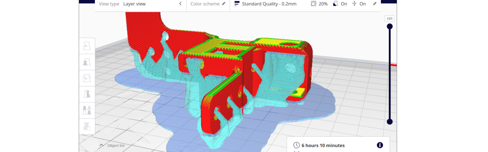
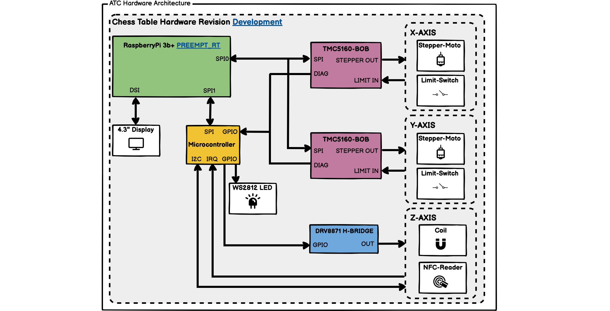
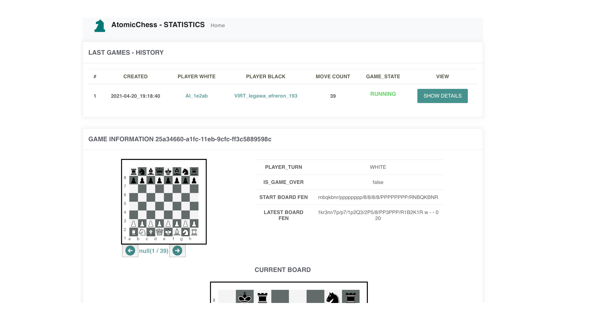

# Einleitung

## Motivation

* Beginn: Er zieht die Aufmerksamkeit des Lesers durch die Schilderung des Ereignisses auf sich, das zu dem Problem geführt hat.
* Hintergrundinformationen (Herstellung des Kontexts): Gehe tiefer auf das Ereignis ein, indem du mehr Informationen über es vermittelst und dabei auch den Rahmen deiner Forschung skizzierst.
* Brücke zur Problemstellung: Erläutere, inwiefern es sich hierbei um ein Problem handelt, und schlage somit die Brücke zur Problemstellung, die deiner Untersuchung zu Grunde liegt.

## Zielsetzung

Das Ziel dieser Arbeit ist es, einen autonomen Schachtisch zu entwickeln, welcher in der Lage ist Schachfiguren autonom zu bewegen und auf Benutzerinteraktion zu reagieren.
Der Schwerpunkt liegt dabei insbesondere auf der Programmierung des eingebetteten Systems und dem Zusammenspiel von diesem mit einem aus dem Internet erreichbaren Servers, welcher als Vermittlungsstelle zwischen verschiedenen Schachtischen und anderen Endgeräten dient.
Dieses besteht zum einem aus der Positionserkennung und Steuerung der Hardwarekomponenten (Schachfiguren) und zum anderen aus der Kommunikation zwischen dem Tisch selbst und einem in einer Cloud befindlichem Server.
Mittels der Programmierung werden diverse Technologien von verschiedenen Einzelsystemen zu einem Gesamtprodukt zusammengesetzt.

## Methodik

Im ersten Abschnitt werden die zum Zeitpunkt existierenden Ansätze und deren Umsetzung beleuchtet.
Anschliessend werden die zuvor verwendeten Technologien betrachtet, welche bei bei den beiden darauffolgenden Prototypen verwendet wurden.

Das sechste Kapitel widmet sich der realisierung des erste Protoypen des autonomen Schachtischs. Dabei werden alle 
Im anschliessenden Kapitel, wird auf der Basis des ersten Prototyps und seiner auftretenden Probleme, der finale Prototyp entwickelt.
Hier werden die Probleme durch ein re-design und vereinfachung der Elektronik gelößt und so ein zufriedenstellendes Produkt entwickelt.

Im darauffolgenden Abschnitt wird die Cloud-Infrastruktur thematisiert, welche für eine Kommunikation zwischen den Prototypen entscheidend ist.

* controller software
* fazit

# Analyse bestehender Systeme und Machbarkeitsanalyse

## Existierende Systeme im Vergleich

* Nischenprodukt, jedoch einige Projekte im OpenSource bereich verfügbar
* Ein kommerzieller Hersteller

### Kommerzielle Produkte

: Auflistung kommerzieller autonomer Schachtische

|                                         	| Square Off - Kingdom [@squareoffkingdom]	| Square Off - Grand Kingdom [@squareoffgrand]		| DGT Smart Board [@dtgsmartboard]	| DGT Bluetooth Wenge [@dtgble] |
|-------------------------------------------|-------------------------------------------|---------------------------------------------------|-----------------------------------|-------------------------------|
| Erkennung Figurstellung           	    | nein (Manuell per Ausgangsposition) 		| nein (Manuell per Ausgangsposition) 				| ja                  				| ja                     		|
| Abmessungen (LxBxH)                		| 486mm x 486mm x 75mm              		| 671mm x 486mm x 75mm              				| 540mm x 540mm x 20mm 				| 540mm x 540mm x 20mm 			|
| Konnektivität                            	| Bluetooth                            		| Bluetooth                         				| Seriell           			    | Bluetooth         			|
| Automatisches Bewegen der Figuren       	| ja                                		| ja                                				| nein                 				| nein                 			|
| Spiel Livestream                        	| ja                                		| ja                                				| ja                   				| ja                   			|
| Cloud anbindung (online Spiele)         	| ja (Mobiltelefon + App)      		        | ja (Mobiltelefon + App)      				        | ja (PC + App)   				    | ja (PC + App)      			|
| Parkposition für ausgeschiedene Figuren 	| nein                              		| ja                                				| nein                 				| nein                 			|
| Stand-Alone Funktionalität               	| nein (Mobiltelefon erforderlich)    		| nein (Mobiltelefon erforderlich)     				| nein (PC erforderlich)			| nein (PC erforderlich)		|   	   
| Besonderheiten                          	| Akku für 30 Spiele                    	| Akku für 15 Spiele					           	| - 								| -								|

Bei den DGT-Schachbrettern ist zu beachten, dass diese die Schachfiguren nicht autonom bewegen können. Sie wurden jedoch in die Liste aufgenommen, da diese einen Teil der Funktionalitäten der Square Off Schachbrettern abdecken und lediglich die automatische Bewegung der Schachfiguren fehlt.
Die DGT-Bretter können die Position der Figuren erkennen und ermöglichen so auch Spiele über das Internet; diese können sie auch als Livestream anbieten.
Bei Schachturnieren werden diese für die Übertragung der Partien sowie die Aufzeichnung der Spielzüge verwendet und bieten Support für den Anschluss von weiterer Peripherien wie z.B. Schachuhren.

Somit gibt es zum Zeitpunkt der Recherche nur einen Hersteller von autonomen Schachbrettern, welcher auch die Figuren bewegen kann.

### Open-Source Projekte

Bei allen Open-Source Projekten wurden die Features anhand der Beschreibung und der aktuellen Software extrahiert.
Besonders bei work-in-progress Projekten können sich die Features noch verändern und so weitere Funktionalitäten hinzugefügt werden.

Zusätzlich zu den genannten Projekten sind weitere derartige Projekte verfügbar; in der Tabelle wurde nur jene aufgelistet, welche sich von anderen Projekten in mindestens einem Feature unterscheiden.

Auch existieren weitere Abwandlungen von autonomen Schachbrettern, bei welchem die Figuren von oberhalb des Spielbretts gegriffen bzw. bewegt werden. In einigen Projekten wird dies mittels eines Industrie-Roboters [@actprojectrobot] oder eines modifizierten 3D-Druckers[@atcproject3dprinter] realisiert. Diese wurden hier aufgrund der Mechanik, welche über dem Spielbrett montiert werden muss, nicht berücksichtigt.

: Auflistung von Open-Source Schachtisch Projekten

|                                         		| Automated Chess Board (Michael Guerero) [@actproject1]| Automated Chess Board (Akash Ravichandran) [@actproject2]	| DIY Super Smart Chessboard [@actproject3]	|
|---------------------------------------------	|-------------------------------------------------------|----------------------------------------------------------	|------------------------------------------	|
| Erkennung Figurstellung              	        | nein (Manuell per Ausgangsposition)     				| ja (Kamera / OpenCV)                       				| nein                       				|
| Abmessungen (LxBxH)                			| keine Angabe                            				| keine Angabe                               				| 450mm x 300mm x 50mm       				|
| Konnektivität                           		| (+usb)                                   				| (+wlan)                           				        | (+wlan)          			            	|
| Automatisches Bewegen der Figuren       		| ja                                      				| ja                                         				| nein                       				|
| Spiel Livestream                        		| nein                                    				| nein                                       				| nein                       				|
| Cloud anbindung (online Spiele)         		| nein                                    				| nein                                       				| ja                         				|
| Parkposition für ausgeschiedene Figuren 		| nein                                    				| nein                                       				| nein                       				|
| Stand-Alone Funktionalität              		| nein (PC erforderlich)                   				| ja                                         				| ja                         				|
| Besonderheiten                          		| -                                       				| Sprachsteuerung (Amazon Alexa)             				| Zuganzeige über LED Matrix 				|
| Lizenz                                 		| (+gpl) 3+                                				| (+gpl)                                       				| -                          				|

In den bestehenden Projekten ist zu erkennen, dass ein autonomer Schachtisch sehr einfach und mit simplen Mittel konstruiert werden kann. Hierbei fehlen in der Regel einige Features, wie das automatische Erkennen von Figuren oder das Spielen über das Internet.

Einige Projekte setzten dabei auf eingebettete Systeme, welche direkt im Schachtisch montiert sind, andere hingegen nutzen einen externen PC, welcher die Steuerbefehle an die Elektronik sendet.

Bei der Konstruktion der Mechanik und der Methode mit welcher die Figuren über das Feld bewegt werden ähneln sich jedoch die meisten dieser Projekte. Hier wird in der Regel eine einfache X- und Y-Achse verwendet, welche von zwei Schrittmotoren bewegt werden.
Die Schachfiguren werden dabei mittels eines Elektromagneten über die Oberseite gezogen. Hierbei ist ein Magnet oder eine kleine Metallplatte in den Fuß der Figuren eingelassen worden.

Die Erkennung der Schachfiguren ist augenscheinlich die schwierigste Aufgabe. Hier wurde in der Mehrzahl der Projekte eine Kamera im Zusammenspiel mit einer auf OpenCV basierenden Figur-Erkennung verwendet.
Diese Variante ist je nach Implementierung des Vision-Algorithmus fehleranfälliger bei sich ändernden Lichtverhältnissen, auch muss die Kamera oberhalb der Schachfiguren platziert werden, wenn kein transparentes Schachfeld verwendet werden soll.

Eine weitere Alternative ist die Verwendung einer Matrix aus Reed-Schaltern oder Halleffekt-Sensoren. Diese werden in einer 8x8 Matrix Konfiguration unterhalb der Platte montiert und reagieren auf die Magnete in den Figuren. So ist es möglich zu erkennen, welches der Schachfelder belegt ist, jedoch nicht konkret von welchem Figurtypen.
Dieses Problem wird durch eine definierte Ausgangsstellung beim Spielstart gelöst. Nach jedem Zug durch den Spieler und der dadurch resultierenden Änderungen in der Figurpositionen in der Matrix können die neuen Figurstellungen berechnet werden.

## User Experience

Ein wichtiger Aspekt bei diesem Projekt stellt die User-Experience dar. Diese beschreibt die Ergonomie der Mensch-Maschine-Interaktion und wird durch die DIN 9241[@din9241] beschrieben.
Hierbei geht es primär um das Erlebnis, welches der Benutzer bei dem Verwenden eines Produktes erlebt und welche Erwartungen der Benutzer an die Verwendung des Produktes hat.

Bei dem autonomen Schachtisch, soll der Benutzer eine ähnlich authentische Erfahrung erleben wie bei einer Schachpartie mit einem menschlichen Gegenspieler.
Der Benutzer soll direkt nach dem Einschalten des Tisches und dem Aufstellen der Figuren in der Lage sein, mit dem Spiel beginnen zu können. Dies soll wie ein reguläres Schachspiel ablaufen; der Spieler vor dem Tisch soll die Figuren mit der Hand bewegen können und der Tisch soll den Gegenspieler darstellen.
Dieser bewegt die Figuren der Gegenseite.

Nach Beendigung einer Partie, soll das Spielbrett wieder in die Ausgangssituation gebracht werden; dies kann zum einem vom Tisch selbst oder vom Benutzer manuell geschehen.
Danach ist der Tisch für die nächste Partie bereit, welche einfach per Knopfdruck gestartet werden können sollte.

Dies soll auf für abgebrochene Spiele gelten, welche von Benutzer oder durch das System abgebrochen werden. Hierbei soll das Schachbrett sich ebenfalls selbständig zurücksetzten können.

Ein weiter Punkt welcher bei der User-Experience beachtet werden soll, ist die zeitliche Konstante. Ein Spiel auf einem normalen Schachspiel hat je nach Spielart kein Zeitlimit, dies kann für das gesamte Spiel gelten oder auch für die Zeit zwischen einzelnen Zügen.
Der autonome Schachtisch soll es dem Spieler z.B. ermöglichen ein Spiel am Morgen zu beginnen und dieses erst am nächsten Tag fortzusetzen.

Auch muss sich hier die Frage gestellt werden, was mit den ausgeschiedenen Figuren geschieht. Bei den autonomen Schachbrettern von Square Off[@squareoffgrand], werden die Figuren an die Seite auf vordefinierte Felder bewegt und können so wieder bei der nächsten Partie vom System aufgestellt werden. Viele andere Projekte schieben die Figuren auf dem Feld heraus, können diese aber im Anschluss nicht mehr gezielt in das Feld zurückholen. So muss diese Aufgabe vom Benutzer geschehen. Auch wir diese Funktionalität von einigen Projekten nicht abgedeckt und der Benutzer muss die Figuren selbständig vom Feld entfernen.

## Anforderungsanalyse
* komplettes vollweriges Produkt

: Auflistung der Anforderungen an den autonomen Schachtisch

|                                         	| autonomer Schachtisch (+atc)        	|
|-----------------------------------------	|-----------------------------------	|
| Erkennung Schachfigurstellung           	| ja                                 	|
| Konnektivität                           	| (+wlan), (+usb)                   	|
| Automatisches Bewegen der Figuren       	| ja                                	|
| Spiel Livestream                        	| ja                                	|
| Cloud anbindung (online Spiele)         	| ja                                	|
| Parkposition für ausgeschiedene Figuren 	| ja                                	|
| Stand-Alone Funktionalität              	| ja (Bedienung direkt am Tisch)    	|
| Besonderheiten                          	| visuelle Hinweise per Beleuchtung 	|

Die Abmessungen und das Gewicht des autonomen Schachtisches, ergeben sich aus mechanischen Umsetzung und werden hier aufgrund der zur Verfügung stehenden Materialen und fertigungstechniken nicht festgelegt.
Dennoch wird Wert darauf gelgegt, dass das Verhältnis zwischen den Spielfeldabmessungen und den Abmessungen des Tisches so gering wie möglich ausfällt. Auch müssen die Figuren für den Benutzer eine gut handhabbare Grösse aufweisen um ein angenehmes haptisches Spielerlebnis zu gewährleisten.

* abmessungen und gewicht ergeben sich aus der Umsetzung der Anforderungen

### Technologien im Makerspace

stehen diese im makerspace zur verfüfung

## Machbarkeitsanalyse

welche technologien werden benötigt
* software architektur anfoderungen
* hardware anforderungen
* grosse
* wiederholgenauigkeit
* lautstärke
* vorerfahrnung in cad ed druck und schaltungsdesign

# Grundlegende Verifikation der ausgewälten Technologien

## Erprobung Buildroot-Framework
* erstellen eines einfachen images für das embedded System
* inkl ssh Server und SFTP
* qt 5 libraries
* eigenes package atctp
* test der toolchain

## Verifikfation NFC Technologie

* warum gewählter nfc reader => ndef lesen
* reicheweiten test mit 22mm
* test mit benachbarten figuren
* warum kein RFID => keine speicherung von id auf der controller seite
* selbherstellung von eigenen figuren ohne modifikation der controllerseite

* test mit figuren nebeneinander

## Schrittmotor / Schrittmotorsteuerung
* warum => einfache ansteuerung
* keine STEP DIR somit muss embedded nicht echtzeitfähigsein und kann ggf auch andere task abbarbeiten
* TMC schrittmotortreiber spi configuration
* und goto move  => wait for move finished irw testen
* dafür einfacher python testreiber geschribene
* schrittverlust nicht zu erwarten

## 3D Druck für den mechanischen Aufbau

* PLA als FDM Filament => einfach verarbeitung und handhabung, keine Mechanische Belastbarkeit gefordert

Da es sich hier nur um einen Protoypen handelt, wurde hier auf ein einfach zu handbabendes Filament vom Typ PLA verwendet.
Dies ist besonders gut für die Prototypenendwicklung geeignet und kann mit nahezu jeden handelsüblichen (+fdm) 3D-Drucker verarbeitet werden.

* keine hohe genauigkeit, teile nicht sichtbar

Zuvor wurden einige Testdrucke durchgeführt um die Qualität der zuvor gewählten Druckparameter zu überprüfen und diese gegebenenfalls anzupassen.
Auch wurden verschiedene Calibrierobjekte gedruckt, an welchen die Toleranzen für die späteren (+cad) Zeichnungen abgeschätz werden können.

Dies betrifft vor allem die Genuigkeit der Bohrungen in den gefertigten Objekten, da hier später Bolzen und Schrauben ein nahezu spielfrei eingeführt werden müssen.
Ein Test, welcher die Machbarkeit von Gewinden zeigt wurde nicht durchgeführt, da alle Schrauben später mit der passenden Mutter gesichert werden sollen.
So soll eine Abnutzung durch häufige Montage der gedruckten Bauteile verhindert werden.

Bei dem Design der zu druckenden Bauteile wurde darauf geachtet, dass diese den Bauraum von 200x200x200mm nicht überschreiten und somit auch von einfachen (+fdm) 3D-Druckern verarbeitet werden können.

Als Software wurde der Open-Source Slicer Ultimaker Cura [@ultimakercura] verwendet, da dieser zum einen bereits fertige Konfigurationen für den verwendeten 3D-Drucker enhält und zum anderen experimentelle Features bereitstellt.

Hier wurde für die Bauteile, welche eine Sützstruktur benötigen, die von Cura bereitgestellte Tree Support Structure aktiviert. \ref{3d_print_tree_structure}
Diese bietet den Vorteil gegenüber anderen Stützstruktiren, dass sich diese leichter entfernen lässt und weniger Rückstände an den Bauteilen hinterlässt.
Diese Vorteile wurde mit verschiedenen Testdrucken verifiziert und kommen insbesondere bei komplexen Bauteilen mit innenliegenden Elementen zum tragen bei denen eine Stützstruktur erfoderlich sind.

: Verwendete 3D Druck Parameter. Temperatur nach Herstellerangaben des verwendeten PLA Filaments.

| Ender 3 Pro 0.4mm Nozzle 	| PLA  Settings 	|
|--------------------------	|---------------	|
| Layer Height             	| 0.2mm         	|
| Infill                   	| 50.00%        	|
| Wall Thickness           	| 2.0mm         	|
| Support Structure        	| Tree          	|
| Top Layers               	| 4             	|
| Bottom Layers            	| 4             	|

* Zeit für den 3D Druck Prozess spiel hier keine Rolle, da selbstbau projekt
* Parameter lassen sich weiter anpassen z.B. Layerheight auf 0.4
* finaler protoyp bietet sich abs oder pteg an

# Erstellung erster Prototyp

* proof of conzept
* 

## Mechanik

* vorgaben IKEA tisch als grundbasis => bereits fertiger grundrahmen in denen die einzelteile integriert werden können

* xy riemen führung
* spiel in Mechanik
* Einabrietung in Fusion360
* Cad design aller bauteile
* standartxy
* erweituerng des spielraums durch zwei Magnete

## Parametrisierung Schachfiguren

Da das System die auf dem Feld befindlichen Schachfiguren anhand von (+nfc) Tags erkennt, müssen diese zuerst mit Daten beschrieben werden.
Die verwendeten NXP NTAG 21 Chips, besitzen einen vom Benutzer verwendbaren Speicher von 180 Byte. Dieser kann über ein (+nfc)-Lese/Schreibgerät mit Daten verschiednster Art beschrieben und wieder ausgelesen werden.
Moderne Mobiltelefone besitzen in der Regel auch die Fähigkeit mit passenden (+nfc) Tags kommunizieren zu können; somit sind keine Stand-Alone Lesegeräte mehr notwendig.

Der Schachtisch verwendet dabei das (+ndef) Dateiformat welches Festlegt, wie die Daten auf dem (+nfc) Tag gespeichert werden. Da diesen ein Standatisiertes Format ist, können alle gängigen Lesegeräte und Chipsätze diese Datensätze lesen. Der im autonomen Schachtisch verwendete Chipsatz PN532 von NXP ist dazu ebenfalls in der Lage.

Um das (+ndef) Format verwenden zu können, müssen die (+nfc) Tags zuerst auf diese Formatiert werden. Die mesten käuflichen Tags sind bereits derart formatiert. Alternativ kann dies mittels Mobiltelefon und passender App geschehen.
Da (+ndef) Informationen über die Formatierung und der gepeicherten Einträge speichert, stehen nach der Formatierung nur noch 137 Bytes des NXP NTAG 21 zur verfügung.

Per Lesegerät können anschliessend mehrere (+ndef) Records auf den Tag geschrieben werden. Diese sind mit Dateien auf einer Festplatte vergleichbar und können verschiedenen Dateiformate und Dateigrössen annehmen.
Ein typischer Anwendungsfall ist der (+ndefrtd) URL Datensatz. Dieser kann dazu genutzt werden eine spezifizierte URL auf dem Endgeräte aufzurufen, nachdem der (+nfc) Tag gescant wurde.[@nordicnfclibndef]

Der autonome Schachtisch verwendet den einfachsten (+ndefrtd) Typ, welcher der Text-Record ist, und zum speichern von Zeichenketten genutzt werden kann, ohne das eine Aktion auf dem Endgerät ausgeführt wird.
Jeder Tag einer Schafigur, welche für den autonomen Schachtisch verwendet werden kann, besitzt diesen (+ndef) Record an der ersten Position. Alle weiteren eventuell vorhandenen Records werden vom Tisch ignoriert.[@nordicnfclib]

Um die Payload für den (+nfc) Record zu erstellen wurde ein kleine Web-Applikation erstellt, welche den Inhalt der Text-Records erstellt.
Dieser ist für jede Figur individuell und enthält den Figur-Typ und die Figur-Farbe. Das Tool untersützt auch das Speichern weiterer Attribute wie einem Figur-Index, welcher aber in der finalen Software-Version nicht genutzt wird. \ref{ATC_ChessFigureIDGenerator}

Nach dem Beschreiben eines (+nfc) Tags ist es möglich diesen gegen auslesen oder erneuten Schreiben mittels einer Read/Write-Protection zu schützen.
Diese Funktionalität wird nicht verwendet um das Kopieren von Figuren durch den Benutzer zu ermöglichen.
Somit kann dieser leicht seine eigenen Figuren erschaffen, ohne auf das Tool angewiesen zu sein. Auch ist es möglich verschiedene Figur-Sets zu mischen, so kann jeder Spieler sein eigenes Set an Figuren mit dem autonomen Schachtisch verwenden.

## Schaltungsentwurf

* auswahl der Motortreiber (leise, bus ansteuerung)
* ansteuerung pn532 und umsetzung auf uart
* platinendesign
* ansterung elektromagnetet

### Implementierung HAL

* ansteuerung des TMC5160
* ansterung des Microncontollers (PN532, LED)
* integration in controller software

## Fazit zum ersten Prototypen

* nicht für production geeignet
* aufbau und calibrierung langwiehrig
* trotzdem robustes design auf kleinem formfaktor
* verwendeten elektromagnete nicht stark genug, somit über aqusserhalb der specs betrieben was zu temeraturproblemen führte
* gewicht der Figuren zu klein bzw magnete zu start
* workarounds in der software nötig durch die beiden magnete
* nicht die beste entscheidung direkt auf grösse zu optimieren

# Erstellung zweiter Prototyp

# Modifikation der Mechanik

* dauertest hat gezeigt dass mechnik zu viel spiel aufweisst
* Motorenhalterung der y achse schränkt des bewegungsspielraum um mehr als 10cm ein, welches zu einem unwesentlichen grösseren verhältnis von Spielfeldgrösse und Abmessungen des Schachtischs
* CoreXY bietet Vorteil:
* Motoren fest am rahmen => weniger kabel + gewicht an der Y Achse
* jedoch komplexerer Aufwand der riemenverlegung so komplexere 3d bauteile
* Tischabmessungen 620x620mm dabei Bewegungsspielraum vom 580x580 zuvor nur 480x480

# Optimierungen der Spielfiguren

Die bisherigen genutzen vorgefertigten Figuren funktionierten mit dem ersten Prototyp problemlos.
Sie wiesen aber trotzdem eine zu hohe Fehleranfälligkeit, im Bezug auf das gegenseitige Beeinflussen (abstoßen,anziehen) durch die verwendeten Magnete.

Die größse der Figuren kann durch die fest definierte Feldgrösse von 55mm und der verwendeten (+nfc) Tags nicht verändert werden.
Nach vielen Testdurchläufen mit dem ersten Prototyp war zu erkennen, dass sich die Figuren je nach aktueller Situation auf dem Spielfeld immernoch magnetisch anziehen.
Dies führt je nach Spielverlauf zu Komplikationen, sodass die Figuren manuell wieder mittig auf den Felder platziert werden müssen.

Um dies zu verhindern, wurde einige Figuren zusätzlich mit einer 20mm Unterlegscheibe am Boden versehen, welche diese Problem behob, jedoch das (+nfc) Tag nicht mehr als lesbar erwies.
Dies resultierte in der Idee die Schachfiguren ebenfalls selbst mit dem 3D-Drucker herzustellen und die Magnete direkt in den Boden der Figur einlassen zu können.

Die aktuell verwendeten Figuren des ersten Protoyp wiegen 8 Gramm für die Bauern und 10 Gramm für die restlichen Figuren.
Der Test mit der Unterlegscheibe ergab, dass diese mit 4 Gramm genug Gewicht hinzufügte um die magnetische Beeinflussung zu unterbinden.

Testweise wurden eingie Figuren mittels 3D Drucker erstellt um so das Gewicht zu erhöhen.
Nach einem erfolgreichen Test wurde das (+cad) Modell wurde so angepasst, dass sich der Magnet direkt in den Boden der Figure einkleben lässt.
Desweiteren wurden bei den Bauern (den leichtesten) Figuren die Magnete ausgetauscht. Die zuerst verwendeten 10x3mm Neodym-Magnete wurden bei diesen Figuren gegen 6x3mm Magnete getauscht.
Somit sind im Design zwei verschiedenen Arten von Magneten notwendig, jedoch traten in den anschliessend durchgeführten Testläufen keine Beeinflussungen mehr statt.

* komplett 3d gedruckte Figuren mit integrierten Magnet 
* nfc + filzgleiter
* durch SLA druck höheres Gewicht somit kein Abstoßen von den anderen Figuren mehr
* verschiedene Magnetgrässe/Stärke für Bauern/andere Figuren

* jedoch alte figuren weiter verwendbar und austausch / vermischbar

# Änderungen der Elektronik

* verwenung von standarthardware, welche gut zu beschaffen ist
* implementierung von standart gcode protokol, somit mit universell verwendbaren steuerung verwendbar
* bietet eine hohe flexibilität da nur ein minimales set von Gcode-kommandos vorrausgesetzt wird

## IMPLEMENTIERUNG GCODE-Sender

* was ist GCODE
* grundlegend verwendete Kommandos G0 G28 G21 G90 M280
* erweiterte optionale Kommandos M150 M502 M500 M92
* anhand der hwid und existenz der serial interfaces wird entschieden gcode hardware zu laden
*

## Fazit zum finalen Prototypen

* modularer hardware aufbau
* einfach/gut verfügbare materialien verwendet
* geänderte Mechnik resultiert in nahezu Spielfreier Mechanik (+- 1mm), welches für diesen Zweck mehr als ausreicht
* 6h dauertest bestanden

# Entwicklung der Cloud Infrastruktur

Die erste Phase der Entwicklung des Systems bestand in der Entwicklung der Cloud-Infrastruktur und der darauf laufenden Services.
Hierbei stellt die "Cloud", einen Server dar, welcher aus dem Internet über eine feste IPv4 und eine IPv6 verfügt und frei konfiguriert werden kann.

## API Design

Das System soll so ausgelegt werden, dass es im späteren Zeitpunkt mit verschiedenen Client-Devices mit diesem kommunizieren können.
Dazu zählen zum einen der autonome Schachtisch, aber z.B. auch einen Web-Client, welcher die Funktionalität eines Schachtisch im Browser abbilden kann.
Hierzu muss das System eine einheitliche (+rest)-Schnittstelle bereitstellen.

Eine RESTful API bezeichnet eine API welche HTTP-Requests verwendet um auf Daten zugreifen zu können.

* grafik
* 5 requirements

Die RESTful API stellt verschiedene Ressourcen bereit, welche durch eine URI \ref{ATC_URI_SCHEMES} eindeutig identifizierbar sind.
Auf diese können mittels verschiedenster HTTP Anfragemethoden (GET, POST, PUT, DELETE) zugegriffen werden. Jeder dieser Methoden stellt einen anderen Zugriff auf die Ressource dar und beeinflusst somit das Verhalten und die Rückantwort dieser.

Eine URI besteht dabei aus mehreren Teilen. Das Schema  gibt an wie die nachfolgenden Teile interpretiert werden sollen.
Dabei wird bei einer RESTful Schnittstelle typischerweise das (+http) Protokoll, sowie (+https) verwendet. Dabei steht (+https) für eine verschlüsselte Verbindung. Desweiteren gibt es viele andere Schema, wie z.B (+ftp) welches

Somit stellt die RESTful API eine Interoperabilität zwischen verschiedenen Anwendungen und Systemen bereit, welche durch ein Netzwerk miteinander verbunden sind.
Dieser Ansatz ist somit geeignet um die verschiedenen Client Systeme (Schachtisch, Webclient) eine Kommunikation mit dem Server zu erlauben.

## Service Architektur

* was ist ein Service
* microservice ansatz
* Kapselung der Schach spiel spzifischen funktionaliutäten
* verwendung von NoSQL Datenbanken somit müssen tabellen nicht spzeill auf Schach spezifische felder ausgelegt sein
* statelss
Diese stellen alle wichtigen Funktionen zum Betrieb des autonomen Schachtischs zur verfügung.

### Vorüberlegungen

* welche funktionalitäten müssen abgedeckt werden
* client aktivitendiagram

### Backend

* matchmaking schachlogik
* zentraler zugriffspunkt auf das System und stellt diese abi bereit
* stellt spielerprofile aus datenbanken bereit bereit
* authentifizierung der clients und deren sessions
* weiterleitung der von spielerinteraktionen an move validator
* spielfelder werden als string übermittelt = hier fen representation; einfach zu parsen; standart

### MoveValidator

Der MoveValidator-Service bildet im System die eigentliche Schachlogik ab.
Die Aufgabe ist es, die vom Benutzer eingegebenen Züge auf Richtigkeit zu überprüfen und auf daraufhin neuen Spiel-Status zurückzugeben.
Dazu zählen unter anderem das neue Schachbrett und ob ein Spieler gewonnen oder verloren hat.

Bevor ein Spiel begonnen wird, generiert der MoveValidator das initiale Spielfeld und bestimmt den Spieler, welcher als erstes am Zug ist.

* Beispiel request/repsonse

Der Backend-Service fragt einen neues Spiel an oder übergibt einen Schachzug inkl. des Spielbretts an den Service. Der Response wird dann vom Backend in der Datenbank gespeichert und weiter an die Client-Devices verteilt.

Mit diesem Design ist es möglich, auch andere Spielarten im System zu implementieren, nur hier die initialen Spielfelder generiert werden und Züge der Spieler validiert werden müssen.

Allgemein geschieht die Kommunikation über drei API Calls.

* Auflistung der routen

* generiter neues brett
* python chess packge welche pesudo legal moves generiert
* beispiel Requests

## Entwicklung Webclient

Der Webclient wurde primär dazu entwickelt um das System während der Entwicklung zu testen.
Dieser simuliert einen autonomen Schachtisch und verwendet dabei die gleichen (+http) Requests.
Dieser wurde dabei komplett in (+js) umgesetzt im Zusammenspiel mit (+html) und (+css) und ist somit komplett im Browser lauffähig.

Ausgeliefert werden die statischen Dateien zur Einfachheit durch den Backend-Service.
* express router
* public folder
* techstack js
* backend zu testen
* menschliche spieler zu simulieren
* wärend der entwicklungsphase des tisches gezielt spiele simulieren zu können
* liefert auch statistiken
* wird zur einfachheit direkt aus dem abckend heraus ausgeliefert da nur statisches html/js/class

Während der Implementierung wurde der Webclient weiter ausgebaut und es wurde weitere Features ergänzt.
Dazu zählt zum einen eine Übersicht über vergangene und aktuell laufende Spiele. In dieser können Spiele Zug um Zug nachvollzogen werden und weitere Information über den Spielstatus angezeigt werden.\ref{ATC_statistics}
Auch ist es möglich aktuell laufende Spiele in Echtzeit anzeigen zu lassen, somit wurde eine Livestream-Funktionaliät implementiert.

### AutoPlayer

Der AutoPlayer-Service stellt den Computerspieler bereit.
Jede Service-Instanz stellt einen virtuellen Spieler bereit, welcher die gleiche Schnittstellen wie der Webclient oder der autonme Schachtisch verwendet.
Die einzige Änderung an den verwendeten (+rest)-Calls ist der Login-Requst. Hier wird das `playertype` Flag gesetzt welches den Spieler als Computerspieler gegenüber des Systems authentifiziert.
Somit wird dieser wärend des Matchmaking-Prozesses erst für ein Match ausgewählt, wenn kein anderer Spieler mehr zur Verfügung steht, welcher vom Typ Webclient oder autonomer Schachtisch ist.
Somit ist gewährleistet, dass immer zuerst die Menschlichen-Spieler ein Spiel beginnen.

Eine weitere Modifikation ist die verwendung einer Schach-AI, da dieser Service als Computerspieler agieren soll. 
Hierzu kam die Open-Source Chess Engine Stockfish[@stockfish] in der Version 11 zum Einsatz.
Die Stockfish-Engine bietet noch weitere Features, als nur die nöchst besten Züge zu einem gegebenen Schachbrett zu ermitteln.
Sie kann auch genutzt werden um Züge zu klassifizieren und bietet Analysemöglichkeiten für Spielstellungen.

Die AutoPlayer-Instanz kommuniziert über das (+uci) Protokoll[@uciprotocol] mit der Executable der Stockfish-Engine.
Dieses Protokoll wird in der Regel von Schach-Engines um mit einer (+gui) zu Kommunizieren und die Kommunikation erfolgt über Klartextbefehle.
Um das aktuelle Spielbrett in der Engine zu setzten wird dieses in der (+fen) Notation mit dem Prefix `position fen ` als Klartext an die Engine übergben.

Im Kontext des AutoPlayer-Service wird der Engine nur das aktuelle Spielbrett übermittelt und der nächst beste Zug ausgelsen.
Dies wird Ausgeführt, wenn der AutoPlayer am Zug ist. Nachdem die Engine einen passenden Zug gefunden hat, wird das Ergebnis über den `make_move` (+rest)-API Call übermittelt. 

Wenn das Match beendet wird, beendet sich auch die Service-Instanz.
Diese wird jedoch wieder gestartet wenn die Anzahl der zur Verfügung stehenden Computerspieler unter einen definierten Wert fallen. 
Somit ist dafür gesorgt, dass das System nicht mit ungenutzen AutoPlayer-Instanzen gebremst wird.
Diese Anzahl \ref{ai_player_count} ist in der Backend-Configuration frei wählbar und kann je nach zu erwartenen Aufkommen angepasst werden.

Allgemein skaliert das System durch diese Art der Ressourcenverwaltung auch auf kleinen Systemen sehr flexibel.
Durch die Art der Implementierung, dass sich der AutoPlayer-Service wie ein normaler Spieler verhält, sind auch andere Arten des Computerspieler möglich.
So ist es zum Beispiel möglich, die Spielstärke je Spieler anzupassen oder einen Computerspieler zu erstellen, welcher nur zufällige Züge zieht.

Ein weiterer Anwendungsfall für den AutoPlayer-Service, ist das Testen des weiteren Systems insbesondere des Backend-Service.
Durch das Matching von zwei AutoPlayer-Instanzen, können automatisierte test Schachpartien ausgeführt werden um die Funktionsfähigkeit des restlichen Systems zu testen.
Diese Feature wurde insbesondere bei der Entwicklung des Webclienten und der Steuerungssoftware für den autonomen Schachtisch verwendet.

## Authetifizierung

* authetifizierung
* https only
* Zertifikate auf Clientseite geniert jedoch nicht Abgefragt

# Embedded System Software

* Hauptsoftware zur Steuerung der Elektrik/Mechanik
* Kommunikation mit dem Cloud-Server

## Ablaufdiagramm

* dummer Client
* Synchronisierung von gegeben Schachfeld mit dem lokalen Schachfeld

* vier Schritte (enfernen, bewegen, hinzufügen, bewegen)

## Figur Bewegungspfadberechnung

* Algorithmus zur Umsetzung eines Schachzugs
* Auftrennung in current und target Board

## Schachfeld Scan Algorithmus zur Erkennung von Schachzügen

* Benutzer bestätigt dass er Schachzug gemacht hat
* Ermittlung des getätigten Schachzug 
* Scan der Schachfeld-Veränderungen, durch Vergleich des vorherigen Schachfelds und der möglichen Züge

## Userinterface

* QT Quick UI, als Package in Buildroot integriert
* IPC Bibliothek zur Kommunikation mit der controller-Software Instanz
* JSON basiert => einfaches Debugging
* Steuerung über andere Endgeräte möglich z.B Handy-App welche im selben Netzwerk befindet.

# Fazit

* mit am weitesten forgeschrittener open-source autonomes Schachtisch Projekt

## Ausblick

* Einbindung in existeirende Schach-Clouds  z.B. https://lichess.org/
* user-port für Erweiterungen (z.B. DGT Schachur)