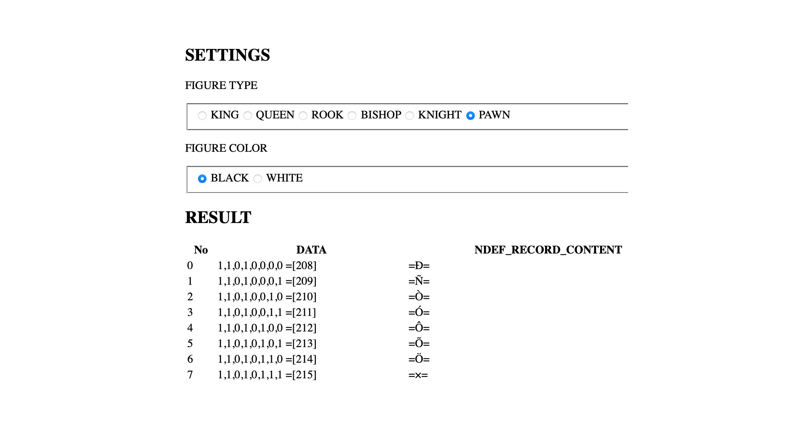
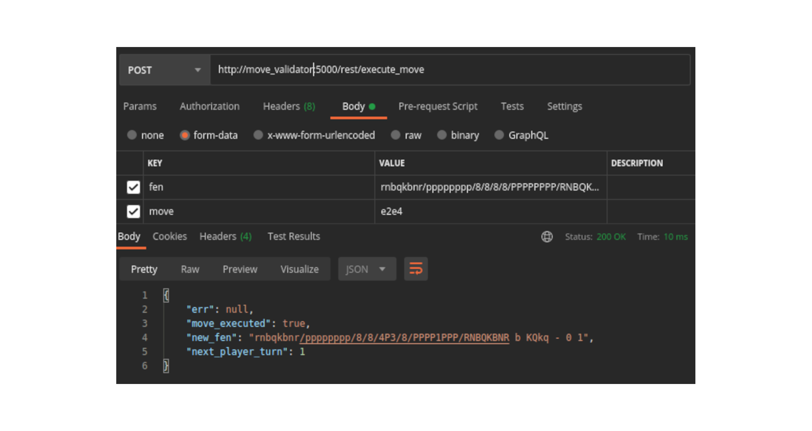
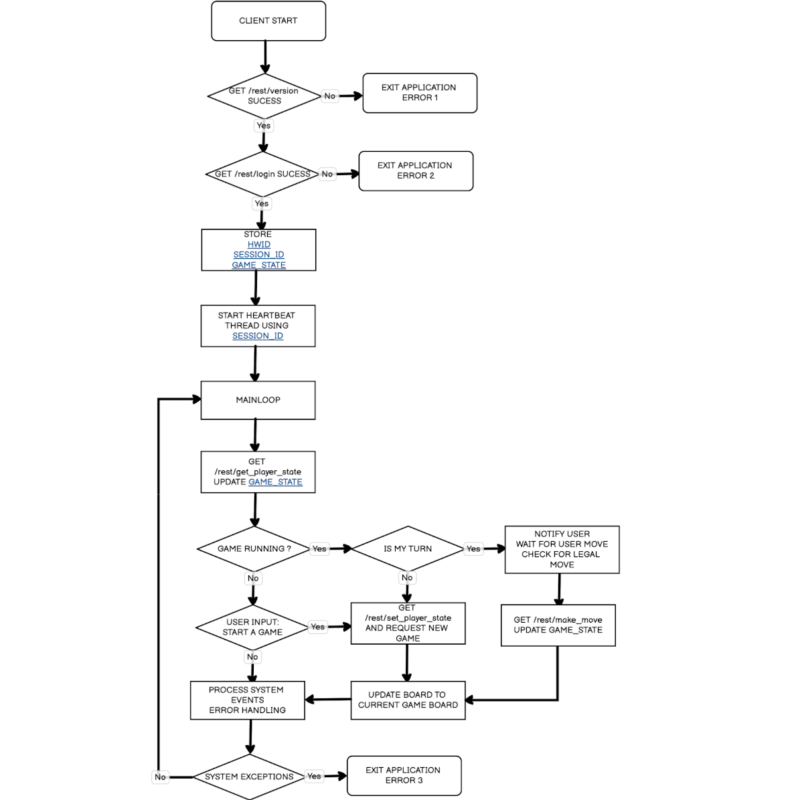

# Einleitung

## Motivation


Eingebettete Systeme (Englisch "embedded Systems") sind technische Zusammensetzungen, welche für eine spezifische Funktion entwickelt werden. Im Gegensatz zu Mehrzwecksystemen (Englisch "multi-purpose systems"), wie zum Beispiel einem Personal Computer, welcher in der Lage ist, diverse Funktionen auszuführen und nicht zwingend an eine Funktion gebunden ist, dienen eingebettete Systeme einer bestimmten Logik. Daraus resultieren simplere und auch Ressourcen-sparendere Systeme, die wesentlich näher an der Technik und der für den Zweck nötigen Komponenten und Software entwickelt werden. Systeme können günstiger zusammengesetzt und Fehlerquellen schneller entdeckt und behoben werden. Nicht für den Prozess notwendige Komponenten werden gar nicht erst verwendet. Bei einem Mehrzwecksystem wird akzeptiert, dass Komponenten und Schnittstellen existieren, die nicht benötigt werden. Diese verursachen Kosten und können mögliche Fehlerquellen sein.

<br>

Dennoch ist die Entwicklung eines solchen Systems nicht banal. Es ist abzuwägen, welche Komponenten derzeit auf dem freien Markt erhältlich sind, welche Eigenschaften diese mitbringen oder ermöglichen und wie diese optimal kombiniert werden können. Es bedarf im Vorhinein intensiverer Recherche und einer größeren Perspektive über mögliche Zusammenhänge. Im Falle eines Merhzwecksystems ist die Auswahl simpler, da man den Prozess auch im Nachhinein noch anpassen kann, da zusätzliche Funktionen und Komponenten gegeben sind oder leichter ergänzt werden können. Das eingebettete System muss in der Regel aufgewertet oder sogar völlig ersetzt werden, wenn zu einem späteren Zeitpunkt festgestellt wird, dass Funktionen nicht gegeben oder umsetzbar sind. Fertiggestellte Systeme sind komplexer in der Aufwertung.

<br>

Die Fähigkeit zur Erstellung eines solchen System ist daher nicht leichtfertig anzunehmen und es ist mir wichtig, zum Abschluss meines Studiums mein gewonnenes Wissen über Systeme, Komponenten, Zusammenhänge und deren Verbindung bis hin zur Programmierung nachzuweisen. Die Auswahl eines fertigen Computers oder sogar das simple Nutzen existierender Betriebssysteme erweckt nicht den gleichen Reiz, wie es die eigene Erstellung dieser Komponenten auf mich hat. Ich halte es für essenziell, möglichst fachlich die Inhalte meines Studiums in Verbindung mit meinen Vorlieben zu bringen, um ein optimales Projekt zu erstellen.

<br>

Die Erstellung eines autonomen Schachtischs vereinbart in meinen Augen im großen Umfang die wesentlichen Komponenten des Informatikstudiums mit meiner Vorliebe zur mechanisch-elektrischen Gestaltung. Angefangen mit den Grundlagen der Informatik, insbesondere mit technischem Bezug, über die Berechnung und Auslegung von Systemkomponenten, zudem die objektorientierte Projektplanung und Architektur von Systemen bis hin zu Datenbanken und Webtechnologien und Softwareenentwicklung. Zudem wird mein Studienschwerpunkt, die technische Informatik, mit einem einbetteten System manifestiert.

<br>

Der Reiz im Schachprojekt liegt in der Bedeutung und der Seltenheit. Schach ist ein bewährtes, ausnahmslos bekanntes und immer logisches Spiel, welches jedoch im kommerziellen Rahmen nie an Bedeutung gewonnen hat. Die Auswahl der verfügbare elektrifizierte und programmgesteuerte Schachtisch ist auffallend gering; zudem sind existierende Lösungen oftmals nicht erschwinglich und bedürfen erhebliche Anpassungen des Spielers an das Spiel.
Innerhalb der vergangenen drei Jahrzehnte bewiesen sich immer mehr Konzerne ihre technische Kompetenz und Überlegenheit und die Fähigkeit ihrer Maschinen mittels der Auswertung von Schachalgorithmen und dem möglichst schnellen besiegen derzeitiger Schach-Meister und -Meisterinnen. Die Algorithmen stehen heute in einer Vielzahl frei zugänglich zur Verfügung, jedoch ist das Interesse daran, für Spieler mögliche Anwendungen zu generieren, verschwindend gering und wird oftmals nur von Experten und Enthusiasten genutzt und auch hinterfragt. 

<br>

Mit dieser Arbeit möchte ich mich diesem Problem stellen und einen möglich günstigen Tisch entwickeln, welcher das Spielerlebnis ohne Einschränkungen dem Spieler transferiert. Zudem möchte ich gewonnene Erkenntnisse und aktuelle Ressourcen wie die Cloud-Infrastruktur einbinden, um das Schachspiel, welches zweier Spieler bedarf, für einen Spieler zu ermöglichen. Das Ergebnis soll nicht nur viele Zeilen Code sein, sondern auch ein handfestes Produkt, dass meine Qualitäten und Enthusiasmus widerspiegeln. 

<br>
    

## Zielsetzung

Das Ziel der nachfolgenden Arbeit ist es, einen autonomen Schachtisch zu entwickeln, welcher in der Lage ist, Schachfiguren autonom zu bewegen und auf Benutzerinteraktionen zu reagieren.

<br>

Der Schwerpunkt liegt dabei insbesondere auf der Programmierung des eingebetteten Systems und dem Zusammenspiel von diesem mit einem aus dem Internet erreichbaren Servers, welcher als Vermittlungsstelle zwischen verschiedenen Schachtischen und anderen Endgeräten dient.
Dieses besteht zum einem aus der Positionserkennung und Steuerung der Hardwarekomponenten (Schachfiguren) und zum anderen aus der Kommunikation zwischen dem Tisch selbst und einem in einer Cloud befindlichem Server.
Mittels der Programmierung werden diverse Technologien von verschiedenen Einzelsystemen zu einem Gesamtprodukt zusammengesetzt.
Insgesamt gilt es, einen für Anwender ansprechenden Schachtisch zu entwickeln, der das Spielerlebnis nicht nur originalgetreu widerspiegelt, sondern das Einzelspieler-Modell zusätzlich noch verbessert.

<br>

## Methodik

Im ersten Abschnitt werden die zum Zeitpunkt existierenden Ansätze und deren Umsetzung beleuchtet. Hier wurde insbesondere darauf geachtet, die Grenzen bestehender Systeme darzulegen und auf nur für dieses Projekt zutreffende Funktionen zu vergleichen. 
Anschließend werden die zuvor verwendeten Technologien betrachtet, welche bei den beiden darauffolgenden Prototypen verwendet wurden. Hierbei stehen insbesondere solche Technologien im Vordergrund der Untersuchung, welche möglichst einfach zu beschaffen sind und optimaler Weise uneingeschränkt und lizenzunabhängig zur Verfügung stehen.

<br>

Das sechste Kapitel widmet sich der Realisierung eines ersten Prototyps des autonomen Schachtischs.
Hier werden die Erkenntnisse der zuvor evaluierten Technologien verwendet, um ein Modell zu entwickeln, welches den im ersten Abschnitt erarbeiteten Vorgaben entspricht. Der nach der Implementierung durchgeführte Dauertest soll zudem weitere Risiken, mögliche Probleme und Fehlerquellen aufdecken.

<br>

Im anschließenden Kapitel wird auf der Basis des ersten Prototypens und dessen im Betrieb verzeichneten Probleme der finale Prototyp entwickelt.

<br>

Hier werden die Schwierigkeiten durch die Vereinfachung der Elektronik sowie der Mechanik gelöst.
Die Zuverlässigkeit wurde mittels stetiger Testläufe mit kontrollierten Schachzug-Szenarien überwacht und so ein produktreifer Prototyp entwickelt.

<br>

Im darauffolgenden Abschnitt wird die Cloud-Infrastruktur thematisiert, welche für eine Kommunikation zwischen den autonomen Schachtischen entscheidend ist.
Auch wird dabei die Software, welche auf dem eingebetteten System ausgeführt wird, im Detail beschrieben und deren Kommunikation mit der Cloud-Infrastruktur, sowie mit den elektrischen Komponenten beleuchtet.

<br>


# Analyse bestehender Systeme und Machbarkeitsanalyse

## Existierende Systeme im Vergleich

Im Folgenden werden vier kommerzielle und drei lizenzunabhängige (Open-Source) Schachtische miteinander verglichen.
Bei den ausgewählten Tischen handelt es sich um

- Square Off - Kingdome
- Square Off - Grand Kingdom
- DGT Smartboard
- DGT Bluetooth Wenge
- Automated Chessboard (Michael Guerero)
- Automated Chessboard (Akash Ravichandran)
- DIY Super Smart Chessboard

<br>

Für die kommerziell käuflichen Schachspiele gibt es kein sehr großes Marktangebot, weswegen für den Vergleich nur zwei Hersteller mit jeweils zwei verschiedenen Modellen gewählt werden konnte. Derzeit integriert nur ein Unternehmen eine Funktion, welche die Figuren unterhalb der Tischplatte mechanisch bewegen kann. Der zweite Hersteller wurde dennoch zum Vergleich der zusätzlichen Funktionen herangezogen. 

<br>

Die Tische eines Herstellers unterscheiden sich kaum in ihren Funktionen; mit steigendem Preis werden zusätzliche Funktionen in Form von Sensoren oder Verbindungsoptionen implementiert.

<br>

Das Angebot lizenzfreier Produkte hingegen ist signifikanter, jedoch sind die einzelnen Modelle oftmals Kopien oder Revisionen voneinander. Die möglichen Funktionen unterscheiden sich daher kaum. Für die hier dargestellte Übersicht wurden drei Modelle gewählt, welche in ihren Funktionen signifikante Auffälligkeiten und einen hohen Stellenwert und Bekanntheitsgrad aufweisen.
Wie bereits aus zum Teil identischen den Namen ersichtlich, streben alle Tische das gleiche Ziel an und unterscheiden sich daher nur in geringen Funktionen, was im Folgenden nun näher erläutert wird.


<br>

### Kommerzielle Produkte

<br>


: Auflistung kommerzieller autonomer Schachtische

|                                         	| Square Off - Kingdom [@squareoffkingdom]	| Square Off - Grand Kingdom [@squareoffgrand]		  | DGT Smart Board [@dtgsmartboard]	| DGT Bluetooth Wenge [@dtgble] |
|-------------------------------------------|-------------------------------------------|---------------------------------------------------|-----------------------------------|-------------------------------|
| Erkennung Figur-Stellung           	      | nein (Manuell per Ausgangsposition) 		  | nein (Manuell per Ausgangsposition) 				      | ja                  				      | ja                     		    |
| Abmessungen (LxBxH)                		    | 486mm x 486mm x 75mm              		    | 671mm x 486mm x 75mm              				        | 540mm x 540mm x 20mm 				      | 540mm x 540mm x 20mm 			    |
| Konnektivität                            	| Bluetooth                            		  | Bluetooth                         				        | Seriell           			          | Bluetooth         			      |
| Automatisches Bewegen der Figuren       	| ja                                		    | ja                                				        | nein                 				      | nein                 			    |
| Spiel Livestream                        	| ja                                		    | ja                                				        | ja                   				      | ja                   			    |
| Cloud-Anbindung (online Spiele)         	| ja (Mobiltelefon + App)      		          | ja (Mobiltelefon + App)      				              | ja (PC + App)   				          | ja (PC + App)      			      |
| Parkposition für ausgeschiedene Figuren 	| nein                              		    | ja                                				        | nein                 				      | nein                 			    |
| Stand-Alone Funktionalität               	| nein (Mobiltelefon erforderlich)    		  | nein (Mobiltelefon erforderlich)     				      | nein (PC)			                    | nein (PC)		                  |   	   
| Besonderheiten                          	| Akku für 30 Spiele                    	  | Akku für 15 Spiele					           	          | - 								                | -								              |


<br>

Die für den Vergleich gewählten Eigenschaften sind jene, welche die im Projekt angestrebten Funktionen möglichst äquivalent reflektieren. Dennoch schränkt das geringe Angebot an autonomen Tischen die Auswahl stark ein; daher wurde hierbei wertgelegt auf Automation, Cloud-Anbindung und die Abmessungen, welche das Spielerlebnis am deutlichsten beeinflussen.

<br>

Die Bretter des Herstellers DGT erkennen die Position der verwendeten Figuren; eine Auskunft, über die die verwendete Technologie erhält, man jedoch nicht. Die Square-Off-Schachtische verfügen über keine solche Funktion. 

<br>

Die Abmessungen unterscheiden sich nur beim Hersteller Square Off deutlich; der Grand Kingdom Schachtisch ist rechteckig konstruiert worden, was das Spielerlebnis deutlich verändert. Der simple Kingdom-Tisch wiederum ist kleiner als das vorgegebene Turniermaß, was ebenfalls Einfluss auf das Spielererlebnis hat. Mit den Standardmaßen der DGT-Spielbretter und zudem ihrer geringen Höhe gleichen diese deutlich einem Turniertisch. Die Kombination aus geringer Höhe und Erkennung der Figur-Stellung bei den DGT-Brettern ist auffallend. 

<br>

Alle Hersteller bieten eine Bluetooth-Schnittstelle an, einzig das Smart-Board des Herstellers DGT nutzt eine serielle, kabelgebundene Schnittstelle.

<br>

Bei den DGT-Schachbrettern ist zu beachten, dass diese die Schachfiguren nicht autonom bewegen können. Sie wurden jedoch in die Liste aufgenommen, da diese einen Teil der Funktionalitäten der Square Off Schachbrettern abdecken und lediglich die automatische Bewegung der Schachfiguren fehlt.
Die DGT-Bretter können die Position der Figuren erkennen und ermöglichen so auch Spiele über das Internet; diese können sie auch als Livestream anbieten.
Bei Schachturnieren werden diese für die Übertragung der Partien sowie die Aufzeichnung der Spielzüge verwendet und bieten Support für den Anschluss von weiterer Peripherie wie z.B. Schachuhren.

Somit gibt es zum Zeitpunkt der Recherche nur einen Hersteller von autonomen Schachbrettern, welcher auch die Figuren bewegen kann.

<br>

Ein Spiel-Livestream, eine Darstellung die aktuellen oder vergangenen Spiele über eine Webanwendung, ist mit allen Tischen möglich. Da alle Tische eine Cloud-Anbindung besitzen, in der Regel mittels Applikation auf dem Smartphone oder Computer, wird lediglich des Versetzten von Figuren detektiert und in einer Oberfläche dargestellt.

<br>

Auffallend ist, dass nur einer der ausgewählten Tische über eine Parkposition für ausgeschiedene Figuren verfügt. Der Square-Off-Grand, welche Figuren automatische verschieben kann, besitzt dank der rechteckigen Tischform die Möglichkeit, Figuren selbständig aus dem Spiel zu entfernen und bei Bedarf wieder ins Spiel zurückzuführen. 

<br>

Ebenfalls erwähnenswert ist, dass keiner der Tische eine Stand-Alone-Funktionalität besitzt. Jeder Tisch benötigt eine Verbindung zu einem externen Gerät, wie einem Smartphone oder Computer, welche die Berechnungen der Spielerzüge vornimmt. Keiner dieser Tische kann ein simples Spiel nach einem verbindungslosen Start ausführen. Ohne Internet verlieren die Tische all ihre Funktionalität. 

<br>

Beide Square-Off-Modelle verfügen zudem über die Möglichkeit des Spiels ohne Energieversorgung, welche durch eingebaute Akkus ermöglicht werden. Diese Funktionalität sorgt für eine zusätzliche Nutzerzufriedenheit.

<br>

Zusammenfassend ist festzustellen, dass alle vier Tische dank unterschiedlicher Ausführung von Spiel-Eigenschaften zu unterschiedlichen Spiel-Erlebnissen führen. Für Nutzer ist eine Entscheidung anhand von Funktionen kaum möglich; letztlich bedarf es der Auswertung von gewünschten und gegebenen Funktionen.
Das Ziel soll nun sein, all die positiven Eigenschaften dieser Tische zu vereinbaren und mittels noch zusätzlicher Verbesserungen ein eigenes Produkt zu entwickeln.

<br> 

### Open-Source Projekte

Bei allen Open-Source Projekten wurden die Eigenschaften anhand der Beschreibung und der aktuellen Software extrahiert.

<br>

Besonders bei Projekten, welche sich noch in der Entwicklung befinden, können sich die Eigenschaften noch verändern und so weitere Funktionalitäten hinzugefügt werden. Alle Eigenschaften der Projekte wurden zum Zeitpunkt der Recherche analysiert und dokumentiert und mit Beginn der Entwicklung als Struktur-Fixpunkt festgelegt. Nachfolgende Entwicklungen werden zu diesem Zeitpunkt nicht mehr berücksichtigt.

<br>

Zusätzlich zu den genannten Projekten sind weitere derartige Projekte verfügbar; in der Tabelle wurde nur jene aufgelistet, welche sich von anderen Projekten in mindestens einem Feature unterscheiden.

Auch existieren weitere Abwandlungen von autonomen Schachbrettern, bei welchem die Figuren von oberhalb des Spielbretts gegriffen bzw. bewegt werden. In einigen Projekten wird dies mittels eines Industrie-Roboters [@actprojectrobot] oder eines modifizierten 3D-Druckers[@atcproject3dprinter] realisiert. Diese wurden hier aufgrund der Mechanik, welche über dem Spielbrett montiert werden muss, nicht berücksichtigt.

: Auflistung von Open-Source Schachtisch Projekten

|                                         		  | Automated Chess Board (Michael Guerero) [@actproject1]| Automated Chess Board (Akash Ravichandran) [@actproject2]	| DIY Super Smart Chessboard [@actproject3]	|
|-----------------------------------------------|-------------------------------------------------------|----------------------------------------------------------	|------------------------------------------	|
| Erkennung Figur-Stellung              	        | nein (Manuell per Ausgangsposition)     				      | ja (Kamera / OpenCV)                       				        | nein                       				        |
| Abmessungen (LxBxH)                			      | keine Angabe                            				      | keine Angabe                               				        | 450mm x 300mm x 50mm       				        |
| Konnektivität                           		  | (+usb)                                   				      | (+wlan)                           				                | (+wlan)          			            	      |
| Automatisches Bewegen der Figuren       		  | ja                                      				      | ja                                         				        | nein                       				        |
| Spiel Livestream                        		  | nein                                    				      | nein                                       				        | nein                       				        |
| Cloud-Anbindung (online Spiele)         		  | nein                                    				      | nein                                       				        | ja                         				        |
| Parkposition für ausgeschiedene Figuren 		  | nein                                    				      | nein                                       				        | nein                       				        |
| Stand-Alone Funktionalität              		  | nein (PC erforderlich)                   				      | ja                                         				        | ja                         				        |
| Besonderheiten                          		  | -                                       				      | Sprachsteuerung (Amazon Alexa)             				        | Zuganzeige über LED Matrix 				        |
| Lizenz                                 		    | (+gpl) 3+                                				      | (+gpl)                                       				      | -                          				        |


In den bestehenden Projekten ist zu erkennen, dass ein autonomer Schachtisch sehr einfach und mit simplen Mittel konstruiert werden kann. Hierbei fehlen in der Regel einige Features, wie das automatische Erkennen von Figuren oder das Spielen über das Internet.

<br>

Einige Projekte setzten dabei auf eingebettete Systeme, welche direkt im Schachtisch montiert sind, andere hingegen nutzen einen externen PC, welcher die Steuerbefehle an die Elektronik sendet.

<br>

Bei der Konstruktion der Mechanik und der Methode, mit welcher die Figuren über das Feld bewegt werden, ähneln sich jedoch die meisten dieser Projekte. Hier wurden in der Regel einfache X- und Y-Achse verwendet, welche von je einem Schrittmotoren bewegt werden.
Die Schachfiguren werden dabei mittels eines Elektromagneten über die Oberseite gezogen. Indes ist ein Magnet oder eine kleine Metallplatte als Gegenpol in den Fuß der Figuren eingelassen worden.

<br>

Die Erkennung der Schachfiguren ist augenscheinlich die schwierigste Aufgabe. Hier wurde in der Mehrzahl der Projekte eine Kamera im Zusammenspiel mit einer auf OpenCV basierenden Figur-Erkennung verwendet.
Diese Variante ist je nach Implementierung des Vision-Algorithmus fehleranfälliger bei sich ändernden Lichtverhältnissen, auch muss die Kamera oberhalb der Schachfiguren platziert werden, wenn kein transparentes Schachfeld verwendet werden soll.

<br>

Eine weitere Alternative ist die Verwendung einer Matrix aus Reed-Schaltern oder Halleffekt-Sensoren. Diese werden in einer 8x8 Matrix Konfiguration unterhalb der Platte montiert und reagieren auf die Magnete in den Figuren. So ist es möglich zu erkennen, welches der Schachfelder belegt ist, jedoch nicht konkret von welchem Figur Typen.
Dieses Problem wird durch eine definierte Ausgangsstellung beim Spielstart gelöst. Nach jedem Zug durch den Spieler und der dadurch resultierenden Änderungen in der Figur Positionen in der Matrix können die neuen Figur Stellungen berechnet werden.

<br>


## User Experience

Ein wichtiger Aspekt bei diesem Projekt stellt die User-Experience dar. Diese beschreibt die Ergonomie der Mensch-Maschine-Interaktion und wird durch die DIN 9241[@din9241] beschrieben.
Darin geht es primär um das Erlebnis, welches der Benutzer bei dem Verwenden eines Produktes erlebt und welche Erwartungen der Benutzer an die Verwendung des Produktes hat.

<br>

Bei dem autonomen Schachtisch soll der Benutzer eine ähnlich authentische Erfahrung erleben wie bei einer Schachpartie mit einem menschlichen Gegenspieler.
Der Benutzer soll direkt nach dem Einschalten des Tisches und dem Aufstellen der Figuren in der Lage sein, mit dem Spiel beginnen zu können. Dies soll wie ein reguläres Schachspiel ablaufen; der Spieler vor dem Tisch soll die Figuren mit der Hand bewegen können und der Tisch soll den Gegenspieler darstellen.
Dieser bewegt die Figuren der Gegenseite.

<br>

Nach Beendigung einer Partie soll das Spielbrett wieder in die Ausgangssituation gebracht werden. Dies kann zum einem vom Tisch selbst oder vom Benutzer manuell geschehen.
Danach ist der Tisch für die nächste Partie bereit, welche einfach per Knopfdruck gestartet werden können sollte.

<br>

Dies soll auf für abgebrochene Spiele gelten, welche von Benutzer oder durch das System abgebrochen werden. Indessen soll das Schachbrett sich ebenfalls selbständig zurücksetzten können.

<br>

Ein weiter Punkt, welcher bei der User-Experience beachtet werden soll, ist die zeitliche Konstante. Ein Spiel auf einem normalen Schachspiel hat je nach Spielart kein Zeitlimit, dies kann für das gesamte Spiel gelten oder auch für die Zeit zwischen einzelnen Zügen.
Der autonome Schachtisch soll es dem Spieler z.B. ermöglichen ein Spiel am Morgen zu beginnen und dieses erst am nächsten Tag fortzusetzen.

<br>

Auch muss sich hier die Frage gestellt werden, was mit den ausgeschiedenen Figuren geschieht. Bei den autonomen Schachbrettern von Square Off[@squareoffgrand], werden die Figuren an die Seite auf vordefinierte Felder bewegt und können so wieder bei der nächsten Partie vom System aufgestellt werden. Viele andere Projekte schieben die Figuren auf dem Feld heraus, können diese aber im Anschluss nicht mehr gezielt in das Feld zurückholen. So muss diese Aufgabe vom Benutzer geschehen. Auch wir diese Funktionalität von einigen Projekten nicht abgedeckt und der Benutzer muss die Figuren selbständig vom Feld entfernen.

<br>


## Anforderungsanalyse

Nach Abschluss der Recherche, kann somit eine Auflistung aller Features angefertigt werden, welche ein autonomer Schachtisch aufweisen sollte.
In diesem Projekt werden vor allem Funktionalitäten berücksichtig, welche die Bedienung und Benutzung des autonomen Schachtisches dem Benutzer einen Mehrwert in Bezug auf die Benutzerfreundlichkeit bieten.

<br>

: Auflistung der Anforderungen an den autonomen Schachtisch

|                                         	| (+atc)                               	|
|-------------------------------------------|---------------------------------------|
| Erkennung Figur-Stellung           	| ja                                 	  |
| Konnektivität                           	| (+wlan), (+usb)                   	  |
| Automatisches Bewegen der Figuren       	| ja                                	  |
| Spiel Livestream                        	| ja                                	  |
| Cloudanbindung (online Spiele)         	  | ja                                	  |
| Parkposition für ausgeschiedene Figuren 	| ja                                	  |
| Stand-Alone Funktionalität              	| ja (Bedienung direkt am Tisch)    	  |
| Besonderheiten                          	| visuelle Hinweise per Beleuchtung 	  |

<br>

Die Abmessungen und das Gewicht des autonomen Schachtisches ergeben sich aus der mechanischen Umsetzung und werden hier aufgrund der zur Verfügung stehenden Materialen und Fertigungstechniken nicht festgelegt.
Dennoch wird Wert daraufgelegt, dass das Verhältnis zwischen den Spielfeldabmessungen und den Abmessungen des Tisches so gering wie möglich ausfällt. 
Auch müssen die Figuren für den Benutzer eine gut handhabbare Größe aufweisen, um ein angenehmes haptisches Spielerlebnis zu gewährleisten. Ebenfalls wird kein besonderes Augenmerk auf die Geschwindigkeit der Figur-Bewegung gelegt, da hier die Zuverlässigkeit und Wiederholgenauigkeit dieser im Vordergrund stehen.


## Machbarkeitsanalyse

* welche technologien werden benötigt
* software architektur anfoderungen
* hardware anforderungen
* grosse
* wiederholgenauigkeit
* lautstärke
* vorerfahrnung in cad ed druck und schaltungsdesign


# Grundlegende Verifikation der ausgewählten Technologien

## Erprobung Buildroot-Framework
* Erstellen eines einfachen images für das embedded System
* inkl ssh Server und SFTP
* qt 5 libraries
* eigenes package atctp
* test der toolchain


## Verifikation NFC Technologie

* warum gewählter nfc reader => ndef lesen
* reicheweiten test mit 22mm
* test mit benachbarten figuren
* warum kein RFID => keine speicherung von id auf der controller seite
* selbherstellung von eigenen figuren ohne modifikation der controllerseite


* test mit figuren nebeneinander


## Schrittmotor / Schrittmotorsteuerung
* warum => einfache ansteuerung
* keine STEP DIR somit muss embedded nicht echtzeitfähigsein und kann ggf auch andere task abbarbeiten
* TMC schrittmotortreiber spi configuration
* und goto move  => wait for move finished irw testen
* dafür einfacher python testreiber geschribene
* schrittverlust nicht zu erwarten


## 3D Druck für den mechanischen Aufbau


Da es sich hier nur um einen Prototyp handelt, wurde hier auf ein einfach zu verarbeitendes Filament vom Typ (+pla) zurückgegriffen.
Dieses ist besonders gut für die Prototypenendwicklung geeignet und kann mit nahezu jeden handelsüblichen (+fdm) 3D-Drucker verarbeitet werden.

<br>

Zuvor wurden einige Testdrucke durchgeführt, um die Qualität der zuvor gewählten Druckparameter zu überprüfen und diese gegebenenfalls anzupassen.
Auch wurden verschiedene weitere Bauteile gedruckt, an welchen die Toleranzen für die späteren (+cad) Zeichnungen abgeschätzt werden können.
Dies betrifft vor allem die Genauigkeit der Bohrungen in den gefertigten Objekten, da hier später Bolzen und Schrauben ein nahezu spielfrei eingeführt werden müssen.
Ein Test, welcher die Machbarkeit von Gewinden zeigt, wurde nicht durchgeführt, da alle Schrauben später mit der passenden Mutter gesichert werden sollen.
So soll eine Abnutzung durch häufige Montage der gedruckten Bauteile verhindert werden.

<br>

Bei dem Design der zu druckenden Bauteile wurde darauf geachtet, dass diese den Bauraum von 200x200x200mm nicht überschreiten und somit auch von einfachen (+fdm) 3D-Druckern erstellt werden können.

<br>

Als Software wurde der Open-Source Slicer Ultimaker Cura [@ultimakercura] verwendet, da dieser zum einen bereits fertige Konfigurationen für den verwendeten 3D-Drucker enthält und zum anderen experimentelle Features bereitstellt.

<br>


Hier wurde für die Bauteile, welche eine Stützstruktur benötigen, die von Cura bereitgestellte Tree Support Structure aktiviert. \ref{3d_print_tree_structure}
Diese bietet den Vorteil gegenüber anderen Stützstrukturen, dass sich diese leichter entfernen lässt und weniger Rückstände an den Bauteilen hinterlässt.
Diese Vorteile wurde mit verschiedenen Testdrucken verifiziert und kommen insbesondere bei komplexen Bauteilen mit innenliegenden Elementen zum Tragen, bei denen eine Stützstruktur erforderlich sind.

<br>

: Verwendete 3D Druck Parameter. Temperatur nach Herstellerangaben des verwendeten PLA Filament.

| Ender 3 Pro 0.4mm Nozzle 	| PLA Settings 	  |
|--------------------------	|---------------	|
| Layer Height             	| 0.2mm         	|
| Infill                   	| 50.00%        	|
| Wall Thickness           	| 2.0mm         	|
| Support Structure        	| Tree          	|
| Top Layers               	| 4             	|
| Bottom Layers            	| 4             	|

<br>


Zusätzliche Parameter wie die Druckgeschwindigkeit, sind hierbei individuell für den zu gewählten 3D Drucker zu ermitteln. Allgemein wurden hier die Standarteinstellungen verwendet, welche in diesem Falle einen guten Kompromiss zwischen Qualität und Druckzeit lieferten.

<br>


# Erstellung erster Prototyp


## Mechanik

Bei dem mechanischen Aufbau wurde auf ein einfaches Design geachtet. Die Konstruktion wurde im Vorfeld in einem (+cad) Programm durchgeführt und die Grundkonstruktion in mehreren Iterationsschritten verfeinert. Das verwendete (+cad) Programm 'Autodesk Fusion 360' bietet, eine einfache Umsetzung auch für Personen, welche keine Ausbildung im Bereich der Mechanik und Entiwcklung vorweisen können.

<br>

Bei der initialen Planung wurde beachtet, einen möglichst kleinen Fußabdruck des Schachtischs zu realisieren. Darüberhinaus wurde beabsichtigt, eine fertige Schachtischplatte als Basis zu verwenden und die Mechanik unter diese zu konstruieren. Um dies zu ermöglichen wurde ein IKEA Lack Tisch verwendet, welcher die Idealen Abmessungen von 55x55cm hat und somit eine erforderliche Schachfeldgröße von 55mm möglich ist.
Durch den bereits vorhandenen Rahmen ist es simpel möglich, weitere Komponenten an diesem zu befestigen. Somit stellt diese Tischplatte eine ideale Basis für den autonomen Schachtisch dar.

<br>

Für die Achsenführung der beiden X- und Y-Achsen wurden konventionelle 20x20mm Aluminium-Profile verwendet, welche mit einfachen Mitteln und wenig Geschick passend zugeschnitten werden können. Allgemein wurde eine X-Y Riemenführung verwendet, wobei jede Achse einen separaten Nema 17 Schrittmotor inklusive des passenden Endschalters montiert hatte. Bei den Schlitten, welche auf den Aluminium-Profilen laufen, wurden fertige Standartkomponenten verwendet, um das Spiel in der Mechanik zu minimieren. Diese stellen jedoch einen großen Posten in der Preiskalkulation dar. Die Vortiele überwogen jedoch, da diese nicht manuell erstellt und getestet werden müssen.

<br>

Bereits während des Designprozess konnte anhand einer statischen Simulation des Modells erkannt werden, dass trotz der Optimierung des Fahrweges beider Achsen durch die Verkleinerung der Halterungen der Aluminium-Profile dieser nicht ausreicht. Mit dieser Konstellation können die Figuren nicht ausreichend weit aus dem Spielfeld platziert werden und verbleiben in den äußeren Spielfeldern. Dieser Effekt war unerwünscht und schränkt das Spielerlebnis deutlich ein.

<br>

Um dies zu verhindern wurde der zentrale Schlitten der Y-Achse, auf welchem der Elektromagnet für die Figur-Mitnahme platziert ist, um einen weiteren Elektromagnet erweitert. Diese befinden sich nun nicht mehr mittig auf dem Schlitten, sondern wurden um 110mm in Richtung der X-Achse versetzt. So ist es möglich Figuren bis ganz an den Rand verschieben zu können.

<br>

Diese Lösung erfordert jedoch einen komplexeren Bahnplanungs-Algorithmus, da die Elektromagneten zwischen einzelnen Zügen gewechselt werden müssen. Dies führt zu einem zeitlich kürzeren Stillstand der Figur auf dem Schachfeld.

<br>

Alle selbst-konstruierten Teile wurden anschließend mittels 3D Druck erstellt und konnten in die Tischplattenbasis eingeschraubt werden. Die Verwendung der aus Holz bestehenden Grundplatte erschwerte jedoch eine akkurate Platzierung der Teile und die bereits existierenden Seitenwände schränkten diese noch zusätzlich ein.
Somit erforderte der komplette Zusammenbau mehrere Tage und zusätzliche Iterationen des 3D-Designs, um den Einbau spezifischer Teile zu ermöglichen.
Das Design stellt jedoch eine solide Grundlage darf, welche für die weitere Software und Hardware-Entwicklung essentiell ist.

<br>

## Parametrisierung Schachfiguren

Da das System die auf dem Feld befindlichen Schachfiguren anhand von (+nfc) Tags erkennt, müssen diese zuerst mit Daten beschrieben werden.
Die verwendeten NXP NTAG 21 Chips, besitzen einen vom Benutzer verwendbaren Speicher von 180 Byte. Dieser kann über ein (+nfc)-Lese/Schreibgerät mit Daten verschiedenster Art beschrieben und wieder ausgelesen werden.
Moderne Mobiltelefone besitzen in der Regel auch die Fähigkeit mit passenden (+nfc) Tags kommunizieren zu können; somit sind keine Stand-Alone Lesegeräte mehr notwendig.

<br>

Der Schachtisch verwendet dabei das (+ndef) Dateiformat welches Festlegt, wie die Daten auf dem (+nfc) Tag gespeichert werden. Da diesen ein Standardisiertes Format ist, können alle gängigen Lesegeräte und Chipsätze diese Datensätze lesen. Der im autonomen Schachtisch verwendete Chipsatz PN532 von NXP ist dazu ebenfalls in der Lage.

<br>

Um das (+ndef) Format verwenden zu können, müssen die (+nfc) Tags zuerst auf diese formatiert werden. Die meisten käuflichen Tags sind bereits derart formatiert. Alternativ kann dies mittels Mobiltelefons und passender Applikation geschehen.
Da (+ndef) Informationen über die Formatierung und der gespeicherten Einträge speichert, stehen nach der Formatierung nur noch 137 Bytes des NXP NTAG 21 zur Verfügung.

<br>

Per Lesegerät können anschließend mehrere (+ndef) Records auf den Tag geschrieben werden. Diese sind mit Dateien auf einer Festplatte vergleichbar und können verschiedenen Dateiformate und Dateigrößen annehmen.
Ein typischer Anwendungsfall ist der (+ndefrtd) URL Datensatz. Dieser kann dazu genutzt werden eine spezifizierte URL auf dem Endgeräte aufzurufen, nachdem der (+nfc) Tag gescannt wurde. [@nordicnfclibndef]

<br>

Der autonome Schachtisch verwendet den einfachsten (+ndefrtd) Typ, den sogenannten Text-Record, welcher zum Speichern von Zeichenketten genutzt werden kann, ohne das eine Aktion auf dem Endgerät ausgeführt wird.
Jeder Tag einer Schachfigur, welche für den autonomen Schachtisch verwendet werden kann, besitzt diesen (+ndef) Record an der ersten Speicher-Position. Alle weiteren eventuell vorhandenen Records werden vom Tisch ignoriert. [@nordicnfclib]



Um die Payload für den (+nfc) Record zu erstellen wurde ein kleine Web-Applikation erstellt, welche den Inhalt der Text-Records erstellt.
Dieser ist für jede Figur individuell und enthält den Figur-Typ und die Figur-Farbe. Das Tool unterstützt auch das Speichern weiterer Attribute wie einem Figur-Index, welcher aber in der finalen Software-Version nicht genutzt wird. \ref{ATC_ChessFigureIDGenerator}

<br>

Nach dem Beschreiben eines (+nfc) Tags ist es zusätzlich möglich, diesen gegen Auslesen mittels einer Read/Write-Protection zu schützen.
Diese Funktionalität wird jedoch nicht verwendet, um das Kopieren einzelner Figuren durch den Benutzer zu ermöglichen. Somit kann dieser leicht seine eigenen Figuren erschaffen, ohne auf das Tool angewiesen zu sein.
Auch ist es so möglich, verschiedene Figur-Sets zu mischen; somit kann ein Spieler verschiedene Sets an Figuren mit dem autonomen Schachtisch verwenden.

<br>


## Schaltungsentwurf


* auswahl der Motortreiber (leise, bus ansteuerung)
* ansteuerung pn532 und umsetzung auf uart
* platinendesign
* ansterung elektromagnetet


### Implementierung HAL

* ansteuerung des TMC5160
* ansterung des Microncontollers (PN532, LED)
* integration in controller software
* welche funktion stehen bereit tabelle
* step dir interface => erfodert jedoch eine rt fähige
## Fazit bezüglich des ersten Prototypens

* nicht für production geeignet
* aufbau und calibrierung langwiehrig
* trotzdem robustes design auf kleinem formfaktor
* verwendeten elektromagnete nicht stark genug, somit über aqusserhalb der specs betrieben was zu temeraturproblemen führte
* gewicht der Figuren zu klein bzw magnete zu start
* workarounds in der software nötig durch die beiden magnete
* nicht die beste entscheidung direkt auf grösse zu optimieren


# Erstellung des zweiter Prototypens


## Modifikation der Mechanik

* Dauertest hat gezeigt dass Mechanik zu viel spiel aufweisst
* Motorenhalterung der y achse schränkt des bewegungsspielraum um mehr als 10cm ein, welches zu einem unwesentlichen grösseren verhältnis von Spielfeldgrösse und Abmessungen des Schachtischs
* CoreXY bietet Vorteil:
* Motoren fest am rahmen => weniger kabel + gewicht an der Y Achse
* jedoch komplexerer Aufwand der riemenverlegung so komplexere 3d bauteile
* Tischabmessungen 620x620mm dabei Bewegungsspielraum vom 580x580 zuvor nur 480x480
* langer zusammenbau !!


## Optimierungen der Spielfiguren

Die bisherigen genutzten vorgefertigten Figuren funktionierten mit dem ersten Prototyp ohne erkennbare Fehler.
Sie wiesen aber trotzdem eine zu hohe Fehleranfälligkeit, in Bezug auf das gegenseitige Beeinflussen (abstoßen, anziehen) durch die verwendeten Magnete auf.

<br>

Die Größe der Figuren kann durch die fest definierte Schachfeldgröße von 55mm und der verwendeten (+nfc) Tags nicht verändert werden.
Nach einigen Testdurchläufen mit dem ersten Prototyp war zu erkennen, dass sich die Figuren je nach aktueller Situation auf dem Spielfeld weiterhin magnetisch anziehen.
Um diesen Fehler zu beheben wurden verschiedenen Bewegungsgeschwindigkeiten getestet, ergaben allerdings für diesen Anwendungsfall keine merkliche Verbesserung.

<br>

Dies führt je nach Spielverlauf zu Komplikationen, sodass die Figuren manuell vom Benutzer wieder mittig auf den Felder platziert werden müssen.

<br>

Um dies zu verhindern, wurde einige Figuren zusätzlich mit einer 20mm Unterlegscheibe am Boden beschwert. Diese behob das Problem, jedoch erwies sich das (+nfc) Tag nicht mehr als lesbar.
Dies resultierten aus dem Prozessgedanken, die Schachfiguren ebenfalls selbst mit dem 3D-Drucker herzustellen und die Magnete direkt in den Boden der Figur einlassen zu können.

<br>

Die aktuell verwendeten Figuren des ersten Protoyp wiegen zwischen 8 Gramm für die Bauern und 10 Gramm für die restlichen Figuren.
Der Test mit der Unterlegscheibe ergab das diese mit 5 Gramm zusätzlich genug Gewicht hinzufügen, um die magnetische Beeinflussung zu unterbinden.

<br>

Testweise wurden einige Figuren mittels 3D Drucker erstellt, um so das Gewicht zu erhöhen.
Nach einem erfolgreichen Test wurde das (+cad) Modell so angepasst, dass sich der Magnet direkt in den Boden der Figur einkleben lässt.
Des Weiteren wurden bei den Bauern die Magnete ausgetauscht. Die zuerst verwendeten 10x3mm Neodym-Magnete wurden bei diesen Figuren gegen 6x3mm Magnete getauscht.
Somit sind im Design zwei verschiedenen Arten von Magneten notwendig, jedoch traten in den anschließend durchgeführten Testläufen keine Beeinflussungen mehr auf.

<br>

## Änderungen der Elektronik

Mit ein relevanter Kritikpunkt, welcher bereits während des Aufbaus des ersten Prototyps zu erkennen war, ist die Umsetzung der Elektronik.
Diese wurde im ersten Prototyp manuell aufgebaut und enthielt viele verschiedene Komponenten.

<br>

Die verwendeten Motortreiber stellten sich während der Entwicklung als sehr flexibel heraus, stellten aber auch einen signifikanten Kostenfaktor dar.
Nach dem Aufbau und Erprobung des ersten Prototyps wurde ersichtlich, dass hier nicht alle zuerst angedachten Features der Treiber benötigt werden und so auch Alternativen in Betracht gezogen werden konnten.
Zusätzlich konnte die Elektronik nur beschränkt mit anderen Systemen verbunden werden, was insbesondere durch die verwendete (+spi) Schnittstelle geschuldet war.

<br>

All diese Faktoren erschweren einen einfachen Zusammenbau des autonomen Schachtischs. Die Lösung stellt die Verwendung von Standardhardware dar.
Nach der Minimierung der elektrischen Komponenten und des mechanischen Aufbaus ist zu erkennen, dass der autonome Schachtisch einer CNC-Fräse bzw. eines 3D Drucker stark ähnelt.
Insbesondere die XY-Achsen Mechanik sowie die Ansteuerung von Schrittmotoren wird in diesen Systemen verwendet.
Mit dem Durchbruch von 3D Druckern im Konsumer-Bereich sind auch kleine und preisgünstige Steuerungen erhältlich, welche 2-3 Schrittmotoren und diverse zusätzliche Hardware ansteuern können.

<br>

: Standardhardware 3D Drucker Steuerungen

|                	| SKR 1.4 Turbo 	| Ramps 1.4       	| Anet A8 Mainboard 	|
|----------------	|---------------	|-----------------	|-------------------	|
| Stepper Driver 	| TMC2209       	| A4988 / TMC2209 	| A4988             	|
| LED Strip Port 	| WS2811 / RGB  	| -               	| -                 	|
| Firmware       	| Marlin-FW 2.0 	| Marlin-FW 1.0   	| Proprietary       	|


<br>

Hierbei existiert eine große Auswahl dieser mit den verschiedensten Ausstattungen. Bei der Auswahl dieser wurde vor allem auf die Möglichkeit geachtet sogenannte Silent-Schrittmotortreiber verwenden zu können, um die Geräuschimmissionen durch die Motoren so weit wie möglich zu minimieren. Im ersten Prototyp wurde unter anderem aus diesem Grund die TMC5160-BOB Treiber ausgewählt.
Hierzu wurde der Schrittmotor-Treiber TMC2209 gewählt, welcher diese Features ebenfalls unterstützt und in der Variante als Silent-Step-Stick direkt in die meisten 3D Drucker Steuerungen eingesetzt werden können. Hierbei ist es wichtig, dass auf der gewählten Steuerung die Treiber-ICs nicht fest verlötet sind, sondern getauscht werden können.
Ein weiterer Punkt ist die Kommunikation der Steuerung mit dem Host-System. Hierbei setzten alle untersuchten Steuerungen auf die (+usb) Schnittstelle und somit ist eine einfache Kommunikation gewährleistet. Das verwendete eingebettete System im autonomen Schachtisch bietet vier freie (+usb) Anschlüsse, somit ist eine einfache Integration gewährleistet.

<br>


Nach einer gründlichen Evaluation der zur Verfügung stehenden Steuerungen, wurde die SKR 1.4 Turbo Steuerung ausgewählt, da diese trotz des geringfügig höheren Marktpreises genug Ressourcen auch für spätere Erweiterung bietet und eine Unterstützung für die neuste Version der Marlin-FW[@marlinfw] bereitstellt.
Somit wurde die Elektronik durch die verwendete Plug&Play stark vereinfacht \ref{ATC_Hardware_Architecture_PROD}.

<br>

### HAL: Implementierung GCODE-Sender

Durch die durchgeführten Änderungen an der Elektronik insbesondere durch die Verwendung einer Marlin-FW[@marlinfw] fähigen Motorsteuerung, ist eine Anpassung der (+hal) notwendig.
Diese unterstütz die Ansteuerung der Motoren und anderen Komponenten (z.B. Spindeln, Heizelemente) mittels G-Code und wird typischerweise in 3D Druckern und CNC-Fräsen eingesetzt.
G-Code ist eine
Marlin-FW[@marlinfw] biete dabei einen großen Befehlssatz an G-Code Kommandos an. Bei diesem Projekt werden jedoch nur einige G-Code Kommandos verwendet, welche sich insbesondere auf die Ansteuerung der Motoren beschränken.

<br>

: Grundlegende verwendete G-Code Kommandos

|                          	| G-Code Command 	| Parameters                        	|
|--------------------------	|----------------	|-----------------------------------	|
| Move X Y                 	| G0             	| X<dest_pos_x_mm> Y<dest_pos_y_mm> 	|
| Move Home Position       	| G28            	| -                                  	|
| Set Units to Millimeters 	| G21            	| -                                  	|
| Set Servo Position       	| M280           	| P<servo_index> S<servo_position>  	|
| Disable Motors           	| M84            	| X Y                               	|


Die erforderlichen Kommandos wurden auf ein Minimum beschränk, um eine maximale Kompatibilität bei verschiedenen G-Code-fähigen Steuerungen zu gewährleisten.
Die Software unterstützt jedoch weitere Kommandos wie z.B. `M150` mit welche speziellen Ausgänge für LEDs gesteuert werden können. Dieses Feature bietet sowohl die verwendete Marlin-FW[@marlinfw] als auch die verwendete Steuerung an. Sollte die verwendete Steuerung solch ein optionales Kommando nicht unterstützen, so werden diese ignoriert was zur Folge hat, dass auch preisgünstige Steuerungen verwendet werden können.

Die Kommunikation zwischen Steuerung und eingebetteten System geschieht durch eine (+usb) Verbinden. Die Steuerung meldet sich als virtuelle Serielle Schnittstelle im System an und kann über diese mit der Software kommunizieren. Auch werden so keine speziellen Treiber benötigt, da auf nahezu jedem System ein Treiber (USB-CDC) für die gängigsten (+usb) zu Seriell Wandler bereits installiert ist. Die Software erkennt anhand der zur Verfügung stehenden USB-Geräte sowie deren Vendor und Product-ID Informationen die verbundene Steuerung und verwendet diese nach dem Start automatisch. Hierzu wurde zuvor eine Liste mit verschiedenen getesteten Steuerungen sowie deren USB-Vendor und Product-ID angelegt.

<br>

: Hinterlegte G-Code Steuerungen

| Product                         | Vendor-ID | Product-ID | Board-Type         |
|---------------------------------|-----------|------------|--------------------|
| Bigtreetech SKR 1.4 Turbo       | 1d50      | 6029       | Stepper-Controller |
| Bigtreetech SKR 1.4             | 1d50      | 6029       | Stepper-Controller |
| Bigtreetech SKR 1.3             | 1d50      | 6029       | Stepper-Controller |

<br>

Damit die Software mit der Steuerung kommunizieren kann, wurde eine G-Code Sender Klasse implementiert, welche die gleichen Funktionen wie die (+hal)-Basisklasse bereitstellen.
Nach Aufruf einer Funktion zum Ansteuern der Motoren, wird aus den übergebenen Parametern das passende G-Code Kommando in Form einer Zeichenkette zusammengesetzt und auf die Serielle Schnittstelle geschrieben.

<br>


```c++
//GCodeSender.cpp
bool GCodeSender::setServo(const int _index,const int _pos) {
	return write_gcode("M280 P" + std::to_string(_index) + " S" + std::to_string(_pos));     //MOVE SERVO
}

bool GCodeSender::write_gcode(std::string _gcode_line, bool _ack_check) {
    //...
    //...
    //FLUSH INPUT BUFFER
	port->flushReceiver();
	//APPEND NEW LINE CHARAKTER IF NEEDED
	if (_gcode_line.rfind('\n') == std::string::npos)
	{
		_gcode_line += '\n';
	}
	//WRITE COMMAND TO SERIAL LINE
	port->writeString(_gcode_line.c_str());
    //WAIT FOR ACK
    return wait_for_ack();
}

bool GCodeSender::wait_for_ack() {
	int wait_counter = 0;
	//...
    //...
	while (true) {
        //READ SERIAL REPONSE
		const std::string resp = read_string_from_serial();
        //...
        //...
		//PROCESS
		if (resp.rfind("ok") != std::string::npos)
		{
			break;
		}else if(resp.rfind("echo:Unknown") != std::string::npos) {
			break;
		}else if(resp.rfind("Error:") != std::string::npos) {
			break;			
		}else if (resp.rfind("echo:busy: processing") != std::string::npos) {
			wait_counter = 0;
			LOG_F("wait_for_ack: busy_processing");
		}else {
            //READ ERROR COUNTER AND HANDLING
			wait_counter++;
			if (wait_counter > 3)
			{
				break;
			}
		}
	}
    //...
    //...
	return true;
}
```
Die Steuerung verarbeitet diese und bestätigt die Ausführung mit einer Acknowledgement-Antwort. Hierbei gibt es verschiedenen Typen. Der einfachste Fall ist ein `ok`, welches eine erfolgreiche Abarbeitung des Kommandos signalisiert. Ein weiterer Fall ist die Busy-Antwort `echo:busy`. Diese Signalisiert, dass das Kommando noch in der Bearbeitung ist und wird im Falle des autonomen Schachtisches bei langen und langsamen Bewegungen der Mechanik ausgegeben. Das System wartet diese Antworten ab bis eine finale `ok`-Antwort zurückgegeben wird, erst dann wird das nächste Kommando aus der Warteschlange bearbeitet.

<br>

### HAL: I2C Seriell Umsetzer

Durch den Wegfall der zuvor eingesetzten Elektronik und der Austausch durch die SKR 1.4 Turbo Steuerung, ist jedoch ein Anschluss des PN532 (+nfc) Moduls nicht mehr direkt möglich, da dieses mittels (+i2c) Interface direkt mit dem eingebetteten System verbunden war. Dieses Interface entfällt nun. Dennnoch besteht weiterhin die Möglichkeit, jedoch wurde auch hier auf eine (+usb) Schnittstelle gewechselt. So ist es möglich das System auch an einem anderen Host-System zu betreiben, wie z.B. an einem handelsüblichen Computer.

<br>

Dazu wurde ein Schnittstellenwandler entwickelt welcher die (+i2c) Schnittstelle zu einer (+usb) Seriell wandelt. Indes wurde ein Atmega328p Mikrokontroller eingesetzt, da dieser weit verbreitet und preisgünstig zu beschaffen ist.
Die Firmware des Mikrokontroller stellt ein einfaches kommandobasiertes Interface bereit. Die Kommunikation ist mit der Kommunikation und der Implementierung des G-Code Senders vergleichbar und teilen sich die gleichen Funktionen zur Kommunikation mit der Seriellen Schnittstelle.

<br>

```c++
//userboardcontroller.cpp Atmega328p Firmware
//simplyfied version
char scan_nfc_tag(){
    //...
    if (nfc.tagPresent())
    {
        //READ TAG CONTENT
        NfcTag tag = nfc.read();
        //READ NDEF PAYLOAD
        NdefMessage msg = tag.getNdefMessage();
        if(msg.getRecordCount() > 0){
            //READ FIRST RECORD
            NdefRecord record = msg.getRecord(0);
            const int payloadLength = record.getPayloadLength();
            byte payload[payloadLength];
            //...
            record.getPayload(payload);
            //...
            //...
            //RETURN FIGURE ID
            if(payloadLength == 6){
                return payload[3];
            }
        }
    return 0; //VALID TAGS FROM 1-127
}
```

<br>

In diesem Falle wird nur ein Befehl zum Auslesen des (+nfc) Tags benötigt. Das Host-System sendet die Zeichenkette `_readnfc_` zum Mikrokontroller und dieser versucht über das PN532 Modul ein (+nfc) Tag zu lesen. Wenn dieses erkannt wird und einen passenden Payload enthält, antwortet dieser mit dem String `_readnfc_res_FIGURE-ID_ok_` oder wenn kein Tag gefunden wurde mit `_readnfc_red__empty_`.
Auch hier wird wie bei der G-Code Sender Implementierung auf Fehler bei der Kommunikation bzw. einem Abbruch durch einen Timeout reagiert. Das System initialisiert die Serielle Schnittstelle neu und resettet das System durch setzten des DTR GPIO am USB-Seriell Wandler ICs (falls vorhanden).

<br>

```c++
//UserBoardController.cpp HOST-SYSTEM
//simplyfied version
ChessPiece::FIGURE UserBoardController::read_chess_piece_nfc(){

    ChessPiece::FIGURE fig;
    fig.type = ChessPiece::TYPE::TYPE_INVALID;
    //...
    //READ SERIAL RESULT
    const std::string readres = send_command_blocking(UBC_COMMAND_READNFC);
    //...
    //SPLIT STRING _
    const std::vector<std::string> re = split(readres,UBC_CMD_SEPERATOR);
    //READ SECTIONS
    //...
    //...
    const std::string figure = re.at(3);
    const std::string errorcode = re.at(4);
    //CHECK READ RESULT
    if(errorcode == "ok"){
        if(figure.empty()){
            break;
        }
        //...
        //...
        //DETERM FINAL READ FIGURE
        const char figure_charakter = figure.at(0);
        fig = ChessPiece::getFigureByCharakter(figure_charakter);
    }
    //...
    return fig;
}
```

<br>

Das System erkennt den Anschluss der Hardware beim Start auf die gleiche Art und Weise wie der G-Code Sender. Dafür wurden einige verschiedene Mikrokontroller im System hinterlegt, auf welchen die Firmware getestet wurde.

<br>

: Hinterlegte Mikrokontroller

| Product                         | Vendor-ID | Product-ID | Board-Type         |
|---------------------------------|-----------|------------|--------------------|
| Arduino Due [Programming Port]  | 2341      | 003d       | User-Move-Detector |
| Arduino Due [Native SAMX3 Port] | 2341      | 003e       | User-Move-Detector |
| CH340                           | 1a86      | 7523       | User-Move-Detector |
| HL-340                          | 1a86      | 7523       | User-Move-Detector |
| STM32F411                       | 0483      | 5740       | User-Move-Detector |


<br>


## Fazit bezüglich des finalen Prototypens

* modularer hardware aufbau
* einfach/gut verfügbare materialien verwendet
* geänderte Mechnik resultiert in nahezu Spielfreier Mechanik (+- 1mm), welches für diesen Zweck mehr als ausreicht
* 6h dauertest bestanden

: Eigenschaften die finalen Prototypen

|                                         	| (+atc) – autonomous Chessboard    	|
|-----------------------------------------	|--------------------------------------	|
| Feldabmessungen (LxBxH)                 	| 57x57mm                              	|
| Abmessungen (LxBxH)                     	| 620x620x170mm                        	|
| Gewicht                                 	| 5.7kg                                	|
| Konnektivität                           	| (+wlan), (+usb)                      	|
| Automatisches Bewegen der Figuren       	| ja                                   	|
| Erkennung Schachfigurstellung           	| ja                                   	|
| Spiel Livestream                        	| ja                                   	|
| Cloudanbindung (online Spiele)         	| ja                                   	|
| Parkposition für ausgeschiedene Figuren 	| ja                                   	|
| Stand-Alone Funktionalität              	| ja                                   	|
| Besonderheiten                          	| User-Port für Erweiterungen           |

* alle anforderungen erfüllt
* zulasten der geschwindigkeit insbesondere bei der erkennung des User-Move
* erweitrungsmöglichkeit in hard uns SOFTWARE


# Entwicklung der Cloud Infrastruktur

Die erste Phase der Entwicklung des Systems bestand in der Auslegung und Erstellung der Cloud-Infrastruktur und der darauf ausgeführten Services.
Die "Cloud" stellt in diesem Zusammenhang einen Server dar, welcher aus dem Internet über eine feste IPv4 und IPv6-Adresse verfügt und frei konfiguriert werden kann.
Auf diesem System ist der Schach-Cloud Stack \ref{ATC_Cloud_Architecture} installiert, welcher zum einen aus der Schach-Software besteht, welche in einem Docker-Stack ausgeführt wird und zum anderen....


## API Design

Das System soll so ausgelegt werden, dass es zu einem späteren Zeitpunkt mit verschiedenen Client-Devices mit diesem kommunizieren können.
Dazu zählen zum einen der autonome Schachtisch, aber z.B. auch einen Web-Client, welcher die Funktionalität eines Schachtisches im Browser abbilden kann.
Hierzu muss das System eine einheitliche (+rest)-Schnittstelle bereitstellen.


<br>

Die RESTful API stellt verschiedene Ressourcen bereit, welche durch eine URI \ref{ATC_URI_SCHEMES} eindeutig identifizierbar sind.
Auf diese können mittels verschiedenster HTTP Anfragemethoden (GET, POST, PUT, DELETE) zugegriffen werden. Jeder dieser Methoden stellt einen anderen Zugriff auf die Ressource dar und beeinflusst somit das Verhalten und die Rück-Antwort dieser.

<br>

Eine URI besteht dabei aus mehreren Teilen. Das Schema gibt an wie die nachfolgenden Teile interpretiert werden sollen.
Dabei wird bei einer RESTful Schnittstelle typischerweise das (+http) Protokoll, sowie (+https) verwendet. Dabei steht (+https) für eine verschlüsselte Verbindung.

<br>

Somit stellt die RESTful API eine Interoperabilität zwischen verschiedenen Anwendungen und Systemen bereit, welche durch ein Netzwerk miteinander verbunden sind.
Dieser Ansatz ist somit geeignet um die verschiedenen Client Systeme (Schachtisch, Webclient) eine Kommunikation mit dem Server zu erlauben.

<br>

* reverse Proxy für https

## Service Architektur

* was ist ein Service
* microservice ansatz
* Kapselung der Schach spiel spzifischen funktionaliutäten
* verwendung von NoSQL Datenbanken somit müssen Tabellen nicht spziell auf Schach spezifische Felder ausgelegt sein
* statelss
Diese stellen alle wichtigen Funktionen zum Betrieb des autonomen Schachtischs zur verfügung.


## Vorüberlegungen

* welche funktionalitäten müssen abgedeckt werden
* client aktivitendiagram


## Backend


* matchmaking schachlogik
* zentraler zugriffspunkt auf das System und stellt diese abi bereit
* stellt spielerprofile aus datenbanken bereit bereit
* authentifizierung der clients und deren sessions
* weiterleitung der von spielerinteraktionen an move validator
* spielfelder werden als string übermittelt = hier fen representation; einfach zu parsen; standart


## MoveValidator

Der MoveValidator-Service bildet im System die eigentliche Schachlogik ab.
Die Aufgabe ist es, die vom Benutzer eingegebenen Züge auf Richtigkeit zu überprüfen und auf daraufhin neuen Spiel-Status zurückzugeben.
Dazu zählen unter anderem das neue Schachbrett und ob ein Spieler gewonnen oder verloren hat.

Bevor ein Spiel begonnen wird, generiert der MoveValidator das initiale Spielfeld und bestimmt den Spieler, welcher als erstes am Zug ist.





Der Backend-Service fragt ein neues Spiel an oder übergibt einen Schachzug inkl. des aktuellen Spielbrett-Aufbaus an den Service.\ref{ATC_movevalidator_execute_move} Der Response wird dann vom Backend in der Datenbank gespeichert und weiter an die Client-Devices verteilt.


: MoveValidator-Service (+api) Overview

| MoveValidator (+api) | (+api)-Route           | Method | Form-Data             |
|----------------------|------------------------|--------|-----------------------|
| Check Move           | /rest/check_move     	| POST   | * fen * move * player |
| Execute Move         | /rest/execute_move   	| POST   | fen * move            |
| Validate Board       | /rest/validate_board 	| POST   | fen                   |
| Init Board           | /rest/init_board     	| GET    |                       |


<br>

Allgemein geschieht die Kommunikation über vier (+api) Calls, welche vom MoveValidator-Service angeboten werden.
Als erstes wird vom Backend der `/rest/init_board` Request verwendet, welcher ein neues Spielbrett in der (+fen) Notation zurückgibt, welches zum Start der Partie verwendet wird.
Allgemein arbeitet wurde das komplette System so umgesetzt, dass dieses mit einem Spielfeld in einer Zeichenketten/String arbeitet.
Dies hat den Vorteil, dass die Spielfeld-Notation leicht angepasst werden kann.
Mit diesem Design ist es möglich, auch andere Spielarten im System zu implementieren, da nur an dieser Stelle die initialen Spielfelder generiert werden und Züge der Spieler validiert werden müssen.

<br>

Die (+fen) Notation ist universal und kann jede Brettstellung darstellen. Auch enthält diese nicht nur die Figur Stellungen, sondern auch weitere Informationen, wie die aktuelle Nummer des Zuges oder welcher Spieler gerade an der Reihe ist. Diese werden dann in der (+xfen) Notation angegeben, bei der zusätzlich zu der Brettstellung auch noch die weiteren Informationen angehängt werden.

<br>

: Vergleich (+fen) - (+xfen)

| FEN-TYPE                                          	| FEN-String                                                    |
|---------------------------------------------------	|---------------------------------------------------------------|
| FEN                                                	| rnbqkbnr/pp1ppppp/8/2p5/4P3/5N2/PPPP1PPP/RNBQKB1R             |
| X-FEN                                             	| rnbqkbnr/pp1ppppp/8/2p5/4P3/5N2/PPPP1PPP/RNBQKB1R b KQkq - 1 2|
| SCHEMA                                            	| Board Player-Color Rochade En-Passant Halfturn Turn-Number	  |


<br>

Alle gängigen Schachprogramme und Bibliotheken unterstützen das Laden von Spielbrettern in der (+fen) bzw (+xfen) Schreibweise, ebenso die für den MoveValidator Service verwendete Python-Chess Bibliothek [@pythonchesslib]. Diese unterstützt zusätzlich die Generierung der für den Benutzer möglichen Schachzügen, welche auf dem aktuellen Brett möglich sind.

<br>

Diese Liste wird vom System dazu verwendet, um sicherzustellen, dass der Benutzer nur gültige Züge tätigen kann. Diese Funktion lässt sich zusätzliche abschalten, falls das Spiel nicht nach den allgemeinen Schachregeln verlaufen soll. Bei der Generierung der möglichen Schachzüge muss zwischen den Legal-Moves und den Pseudo-Legal Schachzügen unterschieden werden. Die Legal-Moves beinhalten nur die nach den Schachregeln möglichen Zügen, welche von Figuren des Spielers ausgeführt werden können.
Die Pseudo-Legal Schachzüge sind alle Schachzüge, welche von den Figuren auf dem aktuellen Schachbrett möglich sind; darin sind unter anderem auch alle anderen Figur-Züge enthalten, solange der König des aktuellen Spielers sich aktuell auf dem Schachbrett befindet.

<br>

Wenn ein Spieler an der Reihe ist und einen Zug getätigt hat, wird sein getätigter Zug mittels der `/rest/check_move` (+api) überprüft und festgestellt, ob dieser gemäß der Legal-Moves durchführbar war. Ist dies der Fall, wird der Zug auf dem onlie-Spielbrett angewendet. Dies geschieht durch die `/rest/execute_move` (+api). Diese führt den Zug aus, ermittelt anschließend das neue Spielbrett und überprüft zusätzlich, ob das Spiel gewonnen oder verloren wurde.

<br>

Hat der Benutzer jedoch einen ungültigen Zug ausgeführt, wird dieser vom System storniert und der Client des Benutzers stellt den Zustand des Spielbretts vor dem getätigten Zug wieder her. Danach hat der Benutzer die Möglichkeit einen alternativen Zug auszuführen.

<br>


## Entwicklung Webclient


Der Webclient wurde primär dazu entwickelt, um das System während der Entwicklung zu testen.
Dieser simuliert einen autonomen Schachtisch und verwendet dabei die gleichen (+http) Requests.
Um das zu ermöglichen wurde dieser vollständig in (+js) umgesetzt im Zusammenspiel mit (+html) und (+css) und ist somit komplett im Browser ausführbar.

<br>

Ausgeliefert werden die statischen Dateien zur Einfachheit durch den Backend-Service; es wurde kein gesonderter Frontend-Service angelegt.
Durch die Implementierung des Webclienten in (+js) ist dieser sogar lokal über einen Browser ausführbar, ohne dass die benötigten Dateien über einen Webserver ausgeliefert werden müssen.

<br>

Zusätzlich zu dem verwendeten Vanilla-(+js) wurde jQuery als zusätzliche (+js) Bibliothek verwendet, welches eine Manipulation der (+html) Elemente stark vereinfacht. Diese bietet insbesondere einfach zu nutzende HTTP-Request Funktionen bzw. (+ajax) an, welche für die Kommunikation mit dem Backen-Service verwendet werden. Diese werden im Hintergrund eingesetzt, sodass der Webclient automatisch den neuen Spielzustand dem Benutzer anzeigt. Dies geschieht mittels `polling`, bei dem der Webbrowser in zyklischen Abständen die aktuellen Spiel-Informationen vom Backen-Service abfragt. Diese Methode wurde verwendet, um eine maximale Kompatibilität mit verschiedensten gegebenenfalls älteren Web-Browsern sicherzustellen. Eine moderne alternative ist die Verwendung von Web-Sockets, bei welcher der Web-Browser eine direkte TCP-Verbindung zum Webserver (in diesem Fall der Backend-Service) aufnehmen und so eine direkte Kommunikation stattfinden kann ohne Verwendung der `polling`-Methode.

<br>

Der Hauptanwendungsfall des Webclienten während der Entwicklung ist es, weitere Spieler zu simulieren und so ein Spiel mit nur einem autonomen Schachtisch testen zu können.
Durch den Webclient ist zusätzliche möglich, gezielt Spiele und Spielzüge zu simulieren. Hierzu gehören vor allem Sonderzüge wie die Rochade oder der En-Passant Zug.
Auch können durch den Webclient ungültige Züge simuliert werden, welche durch die Verwendete Schach-AI nicht getätigt werden.

<br>

Während der Implementierung wurde der Webclient weiter ausgebaut und es wurde weitere Eigenschaften ergänzt.
Dazu zählt zum einen eine Übersicht über vergangene und aktuell laufende Spiele. In dieser können Spiele Zug um Zug nachvollzogen werden und weitere Information über den Spielstatus angezeigt werden.\ref{ATC_statistics}
Auch ist es möglich, aktuell laufende Spiele in Echtzeit anzeigen zu lassen; somit wurde eine Livestream-Funktionalität implementiert.

<br>


## AutoPlayer

Der AutoPlayer-Service stellt den Computerspieler bereit.

<br>

Jede Service-Instanz stellt einen virtuellen Spieler bereit, welcher die gleichen Schnittstellen wie der Webclient oder der autonome Schachtisch verwendet.
Die einzige Änderung an den verwendeten (+rest)-Calls ist der Login-Requst. Hier wird das `playertype` Flag gesetzt welches den Spieler als Computerspieler gegenüber dem System authentifiziert.
Daraus resultierend wird dieser während des Matchmaking-Prozesses erst für ein Match ausgewählt, wenn keine anderen menschlichen Spieler mehr zur Verfügung stehen. Dieser digitale Gegenspieler ist vom Typ Webclient oder autonomer Schachtisch.
Dieser Prozess gewährleistet zudem, dass immer zuerst die menschlichen Spieler ein Spiel beginnen und die digitalen nur Alternativen darstellen.

<br>

Eine weitere Modifikation ist die Verwendung einer Schach-AI, da dieser Service als Computerspieler agieren soll.
Hierzu kam die Open-Source Chess Engine Stockfish[@stockfish] in der Version 11 zum Einsatz.
Die Stockfish-Engine bietet noch weitere Features, als nur die nächstbesten Züge zu einem gegebenen Schachbrett zu ermitteln.

<br>

Die AutoPlayer-Instanz kommuniziert über das (+uci) Protokoll[@uciprotocol] mit der Engine.
Dieses Protokoll wird in der Regel von Schach-Engines verwendet, um mit einer (+gui) zu kommunizieren.

<br>

Um das aktuelle Spielbrett in der Engine zu setzten wird dieses in der (+xfen) Notation mit dem Prefix `position fen ` als Klartext an die Engine übergeben und sendet daraufhin eine List möglicher Züge zurück. Der erste Index dieser Liste ist dabei der am besten bewerteten Zug der Engine.

<br>

Im Kontext des AutoPlayer-Service wird der Engine nur das aktuelle Spielbrett übermittelt und der nächstbeste Zug auslesen.
Dies wird ausgeführt, wenn der AutoPlayer am Zug ist. Nachdem die Engine einen passenden Zug gefunden hat, wird das Ergebnis über den `make_move` (+rest)-API Call übermittelt.

<br>

Wenn das Match beendet wird, beendet sich auch die Service-Instanz.
Diese wird jedoch wieder gestartet, wenn die Anzahl der zur Verfügung stehenden Computerspieler unter einen definierten Wert fallen.
Somit ist dafür gesorgt, dass das System nicht mit ungenutzten AutoPlayer-Instanzen gebremst wird.
Diese Anzahl \ref{ai_player_count} ist in der Konfiguration des Backend-Service frei wählbar und kann je nach zu erwarteten Aufkommen angepasst werden.

Allgemein skaliert das System durch diese Art der Ressourcenverwaltung auch auf kleinen Systemen sehr flexibel.
Durch die Art der Implementierung, dass sich der AutoPlayer-Service wie ein normaler Spieler verhält, sind auch andere Arten des Computerspieler möglich.
So ist es zum Beispiel möglich, die Spielstärke je Spieler anzupassen oder einen Computerspieler zu erstellen, welcher nur zufällige Züge zieht.

Ein weiterer Anwendungsfall für den AutoPlayer-Service, ist das Testen des weiteren Systems insbesondere des Backend-Service.
Durch das Erstellen eines Spiels mit zwei AutoPlayer-Instanzen, können automatisierte Schachpartien ausgeführt werden um die Funktionsfähigkeit des restlichen Systems zu testen.
Diese Feature wurde insbesondere bei der Entwicklung des Webclient und der Steuerungssoftware für den autonomen Schachtisch verwendet.


# Embedded System Software

* Hauptsoftware zur Steuerung der Elektrik/Mechanik
* Kommunikation mit dem Cloud-Server


## Ablaufdiagramm

* dummer/thin Client
* Synchronisierung von gegeben Schachfeld mit dem lokalen Schachfeld
* getätigte züfe werden direkt an den schachserver geschickt und dieser generiert daraufhin das neue schachbrett welches von beiden Partner sync





## Figur Bewegungspfadberechnung

* Algorithmus zur Umsetzung eines Schachzugs
* Auftrennung in current und target Board
* vier Schritte (entfernen, bewegen, hinzufügen, bewegen)
## Schachfeld Scan Algorithmus zur Erkennung von Schachzügen


* Benutzer bestätigt, dass er Schachzug gemacht hat
* Ermittlung des getätigten Schachzugs
* Scan der Schachfeld-Veränderungen, durch Vergleich des vorherigen Schachfelds und der möglichen Züge


## Inter Prozess Communication

Bei der Entwicklung des Systems wurde darauf geachtet, dass sich das User-Interface austauschen lässt. Somit ist es auch möglich, ein webbasiertes User-Interface zu integrieren. Dazu wurde ein zusätzliches (+ipc) Layer hinzugefügt, welches eine Abstraktion der von der User-Interface Software verwendeten Funktionen auf der Controller-Software Ebene bereitstellt.

<br>

Dazu wurde eine einfache (+ipc) Bibliothek implementiert, welche dem Controller- als auch dem User-Interface als Shared-Library zur Verfügung steht.
Diese stellt einfache Funktionen zum Senden und Empfangen von Events bereit und erzeugt nach der Initialisierung einen separaten Thread in welcher die Kommunikation mit den anderen (+ipc) Instanzen verwaltet wird.

<br>

Der Haupthread des Programms kann anschließend über eine (+fifo) Message Queue, die von den anderen Instanzen empfangenen Events in einer Polling-Loop abfragen und Events an die anderen Instanzen absetzten. Diese können mit der gleichen Vorgehensweise

<br>

Die Kommunikation zwischen den (+ipc) Instanzen geschieht hierbei über eine (+tcp) Socket-Verbindung. Es wurde keine Shared Memory (Speicherbasierte) Implementierung verwendet, da hier nur eine Kommunikation auf Betriebssystemebene möglich ist.

<br>

Durch die Socket Basierende Implementierung ist es möglich die andern (+ipc) Instanzen auszulagern und auf verschiedenen Endgeräten ausführen zu können.

<br>

```json
{
"event":12, //BEGIN_BTN_SCAN
"type":2, //CLICKED
"dest_process_id":"ui_qt_01",
"origin_process_id":"controller_sw_01",
"is_ack":false"
}
```

Über die (+tcp) Verbindung werden ausschließlich Daten im (+json) Format übertragen. Dies macht ein einfaches Debugging und Steuerung über einen Webbrowser möglich, welches die Implementierung während der Entwicklungsphase vereinfachte.

<br>

Zusätzlich kann über die Acknowledgement-Funktionalität sichergestellt werden, dass die anderen (+ipc) Instanzen dieses Event erhalten haben. Diese müssen nach Erhalt das empfangene Event quittieren, was mittels des `is_ack` Flag zurückgemeldet wird.

<br>

```c++
//IPC guicommunicator.cpp
//Simplyfied example calls

//INIT IPC SERVER
guicommunicator gui;
gui.start_recieve_thread();
//CHECK OTHER PROCESS REACHABLE
while (!gui.check_guicommunicator_reachable()){
    gui_wait_counter++;
    if (gui_wait_counter > GUI_WAIT_COUNTER_MAX){
        break;
    }
}
//...
//CHECK OTHER PROCESS VERSION NUMBER
if(gui.check_guicommunicator_version()){
    LOG_F(WARNING, "guicommunicator version check failed");
}

//SWITCH MENU ON SCREEN TO PLEASE WAIT SCREEN
gui.createEvent(guicommunicator::GUI_ELEMENT::SWITCH_MENU, guicommunicator::GUI_VALUE_TYPE::PROCESSING_SCREEN);
//FLIP SCREEN ORIENTATION
gui.createEvent(guicommunicator::GUI_ELEMENT::QT_UI_SET_ORIENTATION_180, guicommunicator::GUI_VALUE_TYPE::ENABLED);

//GET EVENT FROM OTHER PROCESSES STORED IN EVENT QUEUE
guicommunicator::GUI_EVENT ev = gui.get_gui_update_event();
if (!ev.is_event_valid){
    gui.debug_event(ev, true);
    continue;
}
//CHECK FOR USER INPUT
if(ev.event == guicommunicator::GUI_ELEMENT::BEGIN_BTN_SCAN && ev.type == guicommunicator::GUI_VALUE_TYPE::CLICKED) {}
```


<br>


## Userinterface


Das User-Interface ist mit eines des zentralen Elements mit welchem der Benutzer interagiert.
Hierbei soll dieses nur die nötigsten Funktionen bereitstellen, welche zur Bedienung des Schachtisches nötig sind.
Durch die kleinen Abmessungen des Displays mit 4.3 Zoll, wurde alle Bedienelemente in ihrer Größe angepasst, sodass der Benutzer auch von einer weiter entfernten Position den Zustand direkt erkennen kann. Auch wurden die maximale Anzahl an Bedienelementen in einer Ansicht auf drei begrenzt. Die Spielansicht stellt zudem nur die eigene Spielerfarbe, sowie welcher Spieler gerade am Zug ist dar, somit soll der Spieler nicht vom Spiel abgelenkt werden. Nach dem Spielstart findet keine weitere Interaktion mit dem User-Interface mehr statt.

Trotz der Einfachheit der Bedienung und der meist nur also Informationsquelle über den Spielstand dienenden User-Interface, bietet diese viele Möglichkeiten der Konfiguration des Systems. Somit kann auf ein weiteres Eingabegerät, wie z.B. einem Mobiltelefon verzichtet werden, da alle relevanten Einstellungen im Optionen-Menu vorgenommen werden können.

Als Framework wurde hier das Qt[@qtframework] verwendet, da dieses bereits im Buildroot-Framework in der Version 5.12 hinterlegt ist. Somit musste kein anderes derartiges Framework aufwändig in das Buildroot-Framrwork integriert werden.

Das User-Interface wurde gegen Ende der Entwicklung der Controller-Software begonnen, somit waren alle benötigten Ansichten und Funktionen definiert, trotzdem wurden im Vorfeld bereits mögliche Ansichten und Menüstrukturen mittels Wireframing festgehalten und konnten anhand dieser schnell umgesetzt werden.


Das Qt[@qtframework] bietet dazu einen separaten Editor `Qt Design Studio` an, in denen die zuvor erstellen Wireframe-Grafiken importiert wurden und anschliessen mit den Bedienelementen ersetzt werden könnten. Dieser Prozess gestaltete sich als sehr effizient und so konnte das komplette UI mit moderatem Zeitaufwand umgesetzt werden.

```QML
// WINDOW.qml User-Interface ATC
import QtQuick 2.15
import QtQuick.Controls 2.15
//...
Rectangle {
    id: window
    objectName: "window"
    width: 800
    height: 480
    //BACKEND LOGIC INIT => CREATES INSTANCE OF THE MenuManager CLASS
    MenuManager{
        id:main_menu
        objectName: "mainmenu"
    }
    //...
    // MAIN MENU CONTAINER
    Rectangle {
        id: mm_container
        objectName: "mm_container"
        property var headline_bar_name:"Main Menu"
        //START AI MATCH BUTTON
        Button {
                id: mm_start_random_btn
                x: 40
                y: 183
                width: 207
                height: 55
                text: qsTr("START AI MATCH")
                //CONNECT BUTTON EVENTS TO BACKEND LOGIC
                Connections {
                    target: mm_start_random_btn
                    function onClicked(_mouse){
                        //CALL A FUNCTION IN BACKEND LOGIC INSTANCE
                        main_menu.mm_search_for_players_toggled(true)
                    }
                    //...
                }
                //...
```

Die anschließende Implementierung der Backend-Logik des Unter-Interface bestand in der Verbindung, der in QML erstellten Bedienelemente durch den `Qt Design Studio`-Editor und der User-Interface Backend Logik. Diese beschränkt sich auf die Initialisierung des Fensters und dem anschließenden laden und darstellen des QML Codes. Die Backend-Logik Funktionalitäten in einem QML Typ `MenuManager` angelegt, welcher vor dem Laden des eigentlichen User-Interface QML Codes registriert werden muss.


```c++
// main.cpp User-Interface ATC
#include <QGuiApplication>
#include <QQmlApplicationEngine>
#include "menumanager.h" //BACKEND LOGIC
int main(int argc, char *argv[])
{
  QCoreApplication::setAttribute(Qt::AA_EnableHighDpiScaling);
  //...
  //CREATE WINDOW
  QWindow window;
  window.setBaseSize(QSize(800,480));

  //REGISTER MainMenu COMPONENT
  qmlRegisterType<MenuManager>("MenuManager",1,0,"MenuManager");
  //LOAD User-Interface QML
  QQuickView view;
  //...
  view.engine()->addImportPath("qrc:/qml/imports");
  view.setSource(QUrl("qrc:/qml/WINDOW.qml"));
  view.engine()->rootContext()->setContextProperty("app", &app);
  //...
  //IMPORTANT STEP: AFTER INIT THE MainMenu COMPONENT HAS NO PARENT
  //SO WE NEED TO SET IT MANUALLY TO MAKE C++ -> QML FUNCATION CALLS WORKING
  QObject *object = view.rootObject();
  QObject *rect = object->findChild<QObject*>("mainmenu");
  if (rect){
         rect->setParent(object);
  }
  //FINALLY SHOW MENU ON SCREEN
  view.show();
}
```


Da das User-Interface ein separates Programm ist, welches auf dem System ausgeführt wird, muss dieses in der Lage sein mit der Controller-Software zu kommunizieren. Hierzu wurde die zuvor erstellte (+ipc) Bibliothek in das Projekt importiert, jedoch wurde in der Makefile das `USES_QT` Define-Flag gesetzt. Wenn dieses gesetzt ist, wird die Bibliothek in den Client-Modus versetzt und stellt somit das Gegenstück zu der Instanz dar, welche in der Controller-Software läuft. Somit werden auch die Funktionen zum Senden von `gui.createEvent()` umgekehrt, sodass ein Event in der Controller-Software ausgelöst wird. Dies kann z.B. durch eine Benutzereingabe oder wenn das User-Interface die von der Controller-Software geforderten Zustand angenommen hat.

<br>

```c++
// menumanager.cpp User-Interface ATC
#include "menumanager.h"

MenuManager::MenuManager()
{
    //START IPC THREAD
    guiconnection.start_recieve_thread();
    //...
}

//METHOD CALLED FROM QML ELEMENT ss_calboard_btn
void MenuManager::ss_calboard_btn(){
    //SEND EVENT TO CONTROLLER SOFTWARE
    guiconnection.createEvent(guicommunicator::GUI_VALUE_TYPE::START_CALBOARD_PROC);
}

//PROCESSES EVENTS COMMING FROM THE INTER PROCESS COMMUNICATION AND SHOWS MENUS OR SET IMAGES/LABES
// MenuManager::updateProgress() CALLED BY SPERATE THREAD
void MenuManager::updateProgress()
{
    //GET LATEST EVENT FROM IPC
    const guicommunicator::GUI_EVENT ev =  guiconnection.get_gui_update_event();
    if(!ev.is_event_valid){return;}
    //PROCESS EVENTS
    //SWITCH MAIN MENU REQUEST
    if(ev.event == guicommunicator::GUI_ELEMENT::SWITCH_MENU){
        switch_menu(ev.type);
    }
    //...
}
```


<br>


# Fazit

Zusammenfassend lässt sich feststellen, dass das Ziel der Arbeit erreicht wurde.
Es wurde ein Prototyp eines autonomen Schachtischs entwickelt.

* mit am weitesten forgeschrittener open-source autonomes Schachtisch Projekt
* vom versierten Benutzer selbstädig aufbaubar
* leichte bedienung
* lässt spiel für erweiterungen
*

## Ausblick

* Einbindung in existeirende Schach-Clouds  z.B. https://lichess.org/
* user-port für Erweiterungen (z.B. DGT Schachur)
