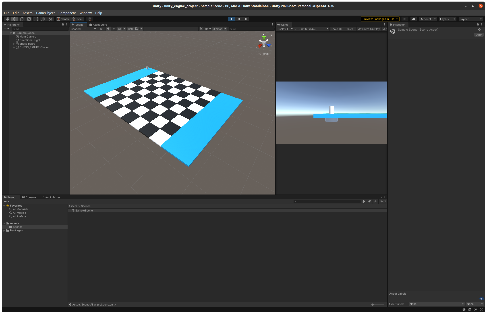

# SRC_ UNITY CHESS SIMULATION

This folder contains a Unity3D Game Engine project, so test and simulate the chess figure move algorithm.
It was used in the early stages of development and can be opened with the Unity Engine 2021.1.

The project is only a simple mockup with basic chess figures move functionallity nothing more!

